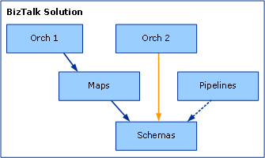
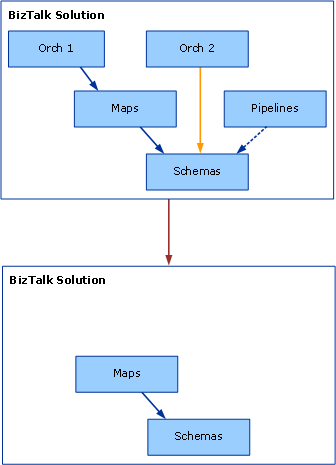

# Troubleshooting Configuration
The Microsoft [!INCLUDE[btsBizTalkServerNoVersion](../includes/btsbiztalkservernoversion-md.md)] configuration program creates databases on one or more computers running [!INCLUDE[btsSQLServerNoVersion](../includes/btssqlservernoversion-md.md)], populates the databases with tables, roles, and stored procedures used by [!INCLUDE[btsBizTalkServerNoVersion](../includes/btsbiztalkservernoversion-md.md)], and deploys .NET assemblies used during runtime to the BizTalk Management database.  
  
 This section discusses troubleshooting techniques to resolve configuration errors. It also lists some common configuration problems and how to resolve these problems.  
  
## Configuration Logging  
 The configuration program writes detailed information to a configuration log file which by default is located in the temp directory of the computer running[!INCLUDE[btsBizTalkServerNoVersion](../includes/btsbiztalkservernoversion-md.md)]. To determine the folder that is specified by the TEMP environment variable open a command prompt on this computer, type the following command, and then press ENTER:  
  
 **echo %TEMP%**  
  
 The configuration log file contains a summary of the configuration steps performed, as well as diagnostic information about any failures that may occur during the configuration process. If a configuration error occurs, open the configuration log in a text editor such as Notepad and check the log file for possible causes of the error.  
  
## Troubleshooting Tools  
 Use SQL Server Profiler, Filemon, or Regmon to gather additional information about configuration failures. For more information about these tools, see [Tools and Utilities to Use for Troubleshooting](../core/tools-and-utilities-to-use-for-troubleshooting.md).  
  
## Known Issues  
  
#### Configuration fails when BizTalk Server and SQL Server are installed on separate computers  
  
##### Problem  
 Configuration fails with errors similar to the following when attempting to configure the Enterprise Single Sign-On (SSO) component:  
  
 An error occurred while attempting to access the SSO database.  
  
 Function: FieldInfoCreate  
  
 -or-  
  
 Failed to enable the Single Sign-On (SSO) Service (error code 0X800706BA)  
  
##### Cause  
 If [!INCLUDE[btsBizTalkServerNoVersion](../includes/btsbiztalkservernoversion-md.md)] and [!INCLUDE[btsSQLServerNoVersion](../includes/btssqlservernoversion-md.md)] are installed on different computers then the configuration operations are performed under the context of a Distributed Transaction Coordinator (MSDTC) transaction and MSDTC functionality must be available over the network between these computers. If MSDTC functionality is not available over the network between the computers running [!INCLUDE[btsBizTalkServerNoVersion](../includes/btsbiztalkservernoversion-md.md)] and [!INCLUDE[btsSQLServerNoVersion](../includes/btssqlservernoversion-md.md)] then this error can occur.  
  
##### Resolution  
 Follow the steps in [Troubleshooting Problems with MSDTC](../core/troubleshooting-problems-with-msdtc.md) to ensure MSDTC functionality over the network between the computers running [!INCLUDE[btsBizTalkServerNoVersion](../includes/btsbiztalkservernoversion-md.md)] and [!INCLUDE[btsSQLServerNoVersion](../includes/btssqlservernoversion-md.md)].  
  
#### Antivirus software interferes with configuration and causes configuration failures  
  
##### Problem  
 [!INCLUDE[btsBizTalkServerNoVersion](../includes/btsbiztalkservernoversion-md.md)] configuration fails when antivirus software incorrectly determines that the configuration program is a virus.  
  
##### Cause  
 The antivirus software has not been updated to include the [!INCLUDE[btsBizTalkServerNoVersion](../includes/btsbiztalkservernoversion-md.md)] configuration program as a legitimate (non-virus) program.  
  
##### Resolution  
 Configure the antivirus program to recognize the [!INCLUDE[btsBizTalkServerNoVersion](../includes/btsbiztalkservernoversion-md.md)] configuration program as a legitimate (non-virus) program or else temporarily disable the antivirus software while the configuration program is running.  
  
#### Configuration fails with a "File or assembly name FileName.dll, or one of its dependencies, was not found" error  
  
##### Problem  
 An error similar to the following is displayed during the configuration process:  
  
 Failed to deploy BizTalk system assembly "C:\Program Files\Microsoft\  
  
 BizTalk Server 2009\Microsoft.BizTalk.DefaultPipelines.dll. Unspecified  
  
 exception: File or assembly name FileName .dll, or one of its  
  
 dependencies, was not found. File or assembly name FileName .dll, or  
  
 one of its dependencies, was not found."  
  
##### Cause  
 This error can occur if the Network Service account does not have write permissions to the temp folder on the computer running [!INCLUDE[btsBizTalkServerNoVersion](../includes/btsbiztalkservernoversion-md.md)]. During configuration, [!INCLUDE[btsBizTalkServerNoVersion](../includes/btsbiztalkservernoversion-md.md)] configuration uses Windows Management Instrumentation (WMI) to deploy .NET assemblies to the BizTalk Management database. WMI impersonates the Network Service account while deploying these assemblies to the BizTalk Management database and so the Network Service account must have write access to the temp folder on the computer running [!INCLUDE[btsBizTalkServerNoVersion](../includes/btsbiztalkservernoversion-md.md)].  
  
##### Resolution  
 Grant the Network Service account write access to the temp folder on the computer running [!INCLUDE[btsBizTalkServerNoVersion](../includes/btsbiztalkservernoversion-md.md)] and run the configuration program again. To determine the folder that is specified by the TEMP environment variable, open a command prompt on the computer, type the following command, and then press ENTER:  
  
```  
echo %TEMP%  
```  
  
#### Configuration of the group fails if the NetBIOS name of the computer running SQL Server exceeds 15 characters  
  
##### Problem  
 [!INCLUDE[btsBizTalkServerNoVersion](../includes/btsbiztalkservernoversion-md.md)] group configuration fails and an error similar to the following is displayed in the [!INCLUDE[btsBizTalkServerNoVersion](../includes/btsbiztalkservernoversion-md.md)] configuration log:  
  
 2006-08-29 23:54:00:0902 [WARN] AdminLib GetBTSMessage: hrErr=80070547;  
  
 Msg=Configuration information could not be read from the domain  
  
 controller, either because the machine is unavailable, or access has  
  
 been denied.;  
  
##### Cause  
 This problem occurs if the length of the NetBIOS name for the computer running [!INCLUDE[btsSQLServerNoVersion](../includes/btssqlservernoversion-md.md)] exceeds 15 characters. If the NetBIOS name exceeds 15 characters then Windows truncates the NetBIOS name to 15 characters and the NetBIOS name will no longer match the first part of the fully qualified domain name (FQDN) or DNS name of this computer. If the NetBIOS name does not match the first part of the FQDN of the computer, group configuration will fail.  
  
##### Resolution  
 Change the NetBIOS name of the computer running [!INCLUDE[btsSQLServerNoVersion](../includes/btssqlservernoversion-md.md)] to a name with no more than 15 characters and run configuration again.  
  
> [!NOTE]
>  You must restart the computer if you rename it.  
  
#### Configuration fails if a SQL Server database file that has the same name as the specified database already exists in the SQL Server data folder  
  
##### Problem  
 Configuration fails with an error similar to the following:  
  
 Failed to set up BAM database(s)  
  
 Cannot open database requested in login 'BAMPrimaryImport'  
  
 Logon fails. Logon failed for user '*BizTalk\BizTalkUser*'  
  
##### Cause  
 This error can occur if an .mdf file or an .ldf file already exists in the \MSSQL\data folder of the computer running [!INCLUDE[btsSQLServerNoVersion](../includes/btssqlservernoversion-md.md)] that has the same name as the .mdf file or the .ldf file that the [!INCLUDE[btsBizTalkServerNoVersion](../includes/btsbiztalkservernoversion-md.md)] configuration program is trying to create. The names of the .mdf file and the .ldf file that are created for the databases are derived from the name of the database that is specified in the [!INCLUDE[btsBizTalkServerNoVersion](../includes/btsbiztalkservernoversion-md.md)] configuration program with an .mdf and an .ldf extension appended.  
  
##### Resolution  
 To resolve this behavior, use one of the following methods:  
  
-   Delete any .mdf files or .ldf files that have names that match the names of any databases that you are creating.  
  
-   Choose database names that do not match the names of any .mdf files or .ldf files that already exist in the \Program Files\Microsoft SQL Server\MSSQL\data folder of your SQL server.  
  
#### Configuration fails on a domain controller when specifying local accounts  
  
##### Problem  
 When running the [!INCLUDE[btsBizTalkServerNoVersion](../includes/btsbiztalkservernoversion-md.md)] configuration program on a domain controller, configuration fails if you specified a local group (for example, BizTalk Host Users Group) for either the BizTalkServerApplication host or the BizTalkIsolatedHost host.  
  
##### Cause  
 A domain controller automatically treats a local Windows group as a domain Windows group (there is no such thing as local Windows group on a domain controller). If you specified a local Windows group for the host while running the configuration program, configuration will fail when trying to create a [!INCLUDE[btsSQLServerNoVersion](../includes/btssqlservernoversion-md.md)] logon for the group. The configuration program does not disable the local Windows group option when the server is a domain controller.  
  
##### Resolution  
 Specify domain groups for the hosts that are created during configuration.  
  
#### Configuration fails to create SQL Server Analysis database if the SQL server has been renamed  
  
##### Problem  
 If you have renamed the computer on which you installed SQL Server Analysis Server, the configuration program fails when it tries to create the new SQL Server Analysis database and an error similar to the following is generated:  
  
 Cannot connect to the repository.  
  
 Analysis server: \<machine name\>  
  
 Error:  
  
 '\\\\<machine name\>\MsOLAPRepository$\msmdrep.mdb' is not a valid path.  
  
 Make sure that you correctly spell the path name and that you are  
  
 connected to the server on which the file resides.  
  
##### Cause  
 The configuration program is unable to determine the new name of the computer on which you installed SQL Server Analysis Server.  
  
##### Resolution  
 Perform the following manual steps to update Analysis Server with the new computer name:  
  
1.  Click **Start**, point to **All Programs**, point to **Microsoft SQL Server**, point to **Analysis Services**, and then click **Analysis Manager**.  
  
2.  In the **Analysis Manager** navigation panel, double-click the **Analysis Servers** node to expand it.  
  
3.  Right-click the server with the repository connection string you want to edit, and then select **Edit Repository Connection String**.  
  
4.  In the **Edit Repository Connection String** dialog box, verify the server name in this string and update it to the new computer name if it is incorrect.  
  
5.  Navigate to the following location: \<*installation directory*\>\Program Files\Microsoft Analysis Services\Bin.  
  
6.  Right-click the **Bin** folder, and then click **Sharing and Security**. The **Bin Properties** dialog box appears.  
  
7.  In the **Bin Properties** dialog box, click the **Sharing** tab to verify that all Online Analytical Processing (OLAP) administrators have full permissions to this folder.  
  
#### Artifacts Disappear from Configuration Database on Redeployment of Assemblies from Visual Studio  
  
##### Problem  
 When a [!INCLUDE[btsBizTalkServerNoVersion](../includes/btsbiztalkservernoversion-md.md)] project is redeployed at the project level within [!INCLUDE[btsVStudioNoVersion](../includes/btsvstudionoversion-md.md)], all artifacts contained within the project that reference the project being redeployed will appear to vanish when the [!INCLUDE[btsBizTalkServerNoVersion](../includes/btsbiztalkservernoversion-md.md)] MMC is refreshed.  
  
##### Cause  
 To illustrate the cause of this problem, consider the following example based on a sample BizTalk Server solution where a user wants to redeploy the Maps project. Note that compiling projects yields individual assemblies. The following figure indicates the state of the solution before the user does a redeployment. The relationships among the artifacts are as follows:  
  
- Orch1, Orch2, Maps, Pipelines, and Schemas are projects.  
  
- Orch1 references Maps, which in turn references Schemas.  
  
- Orch2 references Schemas.  
  
- Pipelines references Schemas.  
  
    
  
  If the user redeploys the Maps project using the default Visual Studio project settings, the Orch1, Orch2, and Pipeline artifacts vanish, as shown in the following figure.  
  
    
  
  Redeploying Maps is a two-step process of undeploying the currently deployed Maps.dll assembly, and then deploying the new Maps.dll file. Visual Studio performs these steps automatically as part of the redeployment process.  
  
> [!NOTE]
>  The preceding sentence is not strictly correct because these are steps that Visual Studio always does so there is no notion of it being the proper way.  
  
 The key point is that in order to undeploy a BizTalk Server assembly, [!INCLUDE[btsVStudioNoVersion](../includes/btsvstudionoversion-md.md)] has to undeploy all assemblies that are dependent upon that assembly that have the deploy flag set. In our example, to perform the first undeployment step of the redeployment, BizTalk Server needs to undeploy Orch1.dll (which depends on Maps.dll). During the undeployment of Maps.dll, [!INCLUDE[btsVStudioNoVersion](../includes/btsvstudionoversion-md.md)] also undeploys Schemas.dll (assuming it has the deploy flag set). In order to undeploy Schemas.dll, Visual Studio needs to undeploy Orch2.dll and Pipelines.dll (both of which depend on Schemas.dll).  
  
 A problem exists in that [!INCLUDE[btsVStudioNoVersion](../includes/btsvstudionoversion-md.md)] redeploys only Maps.dll and the assemblies that it depends upon: in this case, Schemas.dll. So when the user refreshes the BizTalk Server MMC, the Orch1, Orch2, and Pipeline assemblies seem to have vanished, but Maps.dll and Schemas.dll are still visible.  
  
##### Resolution  
 For the main project (that references other projects) do the following:  
  
1.  In Solution Explorer, right-click the solution node.  
  
2.  Click **Properties** to open the **Solution Property Pages** dialog box.  
  
3.  Click **Configuration Properties**, and then click **Configuration**.  
  
4.  Clear the **Deploy** check box for the referenced project.  
  
5.  In Solution Explorer, execute a new solution-level deployment. To do this, right-click the solution node and then click **Deploy Solution**.  
  
#### Supported Virtual Directory Types  
 When referencing Web services from an orchestration and attempting to do an MSI export, the export operation will succeed only if the associated virtual directories are of type **IIsWebVirtualDir** or **IIsWebDirectory**. **IIsWebVirtualDir** and **IIsWebDirectory** are the node types that appear in the IIS metabase. **IIsWebVirtualDir** is a virtual directory with a **Path** property that points to an absolute file folder. **IIsWebDirectory** is a virtual directory without a **Path** property and thus refers to a relative file folder, typically a subfolder of another **IIsWebVirtualDir** or **IIsWebDirectory** node. These two types are the ones typically seen in the metabase hierarchy to describe folders.  
  
 Virtual directories of type **IIsConfigObject** are not supported and the MSI export will fail in this case. **IIsConfigObject** is an unexpected metabase node type that is either a valid node type that BizTalk Server is not handling properly or an indication of an improperly created (and thus invalid) metabase entry. In this situation BizTalk Server will display an error message something like the following: Unexpected directory entry " IIS://LM/W3SVC/1/ROOT/BadVdir/" of type IIsConfigObject.  
  
#### Unable to view Group information after removing stale logons  
  
##### Problem  
 If, during configuration, you encounter and delete stale logons, you may not be able to view Group information.  
  
##### Cause  
 This is a known configuration issue.  
  
##### Resolution  
 It may help to delete the Host Windows group logons and then reconfigure. If the Group information is still not available, contact Microsoft Product Support.  
  
##### Cannot change computer name after BizTalk Server is installed  
  
###### Problem  
 When you change the computer name on a computer running [!INCLUDE[btsBizTalkServerNoVersion](../includes/btsbiztalkservernoversion-md.md)], and you restart (reboot) the computer, error messages may occur.  
  
###### Cause  
 SQL Server does not support changing the computer name, so [!INCLUDE[btsBizTalkServerNoVersion](../includes/btsbiztalkservernoversion-md.md)] does not support changing the computer name once [!INCLUDE[btsBizTalkServerNoVersion](../includes/btsbiztalkservernoversion-md.md)] is installed and configured.  
  
###### Resolution  
 We recommend that you do not change computer names after you install BizTalk Server.