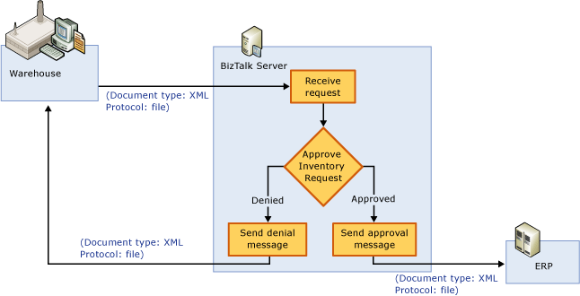
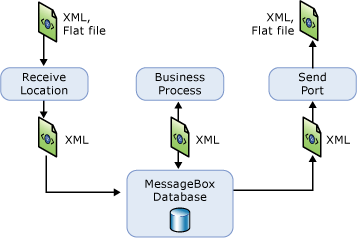

# Tutorial 1: Enterprise Application Integration
Microsoft [!INCLUDE[btsBizTalkServerNoVersion](../includes/btsbiztalkservernoversion-md.md)] provides a development and run-time environment for application integration and business process management (BPM). This tutorial presents an end-to-end exercise in setting up and deploying an enterprise application integration (EAI) solution using [!INCLUDE[btsBizTalkServerNoVersion](../includes/btsbiztalkservernoversion-md.md)].  
  
##   Business Scenario  
 Contoso is an online store selling computer hardware and software.  The company recently purchased an enterprise resource planning (ERP) system to manage its resources.  In this tutorial, you will develop an Enterprise Application Integration (EAI) solution using BizTalk Server to integrate an existing warehouse system to the ERP system, and automate the warehouse request process.  
  
 There are several challenges for this integration solution:  
  
- **Message transportation**.  The warehouse system and the ERP system can reside on two different platforms, and use different transportation protocols for sending and receiving messages. This solution must be able to receive the messages using the protocols supported by the sending system and forward the messages using the protocols supported by the receiving system.  BizTalk Server uses *adapters* for transporting messages.  There are many native adapters that come with the BizTalk Server installation and the BizTalk Adapter pack.  For additional adapters, you can either purchase from vendors or develop your own using the adapter frameworks provided by BizTalk Server. For more information about adapters, see [http://go.microsoft.com/fwlink/?LinkId=191131](http://go.microsoft.com/fwlink/?LinkId=191131).  
  
- **Message conversion**. There are many message types, for example, eXtended Markup Language (XML), Electronic Data Interchange (EDI), delimitated files and so on. BizTalk Server is XML centric. For most cases, you convert inbound messages into XML first.  This process is called *parsing*.  On the outbound side, you can convert messages from XML to other types.  This process is called *serialization*.  
  
- **Business process mangement**. Most of the EAI scenarios are more than simply forwarding messages from one system to another system.  They usually involve more systems and complex workflows.  In this scenario, the warehouse sends a message requesting inventory replenishment; your solution receives the message and then checks the grand total of the request.  If the grand total is over a certain amount, the solution rejects the request automatically and sends a decline message; otherwise the solution forwards the request to the ERP system.  
  
   The following diagram illustrates the business process:  
  
     
  
  In this tutorial, you use [!INCLUDE[btsBizTalkServerNoVersion](../includes/btsbiztalkservernoversion-md.md)] development tools to design and deploy the business process.  
  
## Preparation  
 There is some basic information you must collect before creating a BizTalk Server integration solution:  
  
-   How many applications/systems that the BizTalk Server solution needs to integrate?  In this scenario, there are two systems: ERP and warehouse.  
  
-   Which transportation protocols supported by each of the applications?  To simplify the solution, we assume both applications use files.  The warehouse system drops the request as a file in a file folder. The BizTalk Server solution picks the file from the folder, processes the file, and then drops the request to another folder which the ERP system monitors.  
  
-   What message types used by the applications?  To simplify the solution, we assume both applications use the XML type. BizTalk schemas are documents that define the structure of the XML data in BizTalk messages, and their purpose is to create templates for processing and validating XML messages. BizTalk Server comes with a BizTalk Editor for creating BizTalk schemas.  
  
-   What is the business process?  The process has been explained earlier in this title.  
  
## BizTalk Server Architecture  
 It is helpful to understand how BizTalk Server runs the solution.  The following illustration shows the flow of data through [!INCLUDE[btsBizTalkServerNoVersion](../includes/btsbiztalkservernoversion-md.md)].  
  
   
  
-   (The warehouse system drops a request to a file folder.)  
  
-   A BizTalk Server receive location is configured with the File adapter and a XML transmit pipeline.  The File adapter polls the file regularly from the file folder. Once a message is received, BizTalk Server messaging engine pushes the message through a pipeline.  Because the request message is in the XML format, so the XML transmit pipeline is used in this case.  The XML transmit pipeline makes sure the message is a well-formed XML file.  Then the message is saved to the MessageBox database.  
  
-   When the Orchestration Engine notices a message is ready to be processed by an orchestration, it instantiates an instance of the orchestration.  Depending on the grand total of the message, Orchestration Engine saves either a request message or a request decline message to the MessageBox database.  
  
-   Again, depending on request message or request decline message, the Messaging Engine use either of the send ports to process the message.  The Messaging Engine first pushes the message through a XML transmit pipeline, and then uses the File adapter to send the message to different file folders based on the send port configurations.  
  
-   (Both the warehouse system and the ERP system monitor designated folders to get messages.)  
  
## In This Section  
  
-   [Before You Begin the Tutorial](../core/before-you-begin-the-tutorial.md) 
  
-   [Lesson 1: Define Schemas and a Map](../core/lesson-1-define-schemas-and-a-map.md) 
  
-   [Lesson 2: Define the Business Process](../core/lesson-2-define-the-business-process.md)  
  
-   [Lesson 3: Deploy the Solution](../core/lesson-3-deploy-the-solution.md)