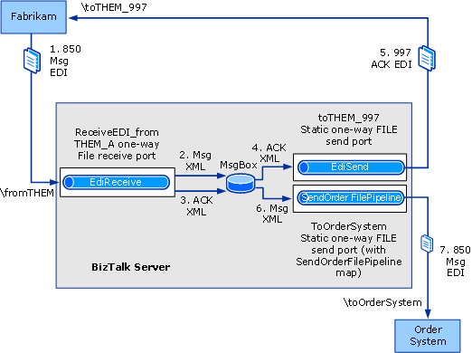

# Tutorial 2: EDI Interface Developer Tutorial
This tutorial demonstrates how to use the EDI functionality in [!INCLUDE[btsBizTalkServerNoVersion](../includes/btsbiztalkservernoversion-md.md)] in an Interface Developer scenario.  
  
 **Tutorial Scenario**  
  
 In this scenario, your trading partner sends Purchase Orders to your company using the ANSI X12 Version 4010 850 Transaction Set (an 850 message). Your company uses an internal application, the Order System, to process purchase orders.  
  
 You are an interface developer responsible for designing the interface between the 850 message you receive from your trading partner and your company’s internal Order System. Your trading partner requires a Functional Acknowledgement (997) for each 850 message it sends.  
  
 For ease of reference, the following identifiers are used:  
  
|Entity|Identifier|  
|------------|----------------|  
|Your company|OrderSystem|  
|Your trading partner|Fabrikam|  
  
 The message flow in the completed solution will be as follows:  
  
   
  
 **Message Flow**  
  
 The solution in this tutorial will do the following:  
  
1. Receive a flat-file interchange from the trading partner Fabrikam.  
  
   > [!NOTE]
   >  The events in this list may not occur in the order shown.  
  
2. Validate the EDI interchange against its schema, disassemble the message into XML, and drop the message XML into the MessageBox.  
  
3. Generate a 997 acknowledgment to the received EDI interchange, and drop it in the MessageBox.  
  
4. Pick up the 997 XML by a one-way send port, and assemble the 997 EDI interchange.  
  
5. Send the 997 interchange to Fabrikam.  
  
6. Pick up the Msg XML by a one-way send port, and assemble the message EDI interchange.  
  
7. Send the EDI interchange to OrderSystem.  
  
   **Configuration**  
  
   In this tutorial, you will do the following:  
  
- Configure BizTalk to expect the 850 message from your trading partner and to send back a 997 acknowledgment  
  
- Use a BizTalk map to convert the 850 message data into the format required by the Order System. This map is provided in the tutorial files in the [!INCLUDE[btsBizTalkServerNoVersion](../includes/btsbiztalkservernoversion-md.md)] SDK.  
  
- Configure a receive port for receiving the 850 message.  
  
- Configure a send port to send the 850 message to OrderSystem in the correct format.  
  
- Configure a send port to subscribe to the BizTalk-generated 997 acknowledgment for routing back to the trading partner, Fabrikam.  
  
## In This Section  
  
-   [Step 1: Prepare for the EDI Interface Developer Tutorial](../core/step-1-prepare-for-the-edi-interface-developer-tutorial.md)  
  
-   [Step 2: Update and Deploy the Tutorial Solution](../core/step-2-update-and-deploy-the-tutorial-solution.md)  
  
-   [Step 3: Configure a Party and Business Profile for Your Organization](../core/step-3-configure-a-party-and-business-profile-for-your-organization1.md)  
  
-   [Step 4: Configure a Party and Business Profile for Your Trading Partner](../core/step-4-configure-a-party-and-business-profile-for-your-trading-partner1.md)  
  
-   [Step 5: Configure a Receive Port and Receive Location](../core/step-5-configure-a-receive-port-and-receive-location.md)  
  
-   [Step 6: Configure a Send Port to Send Data to Your Organization](../core/step-6-configure-a-send-port-to-send-data-to-your-organization.md)  
  
-   [Step 7: Configure a Send Port to Send the Acknowledgment to Your Trading Partner](../core/step-7-configure-a-send-port-to-send-the-acknowledgment-to-trading-partner.md)  
  
-   [Step 8: Configure the Trading Partner Agreement between the Parties](../core/step-8-configure-the-trading-partner-agreement-between-the-parties.md)  
  
-   [Step 9: Test the EDI Solution](../core/step-9-test-the-edi-solution.md)  
  
## See Also  
 [BizTalk Server Tutorials](../core/biztalk-server-tutorials.md)