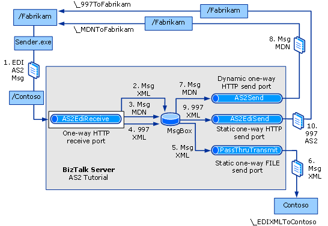

# Tutorial 3: AS2 Tutorial
In this tutorial, you set up a solution that receives and sends EDIINT/AS2-encoded messages over an HTTP transport.  
  
 **How the Tutorial Solution Works**  
  
 The solution will do the following:  
  
- Receive an AS2 message from a partner (Fabrikam)  
  
- Return an MDN response asynchronously to the partner  
  
- Process the EDI payload of the AS2 message  
  
- Return a 997 acknowledgment to the partner (Fabrikam) over AS2  
  
- Route an XML file containing the payload of the EDI message to a backend application of the home organization (Contoso).  
  
  > [!NOTE]
  >  This solution does not use signing or encryption to help ensure the security of AS2 messages.  
  
  **Tutorial Components**  
  
  This solution will use the following:  
  
- A BTS Http Receive ISAPI Filter to receive the AS2/EDI message from the sender **(/Contoso/BTSHTTPReceive.dll**).  
  
- An ASPX Web page to simulate the partner by returning a 997 acknowledgment and an MDN (**http://localhost/Fabrikam/Default.aspx**).  
  
- A project file that you will use to deploy an 864 schema and other schemas (**Schemas.btproj**).  
  
- A one-way HTTP receive location to receive the EDI file (**Receive_AS2**). This receive location uses the default AS2EdiReceive pipeline that contains the AS2 Decoder and EDI Disassembler.  
  
- A dynamic HTTP send port to return an asynchronous MDN (**Send_Async_MDN**). This send port uses the AS2Send pipeline that contains the AS2 Encoder.  
  
- A static one-way FILE send port to route the EDI payload in an XML file to a back-end folder (**Send_Payload_EdiXml**). This send port uses the PassThruTransmit send pipeline.  
  
- A static one-way HTTP send port to return a 997 acknowledgment to the partner over AS2 (**Send_Async_997**). This send port uses the AS2Send pipeline that includes the AS2 Encoder, but has no need for the EDI Assembler.  
  
- A project file that you will use to build an application to send the EDI file from the Fabrikam partner to BizTalk (**Sender.csproj**).  
  
  **Message Flow**  
  
  The message flow in the completed solution will be as shown in the following figure:  
  
    
  
  The tutorial components process the message as follows:  
  
1. You use the **sender.exe application** to send the original EDI/AS2 message from the partner Fabrikam to the BizTalk Server computer. Sender.exe sends the EDI/AS2 message to the Contoso virtual directory.  
  
   > [!NOTE]
   >  The events in this list may not occur in the order shown.  
   >   
   >  The test message is X12_00401_864.edi in \Program Files\Microsoft BizTalk Server 20xx\SDK\AS2 Tutorial.  
  
2. The **Receive_AS2** one-way receive location receives the EDI message from Fabrikam, using the BTSHTTPReceive.dll ISAPI extension to pick the file up from the Contoso virtual directory. The receive pipeline decodes the AS2 message, disassembles the EDI interchange, and then drops the message XML into the MessageBox.  
  
3. The receive pipeline generates an MDN for the AS2 message, and since the MDN is set up to be asynchronous, the receive pipeline drops the MDN into the MessageBox.  
  
4. The receive pipeline generates a 997 acknowledgment in response to the EDI interchange, and drops the 997 into the MessageBox.  
  
5. The **Send_Payload_EdiXml** static one-way send port picks up the EDI payload from the MessageBox, filtering on the BTS.MessageType context property.  
  
6. The payload send port sends the XML file containing the EDI payload to the back-end Contoso application, represented by the \\_EDIXMLToContoso folder. This send port uses a PassThruTransmit send pipeline.  
  
7. The **Send_Async_MDN** dynamic send port picks up the asynchronous MDN from the MessageBox, filtering on the EdiIntAS.IsAS2AsynchronousMdn context property.  
  
8. The MDN send port returns the MDN to the \\_MDNToFabrikam folder. Since this is a dynamic send port, it will use the address in the Receipt-Delivery-Option line in the header of the message (**http://localhost/Fabrikam/Default.aspx?Destination=_MDNToFabrikam**) to route the message to the \\_MDNToFabrikam folder.  
  
9. The **Send_Async_997** send port picks up the 997 from the MessageBox, filtering on the BTS.MessageType context property.  
  
10. The 997 send port uses HTTP transport to send the 997 message generated by the EdiReceive receive pipeline to the \\_997ToFabrikam folder. The send port sends the message to the Fabrikam default.aspx page, using the URI **http://localhost/Fabrikam/Default.aspx?Destination=_997ToFabrikam**. The default.aspx page then sends the 997 to the \\_997ToFabrikam folder.  
  
    To do this tutorial, you should be knowledgeable about the following:  
  
-   BizTalk Server pipelines and pipeline components  
  
-   HTTP Adapter  
  
-   Receive ports and locations  
  
-   Send ports  
  
## In This Section  
  
-   [Step 1: Prepare for the AS2 Tutorial](../core/step-1-prepare-for-the-as2-tutorial.md)  
  
-   [Step 2: Create and Deploy the Sample X12 Schema](../core/step-2-create-and-deploy-the-sample-x12-schema.md)  
  
-   [Step 3: Configure a Party and Business Profile for Your Organization](../core/step-3-configure-a-party-and-business-profile-for-your-organization2.md)  
  
-   [Step 4: Configure a Party and Business Profile for Your Trading Partner](../core/step-4-configure-a-party-and-business-profile-for-your-trading-partner2.md)  
  
-   [Step 5: Configure the Trading Partner Web Pages](../core/step-5-configure-the-trading-partner-web-pages.md)  
  
-   [Step 6: Configure the EDI-AS2 Receive Location](../core/step-6-configure-the-edi-as2-receive-location.md)  
  
-   [Step 7: Configure the MDN Send Port](../core/step-7-configure-the-mdn-send-port.md)  
  
-   [Step 8: Configure the 997 Send Port](../core/step-8-configure-the-997-send-port.md)  
  
-   [Step 9: Configure the EDI Payload Send Port](../core/step-9-configure-the-edi-payload-send-port.md)  
  
-   [Step 10: Configure the X12 and AS2 Trading Partner Agreement](../core/step-10-configure-the-x12-and-as2-trading-partner-agreement.md)  
  
-   [Step 11: Test the AS2 Solution](../core/step-11-test-the-as2-solution.md)  
  
## See Also  
 [BizTalk Server Tutorials](../core/biztalk-server-tutorials.md)