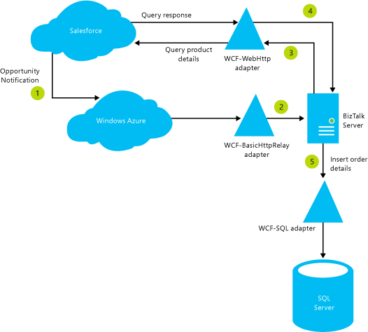

# Tutorial: Integrating BizTalk Server 2013 with Salesforce
Reviewers: [Nick Hauenstein](http://social.msdn.microsoft.com/profile/nick.hauenstein/), [Steef-Jan Wiggers](http://social.msdn.microsoft.com/profile/steef-jan%20wiggers)  
  
 [!INCLUDE[btsBizTalkServerNoVersion](../includes/btsbiztalkservernoversion-md.md)] introduces some new adapters that make a lot of hybrid scenarios, involving on-premises and Azure technologies now possible. In this tutorial, we see how to integrate a purely cloud entity like Salesforce integrate with an on-premises [!INCLUDE[btsBizTalkServerNoVersion](../includes/btsbiztalkservernoversion-md.md)] using some of the new adapters and [!INCLUDE[winazure](../includes/winazure-md.md)]. Before we start, let’s understand the business objective we try to achieve by integrating [!INCLUDE[btsBizTalkServerNoVersion](../includes/btsbiztalkservernoversion-md.md)] with Salesforce.  
  
 We could also create hybrid solutions involving [!INCLUDE[btsBizTalkServerNoVersion](../includes/btsbiztalkservernoversion-md.md)] and Salesforce with previous version of [!INCLUDE[btsBizTalkServerNoVersion](../includes/btsbiztalkservernoversion-md.md)], however the solution would be much more complex involving interaction with Salesforce by consuming a Web service (SOAP). With [!INCLUDE[btsBizTalkServerNoVersion](../includes/btsbiztalkservernoversion-md.md)] and the new adapters, the solution is that much easier.  
  
## Business Scenario  
 Northwind uses the Salesforce online CRM system as their solution for tracking customers through the sales pipeline. Every time a sales opportunity is created in the Salesforce system, Northwind wants its on-premise systems, such as [!INCLUDE[btsBizTalkServerNoVersion](../includes/btsbiztalkservernoversion-md.md)], to be notified so that other down-stream systems can pick up that data and start other relevant processes. Northwind plans to implement this solution using the new adapters available with [!INCLUDE[btsBizTalkServerNoVersion](../includes/btsbiztalkservernoversion-md.md)] and also by including some components of [!INCLUDE[winazure](../includes/winazure-md.md)]. This is how the end-to-end data flow looks like for the solution:  
  
- A sales representative creates an “opportunity” in the Salesforce system.  
  
- When the status of the opportunity is set to “Closed Won”, a notification is sent to a relay endpoint hosted on [!INCLUDE[winazure](../includes/winazure-md.md)].  
  
- Using the new WCF-BasicHttpRelay adapter, the notification information is passed on to [!INCLUDE[btsBizTalkServerNoVersion](../includes/btsbiztalkservernoversion-md.md)] system housed on-premise.  
  
- Using the information received as part of the notification, [!INCLUDE[btsBizTalkServerNoVersion](../includes/btsbiztalkservernoversion-md.md)] invokes a REST endpoint in Salesforce, using the new WCF-WebHttp adapter, to get more information about the opportunity.  
  
- Finally, [!INCLUDE[btsBizTalkServerNoVersion](../includes/btsbiztalkservernoversion-md.md)] uses the information received from Salesforce to create a purchase order entry in an in-house SQL Server database table.  
  
  These are the set of steps that you must perform to achieve the integration objective outlined in this solution. Each of these steps involves broad set of activities that we’ll look at as we proceed with creating the solution.  
  
  Here’s an illustration that describes the end-to-end integration solution:  
  
    
  
## Prerequisites  
 You must have the following software installed on the computer where you set up this solution:  
  
- [!INCLUDE[btsBizTalkServerNoVersion](../includes/btsbiztalkservernoversion-md.md)]  
  
- [!INCLUDE[esbToolkit](../includes/esbtoolkit-md.md)]  
  
- [!INCLUDE[afproductnameshort](../includes/afproductnameshort-md.md)]  
  
- [!INCLUDE[adapterpacknoversion](../includes/adapterpacknoversion-md.md)]  
  
  You must have the following service subscriptions:  
  
- A [!INCLUDE[winazure](../includes/winazure-md.md)] subscription  
  
- Salesforce Developer Edition account  
  
## More Resources  
 In addition to this tutorial, you can also look at the following resources to understand more about integrating [!INCLUDE[btsBizTalkServerNoVersion](../includes/btsbiztalkservernoversion-md.md)] with Salesforce using the new adapters introduced in [!INCLUDE[btsBizTalkServerNoVersion](../includes/btsbiztalkservernoversion-md.md)].  
  
- A virtual lab demonstrating [!INCLUDE[btsBizTalkServerNoVersion](../includes/btsbiztalkservernoversion-md.md)] and Salesforce integration is available at [http://go.microsoft.com/fwlink/?LinkId=290930](http://go.microsoft.com/fwlink/?LinkId=290930).  
  
- A sample based on this tutorial is available for download at [http://go.microsoft.com/fwlink/?LinkId=290932](http://go.microsoft.com/fwlink/?LinkId=290932).  
  
## Next steps
  
-   [Step 1: Create a Service Bus Namespace](../core/step-1-create-a-service-bus-namespace.md)  
  
-   [Step 2: Set up the Salesforce System](../core/step-2-set-up-the-salesforce-system.md)  
  
-   [Step 3: Create the BizTalk Server Solution in Visual Studio](../core/step-3-create-the-biztalk-server-solution-in-visual-studio.md)  
  
-   [Step 4: Configure the BizTalk Server Solution](../core/step-4-configure-the-biztalk-server-solution.md)  
  
-   [Step 5: Test the Solution](../core/step-5-test-the-solution.md)  
  
## See Also  
 [BizTalk Server Tutorials](../core/biztalk-server-tutorials.md)