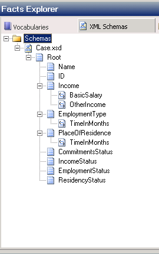

# Typed Facts
*Typed facts* are classes that implement the **ITypedFact** interface: **TypedXmlDocument**, **DataConnection**, **TypedDataTable**, and **TypedDataRow**.  

## TypedXmlDocument  
 The **TypedXmlDocument** class represents the XML document type in the Business Rules Framework. When you use a node of an XML document as an argument in a rule, two XPath expressions are created: the Selector and Field bindings.  

 If the node has no child nodes, a *Selector binding* (also known as an XmlDocument binding) is created to the node's parent node and a *Field binding* (also known as an XmlDocumentMember binding) is created to the node itself. This Field binding is relative to the Selector binding. If the node has child nodes, a Selector binding is created to the node and no Field binding is created.  

 Suppose that you have the following schema.  

   
Case.xsd  

 If the Income node is selected, only a Selector binding is created, because the node has child nodes. The default XPath expression in the **XPath Selector** property of the Property pane contains:  

```  
/*[local-name()='Root' and namespace-uri()='http://LoansProcessor.Case']/*[local-name()='Income' and namespace-uri()='']  
```  

 However, if the Name node is selected, both a Selector binding and a Field binding are created. The binding information looks like.  


|      Property      |                                    Value                                    |
|--------------------|-----------------------------------------------------------------------------|
|  **XPath Field**   |               \*[local-name()='Name' and namespace-uri()='']                |
| **XPath Selector** | /\*[local-name()='Root' and namespace-uri()='<http://LoansProcessor.Case>'] |

 You can change the default XPath expressions for the XML nodes before you drag the node into a rule argument, and the new binding information is placed in the policy. Note, however, that any edits that are made to the XPath expressions must be re-entered in the Business Rule Composer when the schema is reloaded.  

 When vocabulary definitions are created for XML nodes, the XPath expressions for the bindings have similar defaults based on the rules described earlier, but can be edited in the Vocabulary Definition Wizard. Changes to the expressions are placed in the vocabulary definition and are reflected in any rule arguments built from the definitions.  

## DataConnection  
 **DataConnection** is a .NET class provided in the **RuleEngine** library. It contains a .NET **SqlConnection** instance and a **DataSet** name. The **DataSet** name enables you to create a unique identifier for the **SqlConnection** and is used in defining the resulting type.  

 The **DataConnection** class provides a performance optimization to the Business Rule engine. Rather than asserting into the engine very large database tables (**TypedDataTable** class) that may contain many database rows (**TypedDataRow** class) that are not relevant to the policy, you can assert a lightweight **DataConnection**. When the engine evaluates a policy, it dynamically builds a SELECT query based on the rule predicates/actions and queries the **DataConnection** at execution. For example, suppose you have the following rule:  

```  
IF NorthWind.Products.UnitPrice >= 0   
THEN <do something>  
```  

 The following SQL query is generated by from the rule:  

```  
Select * From [Product] Where [UnitPrice] >= 0  
```  

 The results of the query are asserted back into the engine as data rows.  

> [!NOTE]
>  The use of an **OleDbConnection** in a **DataConnection** is not currently supported.  

 When you select a database table/column to use in a rule condition or action, you can choose to bind to the object using either **DataConnection** or **TypedDataTable** by selecting "Data connection" or "Database table/row" from the **Database binding type**drop-down box in the Property Window for the **Databases** tab of Fact Explorer.  

> [!NOTE]
>  The DataConnection binding is used by default.  

## TypedDataTable  
 You can assert an ADO.NET **DataTable** object into the engine, but it will be treated like any other .NET object. In most cases you will instead want to assert the rule engine class **TypedDataTable**.  

 **TypedDataTable** is a wrapper class that contains an ADO.NET **DataTable**. The constructor simply takes a **DataTable**. Any time a table or table column is used as a rule argument, the expression is evaluated against the individual **TypedDataRow** wrappers, and not against the **TypedDataTable**.  

## TypedDataRow  
 This is a typed fact wrapper for an ADO **DataRow** object. Dragging a table or column to a rule argument in the Business Rule Composer results in rules built against the returned **TypedDataRow** wrappers.  

## See Also  
 [Facts](../core/facts.md)