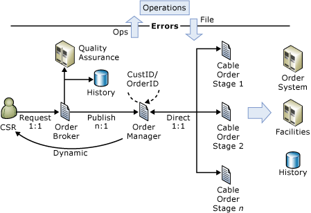
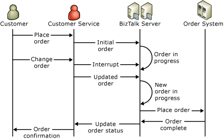

# Understanding the Business Process Management Solution
The solution described in this section presents one way to implement a business process management application. In an ideal business process manager, the parts of the solution representing the business process—the business rules, communicating with specific backend systems, sending response messages—are separate from the infrastructure supporting the process.  
  
 In this solution, a cable service ordering system for Southridge Video, the business process is broken into a series of stages. An order manager, which knows nothing about the business rules and backend systems, directs the operation of the stages. The order manager receives orders from an order broker, which can direct orders to several different order managers.  
  
 The solution makes extensive use of [!INCLUDE[btsBizTalkServerNoVersion](../includes/btsbiztalkservernoversion-md.md)] features and shows, among other things, the use of messages internal to the application for coordinating parts of the application.  
  
## Reader Guidance  
 This document assumes that you are familiar with [!INCLUDE[btsBizTalkServerNoVersion](../includes/btsbiztalkservernoversion-md.md)] and Microsoft [!INCLUDE[btsVStudioNoVersion](../includes/btsvstudionoversion-md.md)]. It also assumes that you understand basic concepts about enterprise application integration and Web services.  
  
 In addition, to read and follow the developer documentation, you should be familiar with how to build applications by using [!INCLUDE[btsVStudioNoVersion](../includes/btsvstudionoversion-md.md)] and with performing the following tasks: creating projects, setting references, and debugging and testing BizTalk solutions.  
  
## Ordering Cable Service from Southridge Video  
 The business process management solution implements a cable service ordering system for Southridge Video. Customers phone into a call center where a customer service representative takes the order and enters it into the order system. The following diagram shows the general flow of an order through the system:  
  
   
  
 Orders go to the order broker, which sends the order on to the order manager. The order manager runs the processing stages in the proper sequence to process the order. Notice that some kinds of errors go to an operations center for correction and resubmission, and that the solution records the history of each order in a SQL Server table.  
  
 The following diagram shows the broad outline of the steps in processing an order.  
  
   
  
 Notice that an order can be updated as well as canceled.  
  
## Business Requirements  
 The business process management solution is an example of an order system for Southridge Video, a cable service provider. It shows one way to implement the process manager pattern in Microsoft BizTalk Server. The solution uses an orchestration to manage the flow of orders through two satellite orchestrations that implement the business process. This structure comes out of the solution's business requirements which include the following:  
  
- Ability to version the business process  
  
- Process long-running orders  
  
- Modify or cancel orders that are still being processed (supplement in-flight orders)  
  
- Avoid suspended orders  
  
- Track orders through the entire process  
  
- Batch order processing  
  
- Accept orders from remote data centers  
  
- Allowing different groups to handle parts of the order processing  
  
- Scale the application by adding BizTalk groups  
  
- Expose, by remoting, the order manager as an application server  
  
  The business requirements of Southridge Video produce a three-part structure: an order broker, a process manager, and the business process itself. Southridge Videohas two separate IT groups involved in the application. A messaging group maintains the corporate messaging infrastructure and provides the components for connecting applications to that infrastructure. Another group writes and maintains applications for specific business processes. Thus, the order broker is separate from the order process manager and process stages so that it can be maintained by a separate group. Because it is a separate component, the order broker can also be extended to broker orders to multiple process managers. A process manager might be added to support a new business line, such as VIP service.  
  
  Southridge Video orders are long running processes: a cable order may take anywhere from a minute to a year to complete. Because an instance of a BizTalk orchestration must run to completion, this means that an orchestration instance could have a lifetime of up to a year.  
  
  Southridge Video needs an architecture for long running processes that allows for application components to change during order processing. Thus, Southridge divides order processing into multiple stages so that an order can complete using the newest process components. For information about how to determine stage boundaries in a business process, see [Some Design Principles in the Business Process Management Solution](../core/some-design-principles-in-the-business-process-management-solution.md).  
  
  The long processing time for an order also, in part, determines the need to change in-flight orders. Modifying orders is one of the reasons that the solution includes an extensive system of interrupts. This interrupt system simplifies making order changes or cancellations before they are complete. The solution uses .NET messages to communicate between functional parts of the solution to handle interruptions.  
  
  Because the system has numerous external dependencies, certain operations can be retried after failure. For example, if a backend system is unavailable and a request to it times out, the solution waits an appropriate interval and retries the request. Because connections to external systems are through custom code, this portion of the solution makes extensive use of .NET reflection to allow object methods to be retried.  
  
  The solution assumes, like the real-life company it is based on, that problems with order processing can be handled by people in an operations group. Similarly, some kind of order errors will be referred back to a customer service representative who may cancel or correct and re-submit the order.  
  
## Business Process Management Solution Resources  
 Read the following documents for additional information about the business process management solution.  
  
### Business Process Management Solution Resources  
  
-   [Developing a Business Process Management Solution](../core/developing-a-business-process-management-solution.md)  
  
     Developers and Software Architects can use this guide to document all code, patterns, architecture, and performance design issues required to build and run the business process management application.  
  
-   [Deploying the Business Process Management Solution](../core/deploying-the-business-process-management-solution.md)  
  
     The IT professional with a general understanding of BizTalk Server can use this guide to build and run the Business Process Management application. The guide assumes a general understanding of how the application works in a distributed environment.  
  
## See Also  
 [Business Process Management Solution](../core/business-process-management-solution.md)