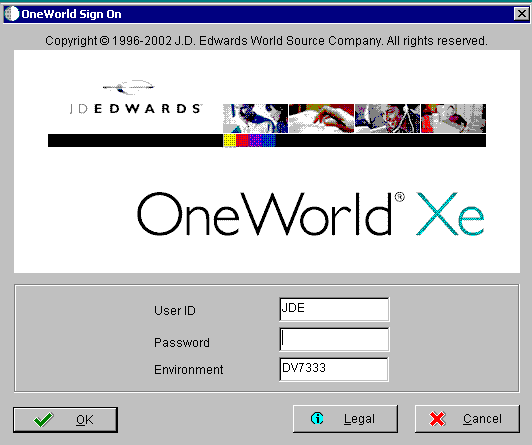
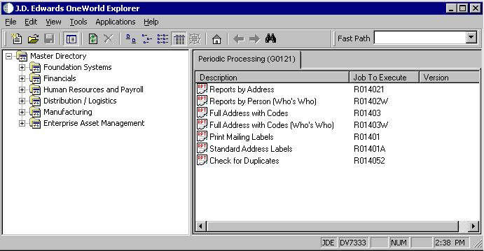
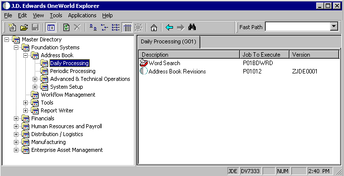
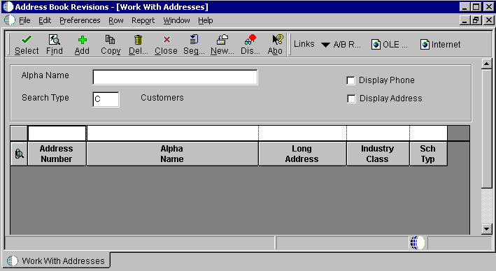
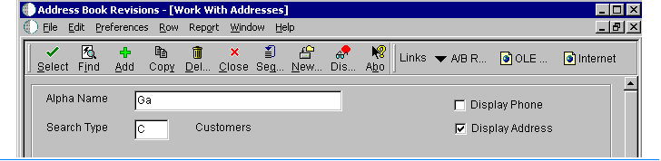
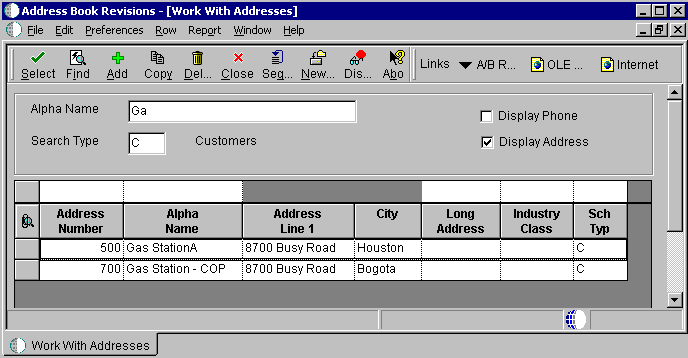
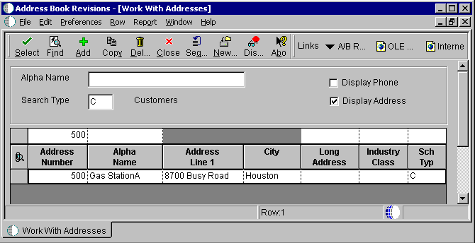

# Using a JD Edwards OneWorld System
The JD Edwards OneWorld system is accessible from a [!INCLUDE[btsBizTalkServerNoVersion](../includes/btsbiztalkservernoversion-md.md)] system by using the JD Edwards OneWorld adapter. This adapter is one of a group of eight line-of-business (LOB) adapters shipped by Microsoft for use with [!INCLUDE[btsBizTalkServerNoVersion](../includes/btsbiztalkservernoversion-md.md)].  
  
 The JD Edwards OneWorld lab work is divided into two parts. This first lab (Lab 1) allows you to use the JD Edwards OneWorld system without needing [!INCLUDE[btsBizTalkServerNoVersion](../includes/btsbiztalkservernoversion-md.md)] or any Microsoft products. You will use the JD Edwards OneWorld Client tool to connect to a JD Edwards OneWorld database and locate a specific record based upon address.  
  
 In the second lab (Lab 2), you will create a BizTalk project and orchestration. After you create the application, you will deploy it and use it to connect to a JD Edwards OneWorld system by using the JD Edwards OneWorld adapter. The goal is to access data through the BizTalk application by using the adapter.  
  
## Prerequisites  
 To perform the procedures for this lab, you need to install the JD Edwards OneWorld client software and its latest update. To use any of the client software tools you will need a JD Edwards OneWorld database, network connectivity to that database, and a user account on that system. You do not need [!INCLUDE[btsBizTalkServerNoVersion](../includes/btsbiztalkservernoversion-md.md)] to complete this lab.  
  
## Lab 1 - Using a JD Edwards OneWorld System  
 In this lab, you will use the JD Edwards OneWorld system without using any components of [!INCLUDE[btsBizTalkServerNoVersion](../includes/btsbiztalkservernoversion-md.md)]. The goals are to test your connectivity to JD Edwards OneWorld and to ensure that the second lab will work correctly. You will use the JD Edwards OneWorld SQL Plus tool to create and manipulate a data table in a JD Edwards OneWorld database.  
  
## Procedures for Lab 1 - Using a JD Edwards OneWorld System  
  
#### To log on to JD Edwards OneWorld by using a browser  
  
-   Log on to the JD Edwards OneWorld system by clicking the JD Edwards OneWorld icon. Enter your **User ID**, **Password**, and **Environment**, and then click **OK**.  
  
       
  
#### To locate and view JD Edwards OneWorld data  
  
1.  A successful logon places you at the **JD Edwards OneWorld Explorer**.  
  
       
  
2.  Expand **Master Directory**, then **Foundation Systems**, then **Address Book**, and then **Daily Processing**.  
  
       
  
3.  In the right-hand window, double-click **Address Book Revisions**.  
  
       
  
4.  For **Alpha Name**, enter `Ga`, select the **Display Address** check box, and then click **Find** on the toolbar.  
  
       
  
     In the **Address Book Revisions - [Work With Addresses]** dialog box, two records are displayed as a result of the search.  
  
       
  
     An alternative method of locating data is to clear the **Alpha Name** field, click in the text box above the **Address Number** column, and enter `500`. Click **Find** on the toolbar to display the search results.  
  
       
  
     In Lab 2, there will be instructions for using the JD Edwards OneWorld adapter to retrieve the information for an **Address Number** of `500`.  
  
5.  On the **File** menu, click **Exit** to exit the JE Edwards OneWorld Client session.  
  
## Summary  
 In this lab, you used the JD Edwards OneWorld Client tool to log on to the JD Edwards OneWorld system. After you were connected, you searched for specific data and viewed the data records returned.
