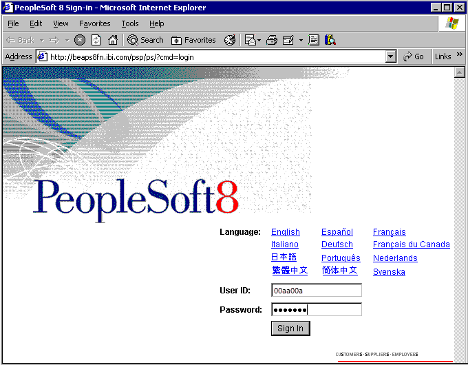

# Using a PeopleSoft System
The PeopleSoft system is accessible from a [!INCLUDE[btsBizTalkServerNoVersion](../includes/btsbiztalkservernoversion-md.md)] system by using the PeopleSoft adapter. This adapter is one of a group of eight line-of-business (LOB) adapters shipped by Microsoft for use with [!INCLUDE[btsBizTalkServerNoVersion](../includes/btsbiztalkservernoversion-md.md)].  
  
 The PeopleSoft lab work is divided into two parts. This first lab (Lab 1) allows you to use the PeopleSoft system without needing [!INCLUDE[btsBizTalkServerNoVersion](../includes/btsbiztalkservernoversion-md.md)] or any Microsoft products (except perhaps Internet Explorer, but you can use any browser). In this lab, you will connect to the PeopleSoft system to locate and modify a simple data record.  
  
 In the second lab (Lab 2), you will create a BizTalk project and orchestration. After you create the application, you will deploy it and use it to connect to a PeopleSoft system by using the PeopleSoft adapter. The goal is to access data through the BizTalk application by using the adapter.  
  
## Prerequisites  
 To perform the procedures for this lab, you need a browser and an Internet connection, along with a user account on a PeopleSoft system. You need to know the location to browse to for gaining Web access to your PeopleSoft system. You do not need [!INCLUDE[btsBizTalkServerNoVersion](../includes/btsbiztalkservernoversion-md.md)] or any other Microsoft technologies.  
  
## Lab 1 - Using a PeopleSoft System  
 In this lab, you will use the PeopleSoft system without using any components of [!INCLUDE[btsBizTalkServerNoVersion](../includes/btsbiztalkservernoversion-md.md)]. The goal is to test your connectivity to PeopleSoft to ensure that the second lab will work correctly. Initially you connect to the PeopleSoft system through its Web interface that allows you to log on by using a browser such as Internet Explorer.  
  
## Procedures for Lab 1 - Using a PeopleSoft System  
  
#### To log on to PeopleSoft by using a browser  
  
-   Log on to the PeopleSoft system by browsing to a PeopleSoft logon page. Enter your **User ID** and **Password** and then click **Sign In**.  
  
       
  
#### To locate and modify PeopleSoft data  
  
1.  A successful logon places you at the page to personalize the content you see by choosing its layout. Scroll down and expand **Set Up Financials/Supply Chain**, click **Common Definitions**, click **Location**, and then click **Location** again. This brings you to the **Location** search interface.  
  
       
  
2.  To begin the search, set **SetID** to **=**, set **Location Code** to **begins with**, enter **A**, and then click **Search**. This displays cities whose names start with A in the **Search Results** section of the interface.  
  
       
  
3.  Click one of the locations to get its detail information. For example, in the figure below, the user clicked the **AUS01** link in the **Location Code** column.  
  
4.  Enter some new data into one of the fields (such as the **Address 2** field) and click **Save** in the lower-left corner. This saves the newly entered data into the record.  
  
       
  
5.  To verify the success of this change, repeat the process from step 2, find this same record again, and observe the changes made to the record.  
  
6.  In the upper-right portion of the window, click **Sign out** to end your PeopleSoft session.  
  
       
  
    > [!NOTE]
    >  In the next lab there are instructions for using the PeopleSoft adapter to retrieve the information for the location record (AUS01) that you modified.  
  
## Summary  
 In this lab you logged on to the PeopleSoft system through a browser. After you were connected, you searched for data, and then manipulated and updated a record's address field. After committing the change, you could view the modified data in the browser to verify that the change executed properly.