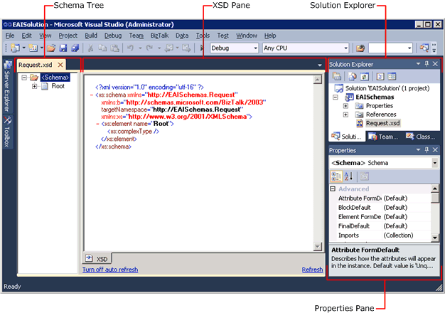

# Using BizTalk Editor

## Overview
BizTalk Editor resides within the Microsoft [!INCLUDE[btsVStudioNoVersion](../includes/btsvstudionoversion-md.md)] shell. Some of the functionality within BizTalk Editor relies upon existing user interface elements within the [!INCLUDE[btsVStudioNoVersion](../includes/btsvstudionoversion-md.md)] shell. For example, you use the **File**, **Edit**, and **View** menus just as you would for other development within [!INCLUDE[btsVStudioNoVersion](../includes/btsvstudionoversion-md.md)]. Information about this common functionality is available from the **Help** menu.  
  
 BizTalk Editor becomes active when you add a new schema to a BizTalk project, when you open an existing schema (an .xsd file) within a BizTalk project, or when you reactivate a schema by clicking its tab in the main [!INCLUDE[btsVStudioNoVersion](../includes/btsvstudionoversion-md.md)] editing window.  
  
> [!NOTE]
>  BizTalk Editor saves schema files using utf-16 character encoding.  

## Views  
 The following figure shows the various views within the Microsoft [!INCLUDE[btsVStudioNoVersion](../includes/btsvstudionoversion-md.md)] shell that are part of BizTalk Editor.  
  
   
  
 BizTalk Editor consists of the following views within the Microsoft [!INCLUDE[btsVStudioNoVersion](../includes/btsvstudionoversion-md.md)] shell and their associated dialog boxes:  
  
- **Schema Tree.** This view is on the left side of the main [!INCLUDE[btsVStudioNoVersion](../includes/btsvstudionoversion-md.md)] editing window. You actively construct your schema in this view by building up the tree structure that describes the structure of the message that the schema defines. For more information about how BizTalk schemas are represented in the schema tree view, see [BizTalk Representation of Schemas](../core/biztalk-representation-of-schemas.md).  
  
- **XSD View.** This view is on the right side of the main [!INCLUDE[btsVStudioNoVersion](../includes/btsvstudionoversion-md.md)] editing window. It shows the XML Schema definition (XSD) language structure that represents the schema you are constructing in the schema tree view. This view is read-only and is provided to help you become accustomed to the XSD syntax of the schema you are creating. If you prefer, you can adjust the view splitter so that the XSD view only barely visible.  
  
- **Solution Explorer.** This view is on the right side of the [!INCLUDE[btsVStudioNoVersion](../includes/btsvstudionoversion-md.md)] shell. It shows the BizTalk project and the various items it contains. Use Solution Explorer to add new and existing schemas to the project, and to open schemas that are already part of the project. For example, to create a new schema, right-click the BizTalk project in the Solution Explorer window, click **Add**, click **New Item**, and then use the **Add New Item** dialog box to name and create a new schema.  
  
- [!INCLUDE[btsVStudioNoVersion](../includes/btsvstudionoversion-md.md)]  **Properties window.** You use this view to examine and set most of the schema and node properties. When you select a node in the schema tree view, or select a schema in the Solution Explorer window, the corresponding properties of that node or schema are displayed in the Properties window using the standard Visual Studio paradigms. For example, the properties are grouped into categories, and can be displayed according to these categories or alphabetically. For detailed information about the different sets of properties that are available when different types of nodes, or the schema, are selected, see the **Schema Property Reference** [!INCLUDE[ui-guidance-developers-reference](../includes/ui-guidance-developers-reference.md)].
  
  In addition to these views, you can interact with several dialog boxes. You usually open these dialog boxes when you are editing a complex property such as a collection.  
  
  This section provides information about the views, commands, and shortcut keys available in BizTalk Editor.  
  
## Next steps 
  
-   [How to Manage the Schema Tree View](../core/how-to-manage-the-schema-tree-view.md)  
  
-   [How to Manage the XSD View](../core/how-to-manage-the-xsd-view.md)  
  
-   [How to Manage the Properties Window](../core/how-to-manage-the-properties-window.md)  
  
-   [How to Manage Other Visual Studio Windows](../core/how-to-manage-other-visual-studio-windows.md)  
  
-   [Using BizTalk Editor Commands](../core/using-biztalk-editor-commands.md)  
  
-   [Working with Large Schemas](../core/working-with-large-schemas.md)