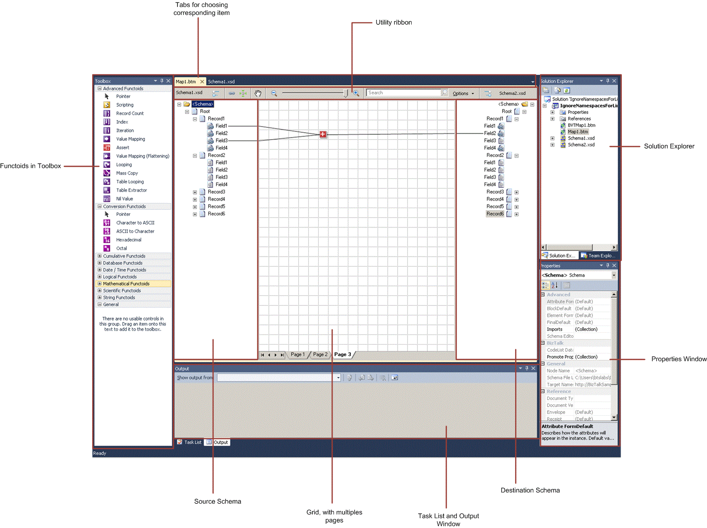
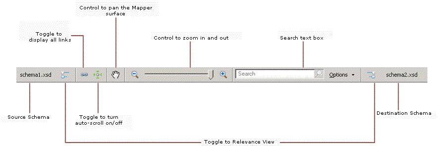

# Using BizTalk Mapper

## Overview
The BizTalk Mapper resides in the [!INCLUDE[btsVStudioNoVersion](../includes/btsvstudionoversion-md.md)] shell. Some of the functionality in the BizTalk Mapper relies on the user interface elements of the [!INCLUDE[btsVStudioNoVersion](../includes/btsvstudionoversion-md.md)] shell. For example, you use the **File**, **Edit**, and **View** menus just as you would for other development in [!INCLUDE[btsVStudioNoVersion](../includes/btsvstudionoversion-md.md)]. Information about this common functionality is available from the **Help** menu.  
  
 The BizTalk Mapper becomes active when you add a new map to a BizTalk project, when you open an existing map (a .btm file), or when you reactivate a map by clicking its tab in the main [!INCLUDE[btsVStudioNoVersion](../includes/btsvstudionoversion-md.md)] editing window.  
  
> [!NOTE]
>  The BizTalk Mapper saves map files using UTF-16 character encoding.  
>
>  When you add an existing artifact to a BizTalk project, the build action is always set to **BtsCompile**. Even when you rename an existing artifact, its build action is set to the default value **BtsCompile**. Hence, while adding or renaming an existing artifact, you need to set the build action appropriately depending on whether you want to build that particular artifact or not.  

## Parts of the BizTalk Mapper  
 The following figure shows various parts of BizTalk Mapper within [!INCLUDE[btsVStudioNoVersion](../includes/btsvstudionoversion-md.md)].  
  
   
  
 The functionality of each of the views is as follows:  
  
- **Visual Studio Mapper Utility Ribbon.** The [!INCLUDE[btsBizTalkServerNoVersion](../includes/btsbiztalkservernoversion-md.md)] Mapper provides a utility ribbon to surface Mapper-related commands. The ribbon provides source schema information, toggle button for relevance view for source and destination schemas, toggle button to show or hide totally out of scope links, toggle switch to turn auto-scrolling on or off, button to pan the Mapper surface, controls to zoom in or zoom out, and the search text box. The following figure shows the utility ribbon you can see at the top of the grid page.  
  
     
  
- **Source schema tree view.** This view shares the main [!INCLUDE[btsVStudioNoVersion](../includes/btsvstudionoversion-md.md)] editing window with the destination schema tree view and the grid view.  
  
   As the name suggests, this view displays the schema that describes the instance messages that are the source of mapping. The links that define the mapping lead from the source schema tree view to the grid view, and, ultimately, to the destination schema tree view.  
  
   For more information about how BizTalk schemas are represented in a schema tree view, see [BizTalk Representation of Schemas](../core/biztalk-representation-of-schemas.md).  
  
- **Destination schema tree view.** This view shares the main [!INCLUDE[btsVStudioNoVersion](../includes/btsvstudionoversion-md.md)] editing window with the source schema tree view and the grid view.  
  
   As the name suggests, this view displays the schema that describes the instance messages that are the destination of the mapping. The links that define the mapping lead into the destination schema tree view from the grid view, and ultimately from the source schema tree view.  
  
   For more information about how BizTalk schemas are represented in a schema tree view, see [BizTalk Representation of Schemas](../core/biztalk-representation-of-schemas.md).  
  
- **Grid view.** This view shares the main [!INCLUDE[btsVStudioNoVersion](../includes/btsvstudionoversion-md.md)] editing window with the source schema tree view and the destination schema tree view, with the source schema tree view to the left and the destination schema tree view to the right.  
  
   As the name suggests, this view plays a critical role in the definition of maps, containing the links and functoids that control how data in a source instance message is transformed into an instance message that conforms to the destination schema.  
  
   The grid view can have multiple layers, called grid pages, allowing you to organize complex maps into logical subdivisions of mappings. Grid pages generally use more space than can be displayed at one time, and there are several effective ways to scroll within a grid page.  
  
   You actively work in this view to construct your map.  
  
- **Visual Studio Toolbox window.** You use this view to display the functoids available for use in BizTalk maps, and as the source of the drag-and-drop operations to place functoids in a grid page.  
  
   The functoids shown in the Toolbox are organized according to their categories. For more information about the available functoids, see [Functoids in Maps](../core/functoids-in-maps.md). Also see the **Functoid Reference** [!INCLUDE[ui-guidance-developers-reference](../includes/ui-guidance-developers-reference.md)]. 
  
- **Visual Studio Properties window.** You use this view, and its associated dialog boxes, to examine and set the properties of the links and functoids that you create to define your map.  
  
   When you select a link or functoid in a grid page in the Grid view, select a schema node in the source or destination schema tree views, or select a map in the **Solution Explorer** window; the corresponding properties of that link, functoid, schema node, or map appear in the **Properties** window using the standard Visual Studio conventions. For example, the properties are grouped into categories, and can be displayed according to these categories or alphabetically.  
  
   For detailed information about the different sets of properties that are available for links, functoids, schema nodes, or the map itself, see the **Map Property Reference** and the **Schema Property Reference**  [!INCLUDE[ui-guidance-developers-reference](../includes/ui-guidance-developers-reference.md)].
  
- **Visual Studio Task List and Output windows.** You use these views to examine the results of validating, compiling, and testing your BizTalk maps in much the same way that these views are used when compiling source code and building other types of projects.  
  
  In addition to these views, you can interact with several dialog boxes. You usually open these dialog boxes when you are editing a complex property such as the input parameters to a functoid.  
  
  You often use the Solution Explorer window in conjunction with BizTalk Mapper. For example, to create a new map, right-click the BizTalk project in the **Solution Explorer** window, click **Add**, click **Add New Item**, and then use the **Add New Item** dialog box to name and create a new map.  
  
## Next steps
  
-   [Using BizTalk Mapper Commands](../core/using-biztalk-mapper-commands.md)  
  
-   [Working with Grid Pages](../core/working-with-grid-pages.md)  
  
-   [How to Manage Views](../core/how-to-manage-views.md)  
  
-   [How to Customize Colors and Font in BizTalk Mapper](../core/how-to-customize-colors-and-font-in-biztalk-mapper.md)  
  
-   [How to Expand and Collapse the Schema Trees](../core/how-to-resize-the-schema-picker-and-expand-and-collapse-the-schema-trees.md)  
  
-   [How to Undo or Redo User Operations](../core/how-to-undo-or-redo-user-operations.md)  
  
-   [How to Search for Map Items](../core/how-to-search-for-map-items.md)  
  
-   [Using Enhanced Features in BizTalk Mapper](../core/using-enhanced-features-in-biztalk-mapper.md)  
  
-   [How to View Infotip and Tooltip](../core/how-to-view-infotip-and-tooltip.md)  
  
## See Also  
 [How to Optimize the Display of Links](../core/how-to-optimize-the-display-of-links.md)