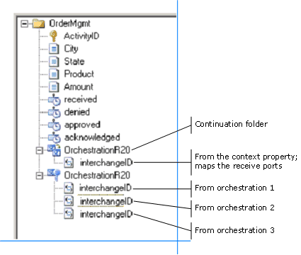
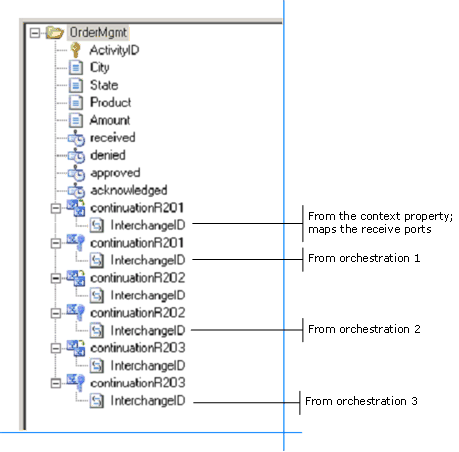
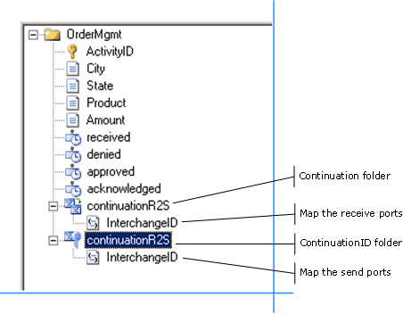
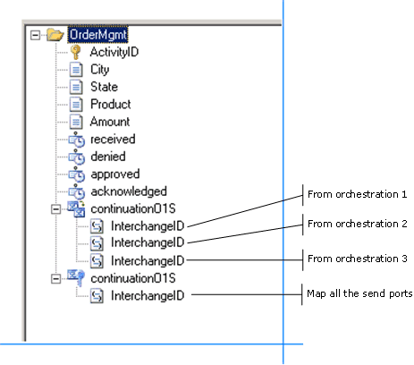
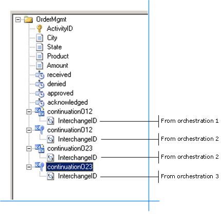

# Using Multiple Continuations
Using the Tracking Profile Editor (TPE) in environments in which there are multiple activities requires that you understand the scenario in which the activities are being tracked in order to map the receive ports, orchestrations, and send ports in the proper sequence.  
  
 In a tracking profile, the TPE assesses the beginning and end of the activity automatically. The activity starts when the first piece of data is collected and ends when the last piece is collected.  
  
 In most cases creating a single continuation, such as a continuation between two orchestrations, is a straightforward process for developers. Where TPE exhibits complexity is in the case of multiple continuations. A multiple continuation scenario  is where a Business Activity Monitoring (BAM) activity spans multiple receive ports, orchestrations, and send ports. In order to collect the BAM data in one record, you must create continuations between all the BizTalk Server schedules. This process can be complex when completed through the TPE user interface (UI).  
  
 This topic describes how to create single and multiple continuations in different scenarios.  
  
#### Base Scenario Description - Multiple Receive Ports, Orchestrations, and Send Ports  
 The scenario consists of a BizTalk server that has a number of receive ports (R), orchestrations (O), and send ports (S). There is a generic interchangeID context property that is used to link the continuations. You can use any context property, such as the activityID or other unique identifier. The choice of the specific content is not germane to the discussion of the scenario.  
  
 For the purposes of the scenario, discussions of the data item/milestone/context-property-value being tracked from these ports and orchestrations are not specified. That part of the mapping is specific to the business logic. The goal is to capture all BAM data from all the ports and orchestrations in a single row in the completed activity table. The different ways in which a message can be received and processed by orchestrations presents some interesting challenges and solutions.  
  
> [!NOTE]
>  The scenario of one port or one orchestration can be considered a special case of the many port and many orchestrations scenario.  
  
#### Scenario Solution 1 - One Receive Port and One Orchestration  
 In this scenario, a message arrives at exactly one of the receive ports (R1) and is processed by exactly one of the orchestrations (O1).  
  
 The process to create the continuation is as follows:  
  
1. Create a continuation in the folder activity tree view of the tracking profile.  
  
2. Choose the context property schema by clicking the **Select Event Source** button, and then clicking the **Select Context Property** menu item.  
  
3. Locate the **interchangeId property** in the **Context Property Name** list, and then select it.  
  
4. From the property schema, map the interchangeID to the continuation folder that you just created.  
  
5. Right-click the newly created interchangeID node in the activity tree, and then select the ports from which to map.  
  
6. In the **Select Ports** dialog box that is displayed, select all **N** receive ports.  
  
7. Create a continuationID folder in the folder activity tree.  
  
8. Open each orchestration by clicking the **Select Event Source** button, and then clicking the **Select Orchestration Schedule** menu item. From each orchestration, right-click a shape in the orchestration, and then map the interchangeID context property to the newly created continuationID.  
  
   In a deployment with three orchestrations, your tracking profile would look similar to this:  
  
     
  
#### Scenario Solution 2 - One Receive Port and Multiple Orchestrations  
 In this scenario, a message arrives at exactly one of the receive ports and is processed by each and every orchestration. This happens as the message is simultaneously sent to each of the orchestrations.  
  
 In this case, we would need a continuation and continuationID for each orchestration. The process for creating the continuations would be similar to the steps outlined in scenario solution 1. For a three-orchestration deployment, your resulting tracking profile looks something like this:  
  
   
  
#### Scenario Solution 3 - Content Based Routing  
 This scenario defines a content based routing (CBR) solution. A message arrives at exactly one of the receive ports and is sent to exactly one of the send ports. This routing happens based on a context property value in the message. In this case, we would need one continuation. The mapping looks something like this:  
  
   
  
> [!NOTE]
>  The above mapping is also valid for a message that arrives at exactly one of the receive ports and is sent to all of the send ports.  
  
#### Scenario Solution 4 - One Orchestration, Multiple Send Ports  
 In this scenario, there are multiple send. ports. A message is processed by exactly one of the orchestrations, which is determined by the processing rules, and is sent to all of the send ports. In this case, we would need one continuation. The mapping looks something like this:  
  
   
  
#### Scenario Solution 5 - Sequential Orchestrations  
 In this scenario, a message is processed by each orchestration in sequence, one by one, and is passed to the next orchestration via the continuation. The mapping looks something like this:  
  
   
  
### Collecting Data in an Asynchronous Environment  
 When you set up continuations, BAM expects the data to arrive. In an asynchronous environment you may not receive a response from a backend process.  
  
 If you do not receive the response data, the activity instance waits indefinitely. The activity will never complete and the records remain in the tables in the BAM Primary Import database. Consider the case of long-running transactions, where there is no way to tell when the remaining data will arrive. There is no time-out, as data arrival will depend on business logic or processes, after which the activity is marked as complete. The data could arrive the same day, or in extreme cases, the following year.  
  
 The solution is to use related activities.  
  
 Split your activity into two activities. Relate the two activities, and relate the response to the original activity.  
  
 For more information about related activities, see [Activity Relationships](../core/activity-relationships.md).  
  
## See Also  
 [Tracking Profile Editor](../core/tracking-profile-editor.md)