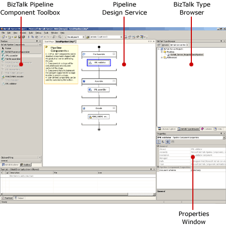

# Using Pipeline Designer
Pipeline Designer is a graphical editor, hosted in Microsoft [!INCLUDE[btsVStudioNoVersion](../includes/btsvstudionoversion-md.md)], which enables you to create new pipelines; view the pipeline templates included with Microsoft [!INCLUDE[btsBizTalkServerNoVersion](../includes/btsbiztalkservernoversion-md.md)]; move pipeline components within a pipeline; and configure pipelines, stages, and pipeline components.  
  
 Pipeline Designer uses three key tools of the [!INCLUDE[btsVStudioNoVersion](../includes/btsvstudionoversion-md.md)] shell as part of the design experience:  
  
- The Properties window, where most of the characteristics of pipeline objects are viewed and modified.  
  
- The Toolbox, which is used as a source for the design surface.  
  
- The design surface, where components from the Toolbox are dragged and dropped.  
  
  The following figure shows the Pipeline Designer environment.  
  
    
  Depicts the Pipeline Designer environment.  
  
  Pipeline Designer is integrated with the BizTalk project template to enhance your development experience. After using the project system to create a new BizTalk project, you can use the **Add New Item** command on the **File** menu to add a pipeline to your solution. For more information about the BizTalk project template, see [Using the BizTalk Project System](../core/using-the-biztalk-project-system.md).  
  
> [!NOTE]
>  In previous versions of [!INCLUDE[btsBizTalkServerNoVersion](../includes/btsbiztalkservernoversion-md.md)], the concept of a pipeline was encapsulated in message channels and ports, which defined a set order of specific components that were applied to a document. In this version, the pipeline is flexible because you are free to reorder the components in each stage of the pipeline and can easily insert multiple custom components throughout the pipeline.  
  
 The Pipeline Designer design surface enables you to draw a graphical representation of a pipeline. The design surface occupies the main section of the [!INCLUDE[btsVStudioNoVersion](../includes/btsvstudionoversion-md.md)] window and enables you to edit the pipelines belonging to a BizTalk project. You can navigate between pipelines by clicking the tabs above the design surface.  
  
 Each pipeline is composed of stages, with each stage containing one or more components. If there are no components in a stage, a watermark with text indicates that shapes can be inserted from the Toolbox. When the first shape is inserted into a stage, the initial text disappears. The design surface shows the pipeline vertically, running from top (start) to bottom (end).  
  
 As with other common Microsoft Windows programs, you can perform several tasks, such as **Open** and **Save** from the **File** menu.  
  
## See Also  
 [Creating Pipelines with Pipeline Designer](../core/creating-pipelines-with-pipeline-designer.md)   
 [Creating Pipelines Using Pipeline Designer](../core/creating-pipelines-using-pipeline-designer.md)