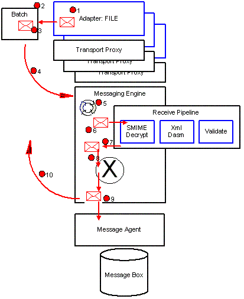

# Using the BizTalk Messaging Engine
The following diagram illustrates the architecture of the Messaging Engine. It shows a scenario in which a message is received by an adapter and submitted into BizTalk Server.  
  
   
Architecture of the Messaging Engine  
  
 Each adapter has its own instance of a **TransportProxy** object that it uses to interact with the Messaging Engine. Adapters perform work against the Messaging Engine in batches, which are processed atomically. A batch is a collection of operations such as SubmitMessage, SuspendMessage, or DeleteMessage.  
  
 The following is the sequence of events for the scenario where an adapter submits a message to the Messaging Engine:  
  
1.  The adapter creates a new message and connects the data stream to the message.  
  
2.  The adapter gets a new batch from the Messaging Engine.  
  
3.  The adapter adds the message to the batch to be submitted.  
  
4.  The batch is committed and queued up on the Messaging Engine thread pool.  
  
5.  The Messaging Engine thread pool starts processing the new batch.  
  
6.  The message is processed in the receive pipeline.  
  
7.  The receive pipeline produces zero or more messages. Pipelines can consume messages providing they do not return any errors. Receive pipelines can produce more than one message; typically this happens when the dissassembler component disassembles a single interchange into many messages. Typically the receive pipeline normalizes the submitted message into XML.  
  
8.  The message(s) produced by the pipeline will be processed in the mapper if mapping is configured.  
  
9. The message(s) are published to the Message Agent or to the MessageBox database.  
  
10. The Messaging Engine calls back the adapter to notify it of the outcome of the batch of work.  
  
## In This Section  
  
-   [Recoverable Interchange Processing](../core/recoverable-interchange-processing.md)  
  
-   [Ordered Delivery of Messages](../core/ordered-delivery-of-messages.md)  
  
-   [Error Handling](../core/error-handling.md)  
  
## See Also  
 [How BizTalk Server Processes Large Messages](../core/how-biztalk-server-processes-large-messages.md)   
 [Engine Performance Characteristics](../core/engine-performance-characteristics.md)   
 [Measuring Maximum Sustainable Engine Throughput](../core/measuring-maximum-sustainable-engine-throughput.md)   
 [Test Scenarios for Measuring MST of the Engine](../core/test-scenarios-for-measuring-mst-of-the-engine.md)   
 [Using the Microsoft BizTalk LoadGen 2007 Tool](../core/using-the-microsoft-biztalk-loadgen-2007-tool.md)
