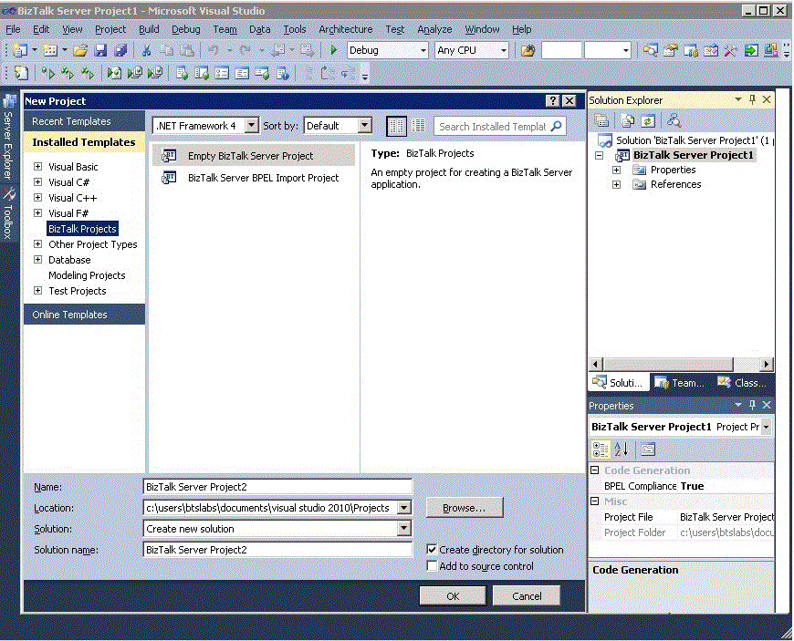

# Using the BizTalk Project System
You can use the BizTalk project system to create, organize, and configure BizTalk solutions in the Microsoft [!INCLUDE[btsVStudioNoVersion](../includes/btsvstudionoversion-md.md)] environment. The topics and procedures in this section describe how to perform various tasks by using the BizTalk project system.

 The BizTalk Server project system uses the same project management principles and procedures that you use with other Microsoft Build Engine (MSBuild) projects in [!INCLUDE[btsVStudioNoVersion](../includes/btsvstudionoversion-md.md)]. This section details common procedures that you might use when creating an application that runs on Microsoft [!INCLUDE[btsBizTalkServerNoVersion](../includes/btsbiztalkservernoversion-md.md)].

 For more information about MSBuild, see the MSBuild reference section in the [!INCLUDE[btsVStudioNoVersion](../includes/btsvstudionoversion-md.md)] Combined Collection at [https://go.microsoft.com/fwlink/?LinkId=193567](/previous-versions/visualstudio/visual-studio-2015/msbuild/msbuild).

 For more information about using the [!INCLUDE[btsVStudioNoVersion](../includes/btsvstudionoversion-md.md)] environment, see "Managing Solutions, Projects, and Files" in the [!INCLUDE[btsVStudioNoVersion](../includes/btsvstudionoversion-md.md)] Combined Collection at [https://msdn.microsoft.com/library/wbzbtw81.aspx](/previous-versions/wbzbtw81(v=vs.140)).

 The following figure shows the BizTalk project system design environment with the **New Project** dialog box open.

 
Depicts the Project System Design Environment

### To open BizTalk Editor

1.  In Solution Explorer, click a schema.

    > [!NOTE]
    >  To open BizTalk Editor, you must first create a schema or open a previously created schema. For information about creating a schema, see [How to Create Schemas for XML Messages](../core/how-to-create-schemas-for-xml-messages.md). Also see [Adding Project Items](../core/adding-project-items.md).

2.  On the **View** menu, click **Open**.

     —Or—

     Right-click the schema, and then click **Open**.

     —Or—

     Double-click the schema.

     The selected schema opens in BizTalk Editor.

    > [!NOTE]
    >  To create a schema, you must have a project open. For information about how to create a project, see [How to Create BizTalk Projects](../core/how-to-create-biztalk-projects.md). For information about adding items to a project, see [How to Create Schemas for XML Messages](../core/how-to-create-schemas-for-xml-messages.md). Also see [Adding Project Items](../core/adding-project-items.md).

### To open BizTalk Mapper

1.  In Solution Explorer, click a map.

    > [!NOTE]
    >  To open BizTalk Mapper, you must first create a map or open a previously created map. For information about creating a map, see [How to Create New Maps](../core/how-to-create-new-maps.md). Also see [Adding Project Items](../core/adding-project-items.md).

2.  On the **View** menu, click **Open**.

     —Or—

     Right-click the map, and then click **Open**.

     —Or—

     Double-click a map.

     The selected map opens in BizTalk Mapper.

    > [!NOTE]
    >  To create a map, you must have a project open. For information about how to create a project, see [How to Create BizTalk Projects](../core/how-to-create-biztalk-projects.md). For information about adding items to a project, see [Adding Project Items](../core/adding-project-items.md). Also see [How to Create New Maps](../core/how-to-create-new-maps.md).

### To open Orchestration Designer

1.  In Solution Explorer, click an orchestration (.odx).

    > [!NOTE]
    >  To open Orchestration Designer, you must first create an orchestration or open a previously created orchestration. For information about how to create an orchestration, see [Working in Orchestration Designer](../core/working-in-orchestration-designer.md).

2.  On the **View** menu, click **Open**.

     —Or—

     Right-click the orchestration, and then click **Open**.

     —Or—

     Double-click the orchestration.

     Orchestration Designer opens.

    > [!NOTE]
    >  To create an orchestration, you must have a project open. For information about how to create a project, see [How to Create BizTalk Projects](../core/how-to-create-biztalk-projects.md). For information about adding items to a project, see [Adding Project Items](../core/adding-project-items.md). Also see [Working in Orchestration Designer](../core/working-in-orchestration-designer.md).

### To open Pipeline Designer

1.  In Solution Explorer, click a pipeline.

    > [!NOTE]
    >  To open Pipeline Designer, you must first create a pipeline or open a previously created pipeline. For information about how to create a pipeline, see [How to Create a New Pipeline](../core/how-to-create-a-new-pipeline.md).

2.  On the **View** menu, click **Open**.

     —Or—

     Right-click the pipeline, and then click **Open**.

     —Or—

     Double-click the pipeline.

     Pipeline Designer opens.

    > [!NOTE]
    >  To create a pipeline, you must have a project open. For information about how to create a project, see [How to Create BizTalk Projects](../core/how-to-create-biztalk-projects.md). For information about adding items to a project, see [Adding Project Items](../core/adding-project-items.md). Also see [Working in Orchestration Designer](../core/working-in-orchestration-designer.md).

## See Also
 [Creating Orchestrations Using Orchestration Designer](../core/creating-orchestrations-using-orchestration-designer.md)
 [Using Pipeline Designer](../core/using-pipeline-designer.md)
 [Windows of the Business Rule Composer](../core/windows-of-the-business-rule-composer.md)
 [Using BizTalk Editor](../core/using-biztalk-editor.md)
 [Using BizTalk Mapper](../core/using-biztalk-mapper.md)
 [Developer Tools](../core/developer-tools.md)
