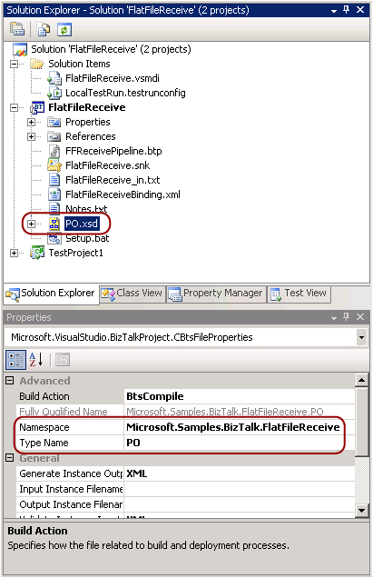

# Using the Unit Testing Feature with Pipelines
This topic demonstrates how to use the unit testing feature to add a unit test for the pipeline in the FlatFileReceive pipeline example. Pipeline unit testing is similar to the Pipeline.exe tool that is documented here: [Pipeline Tools](../core/pipeline-tools.md). When you enable unit testing on the **Deployment** tab of the project properties, the pipeline class in your project is derived from **Microsoft.BizTalk.TestTools.Pipeline.TestableReceivePipeline**.  This class models some of the same functionality exposed by the Pipeline.exe tool.  
  
## Prerequisites  
 You must first follow the steps for building the FlatFileReceive sample and become familiar with that sample. The documentation that includes the steps for building the FlatFileReceive sample can be found here: [FlatFileReceive (BizTalk Server Sample)](../core/flatfilereceive-biztalk-server-sample.md).  
  
## Adding a Unit Test Project to the FlatFileReceive Sample  
  
#### To add a unit test project to the FlatFileReceive sample  
  
1.  In Visual Studio, open the FlatFileReceive.sln solution file.  
  
2.  In Solution Explorer, right-click the **FlatFileReceive** project, and then click **Properties**.  
  
3.  In Project Designer, click the **Deployment** property page tab and set **Enable Unit Testing** to `True`.  
  
4.  Close the project properties page saving the changes.  
  
5.  On the main menu, click **Build**, and then click **Rebuild Solution**.  
  
6.  On the main menu, click **Test**, and then click **New Test**.  
  
7.  In the **Add New Test** dialog box, select **Create a new Visual C# test project** for the **Add to Test Project** field. Select **Unit Test Wizard** in the **Templates** list, and then click **OK**.  
  
8.  In the **New Test Project** dialog box, leave the project name as **TestProject1** and click **Create**.  
  
9. In the **Create Unit Tests** dialog box, expand the types and select the **FFReceivePipeline()** constructor under the **Microsoft.Samples.BizTalk.FlatFileReceive.FFReceivePipeline** node. Click **OK**.  
  
## Adding Test Code to Test the Pipeline  
  
#### To add test code to test the pipeline  
  
1.  Add the following references to the **TestProject1** project:  
  
    -   BizTalk Pipeline Interop  
  
    -   Microsoft.BizTalk.TestTools  
  
    -   Microsoft XLANG/s Base Types  
  
2.  In Solution Explorer, open FFReceivePipelineTest.cs and add the following directives to the top of that file:  
  
    ```  
    using System.IO;  
    using System.Collections.Specialized;  
    using System.Collections.Generic;  
    ```  
  
3.  Scroll to the bottom of the file and replace the **FFReceivePipelineConstructorTest** method with the following code, which verifies that the pipeline inputs exist before testing the pipeline. This code also verifies that a message conforming to the flat file schema is generated.  
  
    ```  
    [TestMethod()]  
    public void FFReceivePipelineUnitTest()  
    {  
        //=== Pipeline class derived from TestableReceivePipeline ===//  
        FFReceivePipeline target = new FFReceivePipeline();  
  
        //=== Collection of messages to test the flat file pipeline ===//  
        StringCollection documents = new StringCollection();  
        string strSourcePO_XML = @".\..\..\..\FlatFileReceive_in.txt";  
        Assert.IsTrue(File.Exists(strSourcePO_XML));  
        documents.Add(strSourcePO_XML);  
  
        //=== Only a body part for this test message so an empty ===//  
        //=== collection will be passed.                         ===//  
        StringCollection parts = new StringCollection();  
  
        //=== Dictionary mapping the schema to the namespace and type ===//  
        //=== as displayed in the properties window for the *.xsd     ===//  
        Dictionary<string, string> schemas = new Dictionary<string, string>();  
        string SchemaFile = @".\..\..\..\PO.xsd";  
        Assert.IsTrue(File.Exists(SchemaFile));  
        schemas.Add("Microsoft.Samples.BizTalk.FlatFileReceive.PO", SchemaFile);  
  
        //=== Test the execution of the pipeline using the inputs ===//  
        target.TestPipeline(documents, parts, schemas);  
  
        //=== Validate that the pipeline test produced the message ===//  
        //=== which conforms to the schema.                        ===//  
        string[] strMessages = Directory.GetFiles(testContextInstance.TestDir + "\\out","Message*.out");              
        Assert.IsTrue(strMessages.Length > 0);                          
        PO PO_target = new PO();  
        foreach(string outFile in strMessages)  
        {  
          Assert.IsTrue(PO_target.ValidateInstance(outFile,Microsoft.BizTalk.TestTools.Schema.OutputInstanceType.XML));  
        }                       
    }  
    ```  
  
## Building and Running the Unit Test  
  
#### To build and run the unit test  
  
1.  In Solution Explorer, right-click **TestProject1**, and then click **Build**.  
  
2.  On the main menu, click **Test**, and then in the **Windows** list, click **Test View**.  
  
3.  In the Test View window, right-click **FFReceivePipelineUnitTest**, and then click **Run Selection**. Verify that you see **Passed** in the Test Results window.  
  
4.  In the TestResults directory examine the \*.out file. This file should contain the new message processed by the pipeline.  It should be located in a directory similar to the following:  
  
     C:\Program Files\Microsoft BizTalk Server \<version\>\SDK\Samples\Pipelines\AssemblerDisassembler\FlatFileReceive\TestResults\Wes_BTS2009Svr 2009-02-04 09_01_04\Out  
  
     The processed message should look similar to the following:  
  
    ```  
    <purchaseOrder orderDate="1999-10-20" xmlns="http://FlatFileRecieve.PO">  
  
      <shipTo country="US" xmlns="">  
        <name>Alice Smith</name>  
        <street>123 Maple Street</street>  
        <city>Mill Valley</city>  
        <state>CA</state>  
        <zip>90952</zip>  
      </shipTo>  
  
      <billTo country="US" xmlns="">  
        <name>Robert Smith</name>  
        <street>8 Oak Avenue</street>  
        <city>Old Town</city>  
        <state>PA</state>  
        <zip>95819</zip>  
      </billTo>  
  
      <comment>Hurry, my lawn is going wild!</comment>  
  
      <items xmlns="">  
  
        <item partNum="872-AA">  
          <productName>Lawnmower</productName>  
          <quantity>1</quantity>  
          <USPrice>148.95</USPrice>  
          <comment xmlns="http://FlatFileRecieve.PO">Confirm this is electric</comment>  
        </item>  
  
        <item partNum="926-AA">  
          <productName>Baby Monitor</productName>  
          <quantity>1</quantity>  
          <USPrice>39.98</USPrice>  
          <comment xmlns="http://FlatFileRecieve.PO">Confirm this is electric</comment>  
          <shipDate>1999-05-21</shipDate>  
        </item>  
  
      </items>  
  
    </purchaseOrder>  
    ```  
  
5.  If any test fails you can double-click the test in the Test Results window to see the assert or exception that caused that test failure.  
  
## Test Code Summary  
 When unit testing was enabled for the **FlatFileReceive** project, the **FFReceivePipeline** C# class associated with **FFReceivePipeline.btp** was derived from the **Microsoft.BizTalk.TestTools.Pipeline.TestableReceivePipeline** class. The **FFReceivePipelineUnitTest** method in **TestProject1** used the **TestPipeline** method that **FFReceivePipeline** inherited to test the flat file receive pipeline. After the pipeline processed the message, the output message was validated against the flat file schema. The parameters for the **TestPipeline** method are as follows:  
  
|Parameter Name|Description|  
|--------------------|-----------------|  
|Documents|StringCollection containing messages to be processed by the pipeline.|  
|Parts|StringCollection containing the parts for the messages.|  
|Schemas|Dictionary mapping used to map each message type to its corresponding \*.xsd schema file. The key must be in the format **Namespace.Type**. The namespace and type used should be noted from the properties window for the \*.xsd file in Visual Studio. See the screenshot below.<br /><br /> <br /><br /> **Namespace and type exposed from the properties window of an XSD file.**|  
  
## See Also  
 [Using the Unit Testing Feature with Schemas and Maps](../core/using-the-unit-testing-feature-with-schemas-and-maps.md)   
 [Working with Unit Tests (Visual Studio)](http://go.microsoft.com/fwlink/?LinkId=128890)