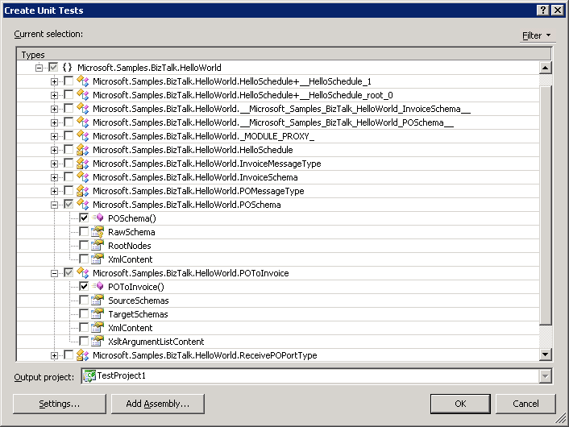

# Using the Unit Testing Feature with Schemas and Maps
This topic demonstrates how to use the unit testing feature to add a unit test for the schemas and map in the HelloWorld orchestration example.

> [!NOTE]
>  The unit testing feature for maps currently does not support multiple input maps.

## Prerequisites
 You must first follow the steps for building the HelloWorld sample. Those steps can be found here: [HelloWorld (BizTalk Server Sample)](../core/helloworld-biztalk-server-sample.md)

### Adding a Unit Test Project to the HelloWorld Sample

1.  In Visual Studio, open the HelloWorld.sln solution file.

2.  In Solution Explorer, right-click the **HelloWorld** project, and then click **Properties**.

3.  In Project Designer, click the **Deployment** property page tab and set **Enable Unit Testing** to `True`.

4.  Close the project properties page saving the changes.

5.  In main menu, click **Build**, and then click **Rebuild Solution**.

6.  On the main menu, click **Test**, and then click **New Test**.

7.  In the **Add New Test** dialog box, select **Create a new Visual C# test project** for **Add to Test Project** field. Select **Unit Test Wizard** in the **Templates** list, and then click **OK**.

8.  In the **New Test Project** dialog box, leave the project name as **TestProject1** and click **Create**.

9. In the **Create Unit Tests** dialog box, expand the types and select the **POSchema()** constructor under the **Microsoft.Samples.BizTalk.HelloWorld.POSchema** node. Also select **POToInvoice()** constructor under the **Microsoft.Samples.BizTalk.HelloWorld.POToInvoice** node. The figure below shows the selections that should be made. After making the selections shown below, press **OK**.

     

### Adding Test Code to Test the Schemas and Map

1.  Add the following references to the **TestProject1** project from the **.NET** tab in the Add Reference dialog:

    -   Microsoft.BizTalk.TestTools

    -   Microsoft XLANG/s Base Types

2.  In Solution Explorer, open POSchemaTest.cs

3.  Scroll to the bottom of the file and replace the **POSchemaConstructorTest** method with the following code which validates the sample PO input message:

    ```
    [TestMethod()]
    public void POSchemaInstanceValidationTest()
    {
        POSchema target = new POSchema();

        //=== The SamplePOInput.xml file from <Samples Path>\Orchestrations\HelloWorld ===//
        string strSourcePO_XML = testContextInstance.TestDir + "..\\..\\..\\SamplePOInput.xml";

        //=== Validate the SamplePOInput message against the schema ===//
        Assert.IsTrue(target.ValidateInstance(strSourcePO_XML, Microsoft.BizTalk.TestTools.Schema.OutputInstanceType.XML));
    }
    ```

4.  In Solution Explorer open POToInvoiceTest.cs and add the following directive to the top of that file:

    ```

    using System.IO;
    ```

5.  Scroll to the bottom of the file and replace the **POToInvoiceConstructorTest** method with the following code which tests the map using the sample PO input message:

    ```

    [TestMethod()]
    public void POToInvoiceMapTest()
    {
        POToInvoice target = new POToInvoice();

        //=== Use the HelloWorld sample directory path for the message files ===//

        string strSourcePO_XML = testContextInstance.TestDir + "..\\..\\..\\SamplePOInput.xml";
        string strDestInvoice_XML = testContextInstance.TestDir + "..\\..\\..\\SampleInvoiceOutput.xml";

        //=== Test the map by using the TestMap method of the TestableMapBase class ===//

        target.ValidateOutput = true;
        target.TestMap(strSourcePO_XML,
                       Microsoft.BizTalk.TestTools.Schema.InputInstanceType.Xml,
                       strDestInvoice_XML,
                       Microsoft.BizTalk.TestTools.Schema.OutputInstanceType.XML);

        //=== Output file should be created as a result of testing the map ===//

        Assert.IsTrue(File.Exists(strDestInvoice_XML));
    }
    ```

### Building and Running the Unit Test

1.  In Solution Explorer, right-click **TestProject1**, and then click **Build**.

2.  On the main menu, click **Test**, and then in the **Windows** list, click **Test View**.

3.  In the Test View window, right-click **POSchemaInstanceValidationTest**, and then click **Run Selection**. Verify that you see **Passed** in the Test Results window.

4.  In the Test View window, right-click **POToInvoiceMapTest**, and then click **Run Selection**. Verify that you see **Passed** in the Test Results window.

5.  If any test fails you can double-click the test in the Test Results window to see the assert or exception that caused that test failure.

## Test Code Summary
 When unit testing was enabled for the **HelloWorld** project, the C# class associated with **POSchema.xsd** was derived from the **Microsoft.BizTalk.TestTools.Schema.TestableSchemaBase** class. The **POSchemaInstanceValidationTest** method in **TestProject1** used the **ValidateInstance** method of the **POSchema** class to validate SamplePOInput.xml against the PO schema.

 Similarly, when unit testing was enabled for the **HelloWorld** project, the C# class associated with the **POToInvoice.btm** map was derived from the **Microsoft.BizTalk.TestTools.Mapper.TestableMapBase** class. The **POToInvoiceMaptest** method used the **TestMap** method of the **POToInvoice** class to test the map using the same SamplePOInput.xml message. This resulted in SampleInvoiceOutput.xml being created in the HelloWorld directory.

## See Also
 [Using the Unit Testing Feature with Pipelines](../core/using-the-unit-testing-feature-with-pipelines.md)
 [Working with Unit Tests (Visual Studio)](https://go.microsoft.com/fwlink/?LinkId=128890)
