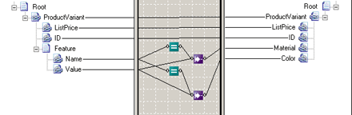

# Value Mapping (Flattening) Functoid
The **Value Mapping (Flattening)** functoid enables you to flatten a portion of an input instance message by converting multiple records into a single record. This is a common operation in converting Microsoft Commerce Server catalogs.  
  
> [!NOTE]
>  The **Value Mapping (Flattening)** functoid should not be combined with the **Looping** functoid or the **Table Looping** functoid. If they are combined, it results in a compiled map that assumes there is no source looping dependency for the target nodes that are below the **Looping** or **Table Looping** functoid.  
  
 The following code shows a portion of a catalog listing product variants with each feature of the variant in a separate record.  
  
```  
<ns0:Root xmlns:ns0="http://ValueMappingFlat.ProductsIn">  
    <ProductVariant ListPrice="99.99" ID="45-01">  
        <Feature Name="Material" Value="Leather" />  
        <Feature Name="Color" Value="Black" />  
    </ProductVariant>  
    <ProductVariant ListPrice="69.99" ID="45-02">  
        <Feature Name="Material" Value="Vinyl" />  
        <Feature Name="Color" Value="Brown" />  
    </ProductVariant>  
</nso0:Root>  
```  
  
 Flattening this portion of the catalog would convert the **Feature** records into attributes of the **ProductVariant** record.  
  
```  
<ns0:Root xmlns:ns0="http://ValueMappingFlat.ProductsOut">  
    <ProductVariant ListPrice="99.99" ID="45-01" Material="Leather" Color="Black" />  
    <ProductVariant ListPrice="69.99" ID="45-02" Material="Vinyl" Color="Brown" />  
</ns0:Root>  
```  
  
 The following figure shows a map that performs this conversion.  
  
   
Value Mapping (Flattening) Functoid Map  
  
 The **Value Mapping (Flattening)** functoid returns the value of its second parameter if its first parameter is true. In this map, the first **Equal** functoid tests to see if the **Name** attribute is equal to "Material". If the attribute is equal to "Material", the **Equal** functoid returns **True**. In turn, this causes the **Value Mapping (Flattening)** functoid to assign the value of the **Value** attribute to the field in the output message.  
  
## See Also  
 [How to Add Value Mapping (Flattening) Functoids to a Map](../core/how-to-add-value-mapping-flattening-functoids-to-a-map.md)   
 [Flat Schema to Catalog](../core/flat-schema-to-catalog.md)   
 [Advanced Functoids](../core/advanced-functoids.md)
