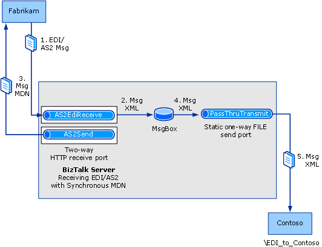

# Walkthrough (AS2): Receiving EDI over AS2 with a Synchronous MDN
This walkthrough provides a set of step-by-step procedures that creates a solution for receiving EDI messages over AS2 transport, returning synchronous MDNs.  

## Prerequisites  
 The following are prerequisites for performing the procedures in this topic:  

- You must be logged on as a member of the [!INCLUDE[btsBizTalkServerNoVersion](../includes/btsbiztalkservernoversion-md.md)] Administrators or [!INCLUDE[btsBizTalkServerNoVersion](../includes/btsbiztalkservernoversion-md.md)] B2B Operators group.  

- The computer that runs the walkthrough must have Internet Information Services (IIS) 7 installed.  

- If the computer that runs the walkthrough is installed with a 64-bit version of Windows, you must ensure that the BizTalk hosts are marked as 32-bit only. You must also ensure IIS has the Enable 32-Bit Application Setting for the Application Pools set to **True**. For more information, see [Tutorial 3: AS2 Tutorial](../core/tutorial-3-as2-tutorial.md).  

## How the Solution Receives an EDI/AS2 Message and Returns a Synchronous MDN  
 The solution does the following:  

1. Receives an AS2 message containing an EDI interchange over HTTP from the trading partner Fabrikam, and decode the interchange from EDIINT/AS2.  

   > [!NOTE]
   >  The events in this list may not occur in the order shown.  

2. Returns a synchronous MDN to the trading partner using the request-response receive port.  

3. Converts the EDI format of the interchange to internal XML format, and drops it in the MessageBox.  

4. A FILE send port with a PassThruTransmit pipeline picks up the message XML file.  

5. The send port sends the EDI interchange XML file to a folder at the Contoso party.  

   The following figure shows the architecture for this solution.  

     

## The Functionality in this Solution  
 The following applies to the functionality of this walkthrough:  

-   An EDI acknowledgment is not generated. Generating an EDI acknowledgment is demonstrated in [Walkthrough (X12): Receiving EDI Interchanges and Sending Back an Acknowledgement](../core/walkthrough-x12--receive-edi-interchanges-and-send-back-an-acknowledgement.md). Sending an EDI acknowledgment over AS2 transport is described in [Walkthrough (AS2): Sending EDI over AS2 with a Synchronous MDN](../core/walkthrough-as2-sending-edi-over-as2-with-a-synchronous-mdn.md).  

-   The solution is designed for interchanges using X12 encoding, not EDIFACT encoding.  

    > [!NOTE]
    >  The configuration used for EDIFACT encoding is closely parallel to that used for X12 encoding.  

-   EDI type and extended validation will be performed on the incoming interchange.  

-   AS2 and EDI reporting will be enabled, and transaction sets will be saved for viewing from the interchange status report.  

-   This solution does not configure signing, compression, encryption, or message storage in the non-repudiation database. For procedures on configuring those properties, see [Configuring AS2 Properties](../core/configuring-as2-properties.md).  

## Configuring and Testing the Walkthrough  
 The procedures required for this solution include the following:  

- Build and deploy a BizTalk project with the required message schema, making the schema available for use by [!INCLUDE[btsBizTalkServerNoVersion](../includes/btsbiztalkservernoversion-md.md)] in processing the received interchange.  

- Enable the BTS ISAPI filter used in receiving the AS2 message.  

- Create a Contoso virtual directory that receives the AS2 message from Fabrikam, as configured in the receive location.  

- Specify that the Contoso virtual directory is not managed by Windows SharePoint Services.  

- Create a static two-way HTTP receive port for [!INCLUDE[btsBizTalkServerNoVersion](../includes/btsbiztalkservernoversion-md.md)] to receive the AS2 message containing the EDI interchange from the trading partner, and send the MDN response. Configure the receive pipeline to be the AS2EDIReceive pipeline and the send pipeline to be the AS2Send pipeline.  

- Create a static one-way FILE send port to route the EDI payload (in XML format) to a local folder. Create the local folder.  

- Create a party (trading partner) for both Fabrikam and Contoso.  

- Create a business profile each for both the trading parties.  

- Create an AS2 agreement between the business profiles for Fabrikam and Contoso. The AS2 agreement would contain properties to send an AS2 message, and receive a synchronous MDN in return.  

- Create an X12 agreement between the business profiles for Fabrikam and Contoso to receive X12 messages.  

- Test the solution by using the HTTP Sender utility that is shipped as part of the AS2 tutorial files. This utility sends a test AS2 message containing an EDI interchange over AS2 transport (X12_00401_864-Sync.edi, also shipped with the AS2 tutorial). You must modify both the HTTP Sender and the test message from the versions that are in the tutorial. These changes are described in the relevant sections below.  

### Configuring the Walkthrough  
 This section describes the procedures to configure the walkthrough.  

##### To deploy the message schema  

1. In [!INCLUDE[btsVStudioNoVersion](../includes/btsvstudionoversion-md.md)], open the project [!INCLUDE[btsBiztalkServerPath](../includes/btsbiztalkserverpath-md.md)]SDK\AS2 Tutorial\Schemas\Schemas.btproj.  

   > [!NOTE]
   >  This project, which is shipped for the AS2 tutorial, includes an 864 schema for use with the test message.  

   > [!NOTE]
   >  This topic assumes that you have already added a reference from your application to the BizTalk EDI Application, which contains EDI schemas, pipelines, and orchestrations. If not, see [How to Add a Reference to the BizTalk Server EDI Application](http://msdn.microsoft.com/library/7af066fb-372f-4709-b566-c8d6b4a9d782).  

2. Right-click the **Schemas** project in the Solution Explorer, and then click **Properties**. Click the **Signing** tab in the project designer, check the **Sign the Assembly** checkbox, and from the drop-down, select **New** and provide the necessary values to create a strong name key file. Save the changes and close the project properties window.  

3. Build and deploy Schemas.btproj.  

##### To enable the BTS ISAPI Filter  

1. Click **Start**, point to **All Programs**, point to **Administrative Tools**, and then click **Internet Information Services (IIS) Manager**.  

   > [!TIP]
   >  Depending on the operating system, the Administrative Tools start menu option may not be available. In such cases, click **Start**, click **Run**, and enter `inetmgr` to open Internet Information Services (IIS) Manager.  

2. Select the root Web Server entry and in the **Features View**, double click **Handler Mappings** and then in the **Actions** pane click **Add Script Map**.  

   > [!NOTE]
   >  Configuring the script mapping at the Web Server level will cause this mapping to apply to all child Web Sites. If you wish to restrict the mapping to a specific Web Site or Virtual Folder, select the target site or folder instead of the Web Server.  

3. In the **Add Script Map** dialog box, enter `BtsHttpReceive.dll` in the **Request path** field.  

4. In the **Executable** field, click the **ellipsis (…)** button and browse to [!INCLUDE[btsBiztalkServerPath](../includes/btsbiztalkserverpath-md.md)]HttpReceive. Select BtsHttpReceive.dll and click **OK**.  

5. Enter `BizTalk HTTP Receive` in the **Name** field, and then click **Request Restrictions**.  

6. In the **Request Restrictions** dialog box, select the **Verbs** tab and then select **One of the following verbs**. Enter `POST` as the verb .  

7. On the **Access** tab, select **Script** and then click **OK**.  

8. Click **OK** and when prompted to allow the ISAPI extension, click **Yes**.  

##### To configure the Contoso Web page  

1. In IIS Manager, right-click **Application Pools** and select **Add Application Pool**.  

2. In the **Add Application Pool** dialog box, enter **BizTalkAppPool** in **Name**, and then select **.NET Framework V4.0.30210** in the **.NET Framework version** dropdown list. Click **OK**.  

   > [!NOTE]
   >  The version number may vary depending on the version of [!INCLUDE[netfx40_short](../includes/netfx40-short-md.md)] installed on the machine.  

3. Select **Application Pools**, in the Features View select **BizTalkAppPool**, and then click **Advanced Settings** in the **Actions** pane.  

4. In the **Advanced Settings** dialog box, select **Identity** and then click the **ellipsis (…)** button.  

5. In the **Application Pool Identity** dialog box, select **Custom account** and then click **Set**.  

6. Enter the **User name** and **Password** for a user account that is a member of the administrators group, enter the password in **Confirm password** and then click **OK** three times to return to the IIS Manager.  

7. In IIS Manager, open the **Sites** folder. Right-click the **Default Web Site** node, and then select **Add Application**.  

8. In the **Add Application** dialog box, enter **Contoso** in the **Alias** text box, and then click **Select**.  

9. In the **Select Application Pool** dialog box, select **BizTalkAppPool** and click **OK**.  

10. For the **Physical Path**, click the **ellipsis (…)** button and browse to [!INCLUDE[btsBiztalkServerPath](../includes/btsbiztalkserverpath-md.md)]HttpReceive.  

11. Click **Test Settings** and verify that there are no errors displayed in the **Test Connection** dialog box. Click **Close**, and then click **OK**.  

12. In IIS Manager, select the Contoso virtual directory and in the **Features View**, double-click **Authentication**.  

13. In the **Authentication** page, select **Anonymous Authentication** and verify that the **Status** is **Enabled**. If the **Status** is **Disabled**, click **Enable** in the **Actions** pane.  

##### To specify that your virtual directory is not managed by Windows SharePoint Services  

1.  If Windows SharePoint Services is installed on your computer, click **Start**, point to **All Programs**, point to **Administrative Tools**, and then click **SharePoint 3.0 Central Administration**.  

    > [!NOTE]
    >  This procedure is required if Windows SharePoint Server is installed on the same computer that you are setting the walkthrough up on. In that case, you must specify that your IIS virtual directory is not being managed by Windows SharePoint Server.  

2.  On the **Central Administration** page, under **Central Administration**, click **Application Management**.  

3.  On the **Application Management** page, click **Define managed paths**.  

4.  In the **Define Managed Paths** page, under **Add a New Path**, and in the **Path** text box, enter **Contoso**. Under **Type**, click **Excluded Path**, and then click **OK**.  

##### To create a receive port to receive the EDI over AS2 message and return an MDN  

1. In the [!INCLUDE[btsBizTalkServerNoVersion](../includes/btsbiztalkservernoversion-md.md)] Administration Console, right-click the **Receive Ports** node under the **BizTalk Application 1** node, point to **New**, and then click **Request-Response Receive Port**.  

2. Name the receive port, and then click **Receive Locations** in the console tree.  

3. Click **New**.  

4. Name the receive location, select **HTTP** for **Type**, and then click **Configure**.  

5. For **Virtual directory plus ISAPI extension**, enter `/Contoso/BTSHTTPReceive.dll`.  

6. Select the **Suspend failed requests** check box, and click **OK**.  

7. For **Receive pipeline**, select **AS2EDIReceive**.  

8. For **Send pipeline**, select **AS2Send**.  

9. Click **OK**, and then click **OK** again.  

10. In the **Receive Locations** pane of the BizTalk Server Administration Console, right-click the receive location, and then click **Enable**.  

##### To create a send port to send the EDI payload to a local folder  

1. In Windows Explorer, create a local folder named **EDI_to_Contoso** to send the EDI payload to.  

2. In the [!INCLUDE[btsBizTalkServerNoVersion](../includes/btsbiztalkservernoversion-md.md)] Administration Console, right-click **Send Ports**, point to **New**, and then click **Static One-Way Send Port**.  

3. In the **Send Port Properties** dialog box, name your send port, for example, **Send_Payload**. Select **FILE** for **Type**, and then click **Configure**.  

4. In the **FILE Transport Properties** dialog box, for **Destination folder**, browse to and select the **EDI_to_Contoso** folder that you created in step 1. Leave **File name** as **%MessageID%.xml**. Click **OK**.  

5. For the **Send Pipeline** drop-down, accept the default **PassThruTransmit**.  

6. Click **Filters** in the console tree. For **Property**, enter **BTS.MessageType**. For **Operator**, enter **==**. For **Value**, enter the message type for your message, `http://schemas.microsoft.com/BizTalk/Edi/X12/2006#X12_00401_864`.  

7. Click **OK**.  

8. In the **Send Ports** pane of the [!INCLUDE[btsBizTalkServerNoVersion](../includes/btsbiztalkservernoversion-md.md)] Administration Console, right-click the send port, and then click **Start**.  

##### To create a party and a business profile for Fabrikam  

1. Right-click the **Parties** node in the [!INCLUDE[btsBizTalkServerNoVersion](../includes/btsbiztalkservernoversion-md.md)] Administration Console, point to **New**, and then click **Party**.  

2. Enter a name for the party in the **Name** text box, and then click **OK**.  

   > [!NOTE]
   >  By selecting the **Local BizTalk processes messages received by the Party OR supports sending messages from this party** check box, you can specify that the party being created is for the same organization that is also hosting [!INCLUDE[btsBizTalkServerNoVersion](../includes/btsbiztalkservernoversion-md.md)]. Based on that, some properties will be enabled or disabled when you create an agreement. However, for this walkthrough, you can leave this check box selected.  

3. Right-click the party name, point to **New**, and then click **Business Profile**.  

4. In the **Profile Properties** dialog box, on the **General** page, enter **Fabrikam_Profile** in the **Name** text box.  

   > [!NOTE]
   >  When you create a party, a profile is also created. You can rename and use that profile instead of creating a new one. To rename a profile, right-click the profile and select **Properties**. In the **General** page, specify a name for the profile.  

##### To create a party and a business profile for Contoso  

1. Right-click the **Parties** node in the [!INCLUDE[btsBizTalkServerNoVersion](../includes/btsbiztalkservernoversion-md.md)] Administration Console, point to **New**, and then click **Party**.  

2. Enter a name for the party in the **Name** text box, and then click **OK**.  

   > [!NOTE]
   >  By selecting the **Local BizTalk processes messages received by the Party OR supports sending messages from this party** check box, you can specify that the party being created is for the same organization that is also hosting [!INCLUDE[btsBizTalkServerNoVersion](../includes/btsbiztalkservernoversion-md.md)]. Based on that, some properties will be enabled or disabled when you create an agreement. However, for this walkthrough, you can leave this check box selected.  

3. Right-click the party name, point to **New**, and then click **Business Profile**.  

4. In the **Profile Properties** dialog box, on the **General** page, enter **Contoso_Profile** in the **Name** text box.  

   > [!NOTE]
   >  When you create a party, a profile is also created. You can rename and use that profile instead of creating a new one. To rename a profile, right-click the profile and select **Properties**. In the **General** page, specify a name for the profile.  

##### To create an AS2 agreement between the two business profiles  

1.  Right-click **Fabrikam_Profile**, point to **New**, and then click **Agreement**.  

2.  In the **General Properties** page, for the **Name** text box, enter a name for the agreement.  

3.  From the **Protocol** drop-down list, select **AS2**.  

4.  In the **Second Partner** section, from the **Name** drop-down list, select **Contoso**.  

5.  In the **Second Partner** section, from the **Profile** drop-down list, select **Contoso_Profile**.  

     You will notice that two new tabs get added next to the **General** tab. Each tab is for configuring a one-way AS2 agreement.  

6.  In the **General** tab, on the **General Properties** page, in the **Common Host Settings** section, select **Turn ON reporting**.  

7.  Perform the following tasks on the **Fabrikam->Contoso** tab.  

    1.  On the **Identifiers** page, enter values for **AS2-From** and **AS2-To**. For **AS2-From**, enter `Fabrikam`. For **AS2- To**, enter `Contoso`.  

8.  Perform the following tasks on the **Contoso->Fabrikam** tab.  

    > [!NOTE]
    >  In this walkthrough, we specify the required value in the tab so that an agreement can be successfully created. To successfully create an agreement, both one-way agreement tabs must have values defined for **AS2_From** and **AS2-To**.  

    1.  On the **Identifiers** page, enter values for **AS2-From** and **AS2-To**. For **AS2-From**, enter `Contoso`. For **AS2- To**, enter `Fabrikam`.  

9. Click **Apply**.  

10. Click **OK**. The newly added agreement is listed in the **Agreements** section of the **Parties and Business Profiles** pane. The newly added agreement is enabled by default.  

##### To create an X12 agreement between the two business profiles  

1. Right-click **Fabrikam_Profile**, point to **New**, and then click **Agreement**.  

2. In the **General Properties** page, for the **Name** text box, enter a name for the agreement.  

3. From the **Protocol** drop-down list, select **X12**.  

4. In the **Second Partner** section, from the **Name** drop-down list, select **Contoso**.  

5. In the **Second Partner** section, from the **Profile** drop-down list, select **Contoso_Profile**.  

    You will notice that two new tabs get added next to the **General** tab. Each tab is for configuring a one-way X12 agreement.  

6. In the **General** tab, on the **General Properties** page, in the **Common Host Settings** section, select **Turn ON reporting**, and then select **Store message payload for reporting**.  

7. Perform the following tasks on the **Fabrikam->Contoso** tab.  

   1. On the **Identifiers** page under the **Interchange Settings** section, enter values for the qualifier and identifier fields (**ISA5**, **ISA6**, **ISA7**, and **ISA8**) that correspond to the values for those header fields in your test message.  

      > [!NOTE]
      >  [!INCLUDE[btsBizTalkServerNoVersion](../includes/btsbiztalkservernoversion-md.md)] requires the qualifier and identifier fields for sender and receiver in order to perform agreement resolution. It will match the values of **ISA5**, **ISA6**, **ISA7**, and **ISA8** in the interchange header with those in the properties of an agreement. [!INCLUDE[btsBizTalkServerNoVersion](../includes/btsbiztalkservernoversion-md.md)] will also resolve the agreement by matching the sender qualifier and identifier (without the receiver qualifier and identifier). If [!INCLUDE[btsBizTalkServerNoVersion](../includes/btsbiztalkservernoversion-md.md)] cannot resolve the agreement, it will use the fallback agreement properties.  
      > 
      > [!NOTE]
      >  For this walkthrough, set **ISA5** to **ZZ**, **ISA6** to **7654321**, **ISA7** to **ZZ**, and **ISA8** to **1234567**.  

   2. On the **Validation** page under the **Interchange Settings** section, make sure **Check for duplicate ISA13** option is unchecked.  

      > [!NOTE]
      >  Clearing the **Check for duplicate ISA13** property enables you to receive multiple instances of the same message.  

   3. If you are using one of the standard schemas shipped with [!INCLUDE[btsBizTalkServerNoVersion](../includes/btsbiztalkservernoversion-md.md)], on the **Local Host Settings** page under the **Transaction Set Settings** section, select the namespace for the schema to be used to process the incoming interchange.  


      |       Use this       |                           To do this                            |
      |----------------------|-----------------------------------------------------------------|
      |     **Default**      |                Select the checkbox in the column                |
      | **Target Namespace** | Select **<http://schemas.microsoft.com/BizTalk/EDI/X12/2006>**. |

      > [!NOTE]
      >  Setting the properties enables [!INCLUDE[btsBizTalkServerNoVersion](../includes/btsbiztalkservernoversion-md.md)] to determine the schema to be used in processing the incoming 850 interchange. If an interchange has the values of GS02 and ST01 that are entered on a line of the grid, then the target namespace for the same line will be used to determine the schema to be used.  

8. Perform the following tasks on the **Contoso->Fabrikam** tab.  

   > [!NOTE]
   >  In this walkthrough, we specify the required value in the tab so that an agreement can be successfully created. To successfully create an agreement, both one-way agreement tabs must have values defined for **ISA5**, **ISA6**, **ISA7**, and **ISA8**.  

   1.  On the **Identifiers** page under the **Interchange Settings** section, enter values for the qualifier and identifier fields (**ISA5**, **ISA6**, **ISA7**, and **ISA8**) that correspond to the values for those header fields in your test message.  

       > [!NOTE]
       >  For this walkthrough, set **ISA5** to **ZZ**, **ISA6** to **1234567**, **ISA7** to **ZZ**, and **ISA8** to **7654321**.  

9. Click **Apply**.  

10. Click **OK**. The newly added agreement is listed in the **Agreements** section of the **Parties and Business Profiles** pane. The newly added agreement is enabled by default.  

### Testing the Walkthrough  
 This section provides information on how to test the walkthrough.  

##### To test the solution  

1. In [!INCLUDE[btsVStudioNoVersion](../includes/btsvstudionoversion-md.md)], open the Sender.csproj project in the [!INCLUDE[btsBiztalkServerPath](../includes/btsbiztalkserverpath-md.md)]SDK\AS2 Tutorial\Sender folder.  

2. In HttpSender.cs, comment out the following line (immediately below the //Request Asynchronous MDN comment line):  

   ```  
   Stream sr = new FileStream(getBizTalkInstallPath() + @"SDK\AS2 Tutorial\X12_00401_864.edi", FileMode.Open, FileAccess.Read);  
   ```  

3. Uncomment out the following line (immediately below the //Request Synchronous MDN comment line):  

   ```  
   Stream sr = new FileStream(getBizTalkInstallPath() + @"SDK\AS2 Tutorial\X12_00401_864-Sync.edi", FileMode.Open, FileAccess.Read);  
   ```  

4. Build this project.  

5. In Windows Explorer, move to [!INCLUDE[btsBiztalkServerPath](../includes/btsbiztalkserverpath-md.md)]SDK\AS2 Tutorial. Open X12_00401_864-Sync.edi in Notepad. Delete the line defining the Disposition-Notification-Options header, and then save the file.  

6. Open a command window. Move to [!INCLUDE[btsBiztalkServerPath](../includes/btsbiztalkserverpath-md.md)]SDK\AS2 Tutorial\Sender\bin\debug. Run **Sender.exe**.  

   > [!NOTE]
   >  Running Sender.exe in this instance posts the message X12_00401_864-sync.edi to the Contoso virtual directory (the BTS HTTP receive location).  

7. Verify that an MDN is displayed in the command window. Verify that in the MDN AS2-From is Contoso and AS2-To is Fabrikam.  

   > [!NOTE]
   >  Sender.exe displays the MDN in the command window.  

8. Open the Contoso local folder that you create to send the EDI payload to (**\EDI_to_Contoso**). Verify that there is a .XML file in the folder. Open the XML file and verify that it contains an 864 transaction set.  

9. Open the test message X12_00401_864-Sync.edi in Notepad, and verify that the transaction set in the output message in the **\EDI_to_Contoso** local folder corresponds to the transaction set in the X12_00401_864-Sync.edi input message.  

## See Also  
 [Developing and Configuring BizTalk Server AS2 Solutions](../core/developing-and-configuring-biztalk-server-as2-solutions.md)