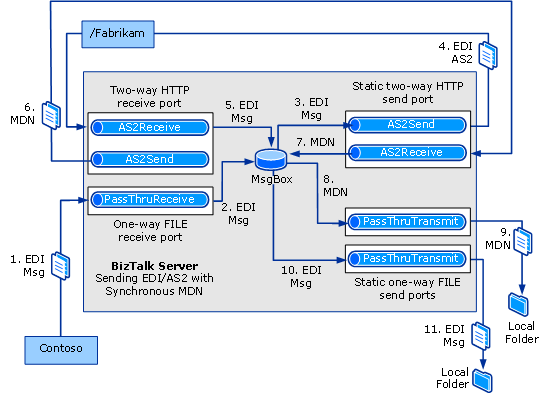

# Walkthrough (AS2): Sending EDI over AS2 with a Synchronous MDN
This walkthrough provides a set of step-by-step procedures that creates a solution for sending EDI messages over AS2, with a synchronous MDN. You can create and test the full solution in this walkthrough on a single computer.  
  
## Prerequisites  
 The following are prerequisites for performing the procedure in this topic:  
  
- You must be logged on as a member of the [!INCLUDE[btsBizTalkServerNoVersion](../includes/btsbiztalkservernoversion-md.md)] Administrators or [!INCLUDE[btsBizTalkServerNoVersion](../includes/btsbiztalkservernoversion-md.md)] B2B Operators group.  
  
- The computer that runs the walkthrough must have Internet Information Services (IIS) 7 installed.  
  
- If the computer that runs the walkthrough is installed with a 64-bit version of Windows, you must ensure that the BizTalk hosts are marked as 32-bit only. You must also ensure IIS has the Enable 32-Bit Application Setting for the Application Pools set to True. For more information, see [Tutorial 3: AS2 Tutorial](../core/tutorial-3-as2-tutorial.md).  
  
## How the Solution Sends an EDI/AS2 Message and Returns a Synchronous MDN  
 The solution will do the following:  
  
1. A one-way FILE receive port receives an EDI interchange from Contoso.  
  
   > [!NOTE]
   >  The events in this list may not occur in the order shown.  
  
2. Using a passthrough receive pipeline, the receive port drops the test message into the MessageBox, unchanged.  
  
3. A static two-way send port picks up the EDI interchange and encodes it into AS2 format.  
  
4. The send port sends the AS2-encoded EDI interchange over AS2 transport to the Fabrikam party.  
  
5. The two-way receive port at Fabrikam receives the AS2 message using the Fabrikam virtual directory. The receive pipeline decodes the EDI interchange from AS2, and drops the EDI interchange into the MessageBox.  
  
6. The send port associated with the two-way receive port returns a synchronous MDN.  
  
7. The receive port associated with the two-way send port receives the MDN, and drops it in the MessageBox.  
  
8. A static one-way send port with a passthrough send pipeline picks up the MDN.  
  
9. The one-way send port sends the MDN to a local folder.  
  
10. A static one-way send port with a passthrough send pipeline picks up the EDI message.  
  
11. The one-way send port sends the EDI message to a local folder.  
  
    The following figure shows the architecture for this solution.  
  
      
  
## The Functionality in this Solution  
 The following applies to the functionality of this walkthrough:  
  
-   This walkthrough deals with AS2 functionality, not EDI functionality. As a result, all ports involved in AS2 processing use either AS2Receive or AS2Send pipelines, not AS2EdiReceive or AS2EdiSend. Ports that are not involved in AS2 processing use PassThruReceive or PassThruTransmit pipelines.  
  
-   Status reporting is not enabled.  
  
-   This solution does not configure signing, compression, encryption, or message storage in the non-repudiation database. For procedures on configuring those properties, see [Configuring AS2 Properties](../core/configuring-as2-properties.md).  
  
## Configuring and Testing the Walkthrough  
 The procedures required for this solution include the following:  
  
- Build and deploy a BizTalk project with the required message schema, making the schema available for use by [!INCLUDE[btsBizTalkServerNoVersion](../includes/btsbiztalkservernoversion-md.md)] in processing the received interchange.  
  
- Enable the BTS ISAPI filter used in receiving the AS2 message.  
  
- Create a Fabrikam virtual directory that receives the AS2 message from Contoso, as configured in the receive location.  
  
- Specify that the Fabrikam virtual directory is not managed by Windows SharePoint Services.  
  
- Create a one-way FILE receive port to receive the EDI test message that will be sent via AS2 transport. Create the local folder to receive the test message.  
  
- Create a static two-way HTTP send port for [!INCLUDE[btsBizTalkServerNoVersion](../includes/btsbiztalkservernoversion-md.md)] to send the AS2 message containing the EDI business document to Fabrikam, and to receive the MDN response. Configure the send pipeline to be the AS2Send pipeline and the receive pipeline to be the AS2Receive pipeline.  
  
- Create a two-way HTTP receive port for [!INCLUDE[btsBizTalkServerNoVersion](../includes/btsbiztalkservernoversion-md.md)] to receive the AS2 message, and to send the MDN response. Configure the receive pipeline to be the AS2Receive pipeline and the send pipeline to be the AS2Send pipeline. Configure the receive location to receive the AS2 message via the Fabrikam virtual directory.  
  
  > [!NOTE]
  >  This solution is targeted for a single computer; as a result, the two-way send port sending the AS2 message (from Contoso) and the two-way receive port receiving the AS2 message (as Fabrikam) are on the same computer.  
  
- Create a static one-way FILE send port (with a passthrough send pipeline) to route the MDN to a local folder. Create the local folder.  
  
- Create a static one-way FILE send port (with a passthrough send pipeline) to route the message payload to a local folder. Create the local folder.  
  
  > [!NOTE]
  >  If you do not have a send port to subscribe to the message payload, it will be suspended in the MessageBox.  
  
- Create a party (trading partner) for both Fabrikam and Contoso.  
  
- Create a business profile each for both the trading parties.  
  
- Create an AS2 agreement between the business profiles for Fabrikam and Contoso. The AS2 agreement would contain properties to send an AS2 message and receive a synchronous MDN in return.  
  
- Test the walkthrough using a test EDI interchange.  
  
  > [!NOTE]
  >  For a test message, you can use the SamplePO.txt file that is used in the EDI Interface Developer tutorial. That file is shipped in the [!INCLUDE[btsBiztalkServerPath](../includes/btsbiztalkserverpath-md.md)]\SDK\EDI Interface Developer Tutorial\ folder. This is an X12 850 message.  
  
### Configuring the Walkthrough  
 This section describes the procedures to configure the walkthrough.  
  
##### To deploy the message schema  
  
1. In [!INCLUDE[btsVStudioNoVersion](../includes/btsvstudionoversion-md.md)], create or open a BizTalk project.  
  
   > [!NOTE]
   >  This topic assumes that you have already added a reference from your application to the BizTalk EDI Application, which contains EDI schemas, pipelines, and orchestrations. If not, see [How to Add a Reference to the BizTalk Server EDI Application](http://msdn.microsoft.com/library/7af066fb-372f-4709-b566-c8d6b4a9d782).  
  
2. Right-click your project, point to **Add**, and then click **Existing Item**. To use the SamplePO.txt file to test your solution, move to the [!INCLUDE[btsBiztalkServerPath](../includes/btsbiztalkserverpath-md.md)]SDK\EDI Interface Developer Tutorial\Inbound_EDI folder. Select the X12_00401_850.xsd schema, and then click **Add**.  
  
   > [!NOTE]
   >  To use a different EDI schema, go to the [!INCLUDE[btsBiztalkServerPath](../includes/btsbiztalkserverpath-md.md)]XSD_SchemaEDI folder. If the EDI schemas have not been unzipped into the XSD_SchemaEDI folders, execute the **MicrosoftEdiXSDTemplates.exe** file in the XSD_SchemaEDI folder to unzip the schemas into the default folder.  
  
3. Set the assembly key file, and then build and deploy the assembly.  
  
##### To enable the BTS ISAPI Filter  
  
1. Click **Start**, point to **All Programs**, point to **Administrative Tools**, and then click **Internet Information Services (IIS) Manager**.  
  
   > [!TIP]
   >  Depending on the operating system, the Administrative Tools start menu option may not be available. In such cases, click **Start**, click **Run**, and enter `inetmgr` to open Internet Information Services (IIS) Manager.  
  
2. Select the root Web Server entry and in the **Features View**, double click **Handler Mappings** and then in the Actions pane click **Add Script Map**.  
  
   > [!NOTE]
   >  Configuring the script mapping at the Web Server level will cause this mapping to apply to all child Web Sites. If you wish to restrict the mapping to a specific Web Site or Virtual Folder, select the target site or folder instead of the Web Server.  
  
3. In the **Add Script Map** dialog box, enter `BtsHttpReceive.dll` in the **Request path** field.  
  
4. In the **Executable** field, click the **ellipsis (…)** button and browse to [!INCLUDE[btsBiztalkServerPath](../includes/btsbiztalkserverpath-md.md)]HttpReceive. Select BtsHttpReceive.dll and click **OK**.  
  
5. Enter `BizTalk HTTP Receive` in the `Name` field, and then click **Request Restrictions**.  
  
6. In the **Request Restrictions** dialog box, select the **Verbs** tab and then select **One of the following verbs**. Enter `POST` as the verb.  
  
7. On the **Access** tab, select **Script** and then click **OK**.  
  
8. Click **OK** and when prompted to allow the ISAPI extension, click **Yes**.  
  
##### To configure the Fabrikam Web page  
  
1. In IIS Manager, right-click **Application Pools** and select **Add Application Pool**.  
  
2. In **the Add Application Pool** dialog box, enter **BizTalkAppPool** in **Name**, and then select **.NET Framework V4.0.30210** in the **.NET Framework version** drop-down list. Click **OK**.  
  
   > [!NOTE]
   >  The version number may vary depending on the version of [!INCLUDE[netfx40_short](../includes/netfx40-short-md.md)] installed on the machine.  
  
3. Select **Application Pools**, in the **Features View** select **BizTalkAppPool**, and then click **Advanced Settings** in the **Actions** pane.  
  
4. In the **Advanced Settings** dialog box, select **Identity** and then click the ellipsis (…) button.  
  
5. In the **Application Pool Identity** dialog box, select **Custom account** and then click **Set**.  
  
6. Enter the **User name** and **Password** for a user account that is a member of the administrators group, enter the password in **Confirm password** and then click **OK** three times to return to the IIS Manager.  
  
7. In IIS Manager, open the **Sites** folder. Right-click the **Default Web Site** node, and then select **Add Application**.  
  
8. In the **Add Application** dialog box, enter **Fabrikam** in **Alias**, and then click **Select**.  
  
9. In the **Select Application Pool** dialog box, select **BizTalkAppPool** and click **OK**.  
  
10. Click the ellipsis (…) button and browse to [!INCLUDE[btsBiztalkServerPath](../includes/btsbiztalkserverpath-md.md)]HttpReceive for the **Physical path**.  
  
11. Click **Test Settings** and verify that there are no errors displayed in the **Test Connection** dialog box. Click **Close**, and then click **OK**.  
  
12. In IIS Manager, select the Fabrikam virtual directory and in the **Features View**, double-click **Authentication**.  
  
13. In the **Authentication** page, select **Anonymous Authentication** and verify that the **Status** is **Enabled**. If the **Status** is **Disabled**, click **Enable** in the **Actions** pane.  
  
##### To specify that your virtual directory is not managed by Windows SharePoint Services  
  
1.  If Windows SharePoint Services is installed on your computer, click **Start**, point to **All Programs**, point to **Administrative Tools**, and then click **SharePoint 3.0 Central Administration**.  
  
    > [!NOTE]
    >  This procedure is required if Windows SharePoint Server is installed on the same computer that you are setting the walkthrough up on. In that case, you must specify that your IIS virtual directory is not being managed by Windows SharePoint Server.  
  
2.  On the **Central Administration** page, under **Central Administration**, click **Application Management**.  
  
3.  On the **Application Management** page, click **Define managed paths**.  
  
4.  In the **Define Managed Paths** page, under **Add a New Path**, in the **Path** text box, enter `Fabrikam`. Under **Type**, click **Excluded Path**, and then click **OK**.  
  
##### To create a receive port to receive the EDI test message  
  
1. In Windows Explorer, create a local folder to receive the EDI interchange from Contoso.  
  
2. In the [!INCLUDE[btsBizTalkServerNoVersion](../includes/btsbiztalkservernoversion-md.md)] Administration console, right-click the **Receive Ports** node under the **BizTalk Application 1** node, point to **New**, and then click **One-way Receive Port**.  
  
3. Name the receive port as **RecvISAFromCont**, and then click **Receive Locations** in the console tree.  
  
4. Click **New**.  
  
5. Name the receive location, select **FILE** for **Type**, and then click **Configure**.  
  
6. For **Receive folder**, enter the name of the folder that you created in step 1.  
  
7. For **File mask**, enter the extension of your file. If you are using the SamplePO.txt file as your test message, enter **\*.txt**. Click **OK**.  
  
8. For **Receive pipeline**, accept the default of **PassThruReceive**.  
  
9. Click **OK**, and then click **OK** again.  
  
10. Click the **Receive Locations** node, right-click your receive location, and then click **Enable**.  
  
##### To create a two-way send port to send the EDI interchange over AS2 to Fabrikam and receive an MDN response  
  
1. > [!NOTE]
   >  A static two-way send port picks up the EDI interchange and encodes it into AS2 format. It then sends the AS2-encoded EDI interchange over AS2 transport to the Fabrikam party. Later, the receive port associated with the two-way send port receives the MDN from Fabrikam, and drops it in the MessageBox.  
  
    In the [!INCLUDE[btsBizTalkServerNoVersion](../includes/btsbiztalkservernoversion-md.md)] Administration console, right-click the **Send Ports** node under the **BizTalk Application 1** node, point to **New**, and then click **Static Solicit-Response Send Port**.  
  
2. In the **Send Port Properties** dialog box, name the send port. For this solution, name the send port as **SendISAToFab_RecMDN**.  
  
3. In the **Transport** section, select **HTTP** for **Type**, and then click **Configure**.  
  
4. In the **HTTP Transport Properties** dialog box, for **Destination URL**, enter **http://localhost/Fabrikam/BTSHttpReceive.dll**.  
  
5. Clear **Enable Chunked Encoding**, and then click **OK**.  
  
6. In **Send pipeline**, select **AS2Send**.  
  
7. In **Receive pipeline**, select **AS2Receive**.  
  
8. In the console tree, select **Filters**. For **Property**, enter **BTS.ReceivePortName**; for **Operator**, enter **==**; and for **Value** enter the name of the receive port that will receive the EDI interchange (`RecvISAFromCont`).  
  
9. Click **OK**.  
  
10. Click the **Send Ports** node in the [!INCLUDE[btsBizTalkServerNoVersion](../includes/btsbiztalkservernoversion-md.md)] Administration Console, right-click your send port, and then click **Start**.  
  
##### To create a two-way receive port to receive the AS2 message and return an MDN  
  
1. > [!NOTE]
   >  The two-way receive port at Fabrikam receives the AS2 message using the Fabrikam virtual directory. The receive pipeline decodes the EDI interchange from AS2, and drops the EDI interchange into the MessageBox. The send port associated with the two-way receive port returns a synchronous MDN.  
  
    In the [!INCLUDE[btsBizTalkServerNoVersion](../includes/btsbiztalkservernoversion-md.md)] Administration console, under the **BizTalk Application 1** node, right-click **Receive Ports**, point to **New**, and then click **Request Response Receive Port**.  
  
2. Name the receive port as **RecvAS2ForFab**, and then click **Receive Locations** in the console tree.  
  
3. Click **New**.  
  
4. In the **Receive Location Properties** dialog box, name your receive location, select **HTTP** for **Type**, and then click **Configure**.  
  
5. In the **HTTP Transport Properties** dialog box, enter **/Fabrikam/BTSHttpReceive.dll** for **Virtual directory plus ISAPI extension**. Clear **Return correlation handle on success** and select **Suspend failed requests**. Click **OK**.  
  
6. Select **AS2Receive** for the **Receive Pipeline**, and **AS2Send** for the **Send Pipeline**. Click **OK**, and then click **OK** again.  
  
7. Click the **Receive Locations** node, right-click your receive location, and then click **Enable**.  
  
##### To create a send port to send the EDI payload to a local folder  
  
1. In Windows Explorer, create a local folder to send the EDI interchange to.  
  
2. In the [!INCLUDE[btsBizTalkServerNoVersion](../includes/btsbiztalkservernoversion-md.md)] Administration console, right-click **Send Ports**, point to **New**, and then click **Static One-Way Send Port**.  
  
3. In the **Send Port Properties** dialog box, name your send port as **SendEDIMsg**. Select **FILE** for **Type**, and then click **Configure**.  
  
4. In the **FILE Transport Properties** dialog box, for **Destination folder**, enter the local folder that you created for the EDI payload.  
  
5. For **File name**, enter the file name. If you are using the SamplePO.txt file as your test message, enter **%MessageID%.txt**. Click **OK**.  
  
6. Accept the default of **PassThruTransmit** for **Send Pipeline**.  
  
7. Click **Filters** in the console tree, and add filter properties for picking up the EDI payload. On the first line, for **Property**, enter **BTS.ReceivePortName**; for **Operator**, enter **==**; for **Value**, enter the name of the receive port that receives the AS2 message (`RecvAS2ForFab`); and for **Group by**, accept **And**. On the second line, for **Property**, enter **EdiIntAS.IsAS2PayloadMessage**; for **Operator**, enter **==**; and for **Value**, enter **True**.  
  
8. Click **OK**.  
  
9. Click the **Send Ports** node, right-click your send port, and then click **Start**.  
  
##### To create a send port to send the MDN to a local folder  
  
1. In Windows Explorer, create a local folder to send the MDN to.  
  
2. In the [!INCLUDE[btsBizTalkServerNoVersion](../includes/btsbiztalkservernoversion-md.md)] Administration console, right-click **Send Ports**, point to **New**, and then click **Static One-Way Send Port**.  
  
3. In the **Send Port Properties** dialog box, name your send port as **SendMDN**. Select **FILE** for **Type**, and then click **Configure**.  
  
4. In the **FILE Transport Properties** dialog box, for **Destination folder**, enter the local folder you created to send the MDN to.  
  
5. For **File name**, enter **%MessageID%.msg**. Click **OK**.  
  
6. Accept the default of **PassThruTransmit** for **Send Pipeline**.  
  
7. Click **Filters** in the console tree. For **Property**, enter **BTS.SPName**; for **Operator**, enter **==**; for **Value**, enter the name of the send port that sends the AS2 message (`SendISAToFab_RecMDN`); and for **Group by**, accept **And**. On a second line, for **Property**, enter **EdiIntAS.IsAS2MdnResponseMessage**; for **Operator**, enter **==**; for **Value**, enter **True**.  
  
8. Click **OK**.  
  
9. Click the **Send Ports** node, right-click your send port, and then click **Start**.  
  
##### To create a party and a business profile for Fabrikam  
  
1. Right-click the **Parties** node in the [!INCLUDE[btsBizTalkServerNoVersion](../includes/btsbiztalkservernoversion-md.md)] Administration Console, point to **New**, and then click **Party**.  
  
2. Enter a name for the party in the **Name** text box, and then click **OK**.  
  
   > [!NOTE]
   >  By selecting the **Local BizTalk processes messages received by the Party OR supports sending messages from this party** check box, you can specify that the party being created is for the same organization that is also hosting [!INCLUDE[btsBizTalkServerNoVersion](../includes/btsbiztalkservernoversion-md.md)]. Based on that, some properties will be enabled or disabled when you create an agreement. However, for this walkthrough, you can leave this check box selected.  
  
3. Right-click the party name, point to **New**, and then click **Business Profile**.  
  
4. In the **Profile Properties** dialog box, on the **General** page, enter **Fabrikam_Profile** in the **Name** text box.  
  
   > [!NOTE]
   >  When you create a party, a profile is also created. You can rename and use that profile instead of creating a new one. To rename a profile, right-click the profile and select **Properties**. In the **General** page, specify a name for the profile.  
  
##### To create a party and a business profile for Contoso  
  
1. Right-click the **Parties** node in the [!INCLUDE[btsBizTalkServerNoVersion](../includes/btsbiztalkservernoversion-md.md)] Administration Console, point to **New**, and then click **Party**.  
  
2. Enter a name for the party in the **Name** text box, and then click **OK**.  
  
   > [!NOTE]
   >  By selecting the **Local BizTalk processes messages received by the Party OR supports sending messages from this party** check box, you can specify that the party being created is for the same organization that is also hosting [!INCLUDE[btsBizTalkServerNoVersion](../includes/btsbiztalkservernoversion-md.md)]. Based on that, some properties will be enabled or disabled when you create an agreement. However, for this walkthrough, you can leave this check box selected.  
  
3. Right-click the party name, point to **New**, and then click **Business Profile**.  
  
4. In the **Profile Properties** dialog box, on the **General** page, enter **Contoso_Profile** in the **Name** text box.  
  
   > [!NOTE]
   >  When you create a party, a profile is also created. You can rename and use that profile instead of creating a new one. To rename a profile, right-click the profile and select **Properties**. In the **General** page, specify a name for the profile.  
  
##### To create an AS2 agreement between the two business profiles  
  
1.  Right-click **Contoso_Profile**, point to **New**, and then click **Agreement**.  
  
2.  In the **General Properties** page, for the **Name** text box, enter a name for the agreement.  
  
3.  From the **Protocol** drop-down list, select **AS2**.  
  
4.  In the **Second Partner** section, from the **Name** drop-down list, select **Fabrikam**.  
  
5.  In the **Second Partner** section, from the **Profile** drop-down list, select **Fabrikam_Profile**.  
  
     You will notice that two new tabs get added next to the **General** tab. Each tab is for configuring a one-way AS2 agreement.  
  
6.  Perform the following tasks on the **Contoso->Fabrikam** tab.  
  
    1.  On the **Identifiers** page, enter values for **AS2-From** and **AS2-To**. For **AS2-From**, enter `Contoso`. For **AS2- To**, enter `Fabrikam`.  
  
    2.  In the **Acknowledgements (MDNs)** page, do the following:  
  
        1.  Select the **Process inbound MDN into MessageBox for routing/delivery options** check box.  
  
            > [!NOTE]
            >  Checking the **Process inbound MDN into MessageBox for routing/delivery options** is required for the testing of this walkthrough, because only then will the returned MDN be dropped into the MessageBox. That enables you to create a send port to subscribe to the MDN, and to send the MDN to a local directory, so you can verify the AS2 transmission.  
  
        2.  Select the **Request MDN** check box.  
  
        3.  Make sure the **Request Signed MDN** check box is cleared.  
  
        4.  Leave **Request asynchronous MDN** cleared.  
  
        5.  In **Disposition-Notification-To**, enter any value. The value of this field is not used during AS2 processing, but a value must be entered in the field.  
  
    3.  On the **Send Ports** page, associate the two-way send port that will be sending the EDI interchange to Fabrikam. In the **Send ports** grid, under the **Name** column, click an empty cell, and from the drop-down list, select the send port **SendISAToFab_RecMDN**.  
  
7.  Perform the following tasks on the **Fabrikam->Contoso** tab.  
  
    > [!NOTE]
    >  In this walkthrough, we specify the required value in the tab so that an agreement can be successfully created. To successfully create an agreement, both one-way agreement tabs must have values defined for **AS2_From** and **AS2-To**.  
  
    1.  On the **Identifiers** page, enter values for **AS2-From** and **AS2-To**. For **AS2-From**, enter `Fabrikam`. For **AS2- To**, enter `Contoso`.  
  
8.  Click **Apply**.  
  
9. Click **OK**. The newly added agreement is listed in the **Agreements** section of the **Parties and Business Profiles** pane. The newly added agreement is enabled by default.  
  
### Testing the Walkthrough  
 This section provides information on how to test the walkthrough.  
  
##### To test the solution  
  
1. In Windows Explorer, move to [!INCLUDE[btsBiztalkServerPath](../includes/btsbiztalkserverpath-md.md)]SDK\EDI Interface Developer Tutorial. Copy the **SamplePO.txt** file.  
  
2. Paste the **SamplePO.txt** file into the local folder that you created to receive the test message from Contoso.  
  
3. Move to the local folder that you created to send the EDI payload to. Confirm that the folder contains an EDI file. Open the file and the original test message, and verify that they have the same content.  
  
4. Move to the local folder that you created to send the resulting MDN to. Confirm that the folder contains a file; open the file and confirm that it is an MDN file.  
  
## See Also  
 [Developing and Configuring BizTalk Server AS2 Solutions](../core/developing-and-configuring-biztalk-server-as2-solutions.md)