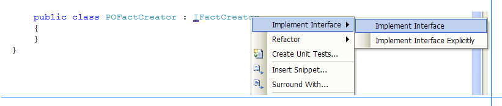
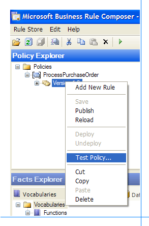

# Walkthrough: Creating a Fact Creator
This walkthrough provides step-by-step procedures for creating a fact creator component, **POFactCreator**, which you can use to test the **ProcessPurchaseOrder** policy you created in earlier walkthroughs.  

## Prerequisites  
 You must complete the [Walkthrough: Creating a Simple Business Policy](../core/walkthrough-creating-a-simple-business-policy.md) walkthrough before you perform this walkthrough.  

## Overview of This Walkthrough  
 This walkthrough contains two procedures, as described in the following table.  

|Procedure title|Procedure description|  
|---------------------|---------------------------|  
|To create the POFactCreator component|Provides step-by-step instructions for creating a fact creator component, **POFactCreator**.|  
|To test the ProcessPurchaseOrder policy using POFactCreator|Provides step-by-step instructions for using the Business Rule Composer tool to test the **ProcessPurchaseOrder** policy by using the **POFactCreator** component.|  

### To create the POFactCreator component  

1. Start **Microsoft Visual Studio**.  

2. In [!INCLUDE[btsVStudioNoVersion](../includes/btsvstudionoversion-md.md)], on the **File** menu, point to **New**, and then click **Project**.  

3. In the **New Project** dialog box, do the following:  


   |             Use this              |                             To do this                              |
   |-----------------------------------|---------------------------------------------------------------------|
   |         **Project types**         |                        Click **Visual C#**.                         |
   |           **Templates**           |                      Click **Class Library**.                       |
   |             **Name**              |                     Type **POFactCreatorLib**.                      |
   |           **Location**            |          Specify **C:\BRE-Walkthroughs** as the location.           |
   |         **Solution Name**         |                     Type **POFactCreatorSol**.                      |
   | **Create directory for solution** | Select this check box to create a directory for the solution files. |


4. Click **OK**. The **POFactCreatorLib** project should appear in Solution Explorer. If you do not see Solution Explorer, click **Solution Explorer** on the **View** menu.  

5. In the Properties window, change the name of the file, **Class1.cs**, to **POFactCreator.cs**.  

6. In the Solution Explorer window, right-click **References**, and then click **Add Reference**.  

7. Click **Browse**, navigate to **C:\Program Files\Common Files\Microsoft BizTalk**, and then double-click **Microsoft.RuleEngine.dll**.  

8. Add the following lines to the top of the **POFactCreator.cs** file after the existing `using` statements:  

   ```  
   //To use the XmlDocument class  
   using System.Xml;  
   //To use the TypedXmlDocument and Policy classes  
   using Microsoft.RuleEngine;   
   ```  

9. Modify the **POFactCreator** class to derive from the **IFactCreator** interface:  

    ```  
    public class POFactCreator : IFactCreator  
    {  
    }  
    ```  

10. Right-click **IFactCreator**, point to **Implement Interface**, and then click **Implement Interface**.  

       

11. Add a public constructor to the **POFactCreator** class as shown below:  

    ```  
    public POFactCreator()  
    {  
    }  
    ```  

12. Remove the lone statement in the **CreateFacts** method.  

13. Add the following code to the **CreateFacts** method to create a **TypedXmlDocument** object based on the **SamplePO.xml** document:  

    ```  
    XmlDocument doc = new XmlDocument();  
    //Loading the XML from SamplePO.xml file.  
    doc.Load(@"C:\BRE-Walkthroughs\SamplePO.xml");  
    TypedXmlDocument txd = new TypedXmlDocument("RuleTest.PO", doc);  
    ```  

14. Add the following code to create an array of facts with the **TypedXmlDocument** object as the only fact:  

    ```  
    object[] facts = new object[1];  
    facts[0] = txd;   
    ```  

15. Return the facts array from the **CreateFacts** method:  

    ```  
    return facts;  
    ```  

16. Verify that the complete code in the **CreateFacts** method looks like the following:  

    ```  
    public object[] CreateFacts(RuleSetInfo ruleSetInfo)  
    {  
    XmlDocument doc = new XmlDocument();  
    //Loading the XML from SamplePO.xml file.  
    doc.Load(@"C:\BRE-Walkthroughs\SamplePO.xml");  
    TypedXmlDocument txd = new TypedXmlDocument("RuleTest.PO", doc);  

    object[] facts = new object[1];  
    facts[0] = txd;  
    return facts;  
    }  
    ```  

17. Remove the lone statement in the **GetFactTypes** method.  

18. Add the following code to the **GetFactTypes** method to return an array of types containing the type of the **TypedXmlDocument** class:  

    ```  
    Type[] t = new Type[1];  
    t[0] = typeof(TypedXmlDocument);  
    return t;  
    ```  

19. Start **Visual Studio Command Prompt**.  

20. Change the directory to **C:\BRE-Walkthroughs\POFactCreatorSol**, and then execute the following command:  

     **Sn -k POFactCreator.snk**  

21. In [!INCLUDE[btsVStudioNoVersion](../includes/btsvstudionoversion-md.md)], in Solution Explorer, expand **Properties**, and then double-click **AssemblyInfo.cs**.  

22. Add the following statement to the **AssemblyInfo.cs** file at the end:  

    ```  
    [assembly: AssemblyKeyFile(@"C:\BRE-Walkthroughs\POFactCreatorSol\POFactCreator.snk")]  
    ```  

23. In the Solution Explorer window, right-click **POFactCreatorLib**, and then click **Build**.  

24. At the [!INCLUDE[btsVStudioNoVersion](../includes/btsvstudionoversion-md.md)] Command Prompt, change the directory to **C:\BRE-Walkthroughs\POFactCreatorSol\POFactCreatorLib\Bin\Debug**, and then execute the following command to register the **POFactCreator** component with the GAC (global assembly cache). If you do not have the command prompt open, follow step 19 to open it.  

     **Gacutil -i POFactCreatorLib.dll**  

### To test the ProcessPurchaseOrder policy using POFactCreator  

1. On the **Start** menu, point to **All Programs**, point to [!INCLUDE[btsBizTalkServerStartMenuItemui](../includes/btsbiztalkserverstartmenuitemui-md.md)], and then click **Business Rule Composer**. If you have the Business Rule Composer already open, press F5 to refresh it.  

   > [!NOTE]
   >  On a system that supports User Account Control (UAC), you may need to run the tool with Administrative privileges. To do this, right-click the application, and then select **Run as administrator**.  

2. In the Policy Explorer window, expand **Policies**, expand **ProcessPurchaseOrder**, right-click the latest version, and then click **Test Policy**.  

      

3. At the bottom of the dialog box, click **Add**.  

4. In the **.NET Assemblies** dialog box, select **POFactCreatorLib**, and then click **OK**.  

5. In the **Select Binding** dialog box, click **POFactCreator** in **POFactCreatorLib, 10.0.0**, and then click **OK**.  

6. Click **Test**.  

7. Verify that the **ApprovalRule** is fired in the Output window.  

## Comments  

-   To test a policy that uses non-static methods of a .NET class by using the Business Rule Composer, you must create a fact creator component.  

## See Also  
 [How to Create a Fact Retriever](../core/how-to-create-a-fact-retriever.md)