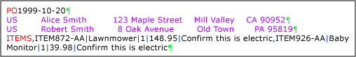
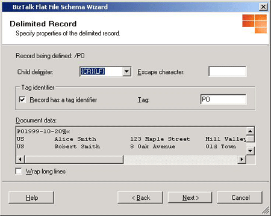
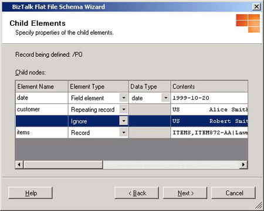
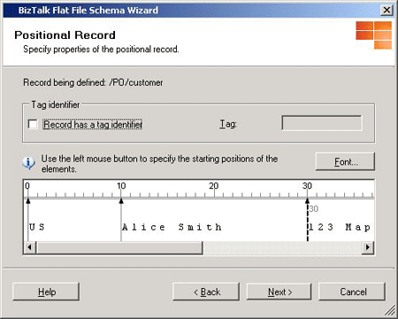
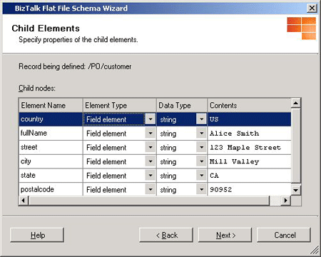
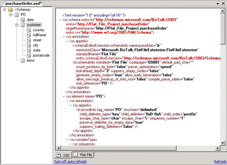

# Walkthrough: Creating a Flat File Schema From a Document Instance
This walkthrough shows you how to create a flat file schema from a document instance using the BizTalk Flat File Schema Wizard based on the following sample purchase order. For an introduction to the BizTalk Flat File Schema Wizard, see [How to Use BizTalk Flat File Schema Wizard](../core/how-to-use-biztalk-flat-file-schema-wizard.md).  

   

 Each line of the purchase order ends with a carriage return line feed (CRLF), marked in green. The purchase order starts with a PO tag shown in red and followed by a date. Two repeating fixed positional fields contain customer information and are shown in purple. After the comment field, there is a repeating field starting with an ITEMS tag that contains multiple records delimited by commas (,) and data values separated by pipes (&#124;), which are shown in blue.  

## Prerequisites  
 Before exercising this walkthrough, make sure the following software is installed and configured on your server:  

- Microsoft [!INCLUDE[btsVStudioNoVersion](../includes/btsvstudionoversion-md.md)]  

- Microsoft [!INCLUDE[btsBizTalkServerNoVersion](../includes/btsbiztalkservernoversion-md.md)] with the **Developer tools** installed

  To prepare the document instance for the walkthrough, copy the following into a text editor, and save it as a text file. Be sure to copy all line feeds and carriage returns.  

```
PO1999-10-20
US        Alice Smith         123 Maple Street    Mill Valley    CA 90952
US        Robert Smith        8 Oak Avenue        Old Town       PA 95819
ITEMS,ITEM872-AA|Lawnmower|1|148.95|Confirm this is electric,ITEM926-AA|Baby Monitor|1|39.98|Confirm this is electric
```


## Start the wizard  

1. In [!INCLUDE[btsVStudioNoVersion](../includes/btsvstudionoversion-md.md)], open the **Solution Explorer**.  

2. To add the new flat file schema, right-click the project, and select **Add**. Click **New Item**.  

3. In the **Add New Item** window, do the following:  

   1.  In the **Categories** section, select **Schema Files**.  

   2.  In the **Templates** section, select **Flat File Schema Wizard**.  

   3.  In the **Name** field, enter **PurchaseOrder.xsd** for the new schema.  

   4.  Click **Add**.  

4. When the BizTalk Flat File Schema Wizard opens, the Welcome Page appears.   
   To skip this screen when running the wizard in the future, select the **Do not show this introduction page again** box. Click **Next** to continue.  

## Selecting purchase order instance  

-   On the **Flat File Schema Information** screen, select your instance and enter the following information. When you are done, click **Next** to continue.  

    -   **Instance file:** Click the **Browse** button to locate the flat file from which the schema will be generated. Browse to the folder containing the text file you created in the Prerequisites section of Walkthrough: Creating a Flat File Schema From a Document Instance.  

    -   **Record name:** Type **PO** as it will be the schema root name.  

    -   **Target namespace:** Type **http://Flat_File_Project.PurchaseOrder** for schema target namespace.  

    -   **Code page:** Select **UTF-8 (65001)** from the drop down selection list.  

    -   **Count positions in bytes:** Check this box if you wish to count the positional data fields by bytes. By default, the positional data fields are counted in characters. In this walkthrough, leave the **Count positions in bytes** check box unchecked.  

## Select purchase order data  

-   On the **Select Document Data** screen, the contents of the flat file are displayed. Select the data needed for creating the schema, and then click **Next**.  

    > [!NOTE]
    >  If you would like to use the entire document instance, you can press **Ctrl-A** to select all.  

    > [!NOTE]
    >  Check **Wrap long lines** box if you want to view the entire document instance content wrapped into the edit box throughout the wizard.  

    > [!NOTE]
    >  If you are creating the schema from an interchange instance, select only the part that represents the individual document structure.  

## Delimit purchase order record  

-   As each line of the purchase order ends with a carriage return line feed (CRLF), select **By delimiter symbol**, and then click **Next** on **Select Record Format** screen.  

## Specify purchase order record property  

- On the **Delimited Record** screen, enter the following to define the first level of the schema and when you are done, click **Next**.  

  - **Child delimiter:** Select **{CR}{LF}**.  

    > [!NOTE]
    >  **Child delimiter** property is an editable box with drop down selection list contains a set of default values. The **Child delimiter** can be specified as a character or as a hexadecimal value. For example, **\\{** or **{0x0D0A}**.  

  - **Escape character:** An escape character is a single character that suppresses any special meaning of the character that follows it. See [Escape Characters](../core/escape-characters.md) for more information. Leave it blank for the walkthrough.  

    > [!NOTE]
    >  When using **\\**, **{,** and **}** for **Child delimiter** or **Escape character**, a back slash must be used. For example, **\\\\,** and **\\{**.  

  - Check **Record has a tag identifier** box and type **PO** in **Tag**. In a multiple records file, **PO** will be used to identify each individual record. Click **Next** to continue.  

      

## Define the element in the purchase order record  

1.  The wizard has identified four elements in the purchase order record; you must now define the element property. In the first row, do the following:  

    1.  Type **date** for the **Element Name**.  

    2.  Select **Field element** for **Element Type**.  

    3.  Select **date** from the drop-down selection list for **Data Type**.  

2.  Repeat Steps a to c for the following elements. When you are done, click **Next**.  

    |Element Name|Element Type|Data Type|  
    |------------------|------------------|---------------|  
    |**customer**|**Repeating record**||  
    ||**Ignore**||  
    |**items**|**Record**||  

       

    > [!NOTE]
    >  You can select multiple rows and then change their **Element Type** to a single type by using the mouse and the SHIFT or CTRL key.  

    > [!NOTE]
    >  After you click **Next** on the **Child Elements** screen, you will not be able to click **Back** to redefine or make any changes to the child elements. You may need to close the wizard and launch the wizard again to define the flat file schema.  

3.  After you complete the steps in this procedure, the first level of the schema is generated as shown in the following screenshot. Three unique elements are defined, and you will continue to further define the child records for the elements in the purchase order record. Click **Next**.  

       

## Define the customer record  

1.  Because we defined the **customer** element as the **Repeating record** type and the **items** element as the **Record** type, the BizTalk Flat File Schema Wizard now continues to further define these two elements. On the **Schema View** screen, select **customer**, and then click **Next** to continue.  

2.  To work with the customer record, you need to select the data that represents that element. Because it is a repeating record, either of the lines can be used to define the record. Select the first line of customer data and click **Next** to continue.  

3.  On the **Select Record Format** page, select **By relative positions**, and then click **Next**.  

4.  The wizard provides a visual tool for showing and calculating the distance between the fields. On the **Positional Record** page, use the left mouse button to click the position marker 10 to represent where the name field begins. Click the following position markers to represent the rest of the data fields:  

    |Field Name|Position Marker|  
    |----------------|---------------------|  
    |street|30|  
    |city|50|  
    |state|65|  
    |postalcode|68|  

     Click **Next** to continue.  

       

5.  On the **Child Elements** page, you specify the properties of the child elements. Select the first row and type **country** as the **Element Name**. Leave the default values in the other columns. Type the following values for the other properties for the **Element Name**:  

    |Element Name|Value|  
    |------------------|-----------|  
    |**customer_Child2**|**fullName**|  
    |**customer_Child3**|**street**|  
    |**customer_Child4**|**city**|  
    |**customer_Child5**|**state**|  
    |**customer_Child6**|**postalcode**|  

     Click **Next** to continue.  

       

6.  The child elements of the customer record are created as shown in the following screenshot. Click **Next** to define the child elements for the items record.  

       

#### Define the items record  

1. On the **Schema View** page, select **items**, and then click **Next**.  

2. On the **Select Document Data** page, select the entire line begins with ITEMS, and then click **Next** to define its child elements.  

3. On the **Select Record Format** page, select **By delimiter symbol**, and then click **Next**.  

4. In the Items record, commas are used to delimit the individual items. Therefore, on the **Delimited Record** page, enter the following to define the items record. When you are done, click **Next**.  

   -   Select **,** from **Child delimiter** drop-down selection list.  

   -   Leave the **Escape character** text box blank.  

   -   Select **Record has a tag identifier** and type **ITEMS** in **Tag**.  

        In a multiple items record, **ITEMS** is used to identify each individual record.  

5. Using the values from the **Delimited Record** page, the wizard identifies two child elements. Because one of them is a repeating record, select the first element and enter **item** for Element Name, and then select **Repeating Record** from the drop down selection list for **Element Type**. Leave the rest of the default values in the columns. Select the second row and select the **Ignore** from **Element Type** list. When you click **Next**, the next level for the items record is created in the schema. You continue to define the final part of the purchase order schema.  

6. Select **item** and then click **Next** to continue on the **Schema View** page.  

7. On the **Select Document Data** page, select **ITEM872-AA&#124;Lawnmower&#124;1&#124;148.95&#124;Confirm this is electric**. Click **Next** to continue.  

8. On the **Select Record Format** page, select the **By delimiter symbol** option because the individual item is delimited by a pipe (&#124;).  

9. On the **Delimited Record** page, enter the following to define the item record. When you are done, click **Next**.  

    -   Select **&#124;** from the **Child delimiter** drop down selection list.  

    -   Leave the **Escape character** text box blank.  

10. On the **Child Elements** page, the wizard has identified five child elements. Select the first row and enter **productCode** for **Element name**. Leave the default values in the rest of the columns. For the rest of the **Element Name properties**, type the following:  

    |Element Name|Value|  
    |------------------|-----------|  
    |**item_Child2**|**description**|  
    |**item_Child3**|**quantity**|  
    |**item_Child4**|**unitPrice**|  
    |**item_Child5**|**notes**|  

     Click **Next** to continue.  

11. You have defined all the nodes for the purchase order schema. On the **Schema View** page, click **Finish**.  

12. You can now view the final purchase order schema. You can also refine the schema by using the BizTalk Schema Editor. See Flat file property name table and the Property tables in **Schema Node Properties**. More details on this property [!INCLUDE[ui-guidance-developers-reference](../includes/ui-guidance-developers-reference.md)].

## Summary  
 In this walkthrough you have learned how to use the BizTalk Flat File Schema Wizard to create a flat file schema from a document instance.  

## Next Steps  

### Validate PO Instance  
 To ensure that the PurchaseOrder.xsd schema can correctly parse the PO instance, do the following:  

1.  In Solution Explorer, right-click the **PurchaseOrder.xsd** and then select **Properties**.  

2.  In the **Property Pages**, make sure that the **Input Instance Filename** field is pointing to the location of the PO instance you created in the Prerequisites section of Walkthrough: Creating a Flat File Schema From a Document Instance. Click **OK** to close the dialog.  

3.  In Solution Explorer, right-click **PurchaseOrder.xsd**, and then select **Validate Instance**. The validation component opens.  

4.  After validation is completed, a link is provided to you for viewing the XML output based on parsing result on PO instance using the PurchaseOrder.xsd schema. To view the XML output, press Ctrl and click the link.  

### Create Pipelines for the Schema  
 Now you can create a receive or send pipeline based on the PurchaseOrder.xsd schema to use with your BizTalk application.  

 To create a new pipeline, see [How to Create a New Pipeline](../core/how-to-create-a-new-pipeline.md). To configure the Flat File Pipeline components, see [How to Configure the Flat File Assembler Pipeline Component](../core/how-to-configure-the-flat-file-assembler-pipeline-component.md) and [How to Configure the Flat File Disassembler Pipeline Component](../core/how-to-configure-the-flat-file-disassembler-pipeline-component.md).  

## See Also  
 [How to Use BizTalk Flat File Schema Wizard](../core/how-to-use-biztalk-flat-file-schema-wizard.md)   
 [Creating Schemas Using BizTalk Flat File Schema Wizard](../core/creating-schemas-using-biztalk-flat-file-schema-wizard.md)