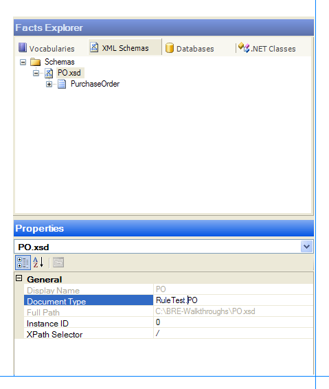
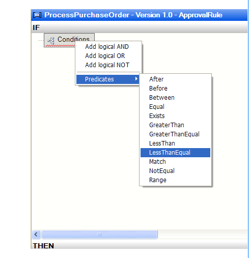
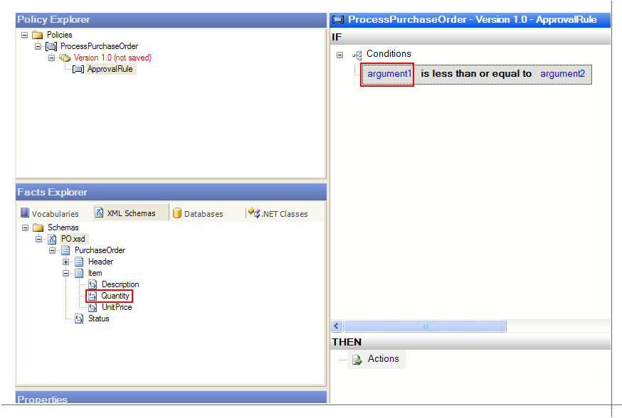
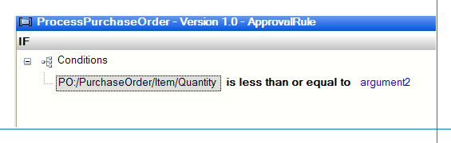
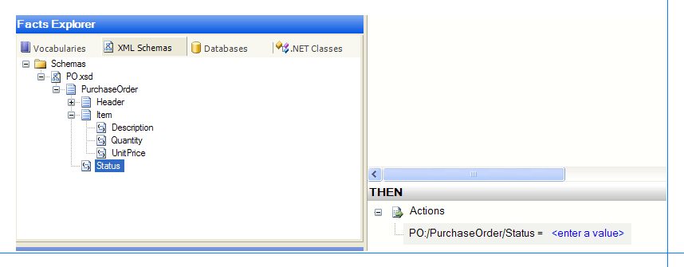

# Walkthrough: Creating a Simple Business Policy
This walkthrough provides step-by-step procedures for using the Business Rule Composer to create a simple business policy named **ProcessPurchaseOrder** containing a rule named **ApprovedRule**. The **ApprovedRule** rule expects the user to submit an XML document as a fact, and sets the value of the **Status** field in the document to **Approved** if the value of the **Quantity** field is less than or equal to **500**.  
  
## Prerequisites  
 You must be familiar with the basics of the Business Rules Framework to perform this walkthrough. If you are new to the Business Rules Framework, we recommend that you read the architecture overview of the Business Rules Framework at [Business Rules Engine](../core/business-rules-engine.md) before performing this walkthrough.  
  
## Overview of This Walkthrough  
 This walkthrough contains two procedures, as described in the following table.  
  
|Procedure title|Procedure description|  
|---------------------|---------------------------|  
|To create the PO schema file|Provides step-by-step instructions for creating the schema for the document that the **ProcessPurchaseOrder** policy uses.|  
|To create the ProcessPurchaseOrder policy|Provides step-by-step instructions for creating the **ProcessPurchaseOrder** policy by using the Business Rule Composer.|  
  
### To create the PO schema file  
  
1.  On the **Start** menu, open **Notepad**.  
  
2.  On the **File** menu, point to **New**, and then click **File**.  
  
3.  Copy the following XML text to the editor:  
  
    ```  
    <?xml version="1.0" encoding="utf-16"?>  
    <xs:schema xmlns:b="http://schemas.microsoft.com/BizTalk/2003" xmlns="http://EAISolution.PurchaseOrder" targetNamespace="http://EAISolution.PurchaseOrder" xmlns:xs="http://www.w3.org/2001/XMLSchema">  
      <xs:element name="PurchaseOrder">  
        <xs:complexType>  
          <xs:sequence>  
            <xs:element name="Header">  
              <xs:complexType>  
                <xs:sequence>  
                  <xs:element name="ReqID" type="xs:string" />  
                  <xs:element name="Date" type="xs:string" />  
                </xs:sequence>  
              </xs:complexType>  
            </xs:element>  
            <xs:element name="Item">  
              <xs:complexType>  
                <xs:sequence>  
                  <xs:element name="Description" type="xs:string" />  
                  <xs:element name="Quantity" type="xs:int" />  
                  <xs:element name="UnitPrice" type="xs:string" />  
                </xs:sequence>  
              </xs:complexType>  
            </xs:element>  
            <xs:element name="Status" type="xs:string" />  
          </xs:sequence>  
        </xs:complexType>  
      </xs:element>  
    </xs:schema>  
    ```  
  
4.  On the **File** menu, click **Save TextFile1.txt As**.  
  
5.  Change the value for **Save As type** from **Text Documents(\*.txt)** to **All Files**.  
  
6.  Type **PO.xsd** in the **File name** text box, change the directory to **C:\BRE-Walkthroughs**, change the value of **Encoding** to **Unicode** and then click **Save**.  
  
    > [!NOTE]
    >  Create the directory **BRE-Walkthroughs** under **C:\\** if it does not exist, and then click **Save**.  
  
7.  Close Notepad.  
  
### To create the ProcessPurchaseOrder business policy  
  
1. On the **Start** menu, open **Business Rule Composer**.  
  
   > [!NOTE]
   >  On a system that supports User Account Control (UAC), you may need to run the tool with Administrative privileges. To do this, right-click the application, and then select **Run as administrator**.  
  
   > [!NOTE]
   >  The Business Rule Composer displays the **Open Rule Store** dialog box when it is opened for the first time on a computer. If you see the **Open Rule Store** dialog box, click **OK** after verifying the SQL server name and database name.  
  
2. In the Policy Explorer window, right-click **Policies**, and then click **Add New Policy**.  
  
3. Edit the name of the policy, **Policy1**, to **ProcessPurchaseOrder** and press ENTER. You can also change the name of the policy in the **Properties** window.  
  
4. Right-click **Version 1.0**, and then click **AddNewRule**.  
  
5. Edit the name of the rule from **Rule1** to **ApprovalRule** and press ENTER<strong>.</strong> You can also change the name of the rule in the **Properties** window.  
  
6. In the Facts Explorer window, click the **XML Schemas** tab.  
  
7. Right-click **Schemas**, click **Browse**, and then select the **PO.xsd** file that you created earlier.  
  
8. In the properties window, change the value of the **Document Type** property from **PO** to **RuleTest.PO**.  
  
   > [!NOTE]
   >  You will be creating a BizTalk project named **RuleTest** later in the [Walkthrough: Invoking the Policy from an Orchestration](../core/walkthrough-invoking-the-policy-from-an-orchestration.md) walkthrough. In that walkthrough, you will add the **PO.xsd** file to the project, create an orchestration that invokes the **ProcessPurchaseOrder** policy, and then test the policy. To test the policy from the orchestration, you need to make sure that you change the **Document Type** property to **\<Project Name\>.\<SchemaName\>**, which is **RuleTest.PO** in this case.  
  
      
  
9. In the Facts Explorer window, expand **PurchaseOrder**, and then expand **Item**.  
  
10. In the IF pane (top) on the right, right-click **Conditions**, click **Predicates**, and then click **LessThanEqual**.  
  
       
  
11. Drag the **Quantity** node from the Facts Explorer window to **argument1** in the IF pane.  
  
       
  
       
  
12. In the IF pane, click **argument2**, type `500`, and then press ENTER.  
  
13. Drag the **Status** node from the Facts Explorer window to the THEN pane at the bottom-right side of Business Rule Composer.  
  
       
  
14. In the THEN pane, click **\<Enter a value\>** and then type **Approved**.  
  
15. In the Policy Explorer window, right-click **Version 1.0 (not saved)**, and then click **Save**.  
  
## Comments  
  
-   A policy can have one or more rules. You will be adding another rule, **DeniedRule**, in the [Walkthrough: Adding a Rule to the Policy](../core/walkthrough-adding-a-rule-to-the-policy.md) walkthrough.  
  
-   You can modify the policy to add more rules, change conditions, and change actions when the policy is in the Saved state.  
  
-   You can prioritize execution of rules by specifying the **Priority** property on rules in Business Rule Composer. For example, if you click the **ApprovedRule** node in the Policy Explorer window, you can see the **Priority** property in the Properties window. The larger the number, the higher the rule priority.  
  
-   You can use an XML schema, a database, or a .NET assembly as a data source for the policy. In this walkthrough, you used an XML schema as a data source. You should submit an XML document instance of the schema as a fact to the rule engine to execute the policy.  
  
## Next Steps  
 Now that you have completed this walkthrough, perform the [Walkthrough: Testing the Policy](../core/walkthrough-testing-the-policy.md) walkthrough, which gives you step-by-step instructions for testing the **ProcessPurchaseOrder** policy you created in this walkthrough.  
  
## See Also  
 [About Business Rules](../core/about-business-rules.md)