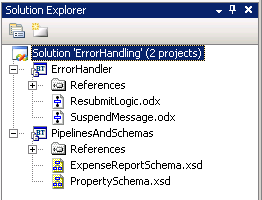
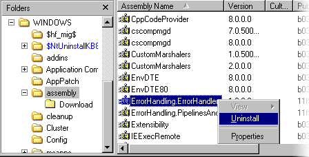
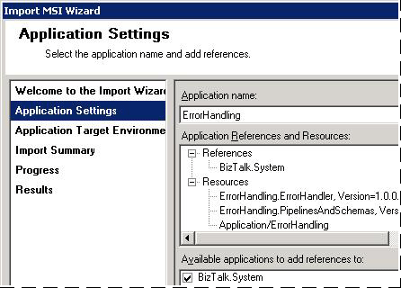
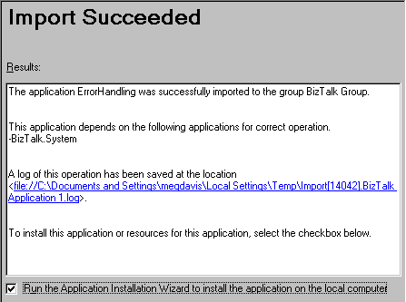

# Walkthrough: Deploying a Basic BizTalk Application
Microsoft [!INCLUDE[btsBizTalkServerNoVersion](../includes/btsbiztalkservernoversion-md.md)] includes features that simplify managing and deploying BizTalk business solutions. It now provides a BizTalk application container for the items in a business solution, such as orchestrations, schemas, maps, pipelines, schemas, and .NET assemblies. You can manage, modify, deploy, and install all of the items in an application as a single unit. [!INCLUDE[btsBizTalkServerNoVersion](../includes/btsbiztalkservernoversion-md.md)] also includes wizards to help automate application deployment tasks. For background information, see [Application Deployment and Management Features](../core/application-deployment-and-management-features.md) and [Application Deployment and Management Tools](../core/application-deployment-and-management-tools.md).  

 This walkthrough provides step-by-step instructions for using [!INCLUDE[btsBizTalkServerNoVersion](../includes/btsbiztalkservernoversion-md.md)] deployment features so that you can see how they work together. The deployment process illustrated in this walkthrough may or may not reflect the way that application deployment is managed at your company.  

 In this walkthrough, you will create a simple BizTalk application and then deploy it from the development environment to a test environment and from there to staging and production environments. After completing this walkthrough, you will understand how to perform the following tasks:  

- From within [!INCLUDE[btsVStudioNoVersion](../includes/btsvstudionoversion-md.md)] on a development computer, use the Deploy command to deploy BizTalk assemblies to a local instance of [!INCLUDE[btsBizTalkServerNoVersion](../includes/btsbiztalkservernoversion-md.md)]. This creates a BizTalk application that is populated with the assemblies. A BizTalk assembly contains resource information such as orchestrations, pipelines, schemas, and maps to be used in a BizTalk solution.  

- From the [!INCLUDE[btsBizTalkServerNoVersion](../includes/btsbiztalkservernoversion-md.md)] Administration console, add, create, configure, and remove any items (called *artifacts*) as needed to create a fully functional business solution, such as send and receive ports, policies, assemblies, and scripts.  

- Use the Export, Import, and Installation Wizards to deploy the BizTalk application to a test computer for functional and system testing.  

- Use the Export, Import, and Installation Wizards to deploy the application to a staging server for final configuration and deployment to a production server.  

## Prerequisites  
 You have two options for setting up your test environment for this walkthrough:  

- You can perform the tasks in this walkthrough on a single computer.  

- You can more closely simulate a real-world deployment by setting up different computers to use as development, test, staging, and production computers. None of the tasks in this walkthrough should be performed in an actual production environment, however.  

  To perform the steps in this walkthrough, make sure that your test environment meets the following prerequisites:  

- The development computer from which you deploy the BizTalk assemblies has Microsoft [!INCLUDE[btsVStudioNoVersion](../includes/btsvstudionoversion-md.md)] installed.  

- Each computer used in the application deployment process described in this walkthrough, including the development computer, has [!INCLUDE[btsBizTalkServerNoVersion](../includes/btsbiztalkservernoversion-md.md)] installed.  

- Each [!INCLUDE[btsBizTalkServerNoVersion](../includes/btsbiztalkservernoversion-md.md)] instance is a separate installation; in other words, it has its own [!INCLUDE[btsBizTalkServerNoVersion](../includes/btsbiztalkservernoversion-md.md)] databases and groups.  

  In addition to the preceding requirements, you need to have a [!INCLUDE[btsVStudioNoVersion](../includes/btsvstudionoversion-md.md)] solution or project available that contains BizTalk assemblies. If you don't have an existing solution or project, you can use the ErrorHandling sample solution included with the [!INCLUDE[btsBizTalkServerNoVersion](../includes/btsbiztalkservernoversion-md.md)] SDK for this purpose. Instructions for using this sample are included later in this walkthrough.  

  You also must have a user account that is a member of the [!INCLUDE[btsBizTalkServerNoVersion](../includes/btsbiztalkservernoversion-md.md)] Administrators group as well as the local Administrators group on the computers that you will be using to perform the tasks in this walkthrough.  

  For more information about installing and configuring [!INCLUDE[btsBizTalkServerNoVersion](../includes/btsbiztalkservernoversion-md.md)], see [What's New, Install, Configure, and Upgrade](../install-and-config-guides/biztalk-server-what-s-new-installation-configuration-and-upgrade.md).

##   Assumptions  
 This walkthrough assumes the following:  

- You have a basic knowledge of [!INCLUDE[btsBizTalkServerNoVersion](../includes/btsbiztalkservernoversion-md.md)]. [Getting started with BizTalk Server](../core/getting-started-with-biztalk-server.md) should help.

- The BizTalk assemblies that you are using have not been previously deployed to an application in your test environment. If they have, you should undeploy the BizTalk application to which they were deployed. For instructions, see [Undeploying BizTalk Applications](../core/undeploying-biztalk-applications.md).  

- No application resources are shared with other applications.  

##   Audience  
 The audience for this walkthrough is:  

- **BizTalk application developers.** Developers can learn how to set project properties in [!INCLUDE[btsVStudioNoVersion](../includes/btsvstudionoversion-md.md)] and deploy BizTalk assemblies from [!INCLUDE[btsVStudioNoVersion](../includes/btsvstudionoversion-md.md)] to a BizTalk application. Developers also learn how to add artifacts to the application and then export the application to an .msi file. For background information about the application deployment tasks for a developer, see [Development Tasks for BizTalk Application Deployment](../core/development-tasks-for-biztalk-application-deployment.md).  

- **BizTalk application testers.** Testers can learn how to import the .msi file into [!INCLUDE[btsBizTalkServerNoVersion](../includes/btsbiztalkservernoversion-md.md)] running on their test computer, which registers it as a BizTalk application. Testers can then learn how to install the application on the test computer and verify the installation. For background information about the application deployment tasks for testing, see [Testing Tasks for BizTalk Application Deployment](../core/testing-tasks-for-biztalk-application-deployment.md).  

- **BizTalk Server IT administrators.** IT administrators who are responsible for deploying BizTalk applications to staging and production servers can learn the basic steps required for this task. For background information about the application deployment tasks for an IT administrator, see [Staging Tasks for BizTalk Application Deployment](../core/staging-tasks-for-biztalk-application-deployment.md) and [Production Tasks for BizTalk Application Deployment](../core/production-tasks-for-biztalk-application-deployment.md).  

##   Overview of this walkthrough  
 The purpose of this walkthrough is to deploy a BizTalk application in a lab environment to assess how this technology would function if deployed in your production environment. The simple scenario covered in this walkthrough – deploying a single .msi file as a BizTalk application on a single computer – will help you become familiar with the basic tasks involved in application deployment.  

> [!NOTE]
>  This walkthrough does not provide guidance for application configuration, such as binding orchestrations, configuring ports, and so forth, which is required for an application to function. The intent of this walkthrough is only to introduce the new application deployment features.  

 The instructions provided in this document cover the following tasks:  

1. **Configuring required permissions.** Before you begin the walkthrough, you need to ensure that you have the appropriate permissions to perform each task.  

2. **Deploying BizTalk assemblies from Visual Studio.** This step is taken by the application developer. Deploying BizTalk assemblies from within [!INCLUDE[btsVStudioNoVersion](../includes/btsvstudionoversion-md.md)] automatically builds the assemblies and deploys their contents into a BizTalk application. If the application does not already exist, deploying the assemblies also creates the application. The application's artifacts are registered and their data stored in the BizTalk Management database. In addition, by default the assemblies are installed in the global assembly cache (GAC) of the local computer. After the application has been created, you can view and manage its artifacts from within the [!INCLUDE[btsBizTalkServerNoVersion](../includes/btsbiztalkservernoversion-md.md)] Administration Console. In the Administration Console, each application is stored in its own folder, with subfolders containing references to all of the application's artifacts.  

3. **Configuring the application.** This step can be taken by the application developer or IT administrator to add, create, and configure any artifacts that are required for the application to function correctly. From within the Administration Console, you can easily add, create, configure, and remove artifacts such as send and receive ports, scripts, and additional assemblies. After you are satisfied that the application contains the required artifacts and that they are configured properly, you export it into an .msi file, as described next.  

4. **Exporting the application into an .msi file.** This step can be taken by the developer, tester, or IT administrator to generate an .msi file that can be used to deploy a BizTalk application into a different environment. For example, the developer can export an .msi file that the tester can use to deploy the application onto a test server. After testing is complete, the IT administrator can then use the tested .msi file to deploy the application to a staging or production server (as described next). This walkthrough covers how to export an application into an .msi file by using the Export Wizard, which is available from the [!INCLUDE[btsBizTalkServerNoVersion](../includes/btsbiztalkservernoversion-md.md)] Administration Console.  

5. **Importing installing the application from the .msi file.** This step can be taken by the tester or IT administrator to deploy a BizTalk application onto a staging or production server. For example, the tester can import the application from an .msi file provided by the developer into a BizTalk group on a test computer and then install the application from the .msi file in order to test it. The IT administrator can likewise deploy the application from an .msi file provided by the tester onto a staging or production server. This walkthrough covers how to use the Import Wizard to import the .msi file into an application in a BizTalk group. As in Step 2, the application's artifacts are registered and their data stored in the [!INCLUDE[btsBizTalkServerNoVersion](../includes/btsbiztalkservernoversion-md.md)] databases. This walkthrough also covers how to install the application on the current server by using the Installation Wizard or by double-clicking the .msi file. This allows you to run the application on the current server.  

##   Step-by-step guide to deploying a BizTalk application  
 This section provides step-by-step procedures to deploy a BizTalk application through all of the phases, from development to test to staging to production. As previously mentioned, you can perform these steps all on the same computer, or if you want to more closely simulate your environment, you can use multiple computers.  

#### 1. Configure permissions  
 The first step is to ensure that you have the appropriate permissions to perform the tasks in this walkthrough. See [Permissions Required for Deploying and Managing a BizTalk Application](../core/permissions-required-for-deploying-and-managing-a-biztalk-application.md), and [Minimum Security Rights](https://social.technet.microsoft.com/wiki/contents/articles/24590.minimum-security-rights-for-biztalk-server-2006-to-2016.aspx).

#### 2. Deploy the BizTalk assemblies  
 From within Microsoft [!INCLUDE[btsVStudioNoVersion](../includes/btsvstudionoversion-md.md)] on the development computer, use the procedures in this step to deploy BizTalk assemblies into a BizTalk application.  

 Before you begin, you must have a BizTalk solution available in [!INCLUDE[btsVStudioNoVersion](../includes/btsvstudionoversion-md.md)]. You can either create your own solution or project, or you can set up the ErrorHandling sample included with BizTalk Server. You can set up the ErrorHandling sample solution in [!INCLUDE[btsVStudioNoVersion](../includes/btsvstudionoversion-md.md)] as follows:  

###### To set up the ErrorHandling solution  

1. On the development computer, navigate to:  

    [!INCLUDE[btsBiztalkServerPath](../includes/btsbiztalkserverpath-md.md)]SDK\Samples\Messaging\ErrorHandling\ErrorHandler  

2. Double-click **ErrorHandler.btproj**.  

    The ErrorHandler solution opens in [!INCLUDE[btsVStudioNoVersion](../includes/btsvstudionoversion-md.md)]. This solution consists of two projects: ErrorHandler and PipelinesAndSchemas.  

      

   Next, you must set properties for each project in the solution. The ErrorHandling sample solution includes two projects for which you should set properties: ErrorHandler and PipeLinesAndSchemas. Configure properties to reflect the environment of the development computer. For example, the SQL server that you specify should be the instance running on the development computer, and which is hosting the local BizTalk Management database.  

###### To configure project properties  

1. In [!INCLUDE[btsVStudioNoVersion](../includes/btsvstudionoversion-md.md)] Solution Explorer, right-click a project for which you want to configure properties, and then click **Properties**.  

2. Click the **Deployment** tab in Project Designer.  

      

3. Configure project properties as described in the following table, and then click **OK**.  

   |             Property             |                Value                 |                                                                                                                                                                                                                                                                                                                                                                                               Explanation                                                                                                                                                                                                                                                                                                                                                                                                |
   |----------------------------------|--------------------------------------|----------------------------------------------------------------------------------------------------------------------------------------------------------------------------------------------------------------------------------------------------------------------------------------------------------------------------------------------------------------------------------------------------------------------------------------------------------------------------------------------------------------------------------------------------------------------------------------------------------------------------------------------------------------------------------------------------------------------------------------------------------------------------------------------------------|
   |         Application Name         |               \<Name\>               |                                                                                                                                                         Name of the BizTalk application to which to deploy the assemblies in this project. If the application already exists, the assemblies will be added to it when you deploy the project. If the application does not exist, the application will be created. If this field is blank, the assemblies will be deployed to the default BizTalk application in the current group, "BizTalk Application 1" by default. Names that include spaces must be enclosed by double quotation marks (").                                                                                                                                                         |
   |      Configuration database      | \<BizTalk Management database name\> |                                                                                                                                                                                                                                                                                                                                                             Name of the BizTalk Management database for the group, BizTalkMgmtDb by default.                                                                                                                                                                                                                                                                                                                                                             |
   |              Server              |           \<Server name\>            |                                                                                                                                                                                                          Name of the SQL Server instance that hosts the BizTalk Management database on the local computer. In a single-computer installation, this is usually the name of the local computer. **Note:**  If you move this BizTalk project to a different computer, you will need to modify the Server property to reflect the new computer name before you will be able to deploy the assembly.                                                                                                                                                                                                          |
   |             Redeploy             |            True or False             |                                                                                                                                                                                                                                                                                                                                          Setting this to True (the default) enables you to redeploy the BizTalk assemblies without changing the version number.                                                                                                                                                                                                                                                                                                                                          |
   | Install to Global Assembly Cache |            True or False             |                                                                                                                                                                                                                                                                                                                            Setting this to True (the default) installs the assemblies to the global assembly cache (GAC) on the local computer when you deploy the assembly.                                                                                                                                                                                                                                                                                                                             |
   |      Restart Host instances      |            True or False             | Setting this to True automatically restarts all host instances running on the local computer when the assembly is redeployed. If set to False (the default), you must manually restart the host instances when you redeploy an assembly. **Note:**  If you are redeploying assemblies from the solution level, host instances will be restarted once for each project that has this option set to True. This may result in multiple restarts. If you plan to redeploy from the solution level, you may want to set this property to True on only one project in the solution to avoid multiple host instance restarts. This should be set on the last project that will be redeployed in the solution. In addition, if a host instance is stopped when you perform the redeploy, it will not be started. |
   |       Enable Unit Testing        |            True or False             |                                                                                                                                                                                                                                                                                                                                                                        Specifies whether to enable unit testing for the project.                                                                                                                                                                                                                                                                                                                                                                         |

4. Repeat steps 1, 2, and 3 for each project in the solution.  

   The deployment process requires that assembly is strongly signed. You strongly sign your assemblies by associating the project with a strong name assembly key file. If you haven't already done so, use the following procedure to generate a strong name assembly key file.  

###### To create a strong name assembly key file  

1. Start **Visual Studio Command Prompt**.  

2. At the command prompt, from the folder where you want to store the key file, type the following command, and then press ENTER:  

    **sn -k**  *file_name* **.snk**  

    Example: **sn -k ErrorHandling.snk**  

    A confirmation message, **Key pair written to \<**<em>file_name</em>**\>.snk**`,` displays on the command line.  

   Next you need to associate each project in the solution with the key file.  

###### To associate your projects with the key file  

1. In [!INCLUDE[btsVStudioNoVersion](../includes/btsvstudionoversion-md.md)] Solution Explorer, right-click the project and then click **Properties**.  

2. Click the **Signing** tab in Project Designer.  

3. In the right pane, check the **Sign the assembly** box.  

4. Click the drop-down box under **Choose a strong name key file**, click **\<Browse…\>**, and then browse to the key file.  

5. Click the key file and click **Open**.  

6. Repeat steps 1 through 5 for each project in your solution.  

   Now you can build and deploy all of the assemblies in the solution in one step, as follows.  

###### To deploy the assemblies in a solution  

- In [!INCLUDE[btsVStudioNoVersion](../includes/btsvstudionoversion-md.md)] Solution Explorer, right-click the solution, and then click **Deploy Solution**.  

   The status of the build and deployment process displays in the lower left corner of the page. If you are using the ErrorHandling sample solution, several warning messages will display in the output window. For the purposes of this walkthrough, you can ignore these. When the deployment is complete, "Deploy: 2 succeeded, 0 failed, 0 skipped” is displayed in the [!INCLUDE[btsVStudioNoVersion](../includes/btsvstudionoversion-md.md)] Output window.  

  Deploying BizTalk assemblies registers them as part of the specified BizTalk application in the BizTalk Management database. It also populates the database with all of the items, or *artifacts*, contained in the assemblies. If the application did not already exist before the deployment, this step also creates a new application. You can now view the BizTalk application and its artifacts from within the [!INCLUDE[btsBizTalkServerNoVersion](../includes/btsbiztalkservernoversion-md.md)] Administration Console on the development computer.  

###### To view the BizTalk application and its artifacts  

1. Click **Start**, click **All Programs**, click [!INCLUDE[btsBizTalkServerStartMenuItemui](../includes/btsbiztalkserverstartmenuitemui-md.md)], and then click **BizTalk Server Administration**.  

2. In the console tree, expand [!INCLUDE[btsBizTalkServerAdminConsoleui](../includes/btsbiztalkserveradminconsoleui-md.md)], expand **BizTalk Group**, and then expand **Applications**.  

3. Expand the folder of the application to which you just deployed your assemblies.  

4. Click the folders under the application folder to view their contents. In the appropriate folders, you should see the artifacts that were contained in the assemblies that you deployed. If you deployed the ErrorHandling sample BizTalk Solution, you should see artifacts in the Orchestrations, Schemas, and Resources folders. You can right-click an artifact and click **Properties** to view its configuration settings.  

5. Expand the **Resources** folder, right-click one of the assemblies, and then click **Modify**.  

6. In the **Options** box, note the deployment options that are configured for the assembly.  

7. In **Destination location**, note the path to the location where the assembly file will be copied when the application is installed. This is the source location of the assembly by default.  

> [!NOTE]
>  If your application does not display, right-click **BizTalk Group** and click **Refresh**.  

 For more information about deploying assemblies, see [Deploying BizTalk Assemblies from Visual Studio into a BizTalk Application](../core/deploying-biztalk-assemblies-from-visual-studio-into-a-biztalk-application.md).  

#### 3. Configure the application  
 From the [!INCLUDE[btsBizTalkServerNoVersion](../includes/btsbiztalkservernoversion-md.md)] Administration console, you can configure your application by creating, adding, and configuring artifacts.  

 For an application to function, it must be properly configured. For example, orchestrations must be bound to a host, and must have send ports and receive locations configured. If you deployed the ErrorHandling sample solution, you will notice that the application has no send ports, receive ports, or receive locations. This means that the orchestrations cannot send or receive messages. It is outside the scope of this walkthrough to give instructions on configuring an application. If you want to do so, however, the quickest approach is to use the Configure Application dialog box, which you access by right-clicking the application and clicking Configure. For more information, see [How to Configure an Application](../core/how-to-configure-an-application.md). In addition to this approach, you can also configure orchestrations as well as create, configure, and delete send ports, send port groups, receive ports, and receive locations individually. For more information, see the appropriate topics in [Managing Artifacts](../core/managing-artifacts.md).  

 You might also want to add to your application artifacts, such as pre-processing scripts or Readme files, or remove artifacts. You can try out this functionality using the following procedures. (The ErrorHandling sample does not include additional artifacts that you can add; however, you can test this functionality by adding items that might already exist in your environment.)  

> [!NOTE]
>  You can use pre- and post-processing scripts to perform actions before or after application import, installation, or uninstallation. For example, you might want to use a pre-processing script to uninstall assemblies from the GAC following uninstallation. For more information, see [Using Pre- and Post-processing Scripts to Customize Application Deployment](../core/using-pre-and-post-processing-scripts-to-customize-application-deployment.md).  

###### To add an artifact to an application  

1. Open the [!INCLUDE[btsBizTalkServerNoVersion](../includes/btsbiztalkservernoversion-md.md)] Administration Console. Click **Start**, click **All Programs**, click [!INCLUDE[btsBizTalkServerStartMenuItemui](../includes/btsbiztalkserverstartmenuitemui-md.md)], and then click **BizTalk Server Administration**.  

2. In the console tree, expand [!INCLUDE[btsBizTalkServerAdminConsoleui](../includes/btsbiztalkserveradminconsoleui-md.md)], expand **BizTalk Group**, and then expand **Applications**.  

3. To add the following types of artifacts, right-click the ErrorHandling application folder, and then click **Add**. Notice that when you add a BizTalk assembly, the artifacts that it contains are also added to the appropriate folders in the application.  

   -   BizTalk assemblies  

   -   Pre-processing scripts  

   -   Post-processing scripts  

   -   Resources (BizTalk assemblies, .NET assemblies, pre-processing scripts, post-processing scripts, files, certificates, COM components. BAM artifacts, binding files, and virtual directories)  

   -   Policies  

   You can also remove an artifact from an application.  

###### To remove an artifact from an application  

1. Open the [!INCLUDE[btsBizTalkServerNoVersion](../includes/btsbiztalkservernoversion-md.md)] Administration Console. Click **Start**, click **All Programs**, click [!INCLUDE[btsBizTalkServerStartMenuItemui](../includes/btsbiztalkserverstartmenuitemui-md.md)], and then click **BizTalk Server Administration**.  

2. In the console tree, expand [!INCLUDE[btsBizTalkServerAdminConsoleui](../includes/btsbiztalkserveradminconsoleui-md.md)], expand **BizTalk Group**, and then expand **Applications**.  

3. Expand the folder containing the artifact, right-click the artifact, and then click **Remove**.  

   For more information about configuring your application, see [Creating and Modifying BizTalk Applications](../core/creating-and-modifying-biztalk-applications.md).  

#### 4. Export the application  
 After you have created a BizTalk application and modified it as necessary, you can export the application by using the Export MSI File Wizard in the [!INCLUDE[btsBizTalkServerNoVersion](../includes/btsbiztalkservernoversion-md.md)] Administration Console. This generates an .msi file that you can later import into another BizTalk group to recreate the application in the new group. To run the application on a particular server, you must also install it locally from the .msi file.  

###### To export the application  

1. Open the [!INCLUDE[btsBizTalkServerNoVersion](../includes/btsbiztalkservernoversion-md.md)] Administration Console. Click **Start**, click **All Programs**, click [!INCLUDE[btsBizTalkServerStartMenuItemui](../includes/btsbiztalkserverstartmenuitemui-md.md)], and then click **BizTalk Server Administration**.  

2. In the console tree, expand [!INCLUDE[btsBizTalkServerAdminConsoleui](../includes/btsbiztalkserveradminconsoleui-md.md)], expand **BizTalk Group**, and then expand **Applications**.  

3. Right-click the BizTalk application, point to **Export**, and then click **MSI file**.  

4. On the **Welcome to the Export MSI File Wizard** page, click **Next**.  

5. On the **Select Resources** page, select the resources to export into the .msi file, and then click **Next**. For this walkthrough, you can accept the defaults.  

6. If prompted, on the **Specify IIS Hosts** page, type the server name of the computer hosting the virtual directory that you want to include, and then click **Next**. You will be prompted to specify the server only if the virtual directory has not been previously added to the BizTalk Management database, such as when it was added to the application or it was imported in an application.  

   > [!NOTE]
   >  There are no virtual directories included in the ErrorHandling sample solution.  

7. On the **Dependencies** page, review the dependencies for the application, and then click **Next**.  

8. On the **Destination** page, in **Destination application name**, type the application name.  

9. In **MSI file to generate**, type the full path for the .msi file, and then click **Export**. Example: C:\MSI\Errorhandling.msi  

    > [!NOTE]
    >  We recommend that you store .msi files in a secure folder.  

10. On the **Summary** page, make a note of the location of the log file for this operation, and then click **Finish**.  

    In the file system, verify that the .msi file was created in the location that you specified.  

> [!NOTE]
>  For security reasons, during application export, passwords are removed from application bindings. After installing the application from the .msi file, you will need to reconfigure the passwords in order for the application to function. Passwords are not removed, however, from any binding files that you added to the application.  

 For more information about exporting applications and artifacts, see [How to Export a BizTalk Application](../core/how-to-export-a-biztalk-application.md).  

#### 5. Import and install the application  
 The next step is to import the application from the .msi file that you just generated into a BizTalk group and also install the application on the local computer. You can use the Import MSI Wizard and the Installation Wizard in the [!INCLUDE[btsBizTalkServerNoVersion](../includes/btsbiztalkservernoversion-md.md)] Administration Console to do this.  

> [!NOTE]
>  The application must be installed on each computer in the group that will run the application. You can double-click the .msi file to install it on additional computers.  

 You can repeat the tasks in this step each time you want to migrate an application from one BizTalk group to another, such as when migrating from a development environment to a test environment, a test environment to a staging environment, or a staging environment to a production environment.  

 At this point, if you are using only one computer for this walkthrough, you should delete the application from the BizTalk group. You should also delete the assemblies from the global assembly cache (GAC). This way, when you import the application, you will be able to verify that it has been re-created correctly. If you are using multiple computers for this walkthrough, you do not need to perform these tasks.  

###### To delete the application from the BizTalk group  

1. Open the [!INCLUDE[btsBizTalkServerNoVersion](../includes/btsbiztalkservernoversion-md.md)] Administration Console. Click **Start**, click **All Programs**, click [!INCLUDE[btsBizTalkServerStartMenuItemui](../includes/btsbiztalkserverstartmenuitemui-md.md)], and then click **BizTalk Server Administration**.  

2. Right-click the application and click **Delete**.  

###### To delete assemblies from the GAC  

1. In the file system, navigate to %systemdrive%\Windows\assembly.  

2. Right-click each assembly file that was generated for your solution, click **Uninstall**, and then click **Yes** to confirm. For example, the assembly files associated with the ErrorHandling project are ErrorHandling.ErrorHandler and ErrorHandling.PipelinesAndSchemas.  

      

   Now you are ready to import the application into a BizTalk group. If you want to import the application into a BizTalk group running on another computer, the .msi file must be accessible from the other computer.  

> [!CAUTION]
>  Before you install any application, be sure that you have received the .msi file from a trusted source. A malicious user can include code in an .msi file that can have an undesirable effect on your system or network. For more information, see [Security and Windows Installer](../core/security-and-windows-installer.md).  

###### To import and install the application  

1. Open the [!INCLUDE[btsBizTalkServerNoVersion](../includes/btsbiztalkservernoversion-md.md)] Administration Console for the instance of [!INCLUDE[btsBizTalkServerNoVersion](../includes/btsbiztalkservernoversion-md.md)] into which you want to import the application. Click **Start**, click **All Programs**, click [!INCLUDE[btsBizTalkServerStartMenuItemui](../includes/btsbiztalkserverstartmenuitemui-md.md)], and then click **BizTalk Server Administration**.  

2. In the console tree, expand [!INCLUDE[btsBizTalkServerAdminConsoleui](../includes/btsbiztalkserveradminconsoleui-md.md)], and then expand **BizTalk Group**.  

3. Right-click **Applications**, point to **Import**, and then click **MSI file**.  

4. On the **Welcome to the Import Wizard** page, in **MSI file to import**, type the complete path of the .msi file, and then click **Next**. Example: C:\msi\MyApplication.msi  

5. On the **Application Settings** page, in **Available applications to add references to**, select the applications to which to add references, and then click **Next**. If you are using the ErrorHandling sample solution, you can accept the defaults.  

      

6. On the **Application Target Environment Settings** page, confirm that **\<Default\>** is selected and click **Next**.  

7. On the **Import Summary** page, confirm that the summary information is correct, and then click **Import**.  

8. On the final screen of the Import MSI Wizard, select **Run the Application Installation Wizard to install the application on the local computer**, and then click **Finish**.  

      

9. On the **Select Installation Folder** page, in **Folder**, type the installation path for the BizTalk application, and then click **Next**.  

10. Click **Next** on the next three pages to continue the installation.  

     Windows Installer installs the application on the local computer.  

11. On the **Installation Complete** page, click **Close**.  

    For more information about importing applications, see [How to Import a BizTalk Application](../core/how-to-import-a-biztalk-application.md). For more information about installing applications, see [How to Install a BizTalk Application](../core/how-to-install-a-biztalk-application.md).  

    Next, you can make sure that the application was imported and installed by verifying the following:  

-   The application and all of its artifacts exist in the application's folder in the Administration Console.  

-   The application assemblies exist in the GAC.  

-   The files associated with the application exist in the path that you specified when you installed the application.  

-   The application displays in Add or Remove Programs control panel.  

-   If you have configured the application so that it can function, such as by specifying send and receive ports, you can now start the application by right-clicking it and then clicking **Start**. The ErrorHandling sample application is not set up to function by default, however, so unless you have manually configured it, you will not be able to start it.  

-   To completely remove the application from the BizTalk group and the local computer, follow the instructions in [Undeploying BizTalk Applications](../core/undeploying-biztalk-applications.md).  

## See Also  
[Understanding BizTalk Application Deployment and Management](../core/understanding-biztalk-application-deployment-and-management.md)