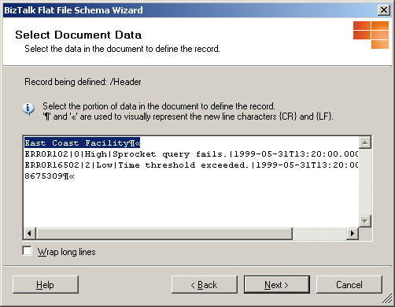
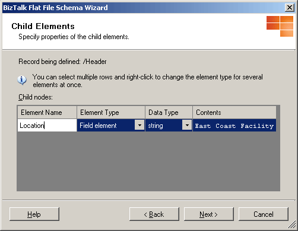
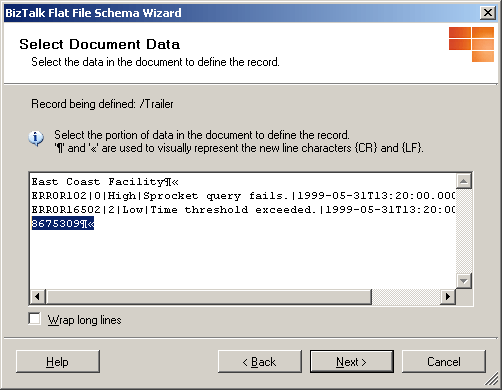
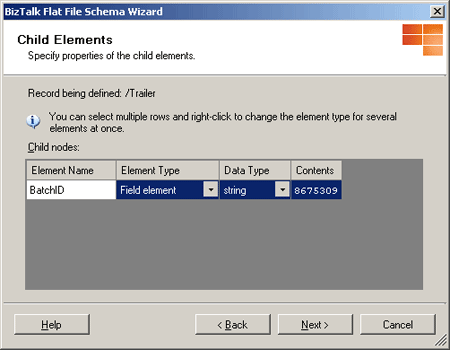
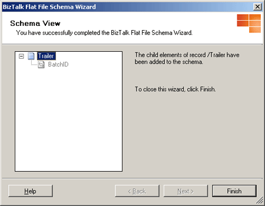
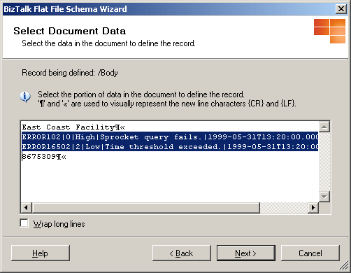
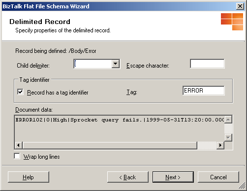
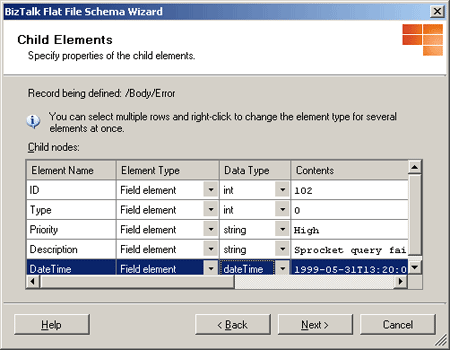
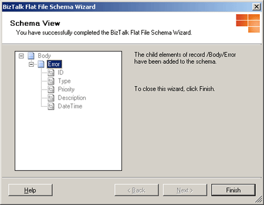

# Walkthrough: Flat File Disassembly Using a Header and Trailer

## Overview
This walkthrough demonstrates the use of schemas created by the Flat File Schema Wizard to perform flat file disassembly of a file containing a header, a trailer, and a repeating message body. In this walkthrough, you develop part of a fictitious error-tracking system that meets the following requirements:  
  
- Error messages are logged at various physical sites within the company and sent to a central location for processing into various back-end systems.  
  
- Error messages are written into a flat file format that contains a header indicating location, a body containing one or more error messages, and a trailer indicating the batch number.  
  
- Messages are considered invalid if they do not have a header, body, and trailer.  
  
  When the walkthrough is completed you will have a BizTalk Server application that processes flat files and writes them out as XML for processing by a back-end system.  
  
## Prerequisites  
 For this example you need to be comfortable with creating BizTalk Server projects, signing an assembly, and using the BizTalk Server Administration console to view applications and ports. You should also be comfortable with the ideas presented in [Walkthrough: Deploying a Basic BizTalk Application](../core/walkthrough-deploying-a-basic-biztalk-application.md). Basic familiarity with the Flat File Schema Wizard is also helpful but not required.  
  
## What This Example Does  
 This example processes inbound flat file messages using a custom pipeline and the Flat File Disassembler component. Messages are parsed using header, trailer, and body schemas and then written out to a send location for back-end processing.  
  
## Example  
 To create the example, follow the steps outlined in the following sections.  
  
### Create a New BizTalk Project  
 Before building a solution you need to create a BizTalk project, ensure that it is strongly named, and assign it an application name. Assigning an application name prevents BizTalk Server from deploying the solution into the default BizTalk application.  
  
1. Use [!INCLUDE[btsVStudioNoVersion](../includes/btsvstudionoversion-md.md)] to create a new BizTalk project. Call the project **FFDisassemblerWalkthrough**.  
  
2. Generate a key file and assign it to the project. For more information about this task, see [Signing Page, Project Designer](http://go.microsoft.com/fwlink/?LinkId=125876).  
  
3. In the deployment properties for the project, set **Application Name** to “FlatFileExample” and set **Restart Host Instances** to `True`. Setting this flag tells the host to clear any cached instances of the assembly.  
  
### Create the Sample Data File  
Before generating schemas, you need to create a test file.   
  
1.  Start Notepad or another text editor.  
  
2.  Create a sample test file. The file consists of a header indicating the location reporting the error(s), a trailer with a batch ID for this batch, and a body consisting of one or more error records. The format of the file is as follows:  
  
    ```  
    Location  
    ERRORid|type|priority|description|errorDateTime  
    …additional error records   
    BatchID  
    ```  
  
    The ERROR record is tagged with the text “ERROR” and delimited with the “&#124;” character (versus positional). The data elements of the ERROR record are described in the following table.  
  
    |Element|Data type|Description|  
    |---|---|---|  
    |ID|integer|ID for this error.|  
    |Type|integer|Type of error.|  
    |Priority|string|Priority indicator: Low, Medium, or High.|  
    |Description|string|Description of the error.|  
    |ErrorDateTime|DateTime|Date and time that the error occurred.|  
  
    The file can have one or more ERROR records.  
  
     **-- OR --  **
  
     Copy the following sample data into the new file. The last line contains a trailing linefeed:
  
    ```  
    East Coast Facility  
    ERROR102|0|High|Sprocket query fails.|1999-05-31T13:20:00.000-05:00  
    ERROR16502|2|Low|Time threshold exceeded.|1999-05-31T13:20:00.000-05:00  
    8675309  
  
    ```  
  
3.  Save the new sample file in the project directory. Use a descriptive name like "ErrorFile.txt" so it can be located easily.  
  
### Create and Test the Header, Trailer, and Body Schemas  
 After the sample data file is created, the next step is to create the header, trailer, and body schemas. These schemas are used with the Flat File Disassembler receive pipeline component to process received messages.  
  
##### Use the Flat File Schema Wizard to create the header schema  
  
1.  Add a new schema to the project. In Solution Explorer, right-click **FFDisassemblerWalkthrough**, point to **Add**, and then click **New Item**.  
  
2.  In the **Add New Item** dialog box, click **Schema Files** and select **Flat File Schema Wizard**. Name the new schema "Header.xsd" and then click **Add**.  
  
3.  On the **Welcome to the BizTalk Flat File Schema Wizard** page, click **Next**.  
  
4.  On the **Flat File Schema Information** page, click **Browse** and locate the sample data file created earlier. Change the **Record Name** to "Header", verify the code page, and then click **Next**.  
  
    > [!NOTE]
    >  If you saved the sample file in Unicode format the code page will be Little-Endian-UTF16 (1200). This will not adversely affect the example.  
  
5.  Next select the document data. On the **Select Document Data** page, highlight the first line of data including the new-line characters {CR} and {LF} as shown:  
  
       
  
     Click **Next**.  
  
6.  On the **Select Record Format** page, click **Next** to accept the default. You can accept the default "by delimiter symbol" because the data file does not use relative position.  
  
7.  On the **Delimited Record** page, click **Next**.  
  
8.  Now you specify child elements. The header contains one element named "Location":  
  
       
  
     Click **Next** to continue.  
  
9. On the **Schema View** page, verify the schema.  
  
       
  
     When you are satisfied, click **Finish** to complete the wizard.  
  
10. Click the **\<Schema\>** node in the Header schema pane. In the Properties pane, change **Element FormDefault** to **Qualified**. This indicates that locally declared elements must be qualified by the target namespace in an instance document.  
  
##### Use the Flat File Schema Wizard to create the trailer schema  
  
1.  Add a new schema to the project. In Solution Explorer, right-click **FFDisassemblerWalkthrough**, point to **Add** , and then click **New Item**.  
  
2.  In the **Add New Item** dialog box, click **Schema Files** and select **Flat File Schema Wizard**. Name the new schema "Trailer.xsd" and then click **Add**.  
  
3.  On the **Welcome to the BizTalk Flat File Schema Wizard** page, click **Next**.  
  
4.  On the **Flat File Schema Information** page, click **Browse** and locate the sample data file created earlier. Change the **Record Name** to "Trailer", verify the code page, and then click **Next**.  
  
    > [!NOTE]
    >  If you saved the sample file in Unicode format the code page will be Little-Endian-UTF16 (1200). This will not adversely affect the example.  
  
5.  Next select the document data. On the **Select Document Data** page, highlight the last line of data including the new-line characters {CR} and {LF} as shown:  
  
       
  
     Click **Next**.  
  
6.  On the **Select Record Format** page, click **Next** to accept the default. You can accept the default "by delimiter symbol" because the data file does not use relative position.  
  
7.  On the **Delimited Record** page, click **Next**.  
  
8.  Now you specify child elements. The header contains one element named "BatchID":  
  
       
  
     Click **Next** to continue.  
  
9. On the **Schema View** page, verify the schema.  
  
       
  
     When you are satisfied, click **Finish** to complete the wizard.  
  
10. Click the **\<Schema\>** node in the Trailer schema pane. In the Properties pane, change **elementFormDefault** to **Qualified**. This indicates that locally declared elements must be qualified by the target namespace in an instance document.  
  
##### Use the Flat File Schema Wizard to create the body schema  
  
1.  Add a new schema to the project. In Solution Explorer, right-click **FFDisassemblerWalkthrough**, point to **Add**, and then click **New Item**.  
  
2.  In the **Add New Item** dialog box, click **Schema Files** and select **Flat File Schema Wizard**. Name the new schema "Body.xsd" and then click **Add**.  
  
3.  On the **Welcome to the BizTalk Flat File Schema Wizard** page, click **Next**.  
  
4.  On the **Flat File Schema Information** page, click **Browse** and locate the sample data file created earlier. Change the **Record Name** to "Body", verify the code page, and then click **Next**.  
  
    > [!NOTE]
    >  If you saved the sample file in Unicode format the code page will be Little-Endian-UTF16 (1200). This will not adversely affect the example.  
  
5.  Next select the document data. On the **Select Document Data** page, highlight lines two and three of data including the new-line characters {CR} and {LF} as shown:  
  
       
  
     Click **Next**.  
  
6.  On the **Select Record Format** page, click **Next** to accept the default. You can accept the default "by delimiter symbol" because the data file does not use relative position.  
  
7.  On the **Delimited Record** page, select **Next**.  
  
8.  Next define the child elements. Change **Body_Child1** to **Error**and set its element type to **Repeating record**. Set the **Body_Child2** element record type to **Ignore**.  
  
9. On the **Schema View** page, click **Next** to define the child elements of the Error record.  
  
10. On the **Select Document Data** page, click **Next**. The wizard chooses the record-defining data correctly.  
  
11. On the **Select Record Format** page, click **Next**. The data is formatted by delimiter symbol.  
  
12. On the **Delimited Record** page, select **&#124;** for the **Child delimiter**. Next, select the **Record has a tag identifier** check box and type **ERROR** for the tag value.  
  
       
  
     Click **Next**.  
  
13. Now define the child elements of the Error record.  
  
       
  
     Click **Next**.  
  
14. On the **Schema View** page, verify the schema.  
  
       
  
     If you have made any mistakes, click **Back** and make the necessary corrections. When you are satisfied, click **Finish** to complete the wizard.  
  
15. Click the **\<Schema\>** node in the Body schema pane. In the Properties pane, change **Element FormDefault** to **Qualified**. This indicates that locally declared elements must be qualified by the target namespace in an instance document.  
  
16. Click the **\<Error\>** node on the Body schema pane. In the Properties pane, change **Max Occurs** to **1**. This causes the Flat File Disassembler to split each error into its own message.  
  
##### Test the schemas using FFDasm  
  
1.  Open a command prompt and change the directory to your project directory.  
  
2.  From the command prompt, run FFDasm.exe as shown below.  
  
    ```  
    <Samples Path>\SDK\Utilities\PipelineTools\FFDasm ErrorFile.txt  -hs header.xsd -bs body.xsd -ts Trailer.xsd  
    ```  
  
     For information about the location of this and other pipeline tools, see [Pipeline Tools](../core/pipeline-tools.md).  
  
3.  FFDasm.exe should produce two output files named {GUID}.xml, one for each ERROR record in the test file. The high-priority error record looks like the following:  
  
    ```  
    <Body xmlns="http://FFDisassemblerWalkthrough.Body">  
      <Error>  
        <ID>102</ID>  
        <Type>0</Type>  
        <Priority>High</Priority>  
        <Description>Sprocket query fails.</Description>  
        <DateTime>1999-05-31T13:20:00.000-05:00</DateTime>  
      </Error>  
    </Body>  
    ```  
  
### Create a Custom Receive Pipeline  
 Now that the flat file schemas are defined, you need to create a custom pipeline that uses the Flat File Disassembler component. The Flat File Disassembler component can then be configured to use the header, body, and trailer schemas to break up messages.    
 
1.  Add a new receive pipeline to the project. In Solution Explorer, right-click the **FFDisassemblerWalkthrough** project, point to **Add**, and then click **New Item**.  
  
2.  In the **Add New Item** dialog box, point to **Pipeline Files** and then click **Receive Pipeline**. Name the new pipeline "FFReceivePipeline" and then click **Add**.  
  
3.  Configure the new pipeline by dragging the Flat File Disassembler component from the Toolbox pane to the Disassemble step.  
  
4.  In the Properties pane, set the **Document schema** to **FFDisassemblerWalkthrough.Body**, the **Header schema** to **FFDisassemblerWalkthrough.Header** and the **Trailer schema** to **FFDisassemblerWalkthrough.Trailer**.  
  
### Deploy the Application and Configure the Send and Receive Ports  
 With the schemas and custom receive pipeline created, you need to compile and deploy the project. After it is deployed, you can use the BizTalk Server Administration console to configure the send and receive ports.  

##### Deploy  
1. From within [!INCLUDE[btsVStudioNoVersion](../includes/btsvstudionoversion-md.md)], deploy the solution by right-clicking on the project and then clicking **Deploy**.  
  
2. Using the BizTalk Server Administration console, expand the **Applications** group to verify that **FlatFileExample** is present as a custom application.  
  
##### Configure the receive port  
  
1.  Use Windows Explorer to create a directory named "Receive" under the **FFDisassemblerWalkthrough** project directory.  
  
2.  In the BizTalk Server Administration console, expand the **FlatFileExample** application, right-click **Receive Ports**, point to **New**, and then click **One-way Receive Port**.  
  
3.  In the **Receive Port Properties** dialog box, set the name of the port to "ReceiveError".  
  
4.  Click **Receive Locations**, and then click **New** to add a receive location. Name the new receive location "ReceiveErrorLocation". Set the **Receive Pipeline** to **FFReceivePipeline**. For **Transport Type**, select **FILE**, and then click **Configure**. Select the receive directory you created, and then set the **File mask** to *.txt.  
  
5.  Click **OK**. Your receive port should now be configured. Click **OK** to close.  
  
##### Configure the send port  
  
1.  Use Windows Explorer to create a directory named "Send" under the **FFDisassemblerWalkthrough** project directory.  
  
2.  In the BizTalk Server Administration console, expand the **FlatFileExample** application, right-click **Send Ports**, point to **New**, and then click **Static One-Way  Send Port…**.  
  
3.  In the **Send Port Properties** dialog box, set the name of the port to "Send".  
  
4.  For transport type, select **FILE**, and then click **Configure**. Set the destination folder to the send directory you created earlier.  
  
5.  Now configure the filter. Click **Filters** and add one expression:  
  
    -   BTS.MessageType == **http://FFDisassemblerWalkthrough.Body#Body**  
  
6.  Click **OK** to complete the send port configuration. Your send port should be configured.  
  
### Run the Example  
 It is now time to run the example. After using the BizTalk Server Management console to start the application, copy the test files to the receive location and observe what is produced in the send location.  
  
1.  In the BizTalk Server Administration console, right-click the **FlatFileExample** application, and then click **Start**. This enlists and starts the send and receive ports.  
  
2.  Drop the copy of the sample Errorfile.txt into the receive directory. Two output files should be written to the send directory.  
  
