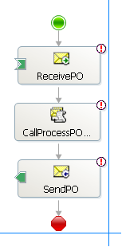
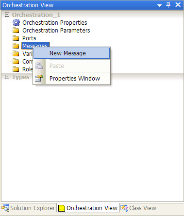
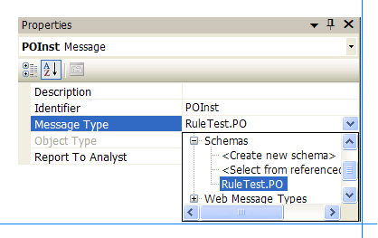
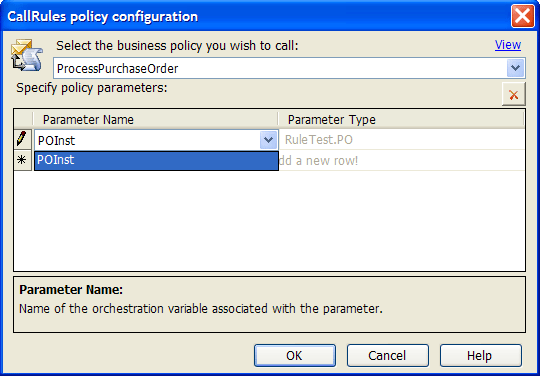
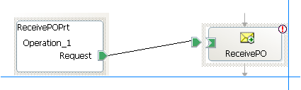
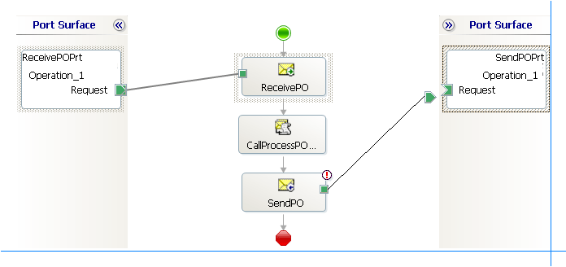
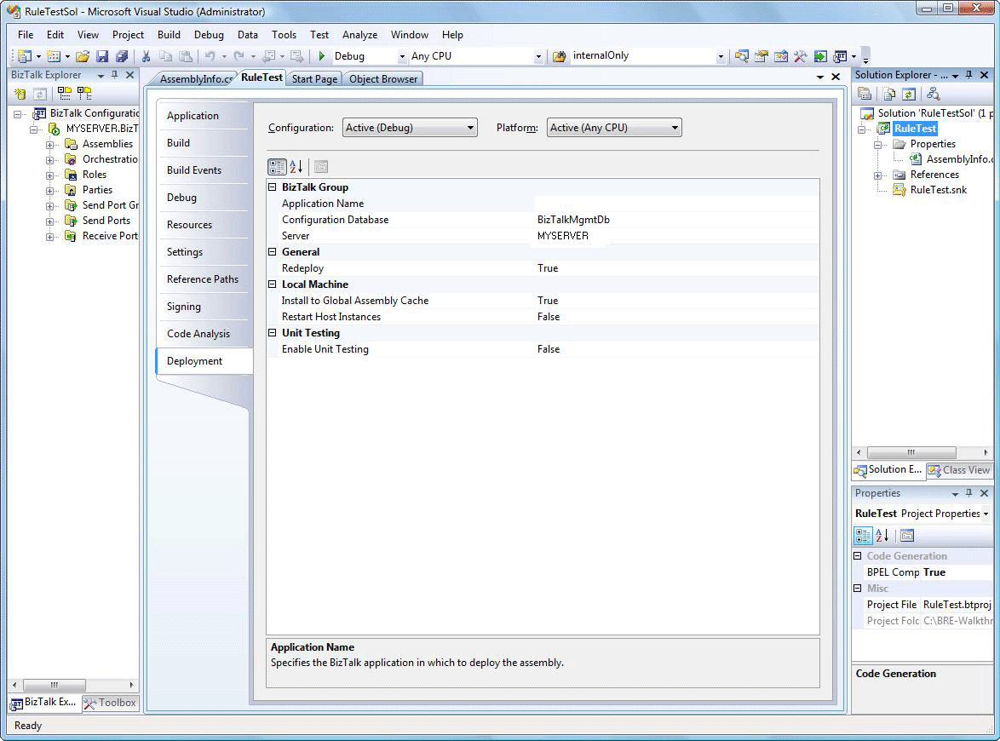
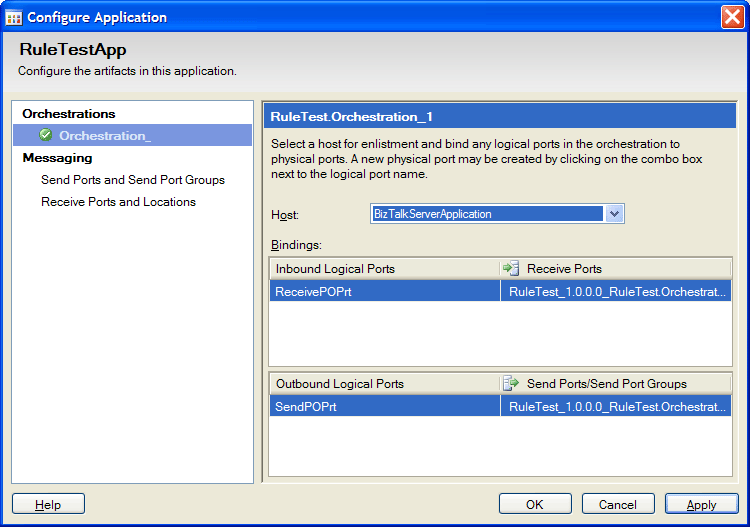

# Walkthrough: Invoking the Policy from an Orchestration
You can invoke a policy from an orchestration in one of the following ways:  

- By using the **Call Rules** shape  

- By using the **Expression** shape, and programmatically invoking the rule engine to execute the policy (**Policy.Execute** method)  

  Using the **Call Rules** shape is the most common way and also the recommended way to invoke a policy from an orchestration. This walkthrough provides step-by-step procedures for using the **Call Rules** shape to invoke the **ProcessPurchaseOrder** policy.  

## Prerequisites  
 You must complete the [Walkthrough: Testing the Policy](../core/walkthrough-testing-the-policy.md) walkthrough before performing this walkthrough.  

## Overview of This Walkthrough  
 This walkthrough contains seven procedures, as described in the following table.  

|Procedure title|Procedure description|  
|---------------------|---------------------------|  
|To create a BizTalk project with a schema and an orchestration|Provides step-by-step instructions for creating a schema and an orchestration that invokes the **ProcessPurchaseOrder** policy.|  
|To create message variables|Provides step-by-step instructions for creating message variables used in the orchestration.|  
|To configure shapes|Provides step-by-step instructions for configuring shapes in the orchestration.|  
|To create ports|Provides step-by-step instructions for creating ports in the orchestration.|  
|To connect ports with the shapes|Provides step-by-step instructions for connecting ports with the shapes.|  
|To build and deploy the solution|Provides step-by-step instructions for building and deploying the solution.|  
|To test the solution|Provides step-by-step instructions for testing the solution.|  

### To create a BizTalk project with a schema and an orchestration  

1. Start **Microsoft Visual Studio**.  

2. In [!INCLUDE[btsVStudioNoVersion](../includes/btsvstudionoversion-md.md)], on the **File** menu, point to **New**, and then click **Project**.  

3. In the **New Project** dialog box, do the following:  

   |             Use this              |                             To do this                              |
   |-----------------------------------|---------------------------------------------------------------------|
   |         **Project types**         |                     Click **BizTalk Projects**.                     |
   |           **Templates**           |               Click **Empty BizTalk Server Project**.               |
   |             **Name**              |                         Type **RuleTest**.                          |
   |           **Location**            |                  Specify **C:\BRE-Walkthroughs**.                   |
   |         **Solution Name**         |                        Type **RuleTestSol**.                        |
   | **Create directory for solution** | Select this check box to create a directory for the solution files. |

4. Click **OK**. The **RuleTest** project should appear in Solution Explorer. If you do not see Solution Explorer, click **Solution Explorer** on the **View** menu.  

5. In Solution Explorer, right-click **RuleTest**, point to **Add**, and then click **Existing Item**.  

6. Browse and add the **PO.xsd** schema file you created in the [Walkthrough: Creating a Simple Business Policy](../core/walkthrough-creating-a-simple-business-policy.md) walkthrough. Visual Studio makes a copy of the **PO.xsd** file and adds it to the project.  

7. In Solution Explorer, right-click **RuleTest**, point to **Add**, and then click **New Item**.  

8. In the **Add New Item** dialog box, do the following:  

   |    Use this    |            To do this            |
   |----------------|----------------------------------|
   | **Categories** |  Click **Orchestration Files**.  |
   | **Templates**  | Click **BizTalk Orchestration**. |
   |    **Name**    |      Type **RuleTest.odx**.      |

9. Click **Add**.  

10. Right-click **Drop a shape from the toolbox here**, point to **Insert Shape**, and then click **Receive**.  

11. In the Properties window, change the name of the **Receive** shape to **ReceivePO**, and set the value of the **Activate** property to `true`.  

12. In the Toolbox, on the **BizTalk Orchestrations** tab, drag the **Call Rules** shape onto a connecting line below the **Receive** shape.  

13. In the Properties window, change the name of the **Call Rules** shape to **CallProcessPOPolicy**.  

14. Right-click below the **Call Rules** shape, point to **Insert Shape**, and then click **Send**.  

15. In the Properties window, change the name of the **Send** shape to **SendPO**. The orchestration should look like the following figure.  

       

### To create message variables  

1.  In the Orchestration View window, right-click **Messages**, and then click **New Message**. If you do not see the Orchestration View window, click the **View** menu, point to **Other Windows**, and then click **Orchestration View**. Typically, the Orchestration View window is on the tab next to the Solution Explorer tab. By default, the new message is named **Message_1**.  

       

2.  In the Orchestration View window, click **Message_1**.  

3.  In the Properties window, do the following:  

    |Use this|To do this|  
    |--------------|----------------|  
    |**Identifier**|Type **POInst**, and then press ENTER.|  
    |**Message Type**|From the drop-down list, expand **Schemas**, and then select **RuleTest.PO**.|  

       

### To configure shapes  

1. Select the **Receive** shape in Orchestration Designer.  

2. In the Properties window, select **POInst** for the **Message** property.  

3. Double-click the **Call Rules** shape in Orchestration Designer.  

4. In the **Call Rules policy configuration** dialog box, select **ProcessPurchaseOrder** for the policy.  

5. Click next to **\\**<em>, below **Parameter Name</em><em>, and select **POInst</em>* as a parameter to the policy.  

      

6. Click **OK**.  

7. Select the **Send** shape in the orchestration.  

8. In the Properties window, set the value of the **Message Type** property to **POInst**.  

### To create ports  

1.  Create two folders, **Input** and **Output**, in the C:\BRE-Walkthroughs\RuleTestSol folder.  

2.  Right-click the left port surface of the orchestration, and then click **New Configured Port**.  

3.  Click **Next**. Type **ReceivePOPrt** for the port name.  

4.  Click **Next** twice.  

5.  Select **Specify Now** for the **port binding**.  

6.  Specify **FILE** for the **transport**, and type the name of the input directory as **C:\BRE-Walkthroughs\RuleTestSol\Input\\\*.xml** along with the file mask (**\*.xml**) for the URI.  

7.  Click **Next**, and then click **Finish**.  

8.  Right-click the right port surface of the orchestration, and then click **New Configuration Port**.  

9. Click **Next**. Type **SendPOPort** for the port name.  

10. Click **Next** twice.  

11. Change the **Port direction of communication** to **I'll always be sending messages on this port**.  

12. Select **Specify Now** for the **port binding**.  

13. Specify **FILE** for the **transport**, and type the name of the output directory as **C:\BRE-Walkthroughs\RuleTestSol\Output**,and %MessageID%.xml as the output file name.  

14. Click **Next**, and then click **Finish**.  

### To connect ports with the shapes  

1.  Connect the **ReceivePOPrt** port to the **ReceivePO** shape. (Drag the arrow to the right of ReceivePOPrt port on the port surface to the box on the ReceivePO shape.)  

       

2.  Connect the **SendPO** shape to the **SendPOPrt** port.  

       

### To build and deploy the solution  

1. Start **Microsoft Visual Studio**.  

2. In [!INCLUDE[btsVStudioNoVersion](../includes/btsvstudionoversion-md.md)], in Solution Explorer, right-click the **RuleTest** project, and then click **Properties**.  

3. In Project Designer (in the center pane), click **Signing**.  

4. In Signing tab, Check **Sign the assembly** checkbox; In the dropdown list **Choose a strong name key file**, click **New**; In the **Key File name** field, enter Rule Test; In the **Password** field (Optional),  set Password, and then click **OK**.  

5. In Project Designer, click **Deployment** to switch to the Deployment tab.  

6. Specify **RuleTestApp** as the application name.  

      

7. Click **OK**.  

8. Right-click the **RuleTest** project, and then click **Build**.  

9. Right-click the **RuleTest** project, and then click **Deploy**.  

### To test the solution  

1. In Business Rule Composer, expand **Policies**, expand **ProcessPurchaseOrder**, right-click **Version 1.0**, and then click **Publish**.  

2. Right-click **Version 1.0 - Published**, and then click **Deploy**.  

3. In the **Start** menu, open **BizTalk Server Administration**. If you have the BizTalk Server Administration console already open, press F5 to refresh it.  

4. Expand **Console Root**, expand [!INCLUDE[btsBizTalkServerAdminConsoleui](../includes/btsbiztalkserveradminconsoleui-md.md)], expand **BizTalk Group**, and then expand **Applications**.  

5. Right-click **RuleTestApp**, and then click **Configure**.  

6. Click **Orchestration_1**, and specify **BizTalkServerApplication** as the host.  

      

7. Click **OK**.  

8. Right-click **RuleTestApp**, and then click **Start**.  

9. In the **Start 'RuleTestApp' Application** dialog box, click **Start**, and then wait until the application is started successfully.  

10. Open **SamplePO.xml** and **SamplePO2.xml** in Notepad and change the value of the **Status** field to **XYZ**.  

11. Copy the **SamplePO.xml** file from the C:\BRE-Walkthroughs directory to the C:\BRE-Walkthroughs\RuleTestSol\Input directory for the orchestration.  

12. You should see an output file in the C:\BRE-Walkthroughs\RuleTestSol\Output directory for the orchestration. Open the output XML file and notice that the value of the **Status** field is set to **Approved**.  

13. Repeat steps 11 and 12 with **SamplePO2.xml**, and notice that the value of the **Status** field in the output document is the same as in the input document (**xyz**).  

## Comments  

-   In this walkthrough, to add the shapes to the orchestration, you did not use the shapes from the Toolbox. Instead, you clicked the right mouse button and selected the shape that you wanted to insert.  

-   The configuration for the **Call Rules** shape looks at the latest saved version when determining the types used. At run time, the latest deployed version will be used.  

-   If you plan to use a policy version other than the latest deployed version, you should use an **Expression** shape, and invoke the rule engine programmatically to execute the policy of that specific version. For more information, see [How to Execute Policies](../core/how-to-execute-policies.md).  

-   The **Call Rules** shape reconstructs the message, as if using a **Construct Message** shape, which in turn may cause context properties of the message to be lost.  

-   A policy cannot be modified after it is published.  

-   The client applications can access only the deployed policies. If a client application invokes a policy that is not deployed, the rule engine generates a **RuleEngineDeploymentNotDeployedException** exception. You can see the detailed error message in the application event log.  

## Next Steps  
 Now that you have completed this walkthrough, perform the [Walkthrough: Creating and Using a Vocabulary in the Policy](../core/walkthrough-creating-and-using-a-vocabulary-in-the-policy.md) walkthrough, which gives you step-by-step instructions for creating a vocabulary and using the vocabulary in the **ProcessPurchaseOrder** policy.  

## See Also  
 [Condition Evaluation and Action Execution](../core/condition-evaluation-and-action-execution.md)   
 [Agenda and Priority](../core/agenda-and-priority.md)   
 [Invoking Business Rules in Orchestrations](../core/invoking-business-rules-in-orchestrations.md)