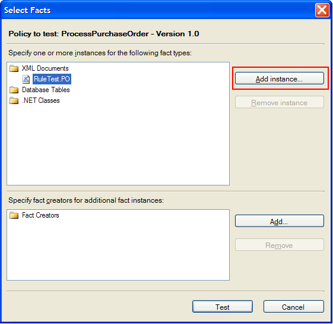

# Walkthrough: Testing the Policy
This walkthrough provides step-by-step procedures for testing the policy you created in the [Walkthrough: Creating a Simple Business Policy](../core/walkthrough-creating-a-simple-business-policy.md) walkthrough.  

## Prerequisites  
 You must complete the [Walkthrough: Creating a Simple Business Policy](../core/walkthrough-creating-a-simple-business-policy.md) walkthrough before you perform this walkthrough.  

## Overview of This Walkthrough  
 This walkthrough contains two procedures, as described in the following table.  

|Procedure title|Procedure description|  
|---------------------|---------------------------|  
|To create the test files|Provides step-by-step instructions for creating two sample XML files, one with the value of the Quantity field as 400 (\<= 500) and the other one with the value of the Quantity field as 700 (> 500).|  
|To test the ProcessPurchaseOrder policy|Provides step-by-step instructions for testing the policy using Business Rule Composer.|  

### To create the test files  

1.  On the **Start** menu, open **Notepad**.  

2.  Copy the following XML to Notepad:  

    ```  
    <ns0:PurchaseOrder xmlns:ns0="http://EAISolution.PurchaseOrder">  
      <Header>  
        <ReqID>ReqID_0</ReqID>  
        <Date>Date_0</Date>  
      </Header>  
      <Item>  
        <Description>Description_0</Description>  
        <Quantity>400</Quantity>  
        <UnitPrice>20</UnitPrice>  
      </Item>  
      <Status>XYZ</Status>  
    </ns0:PurchaseOrder>    
    ```  

3.  On the **File** menu, click **Save TextFile1.txt As**.  

4.  Change the value for **Save As type** from **Text Documents(\*.txt)** to **All Files**.  

5.  Change the directory to **C:\BRE-Walkthroughs**.  

6.  Type **SamplePO.xml** for **File name**, and then click **Save**.  

7.  On the **File** menu, click **New**.  

8.  Copy the following XML to Notepad:  

    ```  
    <ns0:PurchaseOrder xmlns:ns0="http://EAISolution.PurchaseOrder">  
      <Header>  
        <ReqID>ReqID_0</ReqID>  
        <Date>Date_0</Date>  
      </Header>  
      <Item>  
        <Description>Description_0</Description>  
        <Quantity>700</Quantity>  
        <UnitPrice>20</UnitPrice>  
      </Item>  
      <Status>XYZ</Status>  
    </ns0:PurchaseOrder>   
    ```  

9. On the **File** menu, click **Save TextFile1.txt As**.  

10. Change the value for **Save As type** from **Text Documents(\*.txt)** to **All Files**.  

11. Change the directory to **C:\BRE-Walkthroughs**.  

12. Type **SamplePO2.xml** for **File name**, and then click **Save**.  

13. Close Notepad.  

### To test the ProcessPurchaseOrder policy  

1.  On the **Start** menu, open **Business Rule Composer**. If you have Business Rule Composer already open, press F5 to refresh it.  

    > [!NOTE]
    >  On a system that supports User Account Control (UAC), you may need to run the tool with Administrative privileges. To do this, right-click the application, and then select **Run as administrator**.  

2.  In the Policy Explorer window, expand **Policies**, expand **ProcessPurchaseOrder**, right-click **Version 1.0**, and then click **Test Policy**.  

3.  In the **XMLDocuments** node, select **RuleTest.PO**, and then click **Add Instance**.  

       

4.  Select the **SamplePO.xml** file that you created earlier, and then click **Open**.  

5.  Click **Test**.  

6.  Review the output in the Output window. See the "Analysis of the Output from the First Test (samplepo.xml)" section for an explanation of the output you see.  

7.  Open **SamplePO.xml** in Notepad and notice that the value of the **Status** field is set to **Approved**.  

8.  Right-click **Version 1.0**, and then click **Test Policy**.  

9. Select **SamplePO.xml**, click **Remove instance**, and then click **Add Instance**.  

10. Select the **SamplePO2.xml** file that you created earlier, and then click **Open**.  

11. Click **Test**. See the "Analysis of the Output from the Second Test (samplepo2.xml)" section for an explanation of the output you see.  

12. Open the **SamplePO2.xml** file in Notepad and notice that the value of the **Status** field is still **XYZ**.  

## Analysis of the Output from the First Test (samplepo.xml)  

> [!NOTE]
>  The output text is bold and the explanation follows the output text.  

 **RULE ENGINE TRACE for RULESET: ProcessPurchaseOrder 8/31/2006 1:33:10 PM**  

 The rule engine trace for the execution of policy **ProcessPurchaseOrder** started at 8/31/2006 1:33:10 PM.  

 **FACT ACTIVITY 8/31/2006 1:33:10 PM**  

 **Rule Engine Instance Identifier: bc4f1cf5-e9a2-49d0-9cdd-76a2ac057240**  

 **Ruleset Name: ProcessPurchaseOrder**  

 **Operation: Assert**  

 **Object Type: TypedXmlDocument:PurchaseOrder**  

 **Object Instance Identifier: 14626574**  

 When you click **Test**, the following things happen:  

1. The Business Rule Composer creates a **RuleEngine.Policy** object, which in turn creates a new rule engine instance or acquires a rule engine instance from the rule engine cache.  

2. The Business Rule Composer creates a **TypedXmlDocument** object based on the SamplePO.xml file.  

3. The Business Rule Composer invokes the **Policy.Execute** method with the **TypedXmlDocument** object as a parameter.  

4. The **Policy.Execute** method asserts (adds) the **TypedXmlDocument** object as a fact into the working memory of the rule engine.  

5. The rule engine uses the **TypedXmlDocument** object as a fact and executes the **ProcessPurchaseOrder** policy.  

   **FACT ACTIVITY 8/31/2006 1:33:10 PM**  

   **Rule Engine Instance Identifier: bc4f1cf5-e9a2-49d0-9cdd-76a2ac057240**  

   **Ruleset Name: ProcessPurchaseOrder**  

   **Operation: Assert**  

   **Object Type: TypedXmlDocument:PurchaseOrder:/PurchaseOrder**  

   **Object Instance Identifier: 64530307**  

   **FACT ACTIVITY 8/31/2006 1:33:10 PM**  

   **Rule Engine Instance Identifier: bc4f1cf5-e9a2-49d0-9cdd-76a2ac057240**  

   **Ruleset Name: ProcessPurchaseOrder**  

   **Operation: Assert**  

   **Object Type: TypedXmlDocument:PurchaseOrder:/PurchaseOrder/Item**  

   **Object Instance Identifier: 43901854**  

6. The rule engine determines which child **TypedXmlDocument** objects to create based on the XPath selectors defined in the rules. When you build rules in the Business Rule Composer, the XPath selector value defaults to the node above the node selected in the **XML Schemas** tab in Facts Explorer. The XPath field value defaults to the selected node itself, relative to its parent node. However, if the node you selected has children, only an XPath selector binding is created to point to the node that you selected, and no XPath field binding is created.  

7. The following table shows the XPath Selector and XPath Field binding values for the fields used in the **ProcessPurchaseOrder** policy. (The policy has only one rule, ApprovalRule.)  

| Field name |                                                             XPath Selector                                                              |                    XPath Field                     | XPath Selector (simplified form) | XPath Field<br /><br /> (simplified form) |
|------------|-----------------------------------------------------------------------------------------------------------------------------------------|----------------------------------------------------|----------------------------------|-------------------------------------------|
|  Quantity  | /\*[local-name()='PurchaseOrder' and namespace-uri()='http://EAISolution.PurchaseOrder']/\*[local-name()='Item' and namespace-uri()=''] | \*[local-name()='Quantity' and namespace-uri()=''] |       /PurchaseOrder/Item        |                 Quantity                  |
|   Status   |                       /\*[local-name()='PurchaseOrder' and namespace-uri()='<http://EAISolution.PurchaseOrder>']                        |  \*[local-name()='Status' and namespace-uri()='']  |          /PurchaseOrder          |                  Status                   |

<!---Loc Comment: Please, verify strucutre in line 183 and 184--->

#### To view the Xpath Selector and Xpath Field bindings for the Quantity and Status fields  

1. In the Policy Explorer window, expand **Policies**, expand **ProcessPurchaseOrder**, and then expand **Version 1.0**.  

2. Click **ApprovalRule**.  

3. In the IF pane on the right, click **PO:/PurchaseOrder/Item/Quantity**.  

4. Verify that you see the value shown in the preceding table for the **XPath Selector** and **XPath Field** bindings in the Properties window.  

5. Repeat steps 3 and 4 for the **PO:/PurchaseOrder/Status** field.  

   The rule engine creates a child **TypedXmlDocument** object from the original **TypedXmlDocument** you submitted for each XPath selector. Because there are two distinct XPath selectors used in the policy (**/PurchaseOrder/Item** for the **Quantity** field and **/PurchaseOrder** for the **Status** field), the rule engine creates two child **TypedXmlDocument** objects and asserts them into the working memory of the rule engine.  

> [!NOTE]
>  To see the trace output again, click **Version 1.0** in the Policy Explorer window.  

 **CONDITION EVALUATION TEST (MATCH) 8/31/2006 1:33:10 PM**  

 **Rule Engine Instance Identifier: bc4f1cf5-e9a2-49d0-9cdd-76a2ac057240**  

 **Ruleset Name: ProcessPurchaseOrder**  

 **Test Expression: TypedXmlDocument:PurchaseOrder:/PurchaseOrder/Item.Quantity <= 500**  

 **Left Operand Value: 400**  

 **Right Operand Value: 500**  

 **Test Result: True**  

 **AGENDA UPDATE 8/31/2006 1:33:10 PM**  

 **Rule Engine Instance Identifier: bc4f1cf5-e9a2-49d0-9cdd-76a2ac057240**  

 **Ruleset Name: ProcessPurchaseOrder**  

 **Operation: Add**  

 **Rule Name: ApprovalRule**  

 **Conflict Resolution Criteria: 0**  

 The rule engine uses the three-stage Condition Evaluation-Conflict Resolution-Action Execution algorithm to execute policies. In the Condition Evaluation stage, the rule engine evaluates the conditions in all the rules in the policy and adds the rules whose conditions evaluate to `true` to the agenda. In this simple example, the **ProcessPurchaseOrder** policy has only one rule, **ApprovalRule**. Therefore, the rule engine evaluates the condition, **Quantity <= 500**, in the **ApprovalRule** using the value of the **Quantity** field in the submitted XML document, which is **400**. The output above shows you the values of the left operand, right operand, and test result.  

 In the second stage, the Conflict Resolution Criteria stage, the rules whose conditions evaluate to `true` are added to the agenda in order based on their priority. In this scenario, the rule engine adds the **ApprovalRule** to the agenda because the condition for the **ApprovalRule** evaluated to `true`. The Conflict Resolution Criteria shown in the output above is only the priority on the rule (**ApprovalRule**). If you click the **ApprovalRule** node in the Policy Explorer window, you can see the value of the **Priority** property on the rule in the Properties window as **0**, which is the default value of a rule. If you have multiple rules in a policy, and you want to make sure that actions in one rule are executed after actions in another rule, you should set the priority appropriately. The larger the number, the higher the priority.  

 **RULE FIRED 8/31/2006 1:33:10 PM**  

 **Rule Engine Instance Identifier: bc4f1cf5-e9a2-49d0-9cdd-76a2ac057240**  

 **Ruleset Name: ProcessPurchaseOrder**  

 **Rule Name: ApprovalRule**  

 **Conflict Resolution Criteria: 0**  

 In the last stage, the Action Execution stage, the rule engine starts executing the actions in the rule. There is one action in the **ApprovalRule**, which sets the value of the **Status** field in the submitted XML document to **Approved**.  

 **FACT ACTIVITY 8/31/2006 1:33:10 PM**  

 **Rule Engine Instance Identifier: bc4f1cf5-e9a2-49d0-9cdd-76a2ac057240**  

 **Ruleset Name: ProcessPurchaseOrder**  

 **Operation: Retract**  

 **Object Type: TypedXmlDocument:PurchaseOrder**  

 **Object Instance Identifier: 14626574**  

 **FACT ACTIVITY 8/31/2006 1:33:10 PM**  

 **Rule Engine Instance Identifier: bc4f1cf5-e9a2-49d0-9cdd-76a2ac057240**  

 **Ruleset Name: ProcessPurchaseOrder**  

 **Operation: Retract**  

 **Object Type: TypedXmlDocument:PurchaseOrder:/PurchaseOrder/Item**  

 **Object Instance Identifier: 43901854**  

 **FACT ACTIVITY 8/31/2006 1:33:10 PM**  

 **Rule Engine Instance Identifier: bc4f1cf5-e9a2-49d0-9cdd-76a2ac057240**  

 **Ruleset Name: ProcessPurchaseOrder**  

 **Operation: Retract**  

 **Object Type: TypedXmlDocument:PurchaseOrder:/PurchaseOrder**  

 **Object Instance Identifier:** 64530307  

 All the facts submitted (**PurchaseOrder**) to the rule engine and the child facts created by the rule engine based on XPath selectors (**\PurchaseOrder** and **\PurchaseOrder\Item**) are retracted (removed) from the working memory of the rule engine.  

## Analysis of the Output from the Second Test (samplepo2.xml)  
 **CONDITION EVALUATION TEST (MATCH) 9/5/2006 5:24:42 PM**  

 **Rule Engine Instance Identifier: b749d2fd-a883-4c2f-9974-5cf688010622**  

 **Ruleset Name: ProcessPurchaseOrder**  

 **Test Expression: TypedXmlDocument:PurchaseOrder:/PurchaseOrder/Item.Quantity <= 500**  

 **Left Operand Value: 700**  

 **Right Operand Value: 500**  

 **Test Result:** False  

 The rule engine evaluates the condition (**Quantity <= 500**) in the **ApprovalRule** using the lone **Item** object. You can see that left operand value is the value of the **Quantity** element in the XML document, **700**. The test result is `false` because **700 <= 500**, so the rule is not added to the agenda of the rule engine. There is no rule in the agenda. Therefore, there are no actions to execute, and the value of the **Status** field remains **XYZ**.  

## Comments  

-   We recommend that you test the policies before using them from client applications such as BizTalk applications.  

-   When you test a policy that uses database facts with the **DataConnection** binding in the Business Rule Composer, a **DataConnection** object is automatically built for you. However, when you call the same policy from an orchestration by using the **Call Rules** shape, no **DataConnection** object is passed to the policy automatically. You should create a **DataConnection** object in the orchestration and pass it as a parameter or create a fact retriever component that asserts the **DataConnection** object, and configure the policy to use the fact retriever component.  

-   To test a policy that uses a .NET fact, you should create a fact creator component and specify it in the **Select Facts** dialog box. For more information about creating fact creators, see [How to Create a Fact Retriever](../core/how-to-create-a-fact-retriever.md). You can do the same thing when the policy uses database facts (**TypedDataConnection** or **TypedDataTable** or **TypedDataRow**) or XML facts (**TypedXmlDocument**).  

## Next Steps  
 Now that you have completed this walkthrough, perform the [Walkthrough: Invoking the Policy from an Orchestration](../core/walkthrough-invoking-the-policy-from-an-orchestration.md) walkthrough, which gives you step-by-step instructions for invoking the **ProcessPurchaseOrder** policy from an orchestration.  

## See Also  
 [Policy Test Trace Output](../core/policy-test-trace-output.md)   
 [Condition Evaluation and Action Execution](../core/condition-evaluation-and-action-execution.md)   
 [Agenda and Priority](../core/agenda-and-priority.md)
