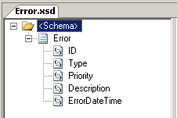
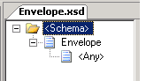

# Walkthrough: Using XML Envelopes (Basic)
This example demonstrates basic XML envelope disassembly by implementing part of a fictitious error-tracking system. The example meets the following requirements:  
  
1.  Error messages are logged at various physical sites within the company and sent to a central location for processing into various back-end systems.  
  
2.  Error messages are written in XML format.  
  
3.  An error message can be sent singly without an envelope or as a batch contained within an envelope.  
  
## Prerequisites  
 For this example you need to be comfortable with creating BizTalk projects, signing an assembly, and using the BizTalk Server Administration console to view applications and ports. You should also be comfortable with the ideas presented in [Walkthrough: Deploying a Basic BizTalk Application](../core/walkthrough-deploying-a-basic-biztalk-application.md).  
  
## What This Example Does  
 The example processes inbound messages containing either a single error message or a batch of error messages by defining an envelope schema and using the XmlDisassembler pipeline.  
  
## Example  
 To create the example, follow the steps outlined in the following sections.  
  
### Create a New BizTalk Project  
 Before building a solution you need to create a BizTalk project, ensure that it is strongly named, and assign it an application name. Assigning an application name prevents BizTalk Server from deploying the solution into the default BizTalk application.  
  
##### To create and configure a new BizTalk project  
  
1. Use [!INCLUDE[btsVStudioNoVersion](../includes/btsvstudionoversion-md.md)] to create a new BizTalk project. Call the project **BasicXMLEnvelope**.  
  
2. Generate a key file and assign it to the project. For more information about this task, see [How to Configure a Strong Name Assembly Key File](../core/how-to-configure-a-strong-name-assembly-key-file.md).  
  
3. In the deployment configuration properties for the project, assign an **Application Name** and set **Restart Host Instances** to `True`. Setting this flag tells the host to clear any cached instances of the assembly.  
  
### Create the Error Schema  
 In this step you create the Error schema. It defines the key message for the system.  
  
##### To create the Error schema  
  
1. Add a new schema named "Error" to the project.  
  
2. Change the target namespace for the schema to **http://BasicXMLEnvelope**.  
  
3. Change the schema property **Element FormDefault** under the **Advanced** category to **Qualified**. This indicates that locally declared elements must be qualified by the target namespace in an instance document.  
  
4. Rename the root node "Error" and create five child elements with the types indicated:  
  
   - ID, xs:int  
  
   - Type, xs:int  
  
   - Priority, xs:string  
  
   - Description, xs:string  
  
   - ErrorDateTime, xs:string  
  
     Your schema should look like the following:  
  
       
  
5. Create a sample message for this schema. This is used to verify that single messages outside of an envelope are processed properly. An example sample message is:  
  
   ```  
   <Error xmlns="http://BasicXMLEnvelope">  
     <ID>1</ID>  
     <Type>5</Type>  
     <Priority>Low</Priority>  
     <Description>Sprocket widget prints reports slowly.</Description>  
     <ErrorDateTime>1999-05-31T13:20:00.000-05:00</ErrorDateTime>  
   </Error>  
   ```  
  
    Save this message in a file in the project directory.  
  
### Create the Envelope Schema  
 The envelope contains one or more error messages. In this basic example, the envelope does not have properties and elements of its own.  
  
##### To create the envelope schema  
  
1.  Add a new schema named "Envelope" to the BasicXMLEnvelope project.  
  
2.  Change the target namespace to **http://BasicXMLEnvelope**.  
  
3.  Change the name of the root node from "Root" to "Envelope".  
  
4.  Now mark the schema as an envelope schema. Click the **\<Schema\>** node. In the Properties pane, set the schema reference property **Envelope** to `OK`.  
  
5.  Set the **Body XPath** property. To do this, click the **Envelope** node. In the Properties window, click the ellipsis (**...**) button in the **Body XPath** property, select **Envelope**, and then click **OK**.  
  
6.  Add an Any element child to the Envelope node. The error message will be contained in this element. Your schema should look like the following:  
  
       
  
7.  Create a sample message containing an envelope and one or more sample messages. An example message is:  
  
    ```  
    <Envelope xmlns="http://BasicXMLEnvelope">  
      <Error>  
        <ID>102</ID>  
        <Type>0</Type>  
        <Priority>High</Priority>  
        <Description>Sprocket query fails.</Description>  
        <ErrorDateTime>1999-05-31T13:20:00.000-05:00</ErrorDateTime>  
      </Error>  
      <Error>  
        <ID>16502</ID>  
        <Type>2</Type>  
        <Priority>Low</Priority>  
        <Description>Time threshold exceeded.</Description>  
        <ErrorDateTime>1999-05-31T13:20:00.000-05:00</ErrorDateTime>  
      </Error>  
    </Envelope>  
    ```  
  
     Save this message in a file in the project directory.  
  
### Deploy and Configure the Send and Receive Ports  
 With the schemas created, you need to compile and deploy the project. After it is deployed, you can use the BizTalk Server Administration console to configure the send and receive ports.  
  
##### To deploy BasicXMLEnvelope  
  
1. From [!INCLUDE[btsVStudioNoVersion](../includes/btsvstudionoversion-md.md)], choose **Deploy BasicXMLEnvelope** from the Build menu. This will build and deploy it to BizTalk Server as the application "BasicXMLEnvelope".  
  
2. In the BizTalk Server Administration console, expand the **Applications** group to verify that **BasicXMLEnvelope** is present as a custom application.  
  
##### To configure the receive port  
  
1.  Use Windows Explorer to create a directory named "Receive" under the **BasicXMLEnvelope** project directory.  
  
2.  In the BizTalk Server Administration console, expand the **BasicXMLEnvelope** application, right-click **Receive Ports**, point to **New**, and then click **One-way Receive Port**.  
  
3.  In the **Receive Port Properties** dialog box, set the name of the port to "Receive".  
  
4.  Right-click Receive Locations, and then click **New** to add a receive port. Name the new port "ReceiveError". Set the **Receive Pipeline** to **XMLReceive**. For **Transport Type**, select **FILE**, and then click **Configure**.  
  
5.  Select the receive directory created above and click **OK**. Your receive port should now be configured. Click **OK** to close.  
  
##### To configure the send port  
  
1.  Use Windows Explorer to create a directory named "Send" under the **BasicXMLEnvelope** project directory.  
  
2.  In the BizTalk Server Administration console, expand the **BasicXMLEnvelope** application, right-click **Send Ports**, point to **New**, and then click **Static One-Way**.  
  
3.  In the **Send Port Properties** dialog box, set the name of the port to "Send".  
  
4.  For **Transport Type**, select **FILE**, and then click **Configure**. Set the destination folder to the send directory you created earlier and click **OK**.  
  
5.  Click **Filters** and add a single filter:  
  
    -   BTS.MessageType == **http://BasicXMLEnvelope#Error**  
  
6.  Click **OK** to complete the send port configuration. Your send port should be configured.  
  
### Run the Example  
 It is now time to run the example. After using the BizTalk Server Management console to start the BasicXMLEnvelope application, you will copy the test files to the receive location and observe what is produced in the send location.  
  
##### To run the BasicXMLEnvelope example  
  
1.  In the BizTalk Server Administration console, right-click the **BasicXMLEnvelope** application and then click **Start**. This will enlist and start the send and receive ports.  
  
2.  Drop each of the sample files into the receive directory. If you use the samples given earlier, you should find three individual error messages in the send location when processing is completed.  
  
## Extending the Example  
 You can extend the example to accommodate other requirements. This section addresses two common scenarios:  
  
- If a batch of errors is submitted within an envelope, individual message failures in disassembly should not prohibit other nonfailing messages from being further processed.  
  
- Errors should be delivered to different locations based on error priority. High-priority messages are expedited while other priorities are handled through normal channels.  
  
  The following sections extend the example to handle these requirements.  
  
### Recoverable Interchange Processing  
 [!INCLUDE[btsBizTalkServerNoVersion](../includes/btsbiztalkservernoversion-md.md)] supports recoverable interchange processing. By using this feature, you can ensure that batches of messages fail individually in disassembly and not as a batch.  
  
##### To configure the example for recoverable interchange processing  
  
1.  In the BizTalk Server Administration console, expand the **BasicXMLEnvelope** application, click **Receive Ports**, and then double-click the Receive port. This is the port you created previously.  
  
2.  In the **Receive Port Properties** dialog box, click **Receive Locations**. Click **Properties** to bring up the **ReceiveError Receive Location Properties** dialog box. Click the ellipsis (**...**) button for the **Receive Pipeline**.  
  
3.  In the **Configure Pipeline - XMLReceive** dialog box, set the **Recoverable Interchange Processing** property to `True`, and then click **OK**.  
  
4.  Click **OK** to close the **Receive Location Properties** dialog box, and then click **OK** to close the **Receive Port Properties** dialog box.  
  
##### To create a sample file and run the example  
  
1.  To create a sample file, make a copy of the envelope sample file created in the example, add a nonexistent namespace to one of the Error instances, and then save the file:  
  
    ```  
    <Envelope xmlns="http://BasicXMLEnvelope">  
      <Error>  
        <ID>102</ID>  
        <Type>0</Type>  
        <Priority>High</Priority>  
        <Description>Sprocket query fails to return any sprockets even though some exist</Description>  
        <ErrorDateTime>1999-05-31T13:20:00.000-05:00</ErrorDateTime>  
      </Error>  
      <Error xmlns="http://ThisIsAnError">  
        <ID>16502</ID>  
        <Type>2</Type>  
        <Priority>Low</Priority>  
        <Description>Time threshold exceeded.</Description>  
        <ErrorDateTime>1999-05-31T13:20:00.000-05:00</ErrorDateTime>  
      </Error>  
    </Envelope>  
    ```  
  
2.  In the BizTalk Server Administration console, click **Applications** and verify that the **BasicXMLEnvelope** application is running.  
  
3.  Drop the message in the receive location. After processing, you should find the first message in the send location and the second, low-priority, message in the Suspended queue.  
  
### Content-Based Routing (CBR)  
 You can use content-based routing to route messages based on their content. In this scenario, routing is based on priority, with High messages going to one send location and Low and Medium messages going to a different send location.  
  
 To extend the sample, you must complete the following tasks:  
  
1.  Promote the **Priority** field in the Error schema in the BasicXMLEnvelope project. Content-based routing relies on promoted properties to route messages. For more information, see [Promoting Properties](../core/promoting-properties.md).  
  
2.  Create and configure two additional send ports. The ports use a filter to ensure they receive appropriate messages.  
  
##### To promote the Priority field in the Error schema  
  
1. With the **BasicXMLEnvelope** project open in [!INCLUDE[btsVStudioNoVersion](../includes/btsvstudionoversion-md.md)], open the **Error** schema and expand the **Error** node.  
  
2. Right-click the **Priority** element, point to **Promote**, and then click **Quick Promote**.  
  
3. Click **OK** to confirm the addition of a new property schema for the promoted properties.  
  
4. In [!INCLUDE[btsVStudioNoVersion](../includes/btsvstudionoversion-md.md)], in Solution Explorer, open the new property schema PropertySchema.xsd. Remove "Field1" from the schema.  
  
5. Now recompile and redeploy the solution. On the Build menu, choose Deploy BasicXMLEnvelope.  
  
6. The project was configured to reset the host instance when the solution is redeployed. If you have changed this, you need to stop and start the host.  
  
##### To configure the low and medium-priority send port  
  
1.  Use Windows Explorer to create a directory named "SendLowMediumPriority" under the **BasicXMLEnvelope** project directory.  
  
2.  In the BizTalk Server Administration console, expand the **BasicXMLEnvelope** application, right-click **Send Ports**, point to **New**, and then click **Static One-Way**.  
  
3.  In the **Send Port Properties** dialog box, set the name of the port to "SendLowMediumPriority".  
  
4.  For **Transport Type**, select **FILE**, and then click **Configure**. Set the destination folder to the directory you created earlier. Click **OK** to close.  
  
5.  Click **Filters** and add three filter expressions:  
  
    -   BTS.MessageType == http://BasicXMLEnvelope#Error And  
  
    -   BasicXMLEnvelope.PropertySchema.Priority == Low Or  
  
    -   BasicXMLEnvelope.PropertySchema.Priority == Medium  
  
6.  Click **OK** to complete the low and medium-priority send port configuration.  
  
##### To configure the high-priority send port  
  
1.  Use Windows Explorer to create a directory named "SendHighPriority" under the **BasicXMLEnvelope** project directory.  
  
2.  In the BizTalk Server Administration console, expand the **BasicXMLEnvelope** application, right-click **Send Ports**, point to **New**, and then click **Static One-Way**.  
  
3.  In the **Send Port Properties** dialog box, set the name of the port to "SendHighPriority".  
  
4.  For **Transport Type**, select **FILE**, and then click **Configure**. Set the destination folder to the directory you created earlier. Click **OK** to close.  
  
5.  Click **Filters** and add two filter expressions:  
  
    -   BTS.MessageType == http://BasicXMLEnvelope#Error And  
  
    -   BasicXMLEnvelope.PropertySchema.Priority == High  
  
6.  Click **OK** to complete the high-priority send port configuration.  
  
##### To test the routing solution  
  
1.  In the BizTalk Server Administration console, expand the **Applications** group, right-click the **BasicXMLEnvelope** application, and then click **Start**. When prompted to confirm, click **Start**. This enlists the new send ports.  
  
2.  Drop the test message into the receive location. Notice how error messages are routed to the different send locations:  
  
    -   Error messages that have a Low, Medium, or High priority and do not fail message processing are routed both to the original send location (configured in the core example) and the send location by priority. For messages with a Low or Medium priority, a copy appears in both the original send location and the Low/Medium send location.  
  
    -   If recoverable interchange processing is enabled, the failed error message is not routed and the nonfailed message is properly routed as expected. The failed message is not routed because its message type does not match the type used in the configured filters.  
  
## See Also  
 [Recoverable Interchange Processing](../core/recoverable-interchange-processing.md)   
 [Promoting Properties](../core/promoting-properties.md)   
 [CBRSample (BizTalk Server Sample)](../core/cbrsample-biztalk-server-sample.md)