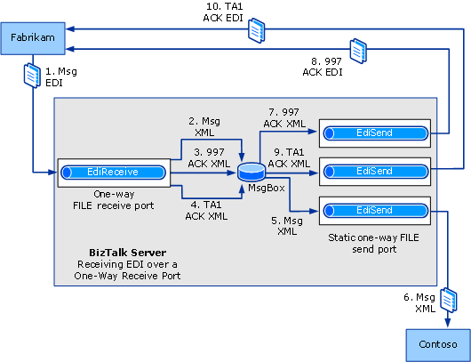

# Walkthrough (X12): Receiving EDI Interchanges and Sending Back an Acknowledgement
This walkthrough provides a set of step-by-step procedures that creates a solution for receiving EDI interchanges using [!INCLUDE[btsBizTalkServerNoVersion](../includes/btsbiztalkservernoversion-md.md)]. In this solution, an EDI interchange is sent from a trading partner, Fabrikam, to another trading partner, Contoso.  

## Prerequisites  
 You must be logged on as a member of the [!INCLUDE[btsBizTalkServerNoVersion](../includes/btsbiztalkservernoversion-md.md)] Administrators or [!INCLUDE[btsBizTalkServerNoVersion](../includes/btsbiztalkservernoversion-md.md)] B2B Operators group.  

## How the Solution Receives EDI Interchanges  
 The solution will do the following:  

> [!NOTE]
>  The events in this list may not occur in the order shown.  

1.  Receive a flat-file EDI interchange from the trading partner Fabrikam.  

2.  Validate the EDI interchange against its schema, disassemble the message into XML, and drop the message XML into the MessageBox.  

3.  Generate a 997 acknowledgment to the received EDI interchange, and drop it in the MessageBox.  

4.  Generate a TA1 acknowledgment to the received EDI interchange, and drop it in the MessageBox.  

5.  Pick up the message XML by a one-way send port, and assemble the message EDI interchange.  

6.  Send the EDI interchange to Contoso.  

7.  Pick up the 997 XML by a one-way send port, and assemble the 997 EDI interchange.  

8.  Send the 997 interchange to Fabrikam.  

9. Pick up the TA1 XML by a one-way send port, and assemble the TA1 EDI interchange.  

10. Send the TA1 interchange to Fabrikam.  

## The Functionality in this Solution  
 For the purposes of this walkthrough, the following functionality will be enabled:  

- The solution is designed for interchanges using X12 encoding, not EDIFACT encoding.  

  > [!NOTE]
  >  The configuration used for HIPAA closely parallel to that used for X12 encoding. For instructions on how to create a similar solution for EDIFACT, see [Walkthrough (EDIFACT): Receiving EDI Interchanges and Sending Back an Acknowledgement](../core/walkthrough-edifact--receive-edi-interchanges-and-send-an-acknowledgement.md).  

- EDI type and extended validation will be performed on the incoming interchange.  

- Technical and functional acknowledgments will be generated for returning to the sender of the interchange.  

- The solution uses a one-way receive location with a FILE transport type.  

  > [!NOTE]
  >  You can use a two-way solicit response receive port and location to receive the message, but if you do so, you will not be able to use a FILE transport type for the receive location. For more information, see [Configuring a Port to Receive EDI Messages and Acknowledgments](../core/configuring-a-port-to-receive-edi-messages-and-acknowledgments.md).  

- EDI reporting will be enabled, and transaction sets will be saved for viewing from the interchange status report.  

- For testing purposes, the solution uses three send ports to send the EDI interchange and the ACKs created to local folders.  

  The following figure shows the architecture for this solution:  

    

## Configuring and Testing the Walkthrough  
 The procedures required for this solution include the following:  

- Add the required message schema(s) to a BizTalk project, and then build and deploy the project, making the schema(s) available for use by [!INCLUDE[btsBizTalkServerNoVersion](../includes/btsbiztalkservernoversion-md.md)] in processing the received interchange.  

- Create a one-way receive port for [!INCLUDE[btsBizTalkServerNoVersion](../includes/btsbiztalkservernoversion-md.md)] to receive the EDI interchange from the trading partner and generate an acknowledgment. This receive location is tied to the file folder where Fabrikam drops the EDI interchange to be sent to Contoso.  

  > [!NOTE]
  >  You can use a two-way solicit response receive port and location to receive the message, but if you do, you will not be able to use a FILE transport type for the receive location.  

- Create one send port that sends the EDI interchange to a local Contoso folder, another that sends the 997 ACK to a local Fabrikam folder, and another that sends the TA1 ACK to a local Fabrikam folder.  

- Create a party (trading partner) for both Fabrikam and Contoso.  

- Create a business profile each for both the trading partners.  

- Create an agreement between the two profiles by configuring the EDI properties for the message to be received and the acknowledgment to be sent.  

- Test the walkthrough using a test EDI interchange.  

  > [!NOTE]
  >  For a test message, you can use the SamplePO.txt file that is used in the EDI Interface Developer tutorial. That file is shipped in the [!INCLUDE[btsBiztalkServerPath](../includes/btsbiztalkserverpath-md.md)]SDK\EDI Interface Developer Tutorial\ folder. This is an X12 850 message.  

### Configuring the Walkthrough  
 This section describes the procedures to configure the walkthrough.  

##### To deploy the message schema  

1. In [!INCLUDE[btsVStudioNoVersion](../includes/btsvstudionoversion-md.md)], create or open a BizTalk project.  

   > [!NOTE]
   >  This topic assumes that you have already added a reference from your application to the BizTalk EDI Application, which contains EDI schemas, pipelines, and orchestrations. If not, see [How to Add a Reference to the BizTalk Server EDI Application](http://msdn.microsoft.com/library/7af066fb-372f-4709-b566-c8d6b4a9d782).  

2. Right-click your project, point to **Add**, and then click **Existing Item**. Move to the folder that your schema is in [!INCLUDE[btsBiztalkServerPath](../includes/btsbiztalkserverpath-md.md)]XSD_Schema\EDI, and then double-click your schema.  

   > [!NOTE]
   >  If the EDI schemas have not been unzipped into the \XSD_Schema\EDI folders, execute the **MicrosoftEdiXSDTemplates.exe** file in the \XSD_Schema\EDI folder to unzip the schemas into the default folder.  
   > 
   > [!NOTE]
   >  If you use the SamplePO.txt file that is used in the EDI Interface Developer tutorial, you must use the X12_00401_850.xsd schema that is shipped in the [!INCLUDE[btsBiztalkServerPath](../includes/btsbiztalkserverpath-md.md)]SDK\EDI Interface Developer Tutorial\Inbound_EDI folder. You must not use the X12 850 schema in the [!INCLUDE[btsBiztalkServerPath](../includes/btsbiztalkserverpath-md.md)]XSD_Schema folder.  

3. Add the assembly key file to the project, and then build and deploy the assembly.  

##### To create a one-way receive port (for Fabrikam) to receive the EDI interchange  

1. In Windows Explorer, create a local folder to receive the interchange.  

2. In [!INCLUDE[btsBizTalkServerNoVersion](../includes/btsbiztalkservernoversion-md.md)] Administration Console, right-click the **Receive Ports** node under the **BizTalk Application 1** node, point to **New**, and then click **One-way Receive Port**.  

3. Name the receive port, and then click **Receive Locations** in the console tree.  

4. Click **New**.  

5. Name the receive location, select **FILE** for **Type**, and then click **Configure**.  

6. Browse to a folder for **Receive folder** text box. You created this folder in step 1 of this procedure. Enter a file mask, such as **\*.edi** or **\*.txt**.  

7. Click **OK**.  

8. For **Receive pipeline**, select **EdiReceive**.  

9. Click **OK** in the **Receive Location Properties** dialog box. Click **OK** again in the **Receive Port Properties** dialog box.  

10. In the console tree, click **Receive Locations**. In the **Receive Locations** pane, right-click your receive location, and then click **Enable**.  

##### To create a static one-way send port (for Contoso) to send the EDI interchange  

1. In Windows Explorer, create a local folder to send the test interchange to.  

2. In [!INCLUDE[btsBizTalkServerNoVersion](../includes/btsbiztalkservernoversion-md.md)] Administration Console, right-click the **Send Ports** node under the **BizTalk Application 1** node, point to **New**, and then click **Static One-way Send Port**.  

3. In the **Send Port Properties** dialog box, name the send port.  

4. In the **Transport** section, select **FILE** for **Type**, and then click **Configure**.  

5. For **Destination folder**, browse to the folder to receive the interchange. You created this folder in step 1 of this procedure. For **File mask**, enter the interchange format, such as **\*.edi** or **\*.xml**.  

6. Click **OK**.  

7. In **Send pipeline**, select **EdiSend**.  

8. In the console tree, select **Filters**. Enter a filter to subscribe to the EDI interchange. For example, for **Property**, enter **BTS.MessageType**; for **Operator**, enter **==**; and for **Value** enter the schema for the interchange, for example, http://schemas.microsoft.com/BizTalk/Edi/X12/2006#X12_00401_850.  

   > [!NOTE]
   >  The above filter setting ensures that interchanges, not acknowledgments, will be sent to the folder associated with this send port.  

9. Click **OK**.  

10. In the console tree, click **Send Ports**. In the **Send Ports** pane, right-click your send port, and then click **Start**.  

##### To create a static one-way send port to send the 997n acknowledgment  

1. In Windows Explorer, create a local folder to send the 997 acknowledgment to.  

2. In [!INCLUDE[btsBizTalkServerNoVersion](../includes/btsbiztalkservernoversion-md.md)] Administration Console, right-click the **Send Ports** node under the **BizTalk Application 1** node, point to **New**, and then click **Static One-way Send Port**.  

3. In the **Send Port Properties** dialog box, name the send port.  

4. In the **Transport** section, select **FILE** for **Type**, and then click **Configure**.  

5. For **Destination folder**, browse to a folder to receive the 997 acknowledgment. You created this folder in step 1 of this procedure. For **File mask**, enter the interchange format, such as **\*.edi** or **\*.txt**.  

6. Click **OK**.  

7. In **Send pipeline**, select **EdiSend**.  

8. In the console tree, select **Filters**. Enter a filter to subscribe to the 997 acknowledgment. For example, for **Property**, enter **BTS.MessageType**; for **Operator**, enter **==**; and for **Value** enter the schema for the acknowledgment, for example, `http://schemas.microsoft.com/Edi/X12#X12_997_Root`.  

9. Click **OK**.  

10. In the console tree, click **Send Ports**. In the **Send Ports** pane, right-click your send port, and then click **Start**.  

##### To create a static one-way send port to send the TA1 acknowledgment  

1. In Windows Explorer, create a local folder to send the TA1 acknowledgment to.  

2. In [!INCLUDE[btsBizTalkServerNoVersion](../includes/btsbiztalkservernoversion-md.md)] Administration Console, right-click the **Send Ports** node under the **BizTalk Application 1** node, point to **New**, and then click **Static One-way Send Port**.  

3. In the **Send Port Properties** dialog box, name the send port.  

4. In the **Transport** section, select **FILE** for **Type**, and then click **Configure**.  

5. For **Destination folder**, browse to a folder to receive the TA1 acknowledgment. You created this folder in step 1 of this procedure. For **File mask**, enter the interchange format, such as **\*.edi** or **\*.txt**.  

6. Click **OK**.  

7. In **Send pipeline**, select **EdiSend**.  

8. In the console tree, select **Filters**. Enter a filter to subscribe to the TA1 acknowledgment. For example, for **Property**, enter **BTS.MessageType**; for **Operator**, enter **==**; and for **Value** enter the schema for the acknowledgment, for example, http://schemas.microsoft.com/Edi/X12#X12_TA1_Root.  

9. Click **OK**.  

10. In the console tree, click **Send Ports**. In the **Send Ports** pane, right-click your send port, and then click **Start**.  

##### To create a party and a business profile for Fabrikam  

1. Right-click the **Parties** node in the [!INCLUDE[btsBizTalkServerNoVersion](../includes/btsbiztalkservernoversion-md.md)] Administration Console, point to **New**, and then click **Party**.  

2. Enter a name for the party in the **Name** text box, and then click **OK**.  

   > [!NOTE]
   >  By selecting the **Local BizTalk processes messages received by the Party OR supports sending messages from this party** check box, you can specify that the party being created is for the same organization that is also hosting [!INCLUDE[btsBizTalkServerNoVersion](../includes/btsbiztalkservernoversion-md.md)]. Based on that, some properties will be enabled or disabled when you create an agreement. However, for this walkthrough, you can leave this check box selected.  

3. Right-click the party name, point to **New**, and then click **Business Profile**.  

4. In the **Profile Properties** dialog box, on the **General** page, enter **Fabrikam_Profile** in the **Name** text box.  

   > [!NOTE]
   >  When you create a party, a profile is also created. You can rename and use that profile instead of creating a new one. To rename a profile, right-click the profile and select **Properties**. In the **General** page, specify a name for the profile.  

##### To create a party and a business profile for Contoso  

1. Right-click the **Parties** node in the [!INCLUDE[btsBizTalkServerNoVersion](../includes/btsbiztalkservernoversion-md.md)] Administration Console, point to **New**, and then click **Party**.  

2. Enter a name for the party in the **Name** text box, and then click **OK**.  

   > [!NOTE]
   >  By selecting the **Local BizTalk processes messages received by the Party OR supports sending messages from this party** check box, you can specify that the party being created is for the same organization that is also hosting [!INCLUDE[btsBizTalkServerNoVersion](../includes/btsbiztalkservernoversion-md.md)]. Based on that, some properties will be enabled or disabled when you create an agreement. However, for this walkthrough, you can leave this check box selected.  

3. Right-click the party name, point to **New**, and then click **Business Profile**.  

4. In the **Profile Properties** dialog box, on the **General** page, enter **Contoso_Profile** in the **Name** text box.  

   > [!NOTE]
   >  When you create a party, a profile is also created. You can rename and use that profile instead of creating a new one. To rename a profile, right-click the profile and select **Properties**. In the **General** page, specify a name for the profile.  

##### To create an agreement between the two business profiles  

1. Right-click **Fabrikam_Profile**, point to **New**, and then click **Agreement**.  

2. In the **General Properties** page, for the **Name** text box, enter a name for the agreement.  

3. From the **Protocol** drop-down list, select **X12**.  

4. In the **Second Partner** section, from the **Name** drop-down list, select **Contoso**.  

5. In the **Second Partner** section, from the **Profile** drop-down list, select **Contoso_Profile**.  

    You will notice that two new tabs get added next to the **General** tab. Each tab is for configuring a one-way agreement and each one-way agreement represents one complete transaction of message (including message transfer and acknowledgement transfer).  

6. In the **General** tab, on the **General Properties** page, in the **Common Host Settings** section, select **Turn ON reporting**, and then select **Store message payload for reporting**.  

7. Perform the following tasks on the **Fabrikam->Contoso** tab.  

   1. On the **Identifiers** page under the **Interchange Settings** section, enter values for the qualifier and identifier fields (**ISA5**, **ISA6**, **ISA7**, and **ISA8**) that correspond to the values for those header fields in your test message.  

      > [!NOTE]
      >  [!INCLUDE[btsBizTalkServerNoVersion](../includes/btsbiztalkservernoversion-md.md)] requires the qualifier and identifier fields for sender and receiver in order to perform agreement resolution. It will match the values of **ISA5**, **ISA6**, **ISA7**, and **ISA8** in the interchange header with those in the properties of an agreement. [!INCLUDE[btsBizTalkServerNoVersion](../includes/btsbiztalkservernoversion-md.md)] will also resolve the agreement by matching the sender qualifier and identifier (without the receiver qualifier and identifier). If [!INCLUDE[btsBizTalkServerNoVersion](../includes/btsbiztalkservernoversion-md.md)] cannot resolve the agreement, it will use the fallback agreement properties.  
      > 
      > [!NOTE]
      >  If you are using the SamplePO.txt file from the “EDI Interface Developer Tutorial” as your test message, set **ISA5** to **ZZ**, **ISA6** to **THEM**, **ISA7** to **ZZ**, and **ISA8** to **US**.  

   2. On the **Acknowledgement** page under the **Interchange Settings** section, check **TA1 Expected** and **997 Expected**.  

   3. On the **Validation** page under the **Interchange Settings** section, make sure **Check for duplicate ISA13** option is unchecked.  

      > [!NOTE]
      >  Clearing the **Check for duplicate ISA13** property enables you to receive multiple instances of the same message.  

   4. On the **Charset and Separators** page under the **Interchange Settings** section, select the **CR LF** option.  

   5. On the **Local Host Settings** page under the **Interchange Settings** section, clear the **Route ACK to send pipeline on request-response receive port** option.  

      > [!NOTE]
      >  If you were using a two-way receive port to receive the interchange and return the acknowledgment, you would check **Route ACK to send pipeline on request-response receive port**.  

   6. On the **Send Ports** page under the **Interchange Settings** section, associate the send ports that will be receiving the interchange from Fabrikam and the send ports that will be receiving the acknowledgements from Contoso. In the **Send ports** grid, under the **Name** column, click an empty cell, and from the drop-down list, select the send port created for receiving the EDI interchange from Fabrikam. Repeat the step for the send port created for receiving the TA1 acknowledgement and the send port created for receiving the 997 acknowledgement.  

   7. On the **Validation** page under the **Transaction Set Settings** section, leave **EDI Type Validation** checked and check **Extended validation**.  

   8. If you are using one of the standard schemas shipped with [!INCLUDE[btsBizTalkServerNoVersion](../includes/btsbiztalkservernoversion-md.md)], on the **Local Host Settings** page under the **Transaction Set Settings** section, select the namespace for the schema to be used to process the incoming interchange. If using a custom schema, enter values in the **Customize Target namespace** grid, so that [!INCLUDE[btsBizTalkServerNoVersion](../includes/btsbiztalkservernoversion-md.md)] can determine the namespace using group and transaction set header values.  

   9. On the **Envelopes** page under the **Transaction Set Settings** section, enter values for all columns in the first line of the grid.  

      |       Use this       |                                                                                                                                    To do this                                                                                                                                    |
      |----------------------|----------------------------------------------------------------------------------------------------------------------------------------------------------------------------------------------------------------------------------------------------------------------------------|
      |     **Default**      |   Select **Default**. **Note:**  When you select this row as the default, the values for **GS1**, **GS2**, **GS3**, **GS7**, and **GS8** are used even if the values for **Transaction Type**, **Version/Release**, and  **Target namespace** are not a match for the message.   |
      | **Transaction Type** |                                                                                                     Select the message type of your test message, **850 - Purchase Order**.                                                                                                      |
      | **Version/Release**  |                                                                                                                        Enter the EDI version, **00401**.                                                                                                                         |
      | **Target namespace** |                                                                                                                Select **<http://schemas.microsoft.com/Edi/X12>**.                                                                                                                |
      |       **GS1**        |                                                                                           Verify that the message type of the test message is selected, **PO - Purchase Order (850)**.                                                                                           |
      |       **GS2**        |                                                                                                                    Enter a value for the Application sender.                                                                                                                     |
      |       **GS3**        |                                                                                                                   Enter a value for the Application receiver.                                                                                                                    |
      |       **GS4**        | Select the date format that you want. **Note:**  You have to select the value in the drop-down list, not just click in the field to display the default. If you click in the field without selecting the value from the drop-down list, the value will not actually be selected. |
      |       **GS5**        |                                                                                                                      Select the time format that you want.                                                                                                                       |
      |       **GS7**        |                                                                                                                Select **X - Accredited Standards Committee X12**.                                                                                                                |
      |       **GS8**        |                                                                                                             Verify that the EDI version has been entered, **00401**.                                                                                                             |

      > [!NOTE]
      >  [!INCLUDE[btsBizTalkServerNoVersion](../includes/btsbiztalkservernoversion-md.md)] will set the values for GS01, GS02, GS03, GS04, GS05, GS07, and GS08 of the outbound acknowledgments based on the values entered for **Transaction Type**, **Version/Release**, and **Target namespace**. The send pipeline attempts to match the transaction set type, the X12 version, and the target namespace with the corresponding values in the header of the message. If successful, it uses the GS values associated with the **Transaction Type**, **Version/Release**, and **Target namespace** values.  

8. Perform the following tasks on the **Contoso->Fabrikam** tab.  

   > [!NOTE]
   >  In this walkthrough, we specify the required value in the tab so that an agreement can be successfully created. To successfully create an agreement, both one-way agreement tabs must have values defined for **ISA5**, **ISA6**, **ISA7**, and **ISA8**.  

   > [!NOTE]
   >  Even though the acknowledgement is part of the same message transaction, the properties related to how the acknowledgement should be generated are configured in the **Contoso->Fabrikam** tab. This is required because the acknowledgement context properties for the sender and receiver qualifiers are set to the opposite of the values you specified in the **Contoso->Fabrikam** tab. For example, if sender and receiver identifiers are set to THEM and US in the **Fabrikam->Contoso** tab, the sender and receiver context properties will be set to US and THEM in the acknowledgement. Typically, the other one-way agreement tab would also have the sender and receiver identifiers set to US and THEM respectively. Hence, the acknowledgement message would resolve to that agreement and the properties setting will be picked. So, if you want to have the acknowledgement to use different element separators or if you want to have the acknowledgement to use CR LF, specify the properties in the **Contoso->Fabrikam** tab.  
   >   
   >  Conceptually, the properties for the acknowledgement will be picked from any one-way agreement tab that has the same sender and receiver qualifiers as set in the acknowledgement’s context properties. However, for ease of practical use, you would typically set this in the other one-way agreement tab of the agreement that you created to which the interchange would have resolved.  

   1.  On the **Identifiers** page under the **Interchange Settings** section, enter values for the qualifier and identifier fields (**ISA5**, **ISA6**, **ISA7**, and **ISA8**) that correspond to the values for those header fields in your test message.  

       > [!NOTE]
       >  If you are using the SamplePO.txt file from the “EDI Interface Developer Tutorial” as your test message, set **ISA5** to **ZZ**, **ISA6** to **US**, **ISA7** to **ZZ**, and **ISA8** to **THEM**.  

9. Click **Apply**.  

10. Click **OK**. The newly added agreement is listed in the **Agreements** section of the **Parties and Business Profiles** pane. The newly added agreement is enabled by default.  

### Testing the Walkthrough  
 This section provides information on how to test the walkthrough.  

##### To test the walkthrough  

1. In Windows Explorer, drop the test EDI interchange into your local receive folder.  

   > [!NOTE]
   >  For a test message, you can use the SamplePO.txt file that is used in the EDI Interface Developer tutorial. That file is shipped in the [!INCLUDE[btsBiztalkServerPath](../includes/btsbiztalkserverpath-md.md)]SDK\EDI Interface Developer Tutorial folder. This is an X12 850 message. If you use this message, you must have deployed the X12_00401_850.xsd schema that is shipped in the [!INCLUDE[btsBiztalkServerPath](../includes/btsbiztalkserverpath-md.md)]SDK\EDI Interface Developer Tutorial\Inbound_EDI folder. You must not use the X12 850 schema in the [!INCLUDE[btsBiztalkServerPath](../includes/btsbiztalkserverpath-md.md)]XSD_Schema folder.  

2. Open the folder that you associated with the send port for interchanges, and verify that it contains the EDI interchange.  

3. Open the folder that you associated with the send port for the 997 acknowledgment, and verify that it contains a 997 acknowledgment.  

4. Open the folder that you associated with the send port for the TA1 acknowledgment, and verify that it contains a TA1 acknowledgment.  

## See Also  
 [Developing and Configuring BizTalk Server EDI Solutions](../core/developing-and-configuring-biztalk-server-edi-solutions.md)