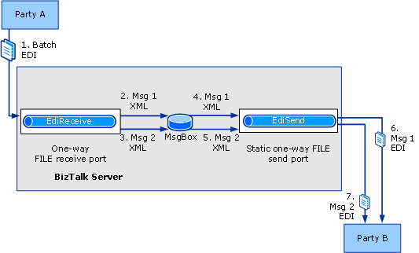

# Walkthrough (X12): Receiving Batched EDI Interchanges
This walkthrough provides a set of step-by-step procedures that creates a solution for receiving EDI batches using [!INCLUDE[btsBizTalkServerNoVersion](../includes/btsbiztalkservernoversion-md.md)]. This solution demonstrates two ways to receive a batched EDI interchange:  

- By splitting the batch into its constituent transaction sets.  

- By preserving the interchange by processing the interchange as one document without splitting the transaction sets.  

  This walkthrough demonstrates how to configure both splitting and preserving batches.  

## Prerequisites  
 You must be logged on as a member of the [!INCLUDE[btsBizTalkServerNoVersion](../includes/btsbiztalkservernoversion-md.md)] Administrators or [!INCLUDE[btsBizTalkServerNoVersion](../includes/btsbiztalkservernoversion-md.md)] B2B Operators group.  

## How the Solution Splits Received EDI Batches  
 When you configure the solution to split the batched interchange into its constituent transaction sets, the solution will do the following:  

1. The receive location receives a batched EDI interchange containing multiple transaction sets from a party.  

   > [!NOTE]
   >  The events in this list may not occur in the order shown.  

2. The receive pipeline splits the received interchange into its constituent transaction sets, converting the transaction sets into internal XML format.  

3. The receive pipeline promotes the entire interchange and group headers into the context of each transaction set split from the interchange. It also promotes certain specific interchange and group headers, such as ISA6, GS1, and GS2, so that these fields can be used for routing.  

4. The receive pipeline drops each transaction set XML file into the MessageBox.  

   > [!NOTE]
   >  In this solution, the batch contains multiple instances of the same message type.  

5. The send port picks up each transaction set by subscribing on an appropriate context property.  

6. The send pipeline builds each transaction set into an EDI interchange, and then sends the interchange to the destination.  

   > [!NOTE]
   >  For more information on how [!INCLUDE[btsBizTalkServerNoVersion](../includes/btsbiztalkservernoversion-md.md)] splits the transaction sets in a batch, see [Splitting a Batched EDI Interchange](../core/splitting-a-batched-edi-interchange.md).  

   The following figure shows the architecture and message flow of the solution when it is configured to split the transaction sets in the batched interchange.  

     

## How the Solution Preserves Received EDI Batches  
 When you configure the solution to preserve the batched interchange, the solution will do the following:  

1. The receive location receives a batched EDI interchange containing multiple transaction sets from the party.  

2. The receive pipeline process the interchange without splitting the transaction sets, converting the two transaction sets as a unit into internal XML format.  

3. The receive pipeline promotes the same properties as if the interchange were not a batch, with the exception that it will applied a reserved tag to the XML that it generates. This tag is \<X12InterchangeXml\> for an X12-encoded EDI interchange or \<EdifactInterchangeXml\> for an EDIFACT-encoded EDI interchange. The EDI receive pipeline also applies the context property `ReuseEnvelope` to identify the interchange as preserved.  

   > [!NOTE]
   >  The EDI send pipeline uses the \<X12InterchangeXml\> or \<EdifactInterchangeXml\> tag to identify the message as a preserved batch. The `ReuseEnvelope` context property enables you to create a send port that subscribes to all batched interchanges that are preserved.  

4. The receive pipeline drops the message XML file into the MessageBox.  

5. The send port picks up the interchange by subscribing on an appropriate context property.  

6. The send pipeline builds the two transaction sets in the XML file into a batched EDI interchange, and then sends the interchange to the destination.  

   > [!NOTE]
   >  For more information on how [!INCLUDE[btsBizTalkServerNoVersion](../includes/btsbiztalkservernoversion-md.md)] processes a preserved batch, see [Preserving a Received Batched EDI Interchange](../core/preserving-a-received-batched-edi-interchange.md).  

## Functionality in this Solution  
 For the purposes of this walkthrough, the following functionality will be enabled:  

-   The solution is designed for interchanges using X12 encoding, not EDIFACT encoding.  

    > [!NOTE]
    >  The configuration used for HIPAA and for EDIFACT encoding is closely parallel to that used for X12 encoding.  

-   Technical or functional acknowledgments will not be returned in response to the interchange originally received or any batched interchange that is sent.  

    > [!NOTE]
    >  For information about generating EDI acknowledgments, see [Walkthrough (X12): Receiving EDI Interchanges and Sending Back an Acknowledgement](../core/walkthrough-x12--receive-edi-interchanges-and-send-back-an-acknowledgement.md).  

-   This solution uses a one-way receive port and a static one-way send port. These ports will be configured with the FILE transport type.  

-   EDI reporting will be enabled.  

-   Transaction sets will be saved for viewing from the interchange status report.  

-   For testing purposes, the solution uses a send ports to send the split interchanges or the preserved batch to a local folder.  

## Configuring and Testing the Walkthrough  
 The procedures required for this solution include the following:  

- Add the required message schema(s) to a BizTalk project, and then build and deploy the project, making the schema(s) available for use by [!INCLUDE[btsBizTalkServerNoVersion](../includes/btsbiztalkservernoversion-md.md)] in processing the messages.  

- Create a receive port for [!INCLUDE[btsBizTalkServerNoVersion](../includes/btsbiztalkservernoversion-md.md)] to receive the EDI X12-encoded .txt batched input message from a party.  

- Create a send port for [!INCLUDE[btsBizTalkServerNoVersion](../includes/btsbiztalkservernoversion-md.md)] to build an interchange out of each transaction sets received in the batch (if splitting the batch), or to build a single interchange from the transaction sets in the received batch (if preserving the batch). The send port then sends the interchange or interchanges to the destination party. This send port will be a static one-way send port.  

- Create a party (trading partner) for both Party A and Party B.  

- Create a business profile each for both the trading partners.  

- Create an agreement between the two profiles by configuring the EDI properties to receive the message by splitting or preserving the interchange.  

- Drop one batched EDI interchange into the local folder associated with the receive location. You can then verify that [!INCLUDE[btsBizTalkServerNoVersion](../includes/btsbiztalkservernoversion-md.md)] has dropped the separate interchanges from the received batch (if splitting the batch) or the single preserved batched interchange (if preserving the batch) into the folder associated with the send port.  

  > [!NOTE]
  >  If you have performed the steps in the sending batched interchanges walkthrough, you can use the output from that solution as the input for this solution. The output from that solution is a batch of two 850 messages. For more information, see [Walkthrough (X12): Sending Batched EDI Interchanges](../core/walkthrough-x12-sending-batched-edi-interchanges.md).  

  This section describes the procedures to configure the walkthrough.  

##### To deploy the message schema  

1. In [!INCLUDE[btsVStudioNoVersion](../includes/btsvstudionoversion-md.md)], create or open a BizTalk project.  

   > [!NOTE]
   >  This topic assumes that you have already added a reference from your application to the BizTalk EDI Application, which contains EDI schemas, pipelines, and orchestrations. If not, see [How to Add a Reference to the BizTalk Server EDI Application](http://msdn.microsoft.com/library/7af066fb-372f-4709-b566-c8d6b4a9d782).  

2. Right-click your project, point to **Add**, and then click **Existing Item**. Move to **\<drive\>:\Program Files\Microsoft BizTalk Server 2009\XSD_Schema\EDI\X12\00401**, and then double-click the schema corresponding to your test message.  

   > [!NOTE]
   >  If the EDI schemas have not been unzipped into the XSD_SchemaEDI folders, execute the **MicrosoftEdiXSDTemplates.exe** file in the XSD_SchemaEDI folder to unzip the schemas into the default folder.  
   > 
   > [!NOTE]
   >  For a test message, you can use the batched interchange generated by the solution in the sending batched interchanges walkthrough. The output from that solution is a batch of two instances of the 850 sample message used for the EDI Interface Developer tutorial. If you do so, you must use the schema x12_00401_850.xsd located in [!INCLUDE[btsBiztalkServerPath](../includes/btsbiztalkserverpath-md.md)]SDKEDI Interface Developer TutorialInbound_EDI.  

3. Set the assembly key file, and then build and deploy the assembly.  

##### To create a one-way receive port to receive the batched EDI messages  

1. In [!INCLUDE[btsBizTalkServerNoVersion](../includes/btsbiztalkservernoversion-md.md)] Administration Console, right-click the **Receive Ports** node under the **BizTalk Application 1** node, point to **New**, and then click **One-way Receive Port.**  

2. Name the receive port, and then click **Receive Locations** in the console tree.  

3. Click **New**.  

4. Name the receive location, select **FILE** for **Type**, and then click **Configure**.  

5. Enter a folder for **Receive folder**, and a mask for **File Mask**, such as **\*.txt**.  

6. Click **OK**.  

7. For **Receive pipeline**, select **EdiReceive**.  

8. Click **OK**.  

9. In the console tree, click **Receive Locations**. In the **Receive Locations** pane, right-click your receive location, and then click **Enable**.  

##### To create a static one-way send port to send the batched EDI interchange  

1. In [!INCLUDE[btsBizTalkServerNoVersion](../includes/btsbiztalkservernoversion-md.md)] Administration Console, right-click the **Send Ports** node under the **BizTalk Application 1** node, point to **New**, and then click **Static One-way Send Port.**  

2. In the **Send Port Properties** dialog box, name the send port.  

3. In the **Transport** section, select **FILE** for **Type**, and then click **Configure**.  

4. Enter a folder for **Destination folder**, and a mask for **File Mask**, such as **\*.txt**.  

5. Click **OK**.  

6. In **Send pipeline**, select **EdiSend**.  

7. In the console tree, select **Filters**. On the **Filters** page, enter a filter expression that will subscribe to the messages in the batch. For example, select **BTS.ReceivePortName** for **Property**, **==** for **Operator**, and the name of the receive port that you just created for **Value**.  

8. Click **OK**.  

9. In the console tree, click **Send Ports**. In the **Send Ports** pane, right-click your send port, and then click **Start**.  

##### To create a party and a business profile for Party A  

1. Right-click the **Parties** node in the [!INCLUDE[btsBizTalkServerNoVersion](../includes/btsbiztalkservernoversion-md.md)] Administration Console, point to **New**, and then click **Party**.  

2. Enter a name for the party in the **Name** text box, and then click **OK**.  

   > [!NOTE]
   >  By selecting the **Local BizTalk processes messages received by the Party OR supports sending messages from this party** check box, you can specify that the party being created is for the same organization that is also hosting [!INCLUDE[btsBizTalkServerNoVersion](../includes/btsbiztalkservernoversion-md.md)]. Based on that, some properties will be enabled or disabled when you create an agreement. However, for this walkthrough, you can leave this check box selected.  

3. Right-click the party name, point to **New**, and then click **Business Profile**.  

4. In the **Profile Properties** dialog box, on the **General** page, enter **PartyA_Profile** in the **Name** text box.  

   > [!NOTE]
   >  When you create a party, a profile is also created. You can rename and use that profile instead of creating a new one. To rename a profile, right-click the profile and select **Properties**. In the **General** page, specify a name for the profile.  

##### To create a party and a business profile for Party B  

1. Right-click the **Parties** node in the [!INCLUDE[btsBizTalkServerNoVersion](../includes/btsbiztalkservernoversion-md.md)] Administration Console, point to **New**, and then click **Party**.  

2. Enter a name for the party in the **Name** text box, and then click **OK**.  

   > [!NOTE]
   >  By selecting the **Local BizTalk processes messages received by the Party OR supports sending messages from this party** check box, you can specify that the party being created is for the same organization that is also hosting [!INCLUDE[btsBizTalkServerNoVersion](../includes/btsbiztalkservernoversion-md.md)]. Based on that, some properties will be enabled or disabled when you create an agreement. However, for this walkthrough, you can leave this check box selected.  

3. Right-click the party name, point to **New**, and then click **Business Profile**.  

4. In the **Profile Properties** dialog box, on the **General** page, enter **PartyB_Profile** in the **Name** text box.  

   > [!NOTE]
   >  When you create a party, a profile is also created. You can rename and use that profile instead of creating a new one. To rename a profile, right-click the profile and select **Properties**. In the **General** page, specify a name for the profile.  

##### To create an agreement between the two business profiles  

1. Right-click **PartyA_Profile**, point to **New**, and then click **Agreement**.  

2. In the **General Properties** page, for the **Name** text box, enter a name for the agreement.  

3. From the **Protocol** drop-down list, select **X12**.  

4. In the **Second Partner** section, from the **Name** drop-down list, select **PartyB**.  

5. In the **Second Partner** section, from the **Profile** drop-down list, select **PartyB_Profile**.  

    You will notice that two new tabs get added next to the **General** tab. Each tab is for configuring a one-way agreement and each one-way agreement represents one complete transaction of message (including message transfer and acknowledgement transfer).  

6. In the **General** tab, on the **General Properties** page, in the **Common Host Settings** section, select **Turn ON reporting**, and then select **Store message payload for reporting**.  

7. Perform the following tasks on the **PartyA->PartyB** tab.  

   1. On the **Identifiers** page under the **Interchange Settings** section, enter values for the qualifier and identifier fields (**ISA5**, **ISA6**, **ISA7**, and **ISA8**) that correspond to the values for those header fields in your test message.  

      > [!NOTE]
      >  [!INCLUDE[btsBizTalkServerNoVersion](../includes/btsbiztalkservernoversion-md.md)] requires the qualifier and identifier fields for sender and receiver in order to perform agreement resolution. It will match the values of **ISA5**, **ISA6**, **ISA7**, and **ISA8** in the interchange header with those in the properties of an agreement. [!INCLUDE[btsBizTalkServerNoVersion](../includes/btsbiztalkservernoversion-md.md)] will also resolve the agreement by matching the sender qualifier and identifier (without the receiver qualifier and identifier). If [!INCLUDE[btsBizTalkServerNoVersion](../includes/btsbiztalkservernoversion-md.md)] cannot resolve the agreement, it will use the fallback agreement properties.  
      > 
      > [!NOTE]
      >  If you are using the SamplePO.txt file from the “EDI Interface Developer Tutorial” as your test message, set **ISA5** to **ZZ**, **ISA6** to **THEM**, **ISA7** to **ZZ**, and **ISA8** to **US**.  

   2. On the **Validation** page under the **Interchange Settings** section, make sure **Check for duplicate ISA13** option is unchecked.  

      > [!NOTE]
      >  Clearing the **Check for duplicate ISA13** property enables you to receive multiple instances of the same message.  

   3. On the **Charset and Separators** page under the **Interchange Settings** section, select the **CR LF** option.  

   4. On the **Local Host Settings** page under the **Interchange Settings** section, in the **Inbound Message Processing Option** box, select the **Split Interchange as Transaction Sets - suspend Transaction Sets on Error** option.  

      > [!NOTE]
      >  To start with, in this solution, we will split the interchange by selecting this option. Later, as part of [To test the walkthrough](../core/walkthrough-x12-receiving-batched-edi-interchanges.md#BKMK_Proc) procedure below, we will configure the solution to preserve the interchange.  

   5. On the **Send Ports** page under the **Interchange Settings** section, associate the send port that you created earlier. In the **Send ports** grid, under the **Name** column, click an empty cell, and from the drop-down list, select the send port.  

   6. On the **Envelopes** page under the **Transaction Set Settings** section, enter values for all columns in the first line of the grid.  

      |       Use this       |                                                                                                                                    To do this                                                                                                                                    |
      |----------------------|----------------------------------------------------------------------------------------------------------------------------------------------------------------------------------------------------------------------------------------------------------------------------------|
      |     **Default**      |   Select **Default**. **Note:**  When you select this row as the default, the values for **GS1**, **GS2**, **GS3**, **GS7**, and **GS8** are used even if the values for **Transaction Type**, **Version/Release**, and **Target namespace** are not a match for the message.    |
      | **Transaction Type** |                                                                                                     Select the message type of your test message, **850 - Purchase Order**.                                                                                                      |
      | **Version/Release**  |                                                                                                                        Enter the EDI version, **00401**.                                                                                                                         |
      | **Target namespace** |                                                                                                                Select **<http://schemas.microsoft.com/Edi/X12>**.                                                                                                                |
      |       **GS1**        |                                                                                           Verify that the message type of the test message is selected, **PO - Purchase Order (850)**.                                                                                           |
      |       **GS2**        |                                                                                                      Enter a value for the Application sender, for example, **Purchasing**.                                                                                                      |
      |       **GS3**        |                                                                                                    Enter a value for the Application receiver, for example, **OrderControl**.                                                                                                    |
      |       **GS4**        | Select the date format that you want. **Note:**  You have to select the value in the drop-down list, not just click in the field to display the default. If you click in the field without selecting the value from the drop-down list, the value will not actually be selected. |
      |       **GS5**        |                                                                                                                      Select the time format that you want.                                                                                                                       |
      |       **GS7**        |                                                                                                                Select **X - Accredited Standards Committee X12**.                                                                                                                |
      |       **GS8**        |                                                                                                             Verify that the EDI version has been entered, **00401**.                                                                                                             |

      > [!NOTE]
      >  [!INCLUDE[btsBizTalkServerNoVersion](../includes/btsbiztalkservernoversion-md.md)] will set the values for GS01, GS02, GS03, GS04, GS05, GS07, and GS08 of the outbound acknowledgments based on the values entered for **Transaction Type**, **Version/Release**, and **Target namespace**. The send pipeline attempts to match the transaction set type, the X12 version, and the target namespace with the corresponding values in the header of the message. If successful, it uses the GS values associated with the **Transaction Type**, **Version/Release**, and **Target namespace** values.  

8. Perform the following tasks on the **PartyB->PartyA** tab.  

   > [!NOTE]
   >  In this walkthrough, we specify the required value in the tab so that an agreement can be successfully created. To successfully create an agreement, both one-way agreement tabs must have values defined for **ISA5**, **ISA6**, **ISA7**, and **ISA8**.  

   1.  On the **Identifiers** page under the **Interchange Settings** section, enter values for the qualifier and identifier fields (**ISA5**, **ISA6**, **ISA7**, and **ISA8**) that correspond to the values for those header fields in your test message.  

       > [!NOTE]
       >  If you are using the SamplePO.txt file from the “EDI Interface Developer Tutorial” as your test message, set **ISA5** to **ZZ**, **ISA6** to **US**, **ISA7** to **ZZ**, and **ISA8** to **THEM**.  

9. Click **Apply**.  

10. Click **OK**. The newly added agreement is listed in the **Agreements** section of the **Parties and Business Profiles** pane. The newly added agreement is enabled by default.  

### Testing the Walkthrough  
 This section provides information on how to test the walkthrough.  

####   To test the walkthrough  

1. In Windows Explorer, open the local folder associated with the receive location, and drop a test batched EDI interchange into the folder.  

   > [!NOTE]
   >  For a test message, you can use the batched interchange output generated by the solution in the sending batched interchanges walkthrough. This sample message would contain two transaction sets.  

2. Open the folder that you associated with the send port that you created above. Verify that the folder contains two new files, and that each file is an 850 interchange containing one of the transaction sets in the test batched message.  

3. In the [!INCLUDE[btsBizTalkServerNoVersion](../includes/btsbiztalkservernoversion-md.md)] Administration Console, click the **Parties** node, click any of the two business profiles that are part of the agreement created earlier. In the **Agreements** section, right-click the agreement, and click **Properties**.  

4. In the **Agreement Properties** dialog box, on the **Local Host Settings** page under the **Interchange Settings** section, in the **Inbound Message Processing Option** box, select either **Preserve Interchange - suspend Interchange on Error** or **Preserve Interchange - suspend Transaction Sets on Error** and click **OK**.  

5. Click **Host Instances** under the **Platform Settings** node, right-click **BizTalkServerApplication**, and then click **Restart**.  

6. In Windows Explorer, open the local folder associated with the receive location, and once again drop the same test batched EDI interchange into the folder.  

7. In Windows Explorer, open the folder that you associated with the send port that you created above. Verify that the folder now contains only one new file, and that the file is an interchange containing the two 850 transaction sets that were in the test batched message.  

## See Also  
 [Developing and Configuring BizTalk Server EDI Solutions](../core/developing-and-configuring-biztalk-server-edi-solutions.md)   
 [Splitting a Batched EDI Interchange](../core/splitting-a-batched-edi-interchange.md)   
 [Splitting HIPAA Subdocuments](../core/splitting-hipaa-subdocuments.md)   
 [Preserving a Received Batched EDI Interchange](../core/preserving-a-received-batched-edi-interchange.md)   
 [Walkthrough (X12): Sending Batched EDI Interchanges](../core/walkthrough-x12-sending-batched-edi-interchanges.md)   
 [Walkthrough (X12): Receiving EDI Interchanges and Sending Back an Acknowledgement](../core/walkthrough-x12--receive-edi-interchanges-and-send-back-an-acknowledgement.md)   
 [Walkthrough (X12): Sending EDI Interchanges](../core/walkthrough-x12-sending-edi-interchanges.md)