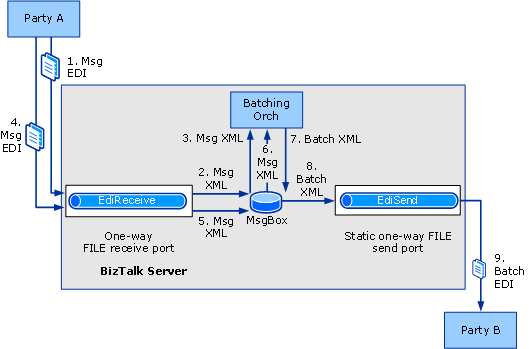

# Walkthrough (X12): Sending Batched EDI Interchanges
This walkthrough provides a set of step-by-step procedures that creates a solution for sending batched EDI interchanges from one party to another using [!INCLUDE[btsBizTalkServerNoVersion](../includes/btsbiztalkservernoversion-md.md)].  

## Prerequisites  
 You must be logged on as a member of the [!INCLUDE[btsBizTalkServerNoVersion](../includes/btsbiztalkservernoversion-md.md)] Administrators or [!INCLUDE[btsBizTalkServerNoVersion](../includes/btsbiztalkservernoversion-md.md)] B2B Operators group.  

## How the Solution Sends Batched EDI Interchanges  
 The solution will do the following:  

1. The receive location receives an EDI interchange from a **Party A**.  

   > [!NOTE]
   >  The events in this list may not occur in the order shown.  

2. The receive pipeline converts the EDI format of the interchange to internal XML format. The receive pipeline determines that the interchange is to be batched. As a result, the BatchMarkerReceivePipeline component promotes the `EDI.ToBeBatched==True` and `EDI.BatchId` properties. It then drops the interchange into the MessageBox.  

3. The Batching Orchestration retrieves the received interchange from the MessageBox, because it subscribes to the message based upon `EDI.ToBeBatched==True` and `EDI.BatchId==%BatchID%`.  

4. The receive location receives a second EDI interchange from the same party that sent the first interchange.  

5. The receive location processes the interchange as in step 2, and then drops the interchange into the MessageBox.  

6. The Batching Orchestration retrieves the interchange as in step 3.  

7. After the release criteria is met (release criteria defines how the interchanges have to be matched), the Batching Orchestration assembles the interchange containing all the interchanges, and then promotes the `EDI.ToBeBatched==False`, `EDI.BatchName` and `EDI.DestinationPartyName` context properties. It drops the batched interchange into the MessageBox.  

8. The send port picks up the batched interchange by subscribing on the context properties `EDI.ToBeBatched`==False, `EDI.BatchName` and `EDI.DestinationPartyName`.  

9. The send pipeline applies additional properties to the envelope of the batched interchange, and then sends the interchange to destination party, **Party B**.  

    > [!NOTE]
    >  For more information, see [Assembling a Batched EDI Interchange](../core/assembling-a-batched-edi-interchange.md).  

   The following figure shows the architecture for this solution.  

     

## The Functionality in this Solution  
 For the purposes of this walkthrough, the following functionality will be enabled:  

-   The solution is designed for interchanges using X12 encoding, not EDIFACT encoding.  

    > [!NOTE]
    >  The configuration used for HIPAA and for EDIFACT encoding is closely parallel to that used for X12 encoding.  

-   Technical or functional acknowledgments will not be returned in response to the interchange originally received or any batched interchange that is sent.  

    > [!NOTE]
    >  For information about generating EDI acknowledgments, see [Walkthrough (X12): Receiving EDI Interchanges and Sending Back an Acknowledgement](../core/walkthrough-x12--receive-edi-interchanges-and-send-back-an-acknowledgement.md).  

-   This solution uses a one-way receive port and a static one-way send port. These ports will be configured with the FILE transport type.  

-   EDI reporting will be enabled.  

-   Transaction sets will be saved for viewing from the interchange status report.  

## Configuring and Testing the Walkthrough  
 The procedures required for this solution include the following:  

- Add the required message schema(s) to a BizTalk project, and then build and deploy the project, making the schema(s) available for use by [!INCLUDE[btsBizTalkServerNoVersion](../includes/btsbiztalkservernoversion-md.md)] in processing the messages.  

- Update the polling interval for the SQL adapter in the **BatchControlMessageReccvLoc** receive location, so that the batching orchestration will be promptly activated when you click the **Start** button to send the control message that will activate a batching orchestration instance.  

- Create a receive port for [!INCLUDE[btsBizTalkServerNoVersion](../includes/btsbiztalkservernoversion-md.md)] to receive the EDI X12-encoded .txt input messages from a party.  

- Create a party (trading partner) for both Party A and Party B.  

- Create a business profile each for both the trading partners.  

- Create an agreement between the two profiles by configuring the EDI properties for the message to be received. Configure the EDI properties for the batched message to be sent. For this solution, configure the agreements such that BizTalk Server will send a batch to Party B whenever two 850 interchanges are received.  

- Create a send port for [!INCLUDE[btsBizTalkServerNoVersion](../includes/btsbiztalkservernoversion-md.md)] to send the batched EDI interchange to the trading partner. This send port will be a static one-way send port.  

- Associate the send port with the agreement that processes the interchanges and batches them.  

- Drop two test EDI interchanges into the local folder associated with the receive location, and verifying that BizTalk Server has dropped a batched interchange into the folder associated with the send port.  

### Configuring the Walkthrough  
 This section describes the procedures to configure the walkthrough.  

##### To deploy the message schema  

1. In [!INCLUDE[btsVStudioNoVersion](../includes/btsvstudionoversion-md.md)], create or open a BizTalk project.  

   > [!NOTE]
   >  This topic assumes that you have already added a reference from your application to the BizTalk EDI Application, which contains EDI schemas, pipelines, and orchestrations. If not, see [How to Add a Reference to the BizTalk Server EDI Application](http://msdn.microsoft.com/library/7af066fb-372f-4709-b566-c8d6b4a9d782).  

2. Right-click your project, point to **Add**, and then click **Existing Item**. Move to [!INCLUDE[btsBiztalkServerPath](../includes/btsbiztalkserverpath-md.md)]XSD_Schema\EDI\X12\00401, and then double-click the schema corresponding to your test message.  

   > [!NOTE]
   >  If the EDI schemas have not been unzipped into the \XSD_Schema\EDI folders, execute the **MicrosoftEdiXSDTemplates.exe** file in the \XSD_Schema\EDI folder to unzip the schemas into the default folder.  
   > 
   > [!NOTE]
   >  For a test message, you can use the 850 sample message used for the EDI Interface Developer tutorial. This file is SamplePO.txt in [!INCLUDE[btsBiztalkServerPath](../includes/btsbiztalkserverpath-md.md)]SDK\EDI Interface Developer Tutorial\\. If you do so, you must use the schema x12_00401_850.xsd located in [!INCLUDE[btsBiztalkServerPath](../includes/btsbiztalkserverpath-md.md)]SDK\EDI Interface Developer Tutorial\Inbound_EDI.  

3. Set the assembly key file, and then build and deploy the assembly.  

##### To update the polling interval  

1. In [!INCLUDE[btsBizTalkServerNoVersion](../includes/btsbiztalkservernoversion-md.md)] Administration Console, open the **BizTalk Group**, **Applications**, **BizTalk EDI Application** nodes, and **Receive Locations** nodes. Under the **Receive Locations** node, right-click **BatchControlMessageRecvLoc**, and then click **Properties**.  

2. For the SQL transport type, click **Configure**.  

3. In the **SQL Transport Properties** dialog box, set the polling interval to a smaller value. For example, you can change **Polling Unit of Measure** to **Seconds**, instead of minutes, to change the polling interval to 5 seconds.  

   > [!NOTE]
   >  Changing the polling interval ensures that the batching orchestration will be promptly activated.  

4. Click **OK**, and then click **OK** again.  

##### To create a one-way receive port to receive the EDI messages to be batched  

1. Create a local folder to receive the EDI messages to be batched.  

2. In [!INCLUDE[btsBizTalkServerNoVersion](../includes/btsbiztalkservernoversion-md.md)] Administration Console, right-click the **Receive Ports** node under the **BizTalk Application 1** node, point to **New**, and then click **One-way Receive Port.**  

3. Name the receive port, and then click **Receive Locations** in the console tree.  

4. Click **New**.  

5. Name the receive location, select **FILE** for **Type**, and then click **Configure**.  

6. Enter a folder for **Receive folder**, and a mask for **File Mask**, such as **\*.txt**.  

7. Click **OK**.  

8. For **Receive pipeline**, select **EdiReceive**.  

9. Click **OK**, and then click **OK** again.  

10. In the console tree, click **Receive Locations**. In the **Receive Locations** pane, right-click your receive location, and then click **Enable**.  

##### To create a party and a business profile for Party A  

1. Right-click the **Parties** node in the [!INCLUDE[btsBizTalkServerNoVersion](../includes/btsbiztalkservernoversion-md.md)] Administration Console, point to **New**, and then click **Party**.  

2. Enter a name for the party in the **Name** text box, and then click **OK**.  

   > [!NOTE]
   >  By selecting the **Local BizTalk processes messages received by the Party OR supports sending messages from this party** check box, you can specify that the party being created is for the same organization that is also hosting [!INCLUDE[btsBizTalkServerNoVersion](../includes/btsbiztalkservernoversion-md.md)]. Based on that, some properties will be enabled or disabled when you create an agreement. However, for this walkthrough, you can leave this check box selected.  

3. Right-click the party name, point to **New**, and then click **Business Profile**.  

4. In the **Profile Properties** dialog box, on the **General** page, enter **PartyA_Profile** in the **Name** text box.  

   > [!NOTE]
   >  When you create a party, a profile is also created. You can rename and use that profile instead of creating a new one. To rename a profile, right-click the profile and select **Properties**. In the **General** page, specify a name for the profile.  

##### To create a party and a business profile for Party B  

1. Right-click the **Parties** node in the [!INCLUDE[btsBizTalkServerNoVersion](../includes/btsbiztalkservernoversion-md.md)] Administration Console, point to **New**, and then click **Party**.  

2. Enter a name for the party in the **Name** text box, and then click **OK**.  

   > [!NOTE]
   >  By selecting the **Local BizTalk processes messages received by the Party OR supports sending messages from this party** check box, you can specify that the party being created is for the same organization that is also hosting [!INCLUDE[btsBizTalkServerNoVersion](../includes/btsbiztalkservernoversion-md.md)]. Based on that, some properties will be enabled or disabled when you create an agreement. However, for this walkthrough, you can leave this check box selected.  

3. Right-click the party name, point to **New**, and then click **Business Profile**.  

4. In the **Profile Properties** dialog box, on the **General** page, enter **PartyB_Profile** in the **Name** text box.  

   > [!NOTE]
   >  When you create a party, a profile is also created. You can rename and use that profile instead of creating a new one. To rename a profile, right-click the profile and select **Properties**. In the **General** page, specify a name for the profile.  

##### To create an agreement between the two business profiles  

1. Right-click **PartyA_Profile**, point to **New**, and then click **Agreement**.  

2. In the **General Properties** page, for the **Name** text box, enter a name for the agreement.  

3. From the **Protocol** drop-down list, select **X12**.  

4. In the **Second Partner** section, from the **Name** drop-down list, select **PartyB**.  

5. In the **Second Partner** section, from the **Profile** drop-down list, select **PartyB_Profile**.  

    You will notice that two new tabs get added next to the **General** tab. Each tab is for configuring a one-way agreement and each one-way agreement represents one complete transaction of message (including message transfer and acknowledgement transfer).  

6. In the **General** tab, on the **General Properties** page, in the **Common Host Settings** section, select **Turn ON reporting**, and then select **Store message payload for reporting**.  

7. Perform the following tasks on the **PartyA->PartyB** tab.  

   1. On the **Identifiers** page under the **Interchange Settings** section, enter values for the qualifier and identifier fields (**ISA5**, **ISA6**, **ISA7**, and **ISA8**) that correspond to the values for those header fields in your test message.  

      > [!NOTE]
      >  [!INCLUDE[btsBizTalkServerNoVersion](../includes/btsbiztalkservernoversion-md.md)] requires the qualifier and identifier fields for sender and receiver in order to perform agreement resolution. It will match the values of **ISA5**, **ISA6**, **ISA7**, and **ISA8** in the interchange header with those in the properties of an agreement. [!INCLUDE[btsBizTalkServerNoVersion](../includes/btsbiztalkservernoversion-md.md)] will also resolve the agreement by matching the sender qualifier and identifier (without the receiver qualifier and identifier). If [!INCLUDE[btsBizTalkServerNoVersion](../includes/btsbiztalkservernoversion-md.md)] cannot resolve the agreement, it will use the fallback agreement properties.  
      > 
      > [!NOTE]
      >  If you are using the SamplePO.txt file from the “EDI Interface Developer Tutorial” as your test message, set **ISA5** to **ZZ**, **ISA6** to **THEM**, **ISA7** to **ZZ**, and **ISA8** to **US**.  

   2. On the **Validation** page under the **Interchange Settings** section, make sure **Check for duplicate ISA13** option is unchecked.  

      > [!NOTE]
      >  Clearing the **Check for duplicate ISA13** property enables you to receive multiple instances of the same message.  

   3. On the **Charset and Separators** page under the **Interchange Settings** section, select the **CR LF** option.  

   4. On the **Batch Configuration** page under the **Interchange Settings** section, do the following:  

      1.  Click **New Batch**.  

      2.  Under the **Identification** section, for **Batch Name** text, enter `Batch1`.  

      3.  Under the **Filter** section, click the **Filter** button, and in the **Batch Filter** dialog box, do the following:  

          1.  Click the empty cell under the **Property** column and select **BTS.ReceivePortName**.  

          2.  Click the empty cell under the **Operator** column and select **==**.  

          3.  Click the empty cell under the **Value** column and enter the name of the receive port you created earlier.  

          4.  Click **OK**.  

      4.  Under the **Release** section, select the **Maximum number of transaction sets in** option, from the drop-down select **Interchange**, and in the text box enter the number of interchanges that will be batched. In this solution, you will be batching two interchanges, so in the text box, enter `2`.  

      5.  Under the **Activation** section, select **Start immediately**.  

   5. On the **Envelopes** page under the **Transaction Set Settings** section, enter values for all columns in the first line of the grid.  

      |       Use this       |                                                                                                                                    To do this                                                                                                                                    |
      |----------------------|----------------------------------------------------------------------------------------------------------------------------------------------------------------------------------------------------------------------------------------------------------------------------------|
      |     **Default**      |   Select **Default**. **Note:**  When you select this row as the default, the values for **GS1**, **GS2**, **GS3**, **GS7**, and **GS8** are used even if the values for **Transaction Type**, **Version/Release**, and **Target namespace** are not a match for the message.    |
      | **Transaction Type** |                                                                                                     Select the message type of your test message, **850 - Purchase Order**.                                                                                                      |
      | **Version/Release**  |                                                                                                                        Enter the EDI version, **00401**.                                                                                                                         |
      | **Target namespace** |                                                                                                         Select **<http://schemas.microsoft.com/BizTalk/Edi/X12/2006>**.                                                                                                          |
      |       **GS1**        |                                                                                           Verify that the message type of the test message is selected, **PO - Purchase Order (850)**.                                                                                           |
      |       **GS2**        |                                                                                                      Enter a value for the Application sender, for example, **Purchasing**.                                                                                                      |
      |       **GS3**        |                                                                                                    Enter a value for the Application receiver, for example, **OrderControl**.                                                                                                    |
      |       **GS4**        | Select the date format that you want. **Note:**  You have to select the value in the drop-down list, not just click in the field to display the default. If you click in the field without selecting the value from the drop-down list, the value will not actually be selected. |
      |       **GS5**        |                                                                                                                      Select the time format that you want.                                                                                                                       |
      |       **GS7**        |                                                                                                                Select **X - Accredited Standards Committee X12**.                                                                                                                |
      |       **GS8**        |                                                                                                             Verify that the EDI version has been entered, **00401**.                                                                                                             |

      > [!NOTE]
      >  [!INCLUDE[btsBizTalkServerNoVersion](../includes/btsbiztalkservernoversion-md.md)] will set the values for GS01, GS02, GS03, GS04, GS05, GS07, and GS08 of the outbound acknowledgments based on the values entered for **Transaction Type**, **Version/Release**, and **Target namespace**. The send pipeline attempts to match the transaction set type, the X12 version, and the target namespace with the corresponding values in the header of the message. If successful, it uses the GS values associated with the **Transaction Type**, **Version/Release**, and **Target namespace** values.  

8. Perform the following tasks on the **PartyB->PartyA** tab.  

   > [!NOTE]
   >  In this walkthrough, we specify the required value in the tab so that an agreement can be successfully created. To successfully create an agreement, both one-way agreement tabs must have values defined for **ISA5**, **ISA6**, **ISA7**, and **ISA8**.  

   1.  On the **Identifiers** page under the **Interchange Settings** section, enter values for the qualifier and identifier fields (**ISA5**, **ISA6**, **ISA7**, and **ISA8**) that correspond to the values for those header fields in your test message.  

       > [!NOTE]
       >  If you are using the SamplePO.txt file from the “EDI Interface Developer Tutorial” as your test message, set **ISA5** to **ZZ**, **ISA6** to **US**, **ISA7** to **ZZ**, and **ISA8** to **THEM**.  

9. Click **Apply**.  

10. Click **OK**. The newly added agreement is listed in the **Agreements** section of the **Parties and Business Profiles** pane. The newly added agreement is enabled by default.  

##### To create a static one-way send port to send the batched EDI interchange  

1. Create a local folder to send the batched EDI message to.  

2. In [!INCLUDE[btsBizTalkServerNoVersion](../includes/btsbiztalkservernoversion-md.md)] Administration Console, right-click the **Send Ports** node under the **BizTalk Application 1** node, point to **New**, and then click **Static One-way Send Port.**  

3. In the **Send Port Properties** dialog box, name the send port.  

4. In the **Transport** section, select **FILE** for **Type**, and then click **Configure**.  

5. Enter a folder for **Destination folder**, and a **File name**, such as **%MessageID%.txt**.  

6. Click **OK**.  

7. In **Send pipeline**, select **EdiSend**.  

8. In the console tree, select **Filters**. On the **Filters** page, do the following:  

   1.  On the first line of the grid, select **EDI.DestinationPartyName** for **Property**, **==** for **Operator**, the name you selected for the party to send the batch to for **Value**, and **And** for **Group by**.  

   2.  On the second line, select **EDI.ToBeBatched** for **Property**, **==** for **Operator**, and **False** for **Value**, and **And** for **Group by**.  

   3.  On the third line, select **EDI.BatchName** for **Property**, **==** for **Operator**, and the name of the batch for **Value**.  

9. Click **OK**.  

10. In the console tree, click **Send Ports**. In the **Send Ports** pane, right-click your send port, and then click **Start**.  

##### To associate the send port with the agreement created for batching  

1.  Right-click the agreement you created earlier and click **Properties**.  

2.  In the **Agreement Properties** dialog box, on the **PartyA->PartyB** tab, click **Send Ports** in the left pane.  

3.  On the **Send Ports** page under the **Interchange Settings** section, associate the send port that you created earlier. In the **Send ports** grid, under the **Name** column, click an empty cell, and from the drop-down list, select the send port.  

4.  Click **OK**.  

### Testing the Walkthrough  
 This section provides information on how to test the walkthrough.  

##### To test the walkthrough  

1. In Windows Explorer, open the local folder associated with the receive location, and drop a test EDI interchange into the folder.  

   > [!NOTE]
   >  For a test message, you can use the 850 sample message used for the EDI Interface Developer tutorial. This file is SamplePO.txt in [!INCLUDE[btsBiztalkServerPath](../includes/btsbiztalkserverpath-md.md)]SDK\EDI Interface Developer Tutorial\\. If you do so, you must use the schema x12_00401_850.xsd located in [!INCLUDE[btsBiztalkServerPath](../includes/btsbiztalkserverpath-md.md)]SDK\EDI Interface Developer Tutorial\Inbound_EDI.  

2. Drop a second copy of the test EDI interchange into the folder.  

3. Open the folder that you associated with the send port for interchanges, and open the batched interchange. Verify that the interchange contains one set of ISA and GS headers, and two transaction sets.  

## See Also  
 [Developing and Configuring BizTalk Server EDI Solutions](../core/developing-and-configuring-biztalk-server-edi-solutions.md)   
 [Configuring an Outgoing Batch](../core/configuring-an-outgoing-batch.md)   
 [Assembling a Batched EDI Interchange](../core/assembling-a-batched-edi-interchange.md)   
 [Assembling a Batched EDI Interchange](../core/assembling-a-batched-edi-interchange.md)   
 [Walkthrough (X12): Receiving EDI Interchanges and Sending Back an Acknowledgement](../core/walkthrough-x12--receive-edi-interchanges-and-send-back-an-acknowledgement.md)   
 [Walkthrough (X12): Sending EDI Interchanges](../core/walkthrough-x12-sending-edi-interchanges.md)