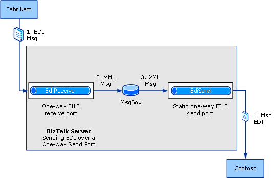

# Walkthrough (X12): Sending EDI Interchanges
This walkthrough provides a set of step-by-step procedures that creates a solution for sending EDI interchanges using [!INCLUDE[btsBizTalkServerNoVersion](../includes/btsbiztalkservernoversion-md.md)].  

## Prerequisites  
 You must be logged on as a member of the [!INCLUDE[btsBizTalkServerNoVersion](../includes/btsbiztalkservernoversion-md.md)] Administrators or [!INCLUDE[btsBizTalkServerNoVersion](../includes/btsbiztalkservernoversion-md.md)] B2B Operators group.  

## How the Solution Sends EDI Interchanges  
 The solution will do the following:  

1.  A one-way FILE receive port receives an EDI message from Fabrikam.  

2.  Using the EdiReceive pipeline, the receive port checks the message and converts it into XML. The receive port then drops the test message into the MeassageBox.  

3.  A static one-way send port picks up the XML message from the MessageBox.  

4.  The static one-way send port validates the EDI message against the message schema, serializes the EDI message into an EDI interchange, and then sends the EDI message to the trading partner Contoso's local folder.  

## The Functionality in this Solution  
 This walkthrough uses the following functionality:  

- Receiving an acknowledgment is not tested in this walkthrough. To understand how to receive an acknowledgment, see demonstrated [Walkthrough (X12): Receiving EDI Interchanges and Sending Back an Acknowledgement](../core/walkthrough-x12--receive-edi-interchanges-and-send-back-an-acknowledgement.md)  

- The solution is designed for interchanges using X12 encoding, not EDIFACT encoding.  

  > [!NOTE]
  >  The configuration used for HIPAA and for EDIFACT encoding is closely parallel to that used for X12 encoding.  

- EDI type and extended validation will be performed on the outgoing interchange.  

- The solution uses a static one-way send port with a FILE transport type.  

  > [!NOTE]
  >  Instead of a static one-way send port, you could use a static two-way send port to send the interchange and receive the acknowledgment. You could also use a dynamic one-way send port to send the interchange. For more information on using a dynamic send port, see [Configuring a Dynamic Send Port to Send EDI Interchanges and Acknowledgments](../core/configuring-a-dynamic-send-port-to-send-edi-interchanges-and-acknowledgments.md).  

  > [!NOTE]
  >  You can use an HTTP adapter and AS2 transport. For more information on doing so, see [Walkthrough (AS2): Sending EDI over AS2 with a Synchronous MDN](../core/walkthrough-as2-sending-edi-over-as2-with-a-synchronous-mdn.md) or [Walkthrough (AS2): Sending EDI over AS2 with an Asynchronous MDN](../core/walkthrough-as2-sending-edi-over-as2-with-an-asynchronous-mdn.md).  

- EDI reporting will be enabled, and transaction sets will be saved for viewing from the interchange status report.  

- For testing purposes, the solution uses a receive location to receive a test message.  

  The following figure shows the architecture for this solution, which uses a static one-way send port.  

    

## Configuring and Testing the Walkthrough  
 The procedures required for this solution include the following:  

- Add the required message schema(s) to a BizTalk project, and then build and deploy the project, making the schemas available for use by [!INCLUDE[btsBizTalkServerNoVersion](../includes/btsbiztalkservernoversion-md.md)] in processing the outbound interchange.  

- Create a receive port and location for [!INCLUDE[btsBizTalkServerNoVersion](../includes/btsbiztalkservernoversion-md.md)] to receive the EDI interchange. This receive location is tied to the file folder where Fabrikam drops the EDI interchange to be sent to Contoso. The receive location will use an EdiReceive receive pipeline.  

- Create a send port for [!INCLUDE[btsBizTalkServerNoVersion](../includes/btsbiztalkservernoversion-md.md)] to send the EDI interchange to Contoso. In this walkthrough, you will create a static one-way send port.  

- Create a party (trading partner) for both Fabrikam and Contoso.  

- Create a business profile each for both the trading partners.  

- Create an agreement between the two profiles by configuring the EDI properties for the message to be received.  

- Test the walkthrough using a test EDI interchange.  

  > [!NOTE]
  >  For a test message, you can use the SamplePO.txt file that is used in the EDI Interface Developer tutorial. That file is shipped in the [!INCLUDE[btsBiztalkServerPath](../includes/btsbiztalkserverpath-md.md)]SDK\EDI Interface Developer Tutorial\ folder. This is an X12 850 message.  

### Configuring the Walkthrough  
 This section describes the procedures to configure the walkthrough.  

##### To deploy the message schema  

1. In [!INCLUDE[btsVStudioNoVersion](../includes/btsvstudionoversion-md.md)], create or open a BizTalk project.  

   > [!NOTE]
   >  This topic assumes that you have already added a reference from your application to the BizTalk EDI Application, which contains EDI schemas, pipelines, and orchestrations. If not, see [How to Add a Reference to the BizTalk Server EDI Application](http://msdn.microsoft.com/library/7af066fb-372f-4709-b566-c8d6b4a9d782).  

2. Right-click your project, point to **Add**, and then click **Existing Item**. Move to the folder that your schema is in [!INCLUDE[btsBiztalkServerPath](../includes/btsbiztalkserverpath-md.md)]XSD_Schema\EDI, and then double-click your schema.  

   > [!NOTE]
   >  If the EDI schemas have not been unzipped into the \XSD_Schema\EDI folders, execute the **MicrosoftEdiXSDTemplates.exe** file in the \XSD_Schema\EDI folder to unzip the schemas into the default folder.  
   > 
   > [!NOTE]
   >  If you use the SamplePO.txt file that is used in the EDI Interface Developer tutorial, you must use the X12_00401_850.xsd schema that is shipped in the [!INCLUDE[btsBiztalkServerPath](../includes/btsbiztalkserverpath-md.md)]SDK\EDI Interface Developer Tutorial\Inbound_EDI folder. You must not use the X12 850 schema in the [!INCLUDE[btsBiztalkServerPath](../includes/btsbiztalkserverpath-md.md)]XSD_Schema folder.  

3. Add the assembly key file to the project, and then build and deploy the assembly.  

##### To create a one-way receive port (for Fabrikam) to receive the EDI interchange  

1. In Windows Explorer, create a local folder to receive the interchange in.  

2. In [!INCLUDE[btsBizTalkServerNoVersion](../includes/btsbiztalkservernoversion-md.md)] Administration Console, right-click the **Receive Ports** node under the **BizTalk Application 1** node, point to **New**, and then click **One-way Receive Port**.  

3. Name the receive port, and then click **Receive Locations** in the console tree.  

4. Click **New**.  

5. Name the receive location, select **FILE** for **Type**, and then click **Configure**.  

6. Enter a folder for **Receive folder**, and enter **\*.txt** for the file mask.  

7. Click **OK**.  

8. For **Receive pipeline**, select **EdiReceive**.  

9. Click **OK**, and then click **OK** again.  

10. In the console tree, click **Receive Locations**. In the **Receive Locations** pane, right-click your receive location, and then click **Enable**.  

##### To create a static one-way send port (for Contoso) to send the EDI interchange  

1. In Windows Explorer, create a local folder to send the EDI interchange to.  

2. In [!INCLUDE[btsBizTalkServerNoVersion](../includes/btsbiztalkservernoversion-md.md)] Administration Console, right-click the **Send Ports** node under the **BizTalk Application 1** node, point to **New**, and then click **Static One-way Send Port**.  

3. In the **Send Port Properties** dialog box, name the send port.  

4. In the **Transport** section, select the **Type**, for example, **FILE**.  

5. If using a FILE type, click **Configure**. In **Destination folder**, browse to a folder to send the interchange to. For **File name**, enter **%MessageID%.edi**. Click **OK**.  

6. In **Send pipeline**, select **EdiSend**.  

7. In the console tree, select **Filters**, and enter a filter expression for the send port to use to subscribe to the message. For example, you could use the receive location that will receive the original test message as a filter expression. To do so, for **Property**, enter **BTS.ReceivePortName**; for **Operator**, enter **==**; and for **Value** enter the name of the receive port that you created to receive the XML message from Fabrikam.  

   > [!NOTE]
   >  You could filter on another property of your choice, for example, on BTS.MessageType.  

8. Click **OK**.  

9. Click the **Send Ports** node in the Administration Console, right-click your send port, and then click **Start**.  

##### To create a party and a business profile for Fabrikam  

1. Right-click the **Parties** node in the [!INCLUDE[btsBizTalkServerNoVersion](../includes/btsbiztalkservernoversion-md.md)] Administration Console, point to **New**, and then click **Party**.  

2. Enter a name for the party in the **Name** text box, and then click **OK**.  

   > [!NOTE]
   >  By selecting the **Local BizTalk processes messages received by the Party OR supports sending messages from this party** check box, you can specify that the party being created is for the same organization that is also hosting [!INCLUDE[btsBizTalkServerNoVersion](../includes/btsbiztalkservernoversion-md.md)]. Based on that, some properties will be enabled or disabled when you create an agreement. However, for this walkthrough, you can leave this check box selected.  

3. Right-click the party name, point to **New**, and then click **Business Profile**.  

4. In the **Profile Properties** dialog box, on the **General** page, enter **Fabrikam_Profile** in the **Name** text box.  

   > [!NOTE]
   >  When you create a party, a profile is also created. You can rename and use that profile instead of creating a new one. To rename a profile, right-click the profile and select **Properties**. In the **General** page, specify a name for the profile.  

##### To create a party and a business profile for Contoso  

1. Right-click the **Parties** node in the [!INCLUDE[btsBizTalkServerNoVersion](../includes/btsbiztalkservernoversion-md.md)] Administration Console, point to **New**, and then click **Party**.  

2. Enter a name for the party in the **Name** text box, and then click **OK**.  

   > [!NOTE]
   >  By selecting the **Local BizTalk processes messages received by the Party OR supports sending messages from this party** check box, you can specify that the party being created is for the same organization that is also hosting [!INCLUDE[btsBizTalkServerNoVersion](../includes/btsbiztalkservernoversion-md.md)]. Based on that, some properties will be enabled or disabled when you create an agreement. However, for this walkthrough, you can leave this check box selected.  

3. Right-click the party name, point to **New**, and then click **Business Profile**.  

4. In the **Profile Properties** dialog box, on the **General** page, enter **Contoso_Profile** in the **Name** text box.  

   > [!NOTE]
   >  When you create a party, a profile is also created. You can rename and use that profile instead of creating a new one. To rename a profile, right-click the profile and select **Properties**. In the **General** page, specify a name for the profile.  

##### To create an agreement between the two business profiles  

1. Right-click **Fabrikam_Profile**, point to **New**, and then click **Agreement**.  

2. In the **General Properties** page, for the **Name** text box, enter a name for the agreement.  

3. From the **Protocol** drop-down list, select **X12**.  

4. In the **Second Partner** section, from the **Name** drop-down list, select **Contoso**.  

5. In the **Second Partner** section, from the **Profile** drop-down list, select **Contoso_Profile**.  

    You will notice that two new tabs get added next to the **General** tab. Each tab is for configuring a one-way agreement and each one-way agreement represents one complete transaction of message (including message transfer and acknowledgement transfer).  

6. In the **General** tab, on the **General Properties** page, in the **Common Host Settings** section, select **Turn ON reporting**, and then select **Store message payload for reporting**.  

7. Perform the following tasks on the **Fabrikam->Contoso** tab.  

   1. On the **Identifiers** page under the **Interchange Settings** section, enter values for the qualifier and identifier fields (**ISA5**, **ISA6**, **ISA7**, and **ISA8**) that correspond to the values for those header fields in your test message.  

      > [!NOTE]
      >  [!INCLUDE[btsBizTalkServerNoVersion](../includes/btsbiztalkservernoversion-md.md)] requires the qualifier and identifier fields for sender and receiver in order to perform agreement resolution. It will match the values of **ISA5**, **ISA6**, **ISA7**, and **ISA8** in the interchange header with those in the properties of an agreement. [!INCLUDE[btsBizTalkServerNoVersion](../includes/btsbiztalkservernoversion-md.md)] will also resolve the agreement by matching the sender qualifier and identifier (without the receiver qualifier and identifier). If [!INCLUDE[btsBizTalkServerNoVersion](../includes/btsbiztalkservernoversion-md.md)] cannot resolve the agreement, it will use the fallback agreement properties.  
      > 
      > [!NOTE]
      >  If you are using the SamplePO.txt file from the “EDI Interface Developer Tutorial” as your test message, set **ISA5** to **ZZ**, **ISA6** to **THEM**, **ISA7** to **ZZ**, and **ISA8** to **US**.  

   2. On the **Validation** page under the **Interchange Settings** section, make sure **Check for duplicate ISA13** option is unchecked.  

      > [!NOTE]
      >  Clearing the **Check for duplicate ISA13** property enables you to receive multiple instances of the same message.  

   3. On the **Charset and Separators** page under the **Interchange Settings** section, select the **CR LF** option.  

   4. On the **Send Ports** page under the **Interchange Settings** section, associate the send port that will be receiving the EDI interchange from Fabrikam. In the **Send ports** grid, under the **Name** column, click an empty cell, and from the drop-down list, select the send port created for receiving the EDI interchange from Fabrikam.  

   5. On the **Validation** page under the **Transaction Set Settings** section, leave **EDI Type Validation** checked and check **Extended validation**.  

   6. If you are using one of the standard schemas shipped with [!INCLUDE[btsBizTalkServerNoVersion](../includes/btsbiztalkservernoversion-md.md)], on the **Local Host Settings** page under the **Transaction Set Settings** section, select the namespace for the schema to be used to process the incoming interchange.  

      |       Use this       |                           To do this                            |
      |----------------------|-----------------------------------------------------------------|
      |     **Default**      |                Select the checkbox in the column                |
      |     **For ST1**      |                Select **850 - Purchase Order**.                 |
      |       **GS2**        |                         Enter **THEM**.                         |
      | **Target Namespace** | Select **<http://schemas.microsoft.com/BizTalk/EDI/X12/2006>**. |

      > [!NOTE]
      >  Setting the properties enables [!INCLUDE[btsBizTalkServerNoVersion](../includes/btsbiztalkservernoversion-md.md)] to determine the schema to be used in processing the incoming 850 interchange. If an interchange has the values of GS02 and ST01 that are entered on a line of the grid, then the target namespace for the same line will be used to determine the schema to be used.  

   7. On the **Envelopes** page under the **Transaction Set Settings** section, enter values for all columns in the first line of the grid.  

      |       Use this       |                                                                                                                                               To do this                                                                                                                                               |
      |----------------------|--------------------------------------------------------------------------------------------------------------------------------------------------------------------------------------------------------------------------------------------------------------------------------------------------------|
      |     **Default**      | Select the checkbox in the **Default** column. **Note:**  When you select this row as the default, the values for **GS1**, **GS2**, **GS3**, **GS7**, and **GS8** are used even if the values for **Transaction Type**, **Version/Release**, and **Target namespace** are not a match for the message. |
      | **Transaction Type** |                                                                                                                Select the message type of your test message, **850 - Purchase Order**.                                                                                                                 |
      | **Version/Release**  |                                                                                                                                   Enter the EDI version, **00401**.                                                                                                                                    |
      | **Target namespace** |                                                                                                                    Select **<http://schemas.microsoft.com/BizTalk/Edi/X12/2006>**.                                                                                                                     |
      |       **GS1**        |                                                                                                      Verify that the message type of the test message is selected, **PO - Purchase Order (850)**.                                                                                                      |
      |       **GS2**        |                                                                                                                               Enter a value for the Application sender.                                                                                                                                |
      |       **GS3**        |                                                                                                                              Enter a value for the Application receiver.                                                                                                                               |
      |       **GS4**        |            Select the date format that you want. **Note:**  You have to select the value in the drop-down list, not just click in the field to display the default. If you click in the field without selecting the value from the drop-down list, the value will not actually be selected.            |
      |       **GS5**        |                                                                                                                                 Select the time format that you want.                                                                                                                                  |
      |       **GS7**        |                                                                                                                           Select **X - Accredited Standards Committee X12**.                                                                                                                           |
      |       **GS8**        |                                                                                                                        Verify that the EDI version has been entered, **00401**.                                                                                                                        |

      > [!NOTE]
      >  [!INCLUDE[btsBizTalkServerNoVersion](../includes/btsbiztalkservernoversion-md.md)] will set the values for GS01, GS02, GS03, GS04, GS05, GS07, and GS08 of the outbound acknowledgments based on the values entered for **Transaction Type**, **Version/Release**, and **Target namespace**. The send pipeline attempts to match the transaction set type, the X12 version, and the target namespace with the corresponding values in the header of the message. If successful, it uses the GS values associated with the **Transaction Type**, **Version/Release**, and **Target namespace** values.  

8. Perform the following tasks on the **Contoso->Fabrikam** tab.  

   > [!NOTE]
   >  In this walkthrough, we specify the required value in the tab so that an agreement can be successfully created. To successfully create an agreement, both one-way agreement tabs must have values defined for **ISA5**, **ISA6**, **ISA7**, and **ISA8**.  

   1.  On the **Identifiers** page under the **Interchange Settings** section, enter values for the qualifier and identifier fields (**ISA5**, **ISA6**, **ISA7**, and **ISA8**) that correspond to the values for those header fields in your test message.  

       > [!NOTE]
       >  If you are using the SamplePO.txt file from the “EDI Interface Developer Tutorial” as your test message, set **ISA5** to **ZZ**, **ISA6** to **US**, **ISA7** to **ZZ**, and **ISA8** to **THEM**.  

9. Click **Apply**.  

10. Click **OK**. The newly added agreement is listed in the **Agreements** section of the **Parties and Business Profiles** pane. The newly added agreement is enabled by default.  

### Testing the Walkthrough  
 This section provides information on how to test the walkthrough.  

##### To test the walkthrough  

1. In Windows Explorer, drop the test EDI interchange into your local receive folder.  

   > [!NOTE]
   >  For a test message, you can use the SamplePO.txt file that is used in the EDI Interface Developer tutorial. That file is shipped in the [!INCLUDE[btsBiztalkServerPath](../includes/btsbiztalkserverpath-md.md)]SDK\EDI Interface Developer Tutorial folder. This is an X12 850 message. If you use this message, you must have deployed the X12_00401_850.xsd schema that is shipped in the [!INCLUDE[btsBiztalkServerPath](../includes/btsbiztalkserverpath-md.md)]SDK\EDI Interface Developer Tutorial\Inbound_EDI folder. You must not use the X12 850 schema in the [!INCLUDE[btsBiztalkServerPath](../includes/btsbiztalkserverpath-md.md)]XSD_Schema folder.  

2. In Windows Explorer, open the destination folder specified for the send port. Verify that the folder contains an output EDI interchange that has ISA, GS, and ST headers that match the values that you entered in the agreement properties.  

## See Also  
 [Developing and Configuring BizTalk Server EDI Solutions](../core/developing-and-configuring-biztalk-server-edi-solutions.md)