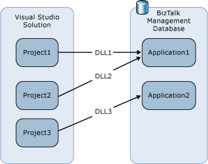
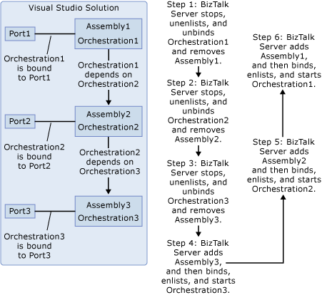

# What Happens When You Deploy an Assembly from Visual Studio
This topic describes what happens when you deploy assemblies from [!INCLUDE[btsVStudioNoVersion](../includes/btsvstudionoversion-md.md)] into a BizTalk application on [!INCLUDE[btsBizTalkServerNoVersion](../includes/btsbiztalkservernoversion-md.md)].  
  
 You can deploy a project individually, or you can deploy all of the projects in a solution at the same time. Before deploying a project, either separately or as part of a solution, you specify the application into which to deploy its assembly in project properties, as described in [How to Set Deployment Properties in Visual Studio](../core/how-to-set-deployment-properties-in-visual-studio.md). When you deploy a project or solution in [!INCLUDE[btsVStudioNoVersion](../includes/btsvstudionoversion-md.md)], the assemblies are automatically built and deployed into the specified application. If an existing application in the local BizTalk group has the same name as the application specified in project properties, the assembly is deployed into the existing application; otherwise, a new application having the specified name is created and assembly is deployed into it. As part of this process, the assembly along with the orchestrations, pipelines, schemas, and maps that it contains (called "artifacts") are imported into the local BizTalk Management database and associated in the database with the specified application.  
  
 You can deploy the projects in a solution into the same BizTalk application or different BizTalk applications, even when you deploy the projects in a solution at the same time. The following diagram illustrates deploying three assemblies contained in a BizTalk solution in [!INCLUDE[btsVStudioNoVersion](../includes/btsvstudionoversion-md.md)] into two different BizTalk applications.  
  
   
  
 After you deploy a project or solution, you can view and manage the assemblies and their artifacts from within the [!INCLUDE[btsBizTalkServerNoVersion](../includes/btsbiztalkservernoversion-md.md)] Administration console or by using the BTSTask command-line tool.  
  
## Destination Locations  
 When deploying assemblies from [!INCLUDE[btsVStudioNoVersion](../includes/btsvstudionoversion-md.md)], the destination location of an assembly defaults to the source location of the assembly. When installing or exporting an assembly from [!INCLUDE[btsVStudioNoVersion](../includes/btsvstudionoversion-md.md)], if the "from" and "to" environment is not the same, the installation will fail. For example, if the source location is D:[path]/[filename] and the target machine installation machine does not have a "D" drive, the installation will fail.  
  
 This behavior is in contrast to adding a resource using BizTalk Administrator, in which case, the default destination location is %BTAD_InstallDir%. This environment variable expands to the install directory specified during installation.  
  
 To work around this issue, use the following procedure:  
  
1. In [!INCLUDE[btsVStudioNoVersion](../includes/btsvstudionoversion-md.md)], deploy the assembly.  
  
2. After the assembly is deployed, open BizTalk Administrator.  
  
3. Modify the destination location as appropriate. For example, change the destination location to %BTAD_InstallDir%.  
  
   Once you modify the destination location, this new location will be used as default for subsequent redeploys of the same assembly.  
  
   For more information, see [How to Deploy a BizTalk Assembly from Visual Studio](../core/how-to-deploy-a-biztalk-assembly-from-visual-studio.md).  
  
## Deploying Solutions vs. Projects  
 We strongly recommend that you always deploy a solution rather than an individual project. When you deploy an individual project and there are dependencies between an assembly you are deploying and another assembly, you must take a number of manual steps to complete the deployment. When you deploy a solution, however, [!INCLUDE[btsBizTalkServerNoVersion](../includes/btsbiztalkservernoversion-md.md)] automatically take all of the steps to manage dependencies between assemblies. For more information, see [How to Redeploy a BizTalk Assembly from Visual Studio](../core/how-to-redeploy-a-biztalk-assembly-from-visual-studio.md).  
  
 The following diagram illustrates the steps that [!INCLUDE[btsBizTalkServerNoVersion](../includes/btsbiztalkservernoversion-md.md)] takes to redeploy assemblies that have dependencies when you deploy a solution.  
  
   
  
## See Also  
 [Deploying BizTalk Assemblies from Visual Studio into a BizTalk Application](../core/deploying-biztalk-assemblies-from-visual-studio-into-a-biztalk-application.md)