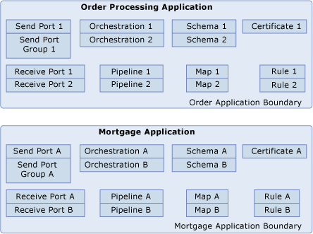

# What Is a BizTalk Application?
The BizTalk application is a feature of [!INCLUDE[btsBizTalkServerNoVersion](../includes/btsbiztalkservernoversion-md.md)] that makes it quicker and easier to deploy, manage, and troubleshoot [!INCLUDE[btsBizTalkServerNoVersion](../includes/btsbiztalkservernoversion-md.md)] business solutions. A BizTalk application is a logical grouping of the items, called "artifacts," used in a [!INCLUDE[btsBizTalkServerNoVersion](../includes/btsbiztalkservernoversion-md.md)] business solution. Artifacts are described in more detail later in this topic.  
  
 The newly designed administration and monitoring tools of BizTalk Server take advantage of this new concept, so that you can manage and configure [!INCLUDE[btsBizTalkServerNoVersion](../includes/btsbiztalkservernoversion-md.md)] business solutions at the application level, and not just at the individual artifact level. By creating an application and adding artifacts to it, you can view, package, deploy, and manage a group of artifacts in a solution as a single entity. Therefore, as the number of complex applications increases you can still manage them individually in a simple and intuitive manner.  
  
 There are several tools you can use to create and manage applications, which are described in [Application Deployment and Management Tools](../core/application-deployment-and-management-tools.md).  
  
 The following diagram depicts two BizTalk applications and the artifacts that they contain.  
  
   
  
## Artifacts  
 Artifacts include the following:  
  
- BizTalk assemblies and the BizTalk-specific resources that they contain – orchestrations, pipelines, schemas, and maps  
  
- .NET assemblies that do not contain BizTalk-specific resources  
  
- Policies  
  
- Send ports, send port groups, receive locations, and receive ports  
  
- Other items that are used by the solution, such as certificates, COM components, and scripts  
  
  For background information about each type of artifact, see [Runtime Architecture](../core/runtime-architecture.md). For more information about adding, removing, and configuring artifacts, see [Managing Artifacts](../core/managing-artifacts.md).  
  
  An application can contain all of the artifacts used in a business solution or only some of them. Depending on how you want to deploy the artifacts, you may want to place them into a single application or into two or more applications. For more information about deciding how to group artifacts, see [Best Practices for Deploying a BizTalk Application](../core/best-practices-for-deploying-a-biztalk-application.md).  
  
## The default application  
 When BizTalk Server is configured following installation, a default application named BizTalk Application 1 is automatically created. For information about best practices for grouping artifacts into different applications, see [Best Practices for Deploying a BizTalk Application](../core/best-practices-for-deploying-a-biztalk-application.md). You can also change the default application or rename the default application.  
  
 In the following scenarios, artifacts are automatically added to the default application:  
  
- When you deploy an assembly from [!INCLUDE[btsVStudioNoVersion](../includes/btsvstudionoversion-md.md)] into [!INCLUDE[btsBizTalkServerNoVersion](../includes/btsbiztalkservernoversion-md.md)] without specifying an application name. For more information, see [How to Deploy a BizTalk Assembly from Visual Studio](../core/how-to-deploy-a-biztalk-assembly-from-visual-studio.md).  
  
- When you use BTSTask to add an artifact to an application without specifying an application name. For more information, see [AddResource Command](../core/addresource-command.md).  
  
- When you use BTSTask to import an application .msi file without specifying an application name. For more information, see [ImportApp Command](../core/importapp-command.md).  
  
## The BizTalk.System application  
 When BizTalk Server is configured following installation, an application named BizTalk.System is automatically created and populated with common artifacts that are used by all BizTalk applications, such as the default schemas and pipelines. BizTalk.System and its artifacts are read-only. You cannot delete or rename BizTalk.System, nor can you delete, rename, or move any of the artifacts that it contains.  
  
> [!IMPORTANT]
>  Every application in [!INCLUDE[btsBizTalkServerNoVersion](../includes/btsbiztalkservernoversion-md.md)] automatically contains a reference to the BizTalk.System application. This is because the artifacts in BizTalk.System are used by every BizTalk application. You should never remove a reference to the BizTalk.System application. If you do, your application may not function correctly.  
  
## See Also  
 [Understanding BizTalk Application Deployment and Management](../core/understanding-biztalk-application-deployment-and-management.md)