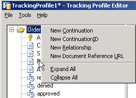

# What Is an Activity View?
An activity view contains the imported BAM activity definition that you create with the BAM Add-In for Excel. The BAM activity definition is an abstract of your trace requirements for your business process. An activity can span multiple orchestrations and ports. You import the activity definition once and map it to each orchestration or messaging artifact that fulfills some part of the definition.  
  
 The Activity View link is on the left pane of Tracking Profile Editor (TPE) user interface.  
  
## Activity view elements  
 The activity view displays the overall structure of the tracking profile in tree view and includes the following elements:  
  
- Milestones  
  
- Data items for the activity  
  
- Event sources  
  
- Data sources  
  
  **Milestones**: Milestones are objects which define a point in a given process. Milestones are accessed in one of three ways:  
  
- You can drag a shape from an orchestration schedule, and the end-time for that shape’s execution is reported by BAM as the milestone value.  
  
- You can drag a messaging property, from a schematic representation on the right, to a target milestone.  
  
- You can drag a message payload schema node which contains a milestone value.  
  
  > [!NOTE]
  >  The DATETIME ONLY type schema nodes are evaluated at run time. Any conversion or casting problem at run time results in a tracking error being placed in the event log.  
  
  **Data items**: Data items are objects which define a particular element from an XML schema for a message instance, system, or promoted property. You access the data item by expanding the schema to find and select the element you are interested in and dragging the element to the correct data item type folder. Information about the data items (for example, XPath) is stored in the profile.  
  
> [!NOTE]
>  TPE supports only data items that have a zero-to-one representation as defined in the message schema for a particular data field. Errors may occur in orchestration tracking when there are data items that have one-to-many representations. In these situations no data is stored in the BAM Primary Import database. If an error does not occur, then there is no guarantee which of the data item is tracked.  
  
> [!NOTE]
>  BAM developers need to be aware that properties are populated according to BizTalk Server process rules, and not BAM.  
>   
>  For example, in the SMTP adapter the context properties, such as SMTPServer, CC, and From, do not contain any values until they are explicitly populated. Once they have been populated their values will appear in the BAM Primary Import database and they will be available for tracking.  
  
## Activity view context menus  
 The context menus of available actions for the activity view dynamically change depending on the node selected in the Orchestration View. For example, if you select an activity folder node, the shortcut menu will contain the shortcut menu items for that activity folder.  
  
 You associate events and data to the items in the business activity by dragging them from the source event pane on the right to the event or data node in the Activity view.  
  
 The context menus for the nodes in the activity view are accessible by right-clicking a node in the tree. The following screen shows the root node for activity views. The following tables describe the items in the context menus for the different nodes for an activity view.  
  
 **Activity Definition Tree root node**  
  
   
  
|Menu Item|Usage|  
|---------------|-----------|  
|New Continuation|Inserts a new Continuation folder into the Activity tree. You map the value for this folder from the source segment of a continuation.   Used in conjunction with a ContinuationID folder to provide a means to hand off processing between multiple components that populate the same activity. Examples of these components are BizTalk orchestrations, ports, BufferedEventStreams, and DirectEventStreams. **Note:**  Continuation folder names can contain a maximum of 127 characters.|  
|New ContinuationID|Inserts a ContinuationID folder into the Activity tree. You map this folder to continued-to segment of a continuation. For example, if orchestration A continues to Orchestration B, this folder must be mapped to an item from Orchestration B.   Used in conjunction with a Continuation folder to provide a means to hand off processing between multiple components that populate the same activity. Examples of these components are BizTalk orchestrations, ports, BufferedEventStreams, and DirectEventStreams. **Note:**  ContinuationID folder names can contain a maximum of 127 characters.|  
|New Relationship|Inserts a new relationship folder into the Activity tree. Used to publish the relationship between activities that form a view. **Note:**  Relationship folder names can contain a maximum of 128 characters. The includes the server name and BizTalk Management database name.|  
|New Document Reference URL|Inserts a new Document Reference URL folder into the Activity tree. Used to set a reference URL to a location that contains a document that is related to this activity. **Note:**  Document Reference URL folder names can contain a maximum of 128 characters.|  
  
 **Property Node**  
  
|Menu Item|Usage|  
|---------------|-----------|  
|Associate Selected Data|Used to create an association between a message payload or context property data item and the BAM Activity data item folder.|  
  
 **Event node**  
  
|Menu Item|Usage|  
|---------------|-----------|  
|Associate with the end of the selected action|Used to create an association between an orchestration shape, DateTime message payload, or DateTime context property data item and the BAM Activity milestone folder.|  
  
## See Also  
 [Implementing BAM Activities with Event Streams](../core/implementing-bam-activities-with-event-streams.md)   
 [Defining Business Activities and Views in Excel](../core/defining-business-activities-and-views-in-excel.md)   
 [Components of the TPE](../core/components-of-the-tpe.md)