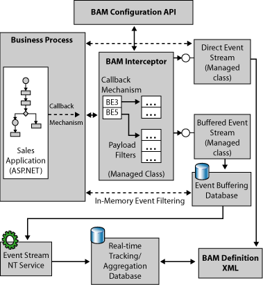

# What Is the BAM Interceptor?
## Overview 

The BAM Interceptor is an object that lets you instrument your application to capture data of interest. The following diagram shows the role of the BAM interceptor and its interaction with the other BAM components:  
  
   
BAM Interceptor  
  
 In each step of your application where you could have data of interest, you call Interceptor OnStep, provide an identifier for the step, and provide some data or arbitrary object that you are using in your application.  
  
 You must implement a callback function so when the callback occurs, your callback procedure gets the current step ID and your data object. Essentially, the BAM interceptor is simply propagating the data object to the callback. The actual logic of extracting data resides in your application. For example, if your data takes the form of XML messages, then the callback will use XPaths. For more information about XPaths, see [Using XPaths in Message Assignment](../core/using-xpaths-in-message-assignments.md).  
  
 The BAM interceptor decides which data to request at each step, based on the configuration that you can create programmatically. The BAM Interceptor then uses the obtained data to call either DirectEventStream or BufferedEventStream that you need to keep around and pass each time as an argument to OnStep.  
  
 Calling the interceptor for each step is not a resource-intensive operation. If you call and you register nothing for this step, the interceptor returns immediately. This means that there are no disk operations, no transactions, not even memory allocations, and thus almost no performance impact. At the same time, you have the opportunity to extract any data for BAM if necessary. The performance impact on the steps involving data extraction and the availability of the data will depend on your implementation of the `IBAMDataExtractor Interface`.  
  
 The following code examples demonstrate the use of the interceptor during configuration and run time.  
  
## Configuration time  
 The following code shows how you configure the Interceptor to stop at step recvPO of the application, and ask for Customer Name and Customer SSN:  
  
```  
ActivityInterceptorConfiguration cfg= new ActivityInterceptorConfiguration ("PurchaseOrder");  
...  
cfg.RegisterDataExtraction("CustomerName",recvPO,XpathName);  
cfg.RegisterDataExtraction("CustomerSSN",recvPO,XpathSSN);  
...  
BAMInterceptor interceptor=new BAMInterceptor();  
cfg.UpdateInterceptor(interceptor);  
...  
// The interceptor instance is ready.  
```  
  
 After you create an interceptor instance, you can store it for later use at runtime.  
  
 You may keep different pre-created interceptors representing different preferences for the data and milestones for BAM. For best performance, serialize the Interceptor instances using the BinaryFormatter class.  
  
## Run time  
 Use this code to use the interceptor at runtime in a production environment:  
  
```  
// Deserialize the Interceptor that was prepared before  
...  
es=new DirectEventStream(...)  
...  
Interceptor.OnStep(recvPO, data1, es, callback)  
...  
Interceptor.OnStep(approvePO, data2, es, callback)  
...  
```  
  
 Where:  
  
- *recvPO* and *approvePO* are arbitrary objects you use to identify the steps in your application.  
  
- *data1* and *data2* are arbitrary objects that you have at that point and may contain interesting data – for example the XML document of the purchase order.  
  
- *es* is either DirectEventStream or BufferedEvent stream depending on your performance requirements.  
  
- *callback* is your implementation of the `IBAMDataExtractor Interface`.  
  
  The SDK sample, [BAM API (BizTalk Server Sample)](../core/bam-api-biztalk-server-sample.md), demonstrates using the Interceptor, which contains both a configuration tool and example runtime application.  
  
  The BizTalk Orchestration Engine accommodates interception, which allows changing what data is collected for BAM at runtime using the Tracking Profile Editor.  
  
## In This Section  
  
-   [How to Determine and Set Event Writer Roles for Activities](../core/how-to-determine-and-set-event-writer-roles-for-activities.md)  
  
## See Also  
 [BAM API (BizTalk Server Sample)](../core/bam-api-biztalk-server-sample.md)