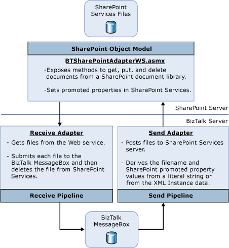

# What Is the Windows SharePoint Services Adapter?
The [!INCLUDE[btsBizTalkServerNoVersion](../includes/btsbiztalkservernoversion-md.md)] adapter for Windows SharePoint Services provides a tighter integration with Windows SharePoint Services and Microsoft Office InfoPath. The following topic describes the features and an overview of how the Windows SharePoint Services adapter works.  
  
## Features of the Windows SharePoint Services adapter  
 The following list describes important features of the Windows SharePoint Services adapter:  
  
-   The ability to send BizTalk Server XML and binary messages to SharePoint document libraries.  
  
-   Integration with InfoPath: You can transform outgoing BizTalk Server XML messages to automatically open in InfoPath when opened from the Windows SharePoint Services site.  
  
-   Property promotion for messages going into Windows SharePoint Services. Up to 16 SharePoint columns can be updated with BizTalk Server metadata about the message-like orchestration instance ID, message ID, or values extracted from the message.  
  
-   File-name definition based on message content and BizTalk Server properties.  
  
-   The ability to send documents to an arbitrary list (instead of to a document library): In this case the document itself is not stored in Windows SharePoint Services but the property promotion still happens so a new list item is created and the column values are retrieved from the message.  
  
-   The ability to receive messages from any view of any document library and archive them to a specified document library using the specified file name.  
  
-   Promotion of Windows SharePoint Services adapter properties in BizTalk Server: Windows SharePoint Services file information is made available in BizTalk Server as message context properties. The message context properties can be accessed from pipelines, orchestrations, etc. Custom SharePoint columns can be accessed through the WSS.InPropertiesXml document.  
  
-   Full support for dynamic ports: Send adapters can support static URI binding (defined by the user when the send port is created) or dynamic URI binding (defined by the orchestration when sending the message). All configuration information can be defined through message context properties, such as WSS.Filename and WSS.ConfigTimeout, for dynamic send ports as well as physical send ports.  
  
-   Performance counters  
  
## How the Windows SharePoint Services adapter works  
 The [!INCLUDE[btsBizTalkServerNoVersion](../includes/btsbiztalkservernoversion-md.md)] adapter for Windows SharePoint Services consists of three main components:  
  
- Windows SharePoint Services adapter Web service  
  
- Windows SharePoint Services receive adapter  
  
- Windows SharePoint Services send adapter  
  
  On the Windows SharePoint Services server, the Web service (BTSharePointAdapterWS.asmx) is installed to provide access to the Windows SharePoint Services libraries and lists. The Web service exposes methods to get, put, delete, and archive documents from a SharePoint library. The receive adapter retrieves files from the Web service and the send adapter posts files to it.  
  
  The following figure shows the main components of the [!INCLUDE[btsBizTalkServerNoVersion](../includes/btsbiztalkservernoversion-md.md)] adapter for Windows SharePoint Services that provide these capabilities.  
  
    
  
### Receiving documents from Windows SharePoint Services  
 The receive adapter polls Windows SharePoint Services document library views. It calls a Web method on the Windows SharePoint Services server which uses the Windows SharePoint Services object model to browse the library, check out the files and return the file data to the adapter. The adapter then submits the files to the BizTalk Server MessageBox and calls another Web method to delete or archive the files from Windows SharePoint Services. In order to filter files in a Windows SharePoint Services library, the adapter polls the Windows SharePoint Services library through a Windows SharePoint Services view.  
  
 The centralized (polling) approach offers a simple management model where configuration is done on the BizTalk server. It also offers better performance due to the fact that it allows batching of the messages.  
  
 Since platform-level transaction support is not available across Windows SharePoint Services, Web services, and BizTalk Server, the check-out mechanism is used to minimize errors associated with failure conditions. Under certain conditions (that is, files are successfully sent into the BizTalk Server MessageBox database but cannot be deleted from Windows SharePoint Services), the files will remain checked out on the Windows SharePoint Services server even though they were submitted to BizTalk Server. Errors will be logged to the event log on the BizTalk server.  
  
### Sending documents to Windows SharePoint Services  
 The adapter sends documents to Windows SharePoint Services by calling a Web method on the Windows SharePoint Services server. The adapter specifies the Windows SharePoint Services site URL, document library or list URL relative to the site, file, or list item name and promoted properties to associate with the file.  
  
 You can set the file name to a fixed string or to a name derived from the XML data in the document. Deriving the name can be very useful to enforce standard naming conventions. The adapter can also set promoted property values on the file as column values. As with the file names, the promoted property values can be fixed or can be derived from the XML data in the document.  
  
> [!IMPORTANT]
>  Promoted properties in the Windows SharePoint Services adapter are different entities than promoted properties in BizTalk Server, or promoted properties in Windows SharePoint Services.  
  
 Windows SharePoint Services promoted properties are used to make XML elements visible when browsing a Windows SharePoint Services forms library. When an InfoPath form is published to a Windows SharePoint Services forms library, InfoPath configures the forms library to promote key elements, making this happen automatically. This feature is available in Windows SharePoint Services only when using InfoPath form libraries (document libraries that store InfoPath forms with the same XSD schema and InfoPath solution).  
  
 Windows SharePoint Services adapter property promotion enables the user to promote properties into Windows SharePoint Services when documents with different schemas are stored in the same document library.  
  
 BizTalk Server property promotion is a similar concept, only that properties are made visible to the orchestration as properties on the message and not to the end user on the UI. In addition, BizTalk Server supports a concept of property demotion when the property values are saved back into the document.  
  
 When using the Windows SharePoint Services adapter with InfoPath forms and forms libraries (rather than arbitrary XML and document libraries), you do not need to set the promoted properties through the send adapter. Instead, the document can be changed within the orchestration (directly by changing the message or indirectly through properties that will be demoted). The values will be automatically promoted by Windows SharePoint Services.  
  
## Security considerations for the Windows SharePoint Services adapter  
 The Windows SharePoint Services adapter consists of subsystems, the BTSharePointAdapterWS Web service that runs on the Windows SharePoint Services Web site, and the adapter runtime that runs on the BizTalk server within the BizTalk Server host instance process. The adapter runtime invokes the BTSharePointAdapterWS Web service which must have permissions to perform certain tasks within Windows SharePoint Services. Since this component runs as the caller, the permissions need to be granted to the caller. This means that the BizTalk host instance must be made a **Contributor** on the SharePoint site in order to be able to send and receive messages from that site. The BTSharePointAdapterWS Web service can be invoked only by members of the **SharePoint Enabled Hosts** group. In order to allow a BizTalk host instance, running the adapter runtime, to interact with the Web service, the host instance Windows account must be made a member of the **SharePoint Enabled Hosts** group. It is the responsibility of the administrator to add and remove accounts from this group as well as to make the host instance accounts members of the SharePoint **Contributor** role.  
  
|Component|Process identity|Permission|  
|---------------|----------------------|----------------|  
|BTSharePointAdapterWS Web service|Caller identity|Invoke permission granted to SharePoint Enabled Hosts group|  
|Adapter runtime|Identity of BizTalk host|N/A|  
|Windows SharePoint Services Object Model|N/A|The SharePoint Enabled Hosts group must be a member of the **Contributor** role in SharePoint Services.|  
  
 BizTalk Server Setup configures the permissions on the BTSharePointAdapterWS Web service so that only the accounts that are members of the **SharePoint Enabled Hosts** group can access this Web service. If you want hosts to run the Windows SharePoint Services adapter, the administrator will have to add the NT group associated with that host to the **SharePoint Enabled Hosts** group and also add the **SharePoint Enabled Hosts** group to the Windows SharePoint Services **Contributor** role.  
  
 Permissions to Windows SharePoint Services files, lists, and document libraries are restricted using Windows SharePoint Services security. The messages are sent from Windows SharePoint Services directly into BizTalk Server. The communication between the adapter runtime and the Web service is done over HTTP or HTTPS.  
  
 The adapter assumes that the BTSharePointAdapterWS Web service is using the same HTTP scheme (HTTP or HTTPS) as the Windows SharePoint Services site. This means that the adapter will use HTTPS to communicate with the BTSSharePointAdapterWS Web service when the Windows SharePoint Services Site is created on a secure IIS Web site, or it will use HTTP to communicate with the BTSharePointAdapterWS Web service when the Windows SharePoint Services site is created on an IIS Web site without a server certificate.  
  
## See Also  
 [Setting Up and Deploying the Windows SharePoint Services Adapter](../core/setting-up-and-deploying-the-windows-sharepoint-services-adapter.md)   
 [Configuring the Windows SharePoint Services Adapter](../core/configuring-the-windows-sharepoint-services-adapter.md)   
 [Windows SharePoint Services Adapter Walkthroughs](../core/windows-sharepoint-services-adapter-walkthroughs.md)