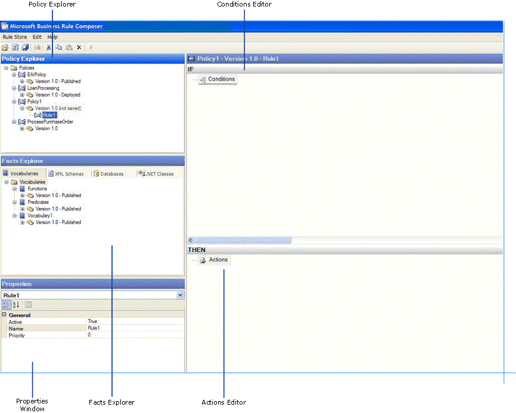

# Windows of the Business Rule Composer
The Business Rule Composer is a graphical tool used for authoring, versioning, and deploying policies and vocabularies. This section provides information about different windows of the Business Rule Composer.  
  
 The following figure shows the Business Rule Composer. The Policy Explorer window allows you create policies that contain one or more rules. The Facts Explorer window allows you to browse for facts (XML, database, and .NET), and drag the facts to the Conditions Editor window or the Actions Editor window. The Conditions Editor window allows you to specify a condition for a rule. The Actions Editor window allows you to specify actions that are executed when the condition evaluates to true.  
  
   
Business Rule Composer  
  
> [!NOTE]
>  It is possible for multiple users of the Business Rule Composer to connect to the shared rule store at the same time. However, the Business Rule Composer does not prevent users from overwriting each other's work. Potentially, a user could see a policy or a vocabulary that is out of sync, because another user may have modified the policy or vocabulary.  
  
## In This Section  
  
-   [Using Policy Explorer](../core/using-policy-explorer.md)  
  
-   [Using Facts Explorer](../core/using-facts-explorer.md)  
  
-   [Using Rule Editor](../core/using-rule-editor.md)