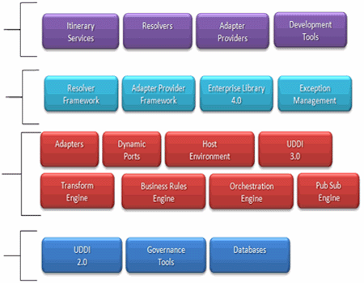
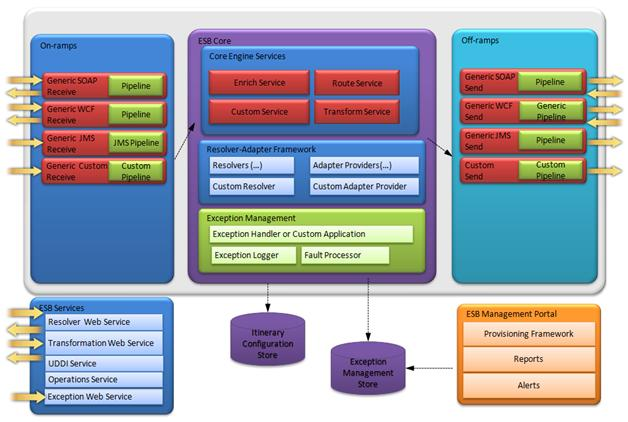
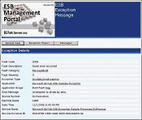
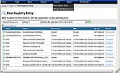

# What Is an Enterprise Service Bus?

An Enterprise Service Bus (ESB) is an architectural pattern and a key enabler in implementing the infrastructure for a service-oriented architecture (SOA). Real-world experience has demonstrated that an ESB is only one of many components required to build a comprehensive service-oriented infrastructure (SOI). The term "ESB" has various interpretations in the market, which have evolved over time; however, the basic challenge it addresses is the same.

Namely, the increasing adoption of SOA and the proliferation of Web services have revealed an ever growing need to provide a managed layer between services and their consumers. There must be support for interaction between heterogeneous services and interfaces that might be mismatched, or that might change over time.

An ESB addresses such integration problems in a way that maximizes the re-use of services and that maintains the flexibility to easily change the solution.

## Get Started with BizTalk ESB Toolkit 2.1

-   [Download the BizTalk ESB Toolkit 2.1](https://www.microsoft.com/downloads/en/details.aspx?FamilyID=8b24d2a7-f079-4123-8428-7699e732a736)
-   [Download BizTalk ESB Toolkit 2.1 documentation](https://www.microsoft.com/downloads/details.aspx?FamilyID=8b24d2a7-f079-4123-8428-7699e732a736)
-   [View BizTalk ESB Toolkit 2.1 documentation](https://msdn.microsoft.com/en-us/library/ff699598(v=bts.70).aspx)
-   [ESB Toolkit Forum](http://social.msdn.microsoft.com/forums/en-us/biztalkesb/threads)

## ESB Toolkit Poster

[BizTalk ESB Toolkit Architecture Poster](https://www.microsoft.com/downloads/en/details.aspx?FamilyID=a7f8b05c-d2f2-4799-b9d9-77c60887483f "BizTalk ESB Architecture Poster")
This poster depicts the architecture of the BizTalk ESB Toolkit. It shows the toolkit's core components, and how these integrate with BizTalk Server. The poster is intended to be printed, and measures 26”x28”.

[BizTalk ESB Toolkit Architecture Interactive Poster](https://www.microsoft.com/downloads/details.aspx?displaylang=en&FamilyID=ffaddb17-79f4-4a32-a6b8-002a7fe4d986)
This poster depicts the architecture of the BizTalk ESB Toolkit. It shows the toolkit's core components, and how these integrate with BizTalk Server.

## ESB Architecture

-   [.NET Rocks! - Dmitri Ossipov on Enterprise Service Bus](https://www.microsoft.com/downloads/details.aspx?FamilyID=3a11209d-be52-4230-8b00-77cf4ecbc6ee&DisplayLang=en)
-   [Architectural Patterns for Distributed Computing](https://msdn.microsoft.com/en-us/library/dd129906.aspx)

## Introducing the Microsoft BizTalk ESB Toolkit 2.1

The **BizTalk ESB Toolkit 2.1** is a collection of tools and libraries that extend BizTalk Server 2010 capabilities of supporting a loosely coupled and dynamic messaging architecture. It functions as middleware that provides tools for rapid mediation between services and their consumers. Enabling maximum flexibility at run time, the BizTalk ESB Toolkit 2.1 simplifies loosely coupled composition of service endpoints and management of service interactions.

The BizTalk ESB Toolkit 2.1 provides key building blocks that are required for implementing a comprehensive SOI including:

-   **Endpoint run-time discovery and virtualization.** The service consumer does not need to be aware of the service provider location and endpoint details; a new or modified service provider can be added to the ESB, without interruptions to the service consumer.
-   **Loosely coupled service composition**. The service provider and service consumer do not need to be aware of service interaction style.
-   **Dynamic message transformation and translation.**The mapping definition between distinct message structure and semantics is resolved at run time.
-   **Dynamic routing.** Run-time content-based, itinerary-based, or context-based message routing.
-   **Centralized exception management.** Exception management framework, services, and infrastructure elements that make it possible to create, repair, resubmit, and compensate fault messages that service consumers or BizTalk components submit.
-   **Quality of service.** An asynchronous publish/subscribe engine resolves different levels of service availability and provides high availability, scalability, and message traceability for ESB implementations.
-   **Protocol transformation.** Providing the ability for service provider and service consumer to interact via different protocols including WS-\* standards for Web Services. For example, a service provider can send an HTTP Web Service request, which will result in sending a message via Message Queuing.
-   **Extensibility.** Provides multiple extensibility points to extend functionality for endpoint discovery, message routing, and additional BizTalk Server adapters for run time and design time.

## What's New in BizTalk ESB Toolkit 2.1?

The Microsoft BizTalk ESB Toolkit 2.1 extends the capabilities of BizTalk Server 2010 . The following list summarizes the additional support extended in Microsoft BizTalk ESB Toolkit 2.1:

-   Support for Visual Studio 2010 Visualization and Modeling SDK for the Itinerary Designer.
-   Support bor both .NET Framework version 4 and .NET Framework 3.5.
-   Support for itineraries developed in BizTalk ESB Toolkit 2.0.
-   Support for copying and pasting itinerary shapes in the Itinerary Designer.

**Note**:
Copying an itinerary shape copies all properties associated with the shape:

-   A new itinerary project template, BizTalk ESB Itinerary designer, provides an easy option to create itinerary projects under BizTalk Projects.
-   Opening a new project in the Itinerary Designer sets the export mode to Strict by default.

**Note**:

-   The Default export mode supports opening itineraries created in ESB Toolkit 2.0:
-   Added a new itinerary model property, Require encryption certificate in the Itinerary designer to enable and disable encryption certificate while validating the itinerary. This flag is set to True by default.

## Biz Talk ESB Toolkit 2.1 Core Engine Components  

 
## BizTalk ESB Toolkit 2.1 Reference Architecture

 
## BizTalk ESB Toolkit 2.1 Interface

.png)
[Itinerary Designer]{}

.png)
[Management Portal Reports]{}

.png)
[Managing Exceptions]{}

.png)
[Managing Registry Entries]{}

.png)
[Managing Alerts]{}

(click any image to zoom)

## CodePlex Projects

[View community samples and projects](http://esbextlibrary.codeplex.com/)

## Blogs and Forum

-   [ESB Team Blog](http://blogs.msdn.com/esb/default.aspx)
-   [ESB Toolkit Forum](http://social.msdn.microsoft.com/forums/en-us/biztalkesb/threads)
-   [Elton Stoneman's Blog](http://geekswithblogs.net/EltonStoneman/category/7947.aspx)
-   [Brian Loesgen's Blog](http://blog.BrianLoesgen.com)
-   [Regis Mauger's Blog](http://blogs.technet.com/regisma/archive/tags/esb/default.aspx)
-   [Peter Kelcey's Blog](http://blogs.msdn.com/pkelcey/default.aspx)

## Frequently Asked Questions about ESB

***From where are downloads provided?***

You can download the [BizTalk ESB Toolkit 2.1](https://www.microsoft.com/downloads/details.aspx?FamilyID=8b24d2a7-f079-4123-8428-7699e732a736) from the BizTalk Server 2010 page on the Microsoft Download Center. The toolkit is packaged as binaries and samples in a Windows Installer. You can download [BizTalk ESB Toolkit 2.1 documentation](https://www.microsoft.com/downloads/details.aspx?FamilyID=8b24d2a7-f079-4123-8428-7699e732a736) from the corresponding documentation page on the Download Center.

***Is source code for signed binaries provided?***

Source code for ESB toolkit will not be shipped.

***What license is used?***

It is a standard, free, Microsoft binary-only license.

***How is the BizTalk ESB Toolkit 2.1 packaged?***

It is packaged as a binary-only Windows Installer (32- and 64-bit).

***Will BizTalk ESB Toolkit 2.1 bug fixes be provided?***

The BizTalk ESB Toolkit Team will address bugs on a best-effort basis.

***Where do customers file bugs and requests?***

Customers should contact Microsoft Support to open a case for any product issues.

***What is the BizTalk ESB Toolkit 2.1 forum commitment?***

Assistance is provided through forums, with a one-year notice of deprecation plans. Any fixes and responses to questions in the forums are best effort, and we will continue to leverage the community to provide peer assistance, though with a capability to issue critical fixes if necessary.

***Where is the online community hosted?***

A dedicated [ESB Toolkit Forum](http://social.msdn.microsoft.com/forums/en-us/biztalkesb/threads) is provided.
