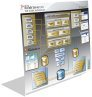

# BizTalk Server 2010 Posters

[BizTalk Server 2010 ESB Toolkit Architecture Poster](https://www.microsoft.com/downloads/en/details.aspx?FamilyID=a7f8b05c-d2f2-4799-b9d9-77c60887483f)
This poster depicts the architecture of the BizTalk ESB Toolkit. It shows the toolkit's core components, and how these integrate with BizTalk Server. When printed, this poster measures 26”x28”.

-   [Explore the BizTalk Server 2010 ESB Toolkit Architecture Poster (interactive version – Silverlight required)](https://www.microsoft.com/biztalk/en/us/technical-posters/esb/default.html)
-   [Download the BizTalk Server 2010 ESB Toolkit Architecture Interactive Poster](https://www.microsoft.com/downloads/en/details.aspx?FamilyID=1169a39e-a221-4aa5-a7c0-be9beb59dee4)

------------------------------------------------------------------------

[BizTalk Server 2010 Capabilities Poster](https://www.microsoft.com/downloads/en/details.aspx?FamilyID=9f4d8b84-816c-406b-be2a-46dcdce65d55)
This poster lists the BizTalk Server 2010 capabilities bucketed in eight categories and is designed to enable technical discussions by providing both high-level and detailed views of the capabilities and features that are included. The poster is intended to be printed and measures 30.5″x28″.

------------------------------------------------------------------------

[BizTalk Server 2010 Run-Time Architecture Poster](https://www.microsoft.com/downloads/en/details.aspx?FamilyID=bd8bf415-748b-4349-8221-e086e4a5ed19)
The poster depicts the modules and components of a BizTalk Server 2010 run-time environment, including message flow, data flow, and references that occur at run time. It can be used to show how the capabilities listed in the [BizTalk Server 2010 Capabilities Poster](https://www.microsoft.com/downloads/en/details.aspx?FamilyID=9f4d8b84-816c-406b-be2a-46dcdce65d55) are actually implemented. The poster is intended to be printed and measures 35″x32″.

------------------------------------------------------------------------

[BizTalk Server 2010 Scale-out Configurations Poster](https://www.microsoft.com/downloads/en/details.aspx?FamilyID=2b70cbfc-d158-45a6-8bbd-99782d6747dc)
This poster describes typical scenarios and commonly used options for scaling out BizTalk Server 2010 physical configurations. It illustrates how to scale out to achieve high availability through load balancing and fault tolerance and how to configure for high-throughput scenarios. The poster is intended for use by IT professionals and developers who need to design, deploy, and manage large-scale implementations of BizTalk Server 2010. When printed, this poster measures 26”x38”.

-   [Explore the BizTalk Server 2010 Scale-out Configurations Poster (interactive version – Silverlight required)](https://www.microsoft.com/biztalk/en/us/technical-posters/sl/default.html)
-   [Download the BizTalk Server 2010 Scale-out Configurations Interactive Poster](https://www.microsoft.com/downloads/en/details.aspx?FamilyID=7ef9ae69-9cc8-442a-8193-831a414dfc30)

------------------------------------------------------------------------

[BizTalk Server 2010 Database Infrastructure Poster](https://www.microsoft.com/downloads/en/details.aspx?FamilyID=445ff87d-8911-4267-862b-043987a6d693)
This poster describes BizTalk Server 2010 databases and associated components, jobs, services, UI, and events. It includes tables that describe the databases and jobs. It is intended primarily for DBAs and administrators of a BizTalk Server environment, yet it also serves as an introduction to the infrastructure for all users. The poster is intended to be printed and measures 28″x30″.

------------------------------------------------------------------------

[BizTalk Server 2010 BAM Poster](https://www.microsoft.com/downloads/en/details.aspx?FamilyID=46c20764-fae0-439d-a116-038808a0e6aa)
This poster provides an overview of the entire BAM life cycle. It depicts the design of the observation model by the business analyst, mapping the observation model to the implementation by the developer, deployment by the system administrator, and the presentation channels for business end users. Both new and experienced users will better understand the concepts, processes, and management of BAM. When printed, this poster measures 26”x28”.

-   [Explore the BizTalk Server 2010 BAM Poster (interactive version – Silverlight required)](https://www.microsoft.com/biztalk/en/us/technical-posters/bam/default.html)

------------------------------------------------------------------------

[BizTalk Adapter Pack 2010 Poster](https://www.microsoft.com/downloads/en/details.aspx?FamilyID=f6e049c3-0a93-4f37-a494-eaff12928865)
This poster depicts the BizTalk Adapter Pack 2010 components, the architecture of its WCF-based adapters, as well as the interoperability of line-of-business (LOB) applications with the Adapter Pack and the Windows Communication Foundation (WCF) LOB Adapter SDK. When printed, this poster measures 38”x26”.

-   [Explore the BizTalk Adapter Pack 2010 Poster (interactive version – Silverlight required)](https://www.microsoft.com/biztalk/en/us/technical-posters/adapters/default.html)
-   [Download the BizTalk Adapter Pack 2010 Interactive Poster](https://www.microsoft.com/downloads/en/details.aspx?FamilyID=a027bfff-1bc2-4022-aed1-08254f14c3ec)

## BizTalk Server 2009 Posters

[BizTalk ESB Toolkit Architecture Poster](https://www.microsoft.com/downloads/details.aspx?FamilyID=844322c2-7a14-4e81-8558-c7941273dd5d)
This poster depicts the architecture of the BizTalk ESB Toolkit. It shows the toolkit's core components, and how these integrate with BizTalk Server. The poster is intended to be printed, and measures 26”x28″.

[BizTalk ESB Toolkit Architecture Interactive Poster](https://www.microsoft.com/downloads/details.aspx?displaylang=en&FamilyID=ffaddb17-79f4-4a32-a6b8-002a7fe4d986)
This poster depicts the architecture of the BizTalk ESB Toolkit. It shows the toolkit's core components, and how these integrate with BizTalk Server.

------------------------------------------------------------------------

[BizTalk Server 2009 Capabilities Poster](https://www.microsoft.com/downloads/details.aspx?FamilyID=9cb8fa47-f8b9-4b58-a927-3430826f520c#tm)
This poster lists the BizTalk Server 2009 capabilities bucketed in eight categories and is designed to enable technical discussions by providing both high-level and detailed views of the capabilities and features that are included. The poster has been updated to include new features and capabilities, including enhancements to RFID, BizTalk Adapter Pack, EDI, AS2, and better integration with Visual Studio and Windows Server. The poster is intended to be printed and measures 30.5″x28″.

------------------------------------------------------------------------

[BizTalk Server 2009 Runtime Architecture Poster](https://www.microsoft.com/downloads/details.aspx?FamilyID=d022a0a4-3b27-49cf-b47c-16d8458a1be2)
The poster depicts the modules and components of a BizTalk Server 2009 runtime environment, including message flow, data flow, and references that occur at runtime. It can be used to show how the capabilities listed in the [BizTalk Server 2009 Capabilities Poster](https://www.microsoft.com/downloads/details.aspx?FamilyID=9cb8fa47-f8b9-4b58-a927-3430826f520c#tm) are actually implemented. The poster is intended to be printed and measures 35″x32″.

------------------------------------------------------------------------

[BizTalk Server 2009 Scale-out Configurations Poster](https://www.microsoft.com/downloads/details.aspx?FamilyID=DBBE85C5-4DD4-4B28-B2F1-6197980FD149)
This poster describes typical scenarios and commonly used options for scaling out BizTalk Server 2009 physical configurations. It illustrates how to scale out to achieve high availability through load balancing and fault tolerance and how to configure for high-throughput scenarios. The poster is intended for use by IT professionals and developers who need to design, deploy, and manage large-scale implementations of BizTalk Server 2009. When printed, this poster measures 26”x38”.

-   [Explore the BizTalk Server 2009 Scale-out Configurations Poster (interactive version – Silverlight required)](https://www.microsoft.com/biztalk/en/us/technical-posters/sl/default.html)
-   [Download the interactive poster](https://www.microsoft.com/downloads/details.aspx?FamilyID=DBBE85C5-4DD4-4B28-B2F1-6197980FD149)

------------------------------------------------------------------------

[BizTalk Server 2009 Database Infrastructure Poster](https://www.microsoft.com/downloads/details.aspx?FamilyID=2E322206-03CF-47BA-BDB0-F96770F889ED)
This poster describes BizTalk Server 2009 databases and associated components, jobs, services, UI, and events. It includes tables that describe the databases and jobs. It is intended primarily for DBAs and administrators of a BizTalk Server environment, yet it also serves as an introduction to the infrastructure for all users. The poster is intended to be printed and measures 28″x30″.

------------------------------------------------------------------------

[BizTalk Server 2009 BAM Poster](https://www.microsoft.com/downloads/details.aspx?FamilyID=193CD7A4-E271-46BB-B4EE-8434DFA779A0)
This poster provides an overview of the entire BAM life cycle. It depicts the design of the observation model by the business analyst, mapping the observation model to the implementation by the developer, deployment by the system administrator, and the presentation channels for business end users. Both new and experienced users will better understand the concepts, processes, and management of BAM. The poster is intended to be printed and measures 26″x28″.

[BizTalk Server 2009 BAM Interactive Poster](https://www.microsoft.com/downloads/details.aspx?FamilyID=aab8e364-f24e-4935-a701-f4726f8055f1)
This Silverlight poster shows you how to develop a simple Business Activity Monitoring (BAM) solution. You will monitor a purchase order in a BizTalk Server application. You will also learn about the roles, BAM components, and the process of developing a BAM solution, so that you can monitor your own business process.

------------------------------------------------------------------------

[BizTalk Adapter Pack 2.0 Poster](https://www.microsoft.com/downloads/details.aspx?displaylang=en&FamilyID=4a7e28b9-9f4b-4989-a35a-247f379f2142)
This poster depicts the BizTalk Adapter Pack components, the architecture of its WCF-based adapters, as well as the interoperability of line-of-business (LOB) applications with the Adapter Pack and the Windows Communication Foundation (WCF) LOB Adapter SDK. When printed in full scale, this poster size is 38″x 26″.

[BizTalk Adapter Pack 2.0 Interactive Poster](https://www.microsoft.com/downloads/details.aspx?FamilyID=e0b11f69-657a-4cae-9838-ccf96b15d3ec)
This Silverlight poster covers interoperability with LOB applications using the BizTalk Adapter Pack and the WCF LOB Adapter SDK. This poster depicts the functionality, components, architecture, and usage/hosting scenarios of BizTalk Adapter Pack 2.0 and of the WCF LOB Adapter SDK.
