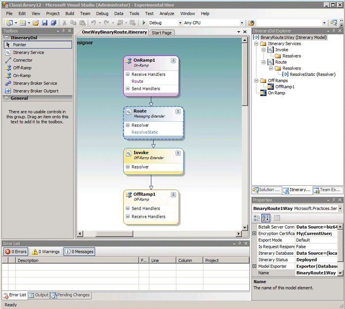

# About Itineraries
An itinerary is a representation of an ESB mediation policy for executing a sequence of processing instructions based on the [!INCLUDE[esbToolkit](../includes/esbtoolkit-md.md)] extensible format. An itinerary can be viewed as a high-level mediation language that describes a sequence of declarative itinerary services that are associated with mediation components by configuration of the [!INCLUDE[esbToolkit](../includes/esbtoolkit-md.md)] core engine. You can design mediation flows to describe how messages should be processed, and you can organize the entire flow as a visual drawing. At run time, the [!INCLUDE[esbToolkit](../includes/esbtoolkit-md.md)] core engine executes the itinerary produced by Itinerary Designer.  
  
## The Itinerary Designer Surface  
 The Itinerary Designer surface is a visual designer that is used to create [!INCLUDE[esbToolkit](../includes/esbtoolkit-md.md)] itineraries and to export these itineraries into run-time format. It is a canvas to which you can drag items from the Toolbox, as illustrated in Figure 1.  
  
   
  
 **Figure 1**  
  
 **Itinerary Designer surface**  
  
 The name of the itinerary is displayed on the top tab of the Itinerary Designer and in the Microsoft Visual Studio title bar. The design surface itself is a single area and contains model elements that describe the actual message flow of the itinerary. The ItineraryDSL enables you to modify the model element properties using the Visual Studio Properties window.  
  
## Itinerary Designer Toolbox  
 The Visual Studio Toolbox contains tabs, which represent sets of tools. When you open a Visual Studio project that uses Itinerary Designer, the Toolbox contains two tabs: the **General** tab and the **ItineraryDsl** tabs. The **ItineraryDsl** tab contains the following tools:  
  
-   **Itinerary Service tool**. This model element corresponds to the itinerary mediation service and represents a processing instruction.  
  
-   **Connector tool**. This model element defines the relationship between individual model elements on the Itinerary Designer surface.  
  
-   **Off-Ramp tool**. This model element corresponds to the off-ramp that sends a message. The Itinerary Designer allows multiple off-ramps per model.  
  
-   **On-Ramp tool**. This model element corresponds to an on-ramp that receives a message. The Itinerary Designer allows only one on-ramp per model.  
  
-   **Itinerary Broker Service tool**. This model element corresponds to the itinerary mediation service that allows defined message flow with multiple inputs and multiple outputs.  
  
-   **Itinerary Broker Output port**. This model element corresponds to the single output port of the Itinerary Broker Service. The Itinerary Broker Service model element allows multiple output ports.  
  
## Steps in Itinerary Development  
 To develop an itinerary, which represents ESB mediation flow, you should typically perform the following actions:  
  
- Add model elements to represent the message processing steps for your itinerary. The Itinerary Designer provides a toolbox that contains shapes used to represent different actions or key abstractions.  
  
- Specify itinerary model properties, which include a connection string to the Microsoft BizTalk Server management database and model exporter configuration.  
  
- Bind on-ramp and off-ramp model elements to physical BizTalk receive locations and send ports by associating these model elements with corresponding technology extenders.  
  
- Associate itinerary services model elements with extenders and define technology-specific properties required by an extender. These properties may vary for a particular type of the extender; they can represent itinerary mediation service properties and BizTalk-specific properties associated with its run-time components and artifacts.  
  
- Identify custom components that you might want to reference as itinerary mediation services. For example, you may develop an orchestration as the itinerary service.  
  
- Verify resolver model element settings against [!INCLUDE[esbToolkit](../includes/esbtoolkit-md.md)] run-time configuration by invoking resolver service from the designer surface.  
  
- Validate and export the itinerary run-time policy using an exporter. The [!INCLUDE[esbToolkit](../includes/esbtoolkit-md.md)] provides two exporters with the Itinerary Designer: file exporter and database exporter. Alternatively, you can implement a custom exporter.  
  
- Test your itinerary using test client applications or BizUnit framework.  
  
## Security Considerations for Developing Itineraries  
 When you design itineraries, you should consider potential security issues:  
  
-   Avoid specifying user credentials without using a certificate from the model properties.  
  
-   Do not refer to BizTalk receive ports with receive locations that allow anonymous access.  
  
-   Protect the message or transport channel if the itinerary message contains sensitive data.  
  
-   Protect messages in the Message box with a pipeline component if the messages contain sensitive data that needs to be protected while in transit.