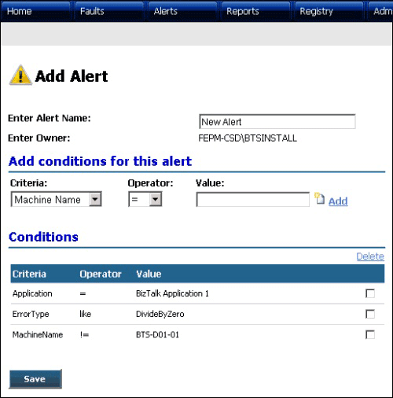

# Add Alert Page
Figure 1 shows the Add Alert page, where you can create a new alert that the portal will raise when a fault message matching the criteria (conditions) specified in the alert arrives at the portal.  
  
   
  
 **Figure 1**  
  
 **The ESB Management Portal Add Alert page**  
  
 On the Add Alert page, you can do the following:  
  
-   Type a name for the new alert in the **Enter Alert Name** text box.  
  
-   Specify how the alert will match to values of the fields in incoming exceptions in the **Add conditions for this alert** section of this page. Select a field from the exception schema (such as **Application, Error Type,** or **Fault Severity)** in the **Criteria** drop-down list; select a comparison type for the (such as =, **!=, >=, <=,** or **like**) in the **Operator** drop-down list; and type or select a value from the third list. When you select an exception field, the **Value** control changes to either a text box or a drop-down list for you to enter or select a matching value.  
  
-   After selecting or entering the criteria values, click the **Add** link to add this condition to the list in the **Conditions** section of the page, and repeat to add any more conditions you require for this alert.  
  
-   Click the **Save** button to create the new alert with the name and conditions you specified.
