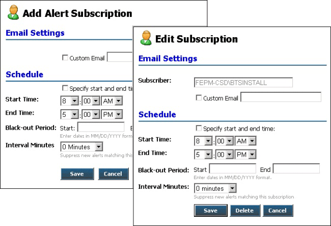

# Add Alert Subscription and Edit Subscription Pages
The Add Alert Subscription and Edit Subscription pages are similar. They differ in that the Edit Subscription page shows the subscriber ID (the Microsoft Windows account of the current portal user), and has a different set of buttons. Figure 1 shows the Add Alert Subscription and Edit Subscription pages.  

   

 **Figure 1**  

 **The ESB Management Portal Add Alert Subscription and Edit Subscription pages**  

 The Add Alert Subscription and Edit Subscription pages allow you to specify and modify the following:  

- A custom e-mail address to use for the subscription (instead of your Microsoft Windows account e-mail address)  

- The time period when you will accept alert notifications  

- A "black-out" period for events such as vacations  

- The interval over which the portal will not send duplicate alerts  

  You can do the following on the Add Alert Subscription and Edit Subscription pages:  

- Select the check box next to the **Custom Email** text box if you want to use an e-mail address for the subscription that is different to your standard Windows account e-mail address, and then type the preferred e-mail address in the text box.  

- Select the check box at the top of the **Schedule** section if you want to specify a period when the portal should send alerts to you, and then specify the start and end times for the period in the **Start Time** and **End Time** drop-down lists. Alerts occurring outside this period are queued and delivered during the specified period.  

- Type the start date and end date for a **Black-out Period** if there is a period when you will be unable to receive and act on alerts. Use the format mm/dd/yyyy for the two dates.  

- Select an **Interval** in **Minutes** during which the portal will compare alerts raised and send only one when multiple instances of the same alert occur. This prevents a rapidly occurring fault from creating a large number of identical alert messages.  

- Click the **Save** button to create or update the subscription.  

- Click the **Delete** button (available only on the Edit Subscription page) to delete the selected subscription.  

- Click the **Cancel** button to go back to the [Alert Viewer Page](../esb-toolkit/alert-viewer-page.md) without creating or modifying the subscription.
