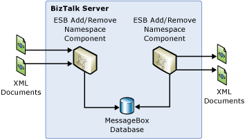

# Adding and Removing Namespaces in an XML Message Document
In this use case, the Namespace component provided with the [!INCLUDE[esbToolkit](../includes/esbtoolkit-md.md)] adds namespaces to, or removes namespaces from, documents and messages, as illustrated in Figure 1. This prevents namespace clashes or errors arising when documents use default namespaces.  
  
   
  
 **Figure 1**  
  
 **Adding and removing XML document and message namespaces**  
  
 The Namespace Component sample included with the [!INCLUDE[esbToolkit](../includes/esbtoolkit-md.md)] demonstrates this use case. It shows how to use the component to inject and remove namespaces in a document as part of the send and the receive process.  
  
 For more information, see [Installing and Running the Namespace Component Sample](../esb-toolkit/installing-and-running-the-namespace-component-sample.md).
