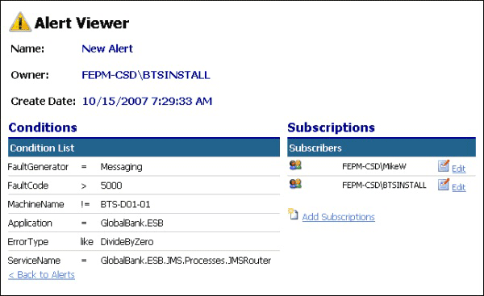

# Alert Viewer Page
The Alert Viewer page, shown in Figure 1, displays all the details of a selected alert, including the conditions that match it to incoming exceptions, and a list of subscriptions defined for this alert.  
  
   
  
 **Figure 1**  
  
 **The ESB Management Portal Alert Viewer page**  
  
 On the Alert Viewer page, you can do the following:  
  
-   Use the **Edit** link next to a subscription to edit or delete that subscription. Clicking the **Edit** link opens the [Add Alert Subscription and Edit Subscription Pages](../esb-toolkit/add-alert-subscription-and-edit-subscription-pages.md) (described next).  
  
-   Click the **Add Subscriptions** link under the list of existing subscriptions to create a new subscription for this alert. This opens the [Add Alert Subscription and Edit Subscription Pages](../esb-toolkit/add-alert-subscription-and-edit-subscription-pages.md) (described next).  
  
-   Click the link at the bottom of the page to return to the list of alerts and subscriptions.
