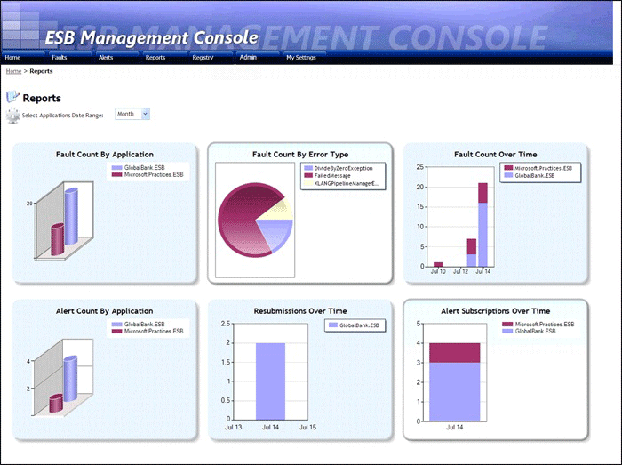

# Analyzing Fault Trends Using Charts and Reports
This section describes the charts and reports that the ESB Management Portal generates. These charts and reports provide valuable detail and trend information for faults, alerts, and message resubmission. You can view the following:  
  
- [Faults by Application or Service](../esb-toolkit/faults-by-application-or-service.md)  
  
- [Alerts by Application or Service](../esb-toolkit/alerts-by-application-or-service.md)  
  
- [Fault Error Types by Application or Service](../esb-toolkit/fault-error-types-by-application-or-service.md)  
  
- [Faults over Time by Application or Service](../esb-toolkit/faults-over-time-by-application-or-service.md)  
  
- [Resubmissions over Time by Application or Service](../esb-toolkit/resubmissions-over-time-by-application-or-service.md)  
  
- [Subscriptions over Time by Application or Service](../esb-toolkit/subscriptions-over-time-by-application-or-service.md)  
  
  For more information about the reporting features of the ESB Management Portal, see the [Portal Reports Page](../esb-toolkit/portal-reports-page.md). Figure 1 shows the default view of the Reports page.  
  
    
  
  **Figure 1**  
  
  **The Reports page of the ESB Management Portal**