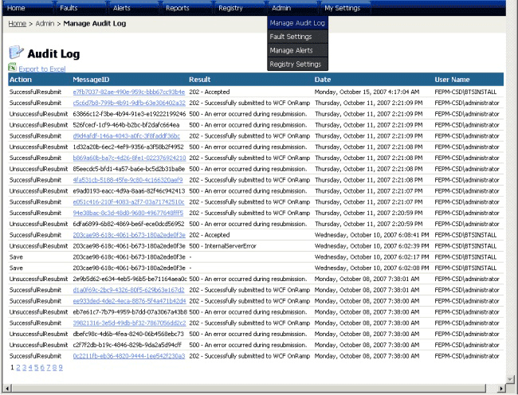
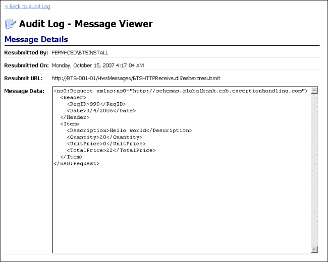

# Audit Log Page
Figure 1 shows the Audit Log page. This page displays a list of audited events.  
  
   
  
 **Figure 1**  
  
 **The Audit Log page of the ESB Management Portal**  
  
 The following list explains how you can use the features of the ESB Management Portal Audit Log page:  
  
- Click the message identifier link to view the resubmitted message body. This opens the Audit Log - Message Viewer page (see Figure 2), which displays the user, date, and URL for the resubmitted message, and the resubmitted message contents.  
  
    
  
  **Figure 2**  
  
  **The Audit Log – Message Viewer page of the ESB Management Portal**
