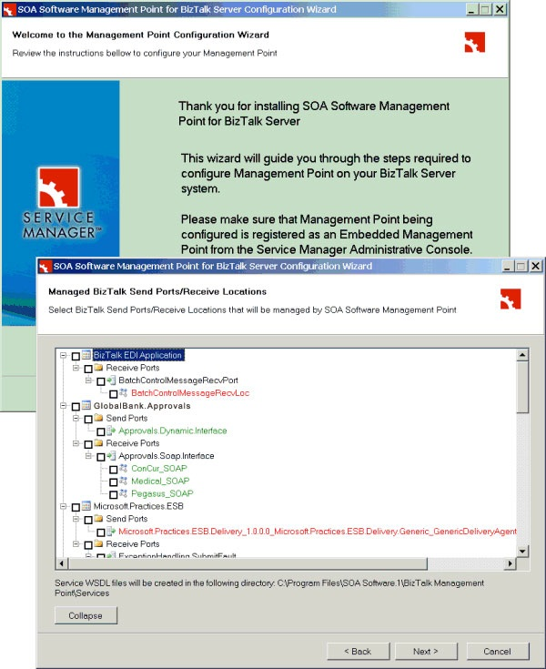
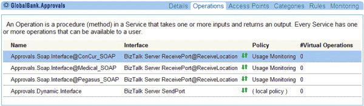

# BizTalk Server Integration
The SOA Service Manager provides wizards that help you set up the SOA Service Manager for use with Microsoft BizTalk Server. For example, Figure 1 shows the wizard that helps you install and configure the BizTalk Integration Point that links BizTalk Server send ports and receive locations to the SOA Service Manager.  
  
   
  
 **Figure 1**  
  
 **The SOA BizTalk Integration Point installation and configuration wizard**  
  
 After installation, the SOA Service Manager can display details of the send ports and receive locations configured by the wizard. Figure 2 shows the Operations page displaying the name, interface, policy, and the number of virtual operations for three receive locations and a send port.  
  
   
  
 **Figure 2**  
  
 **A list of BizTalk Server send ports and receive locations displayed by the SOA Service Manager**