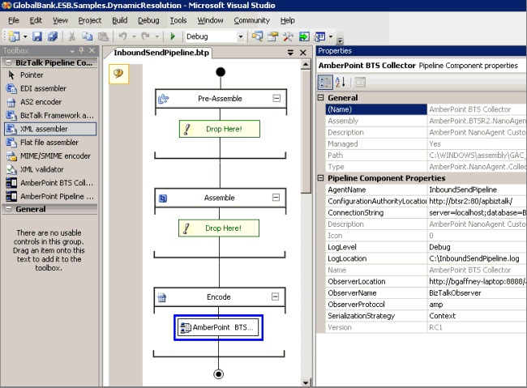
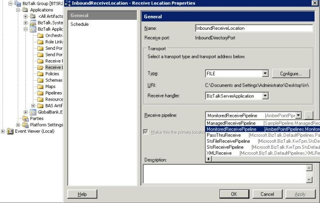

# BizTalk Server Integration
AmberPoint packages its Microsoft BizTalk Server integration product as a custom BizTalk pipeline component. You can add this component to your existing custom pipelines using Visual Studio, as shown in Figure 1.  
  
   
  
 **Figure 1**  
  
 **Installing the AmberPoint component into a send pipeline**  
  
 In addition, AmberPoint ships four predefined pipelines that you can bind directly to existing receive locations and send ports using the BizTalk Administration Console. Figure 2 shows the binding of a receive pipeline to an adapter.  
  
   
  
 **Figure 2**  
  
 **Binding an AmberPoint receive pipeline to an adapter**  
  
> [!NOTE]
>  The AmberPoint SOA Management System (SMS) product is a product from AmberPoint, Inc. that integrates with BizTalk Server. For more information about AmberPoint and their SOA governance products, see the [AmberPoint](http://go.microsoft.com/fwlink/?LinkId=188561) Web site.