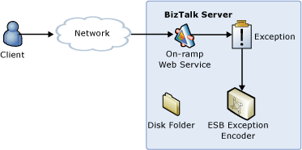

# Collecting Exceptions and Persisting the Payload Using the ESB Exception Processor
In this use case, either the exception handler for an orchestration publishes an ESB fault message to the BizTalk Server Message Box or the BizTalk Failed Message Routing mechanism generates a fault message. A send port, preconfigured with the ESB Exception Encoder pipeline component, subscribes to both of the fault message types. It processes the fault messages and then persists them as disk files that you can view using InfoPath, as illustrated in Figure 1.  
  
   
  
 **Figure 1**  
  
 **Capturing a fault message and persisting it to a disk file**  
  
 The [!INCLUDE[esbToolkit](../includes/esbtoolkit-md.md)] includes the following:  
  
- **A preconfigured send port that uses the ESB Fault Processor send pipeline.** You can configure this send port according to your own specific requirements.  
  
- **The Message Persisting Custom Exception Handler sample.** This sample shows how a loosely coupled generic exception handler can receive fault messages, extract the BizTalk Server messages they contain, normalize and enrich the messages, and write them as disk files to the file system.  
  
- **The BizTalk Failed Message Routing sample.** This sample shows how the ESB Exception Management Framework can normalize and enrich fault messages natively generated by the Failed Message Routing mechanism in BizTalk Server.  
  
  For more information, see [Running the Message Persisting Custom Exception Handler Sample](../esb-toolkit/running-the-message-persisting-custom-exception-handler-sample.md) and [Running the BizTalk Failed Message Routing ESB Processing Sample](../esb-toolkit/running-the-biztalk-failed-message-routing-esb-processing-sample.md).